---
lab:
  title: Preparare i dati in Power BI Desktop
  module: Module 2 - Get Data in Power BI
ms.openlocfilehash: deaa403224e029a08c91ed5137693d51ac30fcab
ms.sourcegitcommit: 3520e7d016e94549d408464207c1b91cd47867c2
ms.translationtype: HT
ms.contentlocale: it-IT
ms.lasthandoff: 03/05/2022
ms.locfileid: "139839947"
---
# **Preparare i dati in Power BI Desktop**

**Il tempo stimato per il completamento del lab è di 45 minuti**

In questo lab si avvia lo sviluppo di una soluzione di Power BI Desktop per l'azienda Adventure Works. Si esaminerà come connettersi ai dati di origine, come visualizzare in anteprima i dati e come usare le tecniche di anteprima dei dati per comprendere le caratteristiche e la qualità dei dati di origine.

Contenuto del lab:

- Aprire Power BI Desktop

- Impostare le opzioni di Power BI Desktop

- Connettersi all'origine dati

- Visualizzare in anteprima i dati di origine

- Usare le tecniche di anteprima dei dati per comprendere meglio i dati

### **Presentazione del lab**

Questo lab fa parte di una serie che comprende molti lab progettati come attività completa, dalla preparazione dei dati alla pubblicazione come report e dashboard. È possibile completare i lab nell'ordine desiderato. Se tuttavia si intende seguire più lab, per i primi 10 è consigliabile procedere in questo ordine:

1. **Preparare i dati in Power BI Desktop**

2. Caricare i dati in Power BI Desktop

3. Modellare i dati in Power BI Desktop

5. Creare calcoli DAX in Power BI Desktop - Parte 1

6. Creare calcoli DAX in Power BI Desktop - Parte 2

7. Progettare un report in Power BI Desktop - Parte 1

8. Progettare un report in Power BI Desktop - Parte 2

9. Creare un dashboard di Power BI

10. Eseguire l'analisi dei dati in Power BI Desktop

11. Applicare la sicurezza a livello di riga

## **Esercizio 1: Preparare i dati**

In questo esercizio verranno create otto query di Power BI Desktop. Per sei query verranno usati dati di origine di SQL Server e per due i dati di file CSV.

### **Attività 1: Salvare il file di Power BI Desktop**

In questa attività verrà innanzitutto salvato il file di Power BI Desktop.

1. Per aprire Power BI Desktop, sulla barra delle applicazioni fare clic sul collegamento Microsoft Power BI Desktop.

    

1. Per chiudere la finestra introduttiva, fare clic su **X** nella parte superiore destra della finestra.

    

1. Per salvare il file, fare clic sulla scheda della barra multifunzione **File** per aprire la visualizzazione Backstage.

1. Selezionare **Salva**.

    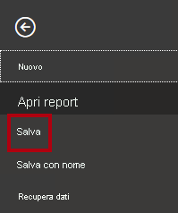

1. Nella finestra **Salva con nome** passare alla cartella **D:\PL300\MySolution**.

1. Nella casella **Nome file** immettere **Sales Analysis**.

    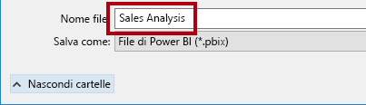

1. Fare clic su **Save** (Salva).

    

    Suggerimento: È anche possibile salvare il file facendo clic sull'icona **Salva** in alto a sinistra.

    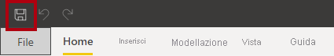

### **Attività 2: Impostare le opzioni di Power BI Desktop**

In questa attività si imposteranno le opzioni di Power BI Desktop.

1. In Power BI Desktop fare clic sulla scheda **File** della barra multifunzione per aprire la visualizzazione Backstage.

1. A sinistra selezionare **Opzioni e impostazioni** e quindi **Opzioni**.

    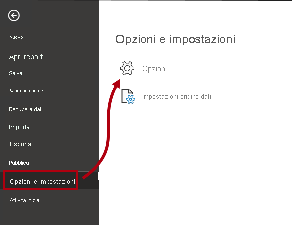

1. Nella finestra **Opzioni**, a sinistra, nel gruppo **File corrente** selezionare **Caricamento dati**.

    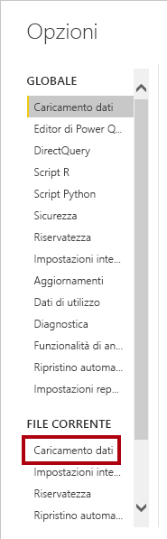

    Le impostazioni di **Caricamento dati** per il file corrente consentono di impostare le opzioni che determinano i comportamenti predefiniti durante la modellazione.

1. Nel gruppo **Relazioni** deselezionare le due opzioni già selezionate.

    

    Sebbene queste due opzioni possano essere utili durante lo sviluppo di un modello di dati, sono state disabilitate a supporto dell'esperienza nel lab. Quando si creano le relazioni nel lab **Caricare i dati in Power BI Desktop**, si capirà perché vengono aggiunte.

1. Fare clic su **OK**.

    

1. Salvare il file di Power BI Desktop.

### **Attività 3: Recuperare i dati da SQL Server**

In questa attività verranno create query basate sulle tabelle di SQL Server.

1. Nella scheda **Home** della barra multifunzione fare clic su **SQL Server** nel gruppo **Dati**.

    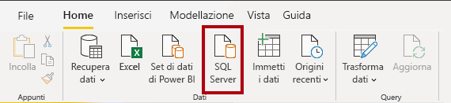

2. Nella finestra **Database SQL Server** immettere **localhost** nella casella **Server**.

    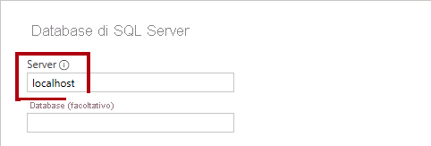

    In questo lab ci si connetterà al database di SQL Server usando **localhost**. Questa procedura non è consigliata quando si creano soluzioni personalizzate. Le origini dati del gateway non possono infatti risolvere **localhost**.

3. Fare clic su **OK**.

    

4. Nella finestra **Strumento di navigazione**, a sinistra, espandere il database **AdventureWorksDW2020**.

    Il database **AdventureWorksDW2020** è basato sul database di esempio **AdventureWorksDW2017**. È stato modificato per supportare gli obiettivi di apprendimento dei lab del corso.

    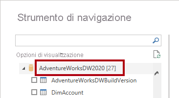

5. Selezionare la tabella **DimEmployee**, ma non la relativa casella di controllo.

    

6. Nel riquadro a destra osservare un'anteprima dei dati della tabella.

    I dati di anteprima consentono di determinare le colonne e un campione di righe.

7. Per creare query, selezionare la casella di controllo accanto alle sei tabelle seguenti:

    - DimEmployee

    - DimEmployeeSalesTerritory

    - DimProduct

    - DimReseller

    - DimSalesTerritory

    - FactResellerSales

8. Per applicare le trasformazioni ai dati delle tabelle selezionate, fare clic su **Trasforma dati**.

    In questo lab i dati non verranno trasformati. Gli obiettivi del lab sono l'esplorazione e la profilatura dei dati nella finestra **Editor di Power Query**.

    

### **Attività 4: Visualizzare in anteprima le query di SQL Server**

In questa attività verranno visualizzati in anteprima i dati delle query di SQL Server. Si apprenderanno innanzitutto le informazioni rilevanti sui dati. Si useranno inoltre gli strumenti relativi a qualità, distribuzione e profilo delle colonne per comprendere i dati e valutarne la qualità.

1. Nella finestra **Editor di Power Query**, a sinistra, osservare il riquadro **Query**.

    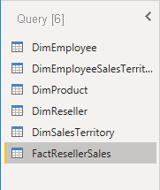

    Il riquadro **Query** contiene una query per ogni tabella selezionata.

2. Selezionare la prima query **DimEmployee**.

    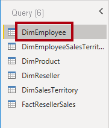

    La tabella **DimEmployee** nel database di SQL Server archivia una riga per ogni dipendente. Un subset delle righe da questa tabella rappresenta i venditori, che saranno rilevanti per il modello che verrà sviluppato.

3. In basso a sinistra, nella barra di stato, osservare le statistiche per la tabella, che contiene 33 colonne e 296 righe.

    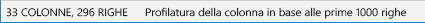

4. Nel riquadro di anteprima dei dati scorrere orizzontalmente per esaminare tutte le colonne.

5. Si noti che le ultime cinque colonne contengono i collegamenti **Table** o **Value**.

    Queste cinque colonne rappresentano le relazioni con altre tabelle del database. Possono essere usate per unire le tabelle. Le tabelle verranno unite nel lab **Caricare i dati in Power BI Desktop**.

6. Per valutare la qualità delle colonne, nella scheda **Visualizza** della barra multifunzione selezionare **Colonna qualità** nel gruppo **Anteprima dati**.

    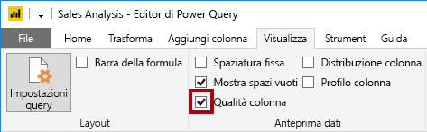

    La qualità della colonna consente di determinare facilmente la percentuale di valori validi, con errori o vuoti rilevata nelle colonne.

7. Per la colonna **Position** (sestultima colonna), si noti che il 94% delle righe è vuoto (null).

    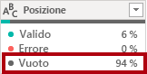

8. Per valutare la distribuzione delle colonne, nella scheda **Visualizza** della barra multifunzione selezionare **Colonna distribuzione** nel gruppo **Anteprima dati**.

    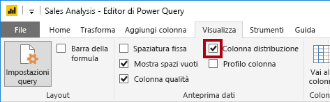

9. Esaminare di nuovo la colonna **Position** e osservare che sono presenti quattro valori distinti e un valore univoco.

10. Esaminare la distribuzione della colonna **EmployeeKey** (prima colonna), dove sono presenti 296 valori distinti e 296 valori univoci.

    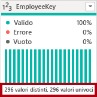

    Quando il numero di valori distinti corrisponde a quello di valori univoci, significa che la colonna contiene valori univoci. Quando si esegue la modellazione, è importante che alcune tabelle del modello contengano colonne univoche. Queste colonne univoche possono essere usate per creare relazioni uno-a-molti, attività che verrà eseguita nel lab **Modellare i dati in Power BI Desktop - Parte 1**.

11. Nel riquadro **Query** selezionare la query **DimEmployeeSalesTerritory**.

    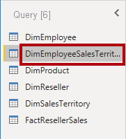

    La tabella **DimEmployeeSalesTerritory** archivia una riga per ogni dipendente e le aree dei territori di vendita gestite. La tabella supporta la correlazione di diverse aree a un singolo dipendente. Alcuni dipendenti gestiscono una, due o più aree. Quando si modellano i dati, sarà necessario definire una relazione molti-a-molti, attività che verrà eseguita nel lab **Modellare i dati in Power BI Desktop - Parte 2**.

12. Nel riquadro **Query** selezionare la query **DimProduct**.

    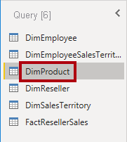

    La tabella **DimProduct** contiene una riga per ogni prodotto venduto dall'azienda.

13. Scorrere orizzontalmente per visualizzare le ultime colonne.

14. Osservare la colonna **DimProductSubcategory**.

    Quando si aggiungono trasformazioni a questa query nel lab **Caricare i dati in Power BI Desktop**, si userà la colonna **DimProductSubcategory** per unire le tabelle.

15. Nel riquadro **Query** selezionare la query **DimReseller**.

    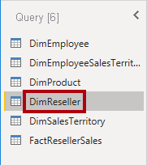

    La tabella **DimReseller** contiene una riga per rivenditore. I rivenditori vendono, distribuiscono o aggiungono valore ai prodotti Adventure Works.

16. Per visualizzare i valori delle colonne, nella scheda **Visualizza** della barra multifunzione selezionare **Profilo colonna** nel gruppo **Anteprima dati**.

    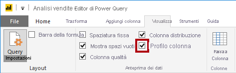

17. Selezionare l'intestazione di colonna **BusinessType**.

18. Notare il nuovo riquadro aperto sotto il riquadro di anteprima dei dati.

19. Esaminare le statistiche delle colonne e la distribuzione dei valori nel riquadro di anteprima dei dati.

20. Si noti il problema relativo alla qualità dei dati: sono presenti due etichette per il magazzino (**Warehouse** e la versione con un errore di ortografia **Ware House**).

    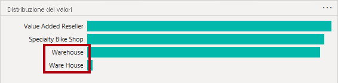

21. Passare il puntatore sulla barra relativa a **Ware House** e osservare che sono presenti cinque righe con questo valore.

    Verrà applicata una trasformazione per rietichettare queste cinque righe nel lab **Caricare i dati in Power BI Desktop**.

22. Nel riquadro **Query** selezionare la query **DimSalesTerritory**.

    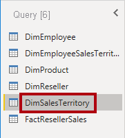

    La tabella **DimSalesTerritory** contiene una riga per ogni area di vendita, tra cui **Corporate HQ** (sede centrale). Le aree sono assegnate a un paese e i paesi sono assegnati ai gruppi. Nel lab **Modellare i dati in Power BI Desktop - Parte 1**, si creerà una gerarchia per consentire l'analisi a livello di area, paese o gruppo.

23. Nel riquadro **Query** selezionare la query **FactResellerSales**.

    

    La tabella **FactResellerSales** contiene una riga per ogni riga dell'ordine di vendita. Un ordine di vendita contiene uno o più articoli.

24. Verificare la qualità della colonna **TotalProductCost** e osservare che l'8% delle righe è vuoto.

    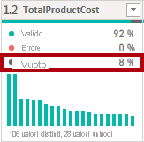

    I valori mancanti nella colonna **TotalProductCost** rappresentano un problema di qualità dei dati. Per risolvere il problema, nel lab **Caricare i dati in Power BI Desktop** si applicheranno le trasformazioni per inserire i valori mancanti usando il costo standard dei prodotti, archiviato nella tabella **DimProduct** correlata.

### **Attività 5: Recuperare i dati da un file CSV**

In questa attività verrà creata una query basata su un file CSV.

1. Per aggiungere una nuova query nella finestra **Editor di Power Query**, nella scheda **Home** della barra multifunzione fare clic sulla freccia a discesa **Nuova origine** nel gruppo **Nuova query** e quindi selezionare **Testo/CSV**.

    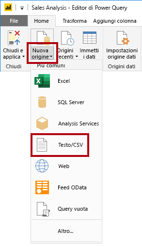

2. Nella finestra **Apri** passare alla cartella **D:\PL300\Resources** e selezionare il file **ResellerSalesTargets.csv**.

3. Fare clic su **Apri**.

4. Nella finestra **ResellerSalesTargets.csv** esaminare i dati in anteprima.

5. Fare clic su **OK**.

    

  
‎ 

6. Nel riquadro **Query** osservare l'aggiunta della query **ResellerSalesTargets**.

    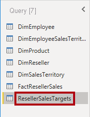

    Il file CSV **ResellerSalesTargets** contiene una riga per ogni venditore, per anno. Ogni riga registra 12 obiettivi di vendita mensili (espressi in migliaia). Si noti che l'anno fiscale dell'azienda Adventure Works inizia il 1° luglio.

7. Notare anche che nessuna colonna contiene valori vuoti.

    Quando non è presente un obiettivo di vendita mensile, viene invece archiviato un trattino.

8. Esaminare le icone in ogni intestazione di colonna, a sinistra del nome della colonna.

    

    Le icone rappresentano il tipo di dati della colonna. **123** indica un numero intero e **ABC** indica il testo.

    Nel lab **Caricare i dati in Power BI Desktop** si applicheranno molte trasformazioni per ottenere un risultato di tipo diverso costituito solo da tre colonne: **Date**, **EmployeeKey** e **TargetAmount**.

### **Attività 6: Recuperare dati aggiuntivi da un file CSV**

In questa attività verrà creata una query aggiuntiva basata su un file CSV diverso.

1. Usare la procedura descritta nell'attività precedente per creare una query basata sul file **D:\PL300\Resources\ColorFormats.csv**.

    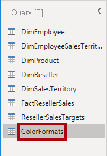

    Il file CSV **ColorFormats** contiene una riga per ogni colore di prodotto. Ogni riga registra i codici esadecimali per formattare i colori di sfondo e dei caratteri. Questi dati verranno integrati con i dati della query **DimProduct** nel lab **Caricare i dati in Power BI Desktop**.

### **Attività 7: Completare il lab**

In questa attività si completerà il lab.

1. Nella scheda **Visualizza** della barra multifunzione, nel gruppo **Anteprima dati** deselezionare le tre opzioni di anteprima dei dati abilitate in precedenza in questo lab:

    - Colonna qualità

    - Colonna distribuzione

    - Profilo colonna

    

2. Per salvare il file di Power BI Desktop, nella finestra **Editor di Power Query** selezionare **Salva** nella visualizzazione Backstage **File**.

    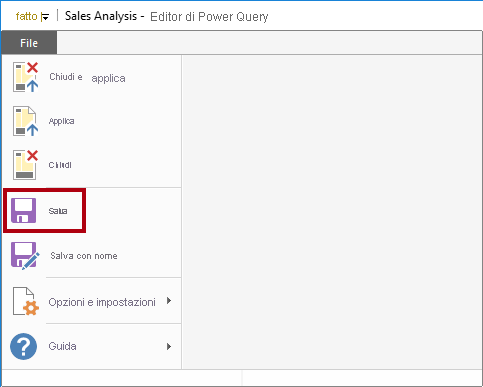

3. Quando viene richiesto di applicare le query, fare clic su **Applica più tardi**.

    

    Applicando le query, i dati vengono caricati nel modello di dati. Non si è pronti per eseguire questa operazione, in quanto è prima necessario applicare molte trasformazioni.

4. Se si intende iniziare il lab successivo, lasciare aperto Power BI Desktop.

    Nel lab **Caricare i dati in Power BI Desktop** verranno eseguite varie trasformazioni delle query e quindi si applicheranno le query per caricarle nel modello di dati.
