---
lab:
  title: Caricare i dati in Power BI Desktop
  module: 'Module 3 - Clean, Transform, and Load Data in Power BI'
---

# <a name="load-data-in-power-bi-desktop"></a>**Caricare i dati in Power BI Desktop**

**Il tempo stimato per il completamento del lab è di 45 minuti**

In questo lab si inizieranno ad applicare trasformazioni a ognuna delle query create nel lab precedente. Le query verranno quindi applicate per caricare ognuna come tabella nel modello di dati.

Contenuto del lab:

- Applicare varie trasformazioni

- Applicare query per caricarle nel modello di dati

### <a name="lab-story"></a>**Presentazione del lab**

Questo lab fa parte di una serie che comprende molti lab progettati come attività completa, dalla preparazione dei dati alla pubblicazione come report e dashboard. È possibile completare i lab nell'ordine desiderato. Se tuttavia si intende seguire più lab, per i primi 10 è consigliabile procedere in questo ordine:

1. Preparare i dati in Power BI Desktop

2. **Caricare i dati in Power BI Desktop**

3. Modellare i dati in Power BI Desktop


5. Creare calcoli DAX in Power BI Desktop - Parte 1

6. Creare calcoli DAX in Power BI Desktop - Parte 2

7. Progettare un report in Power BI Desktop - Parte 1

8. Progettare un report in Power BI Desktop - Parte 2

9. Creare un dashboard di Power BI

10. Eseguire l'analisi dei dati in Power BI Desktop

11. Applicare la sicurezza a livello di riga

## <a name="exercise-1-load-data"></a>**Esercizio 1: Caricare i dati**

In questo esercizio si applicheranno trasformazioni a ognuna delle query create nel lab precedente.

### <a name="task-1-get-started"></a>**Attività 1: Operazioni preliminari**

In questa attività si configurerà l'ambiente per il lab.

*Importante: se si sta continuando dal lab precedente (e il lab è stato completato correttamente), non completare questa attività, ma passare a quella successiva.*

1. Per aprire Power BI Desktop, sulla barra delle applicazioni fare clic sul collegamento Microsoft Power BI Desktop.

    

1. Per chiudere la finestra introduttiva, fare clic su **X** nella parte superiore sinistra della finestra.

    

1. Per aprire il file di avvio di Power BI Desktop, selezionare la scheda della barra multifunzione **File** per aprire la visualizzazione Backstage.

1. Selezionare **Apri report**.

    

1. Fare clic su **Sfoglia report**.

    

1. Nella finestra **Apri** passare alla cartella **D:\PL300\Labs\02-load-data-with-power-query-in-power-bi-desktop\Starter**.

1. Selezionare il file **Sales Analysis**.

1. Fare clic su **Apri**.

    

1. Chiudere eventuali finestre aperte di carattere informativo.

1. Si noti il messaggio di avviso giallo sotto la barra multifunzione.

    *Il messaggio avvisa che le query non sono state applicate per il caricamento come tabelle del modello. Le query verranno applicate più avanti in questo lab.*

1. Per ignorare il messaggio di avviso giallo, fare clic su **X** a destra.

    

1. Per creare una copia del file, fare clic sulla scheda della barra multifunzione **File** per aprire la visualizzazione Backstage.

1. Selezionare **Salva con nome**.

    

1. Se viene richiesto di applicare le modifiche, fare clic su **Applica più tardi**.

    

1. Nella finestra **Salva con nome** passare alla cartella **D:\PL300\MySolution**.

1. Fare clic su **Save** (Salva).

    

1. Per aprire la finestra **Editor di Power Query**, nella scheda della barra multifunzione **Home**, nel gruppo **Query** fare clic sull'icona **Trasforma dati**.

    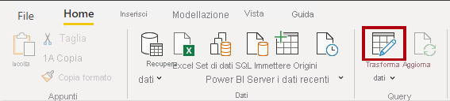

### <a name="task-2-configure-the-salesperson-query"></a>**Attività 2: Configurare la query Salesperson**

In questa attività verrà configurata la query **Salesperson**.

1. Nella finestra **Editor di Power Query**, nel riquadro **Query**, selezionare la query **DimEmployee**.

    

2. Per rinominare la query, nel riquadro **Impostazioni query** (situato a destra), nella casella **Nome** sostituire il testo con **Salesperson** e quindi premere **INVIO**.

    *Il nome della query determinerà il nome della tabella del modello. È consigliabile definire nomi concisi, ma intuitivi.*

3. Nel riquadro **Query** verificare che il nome della query sia stato aggiornato.

    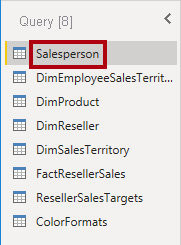

    *È ora possibile filtrare le righe della query per recuperare solo i dipendenti che sono venditori.*

4. Per individuare una colonna specifica, nella scheda **Home** della barra multifunzione, dal gruppo **Gestisci colonne** fare clic sulla freccia rivolta verso il basso **Scegli colonne** e quindi selezionare **Vai a colonna**.

    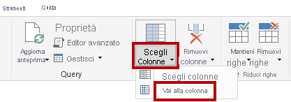

    *Suggerimento: questa tecnica è utile quando una query contiene molte colonne. Se le colonne non sono troppe, è possibile scorrere semplicemente in orizzontale per trovare la colonna a cui si è interessati.*

5. Nella finestra **Vai a colonna**, per ordinare l'elenco in base al nome della colonna, fare clic sul pulsante di ordinamento **AZ** e quindi selezionare **Nome**.

    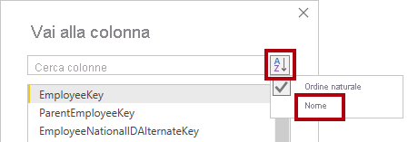

6. Selezionare la colonna **SalesPersonFlag** e quindi fare clic su **OK**.

7. Per filtrare la query, nell'intestazione di colonna **SalesPersonFlag** fare clic sulla freccia rivolta verso il basso e deselezionare **FALSE**.

    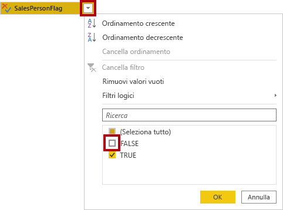

8. Fare clic su **OK**.

    

9. Nel riquadro **Impostazioni query**, nell'elenco **Passaggi applicati**, notare l'aggiunta del passaggio **Filtrate righe**.

    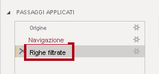

    *Ogni trasformazione creata comporta una logica di passaggio aggiuntiva. È possibile modificare o eliminare passaggi. È anche possibile selezionare un passaggio per visualizzare un'anteprima dei risultati della query in quella fase della trasformazione.*

10. Per rimuovere colonne, nella scheda **Home** della barra multifunzione, dall'interno del gruppo **Gestisci colonne** fare clic sull'icona **Scegli colonne**.

    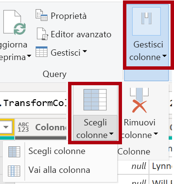

11. Nella finestra **Scegli colonne**, per deselezionare tutte le colonne, deselezionare l'opzione **(Seleziona tutte le colonne)**.

    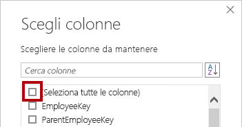

12. Per includere colonne, selezionare le 6 colonne seguenti:

    - EmployeeKey

    - EmployeeNationalIDAlternateKey

    - FirstName

    - LastName

    - Title

    - EmailAddress

13. Fare clic su **OK**.

    

14. Nell'elenco **Passaggi applicati** si noti l'aggiunta di un altro passaggio della query.

    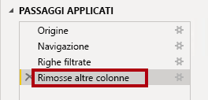

15. Per creare una singola colonna del nome, selezionare prima l'intestazione di colonna **FirstName**.

16. Tenendo premuto il tasto **CTRL** selezionare la colonna **LastName**.

    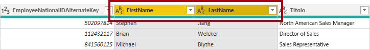

17. Fare clic con il pulsante destro del mouse su una delle intestazioni di colonna selezionate e quindi scegliere **Merge di colonne** dal menu di scelta rapida.

    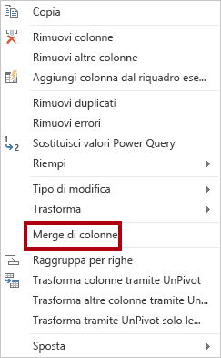

    *Molte trasformazioni comuni possono essere applicate facendo clic con il pulsante destro del mouse sull'intestazione di colonna e scegliendo quindi la trasformazione desiderata dal menu di scelta rapida. Si noti, tuttavia, che sono disponibili altre trasformazioni nella barra multifunzione.*

18. Nella finestra **Merge di colonne** selezionare **Spazio** nell'elenco a discesa **Separatore**.

19. Nella casella **Nome nuova colonna** sostituire il testo con **Salesperson**.

    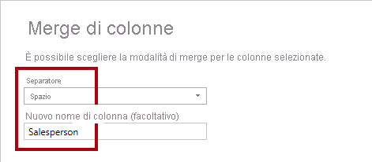

20. Fare clic su **OK**.

    

21. Per rinominare la colonna **EmployeeNationalIDAlternateKey**, fare doppio clic sull'intestazione di colonna **EmployeeNationalIDAlternateKey**.

22. Sostituire il testo con **EmployeeID** e quindi premere **INVIO**.

    *Importante: quando viene richiesto di rinominare le colonne, è importante rinominarle esattamente come descritto.*

23. Usare i passaggi precedenti per rinominare la colonna **EmailAddress** in **UPN**.

    *UPN è l'acronimo di User Principal Name, ovvero nome dell'entità utente. I valori in questa colonna verranno usati quando si configurerà la sicurezza a livello di riga nel lab **Modellare i dati in Power BI Desktop - Parte 2**.*

24. Nella parte inferiore sinistra della barra di stato verificare che la query includa cinque colonne e 18 righe.

    

    *Importante: è importante non continuare se la query non produce il risultato corretto, perché non sarà possibile completare i lab successivi. Se le colonne o le righe della query non corrispondono, ripercorrere i passaggi descritti in questa attività per risolvere eventuali problemi.*

### <a name="task-3-configure-the-salespersonregion-query"></a>**Attività 3: Configurare la query SalespersonRegion**

In questa attività verrà configurata la query **SalespersonRegion**.

1. Nel riquadro **Query** selezionare la query **DimEmployeeSalesTerritory**.

    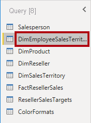

2. Nel riquadro **Impostazioni query** rinominare la query in **SalespersonRegion**.

3. Per rimuovere le ultime due colonne, selezionare prima di tutto l'intestazione di colonna **DimEmployee**.

4. Tenendo premuto il tasto **CTRL** selezionare l'intestazione di colonna **DimSalesTerritory**.

5. Fare clic con il pulsante destro del mouse su una delle intestazioni di colonna selezionate e quindi scegliere **Rimuovi colonne** dal menu di scelta rapida.

    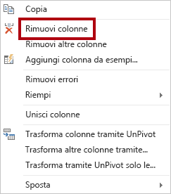

6. Nella barra di stato verificare che la query includa due colonne e 39 righe.

    

### <a name="task-4-configure-the-product-query"></a>**Attività 4: Configurare la query Product**

In questa attività verrà configurata la query **Product**.

*Importante: nei casi in cui sono già state fornite istruzioni dettagliate, i passaggi del lab forniranno ora istruzioni più concise. Se sono necessarie istruzioni dettagliate, fare riferimento ai passaggi delle attività precedenti.*

1. Selezionare la query **DimProduct**.

    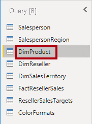

2. Rinominare la query in **Product**.

3. Individuare la colonna **FinishedGoodsFlag** e quindi filtrare la colonna per recuperare i prodotti che sono prodotti finiti (ovvero TRUE).

4. Rimuovere tutte le colonne, ad eccezione delle seguenti:

    - ProductKey

    - EnglishProductName

    - StandardCost

    - Color

    - DimProductSubcategory

5. Si noti che la colonna **DimProductSubcategory** rappresenta una tabella correlata (contiene collegamenti a **Value**).

6. Nell'intestazione di colonna **DimProductSubcategory**, a destra del nome della colonna, fare clic sul pulsante di espansione.

    

7. Per deselezionare tutte le colonne, deselezionare l'opzione **(Seleziona tutte le colonne)**.

8. Selezionare le colonne **EnglishProductSubcategoryName** e **DimProductCategory**.

    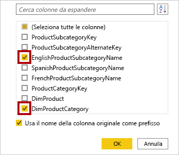

    *Selezionando queste due colonne verrà applicata una trasformazione per creare un join con la tabella **DimProductSubcategory** e quindi includere tali colonne. La colonna **DimProductCategory** è in realtà un'altra tabella correlata nell'origine dati.*

9. Deselezionare la casella di controllo **Usa il nome della colonna originale come prefisso**.

    

    *I nomi delle colonne di query devono essere sempre univoci. Se questa casella di controllo rimane selezionata, a ogni colonna viene aggiunto il nome della colonna espanso come prefisso (in questo caso **DimProductSubcategory**). Poiché è noto che i nomi delle colonne selezionate non sono in conflitto con i nomi delle colonne nella query **Product**, l'opzione è deselezionata.*

10. Fare clic su **OK**.

    

11. Si noti che la trasformazione ha determinato l'aggiunta di due colonne e che la colonna **DimProductSubcategory** è stata rimossa.

12. Espandere la colonna **DimProductCategory** e quindi introdurre solo la colonna **EnglishProductCategoryName**.

13. Rinominare le 4 colonne seguenti:

    - **EnglishProductName** in **Product**

    - **StandardCost** in **Standard Cost** (includere uno spazio)

    - **EnglishProductSubcategoryName** in **Subcategory**

    - **EnglishProductCategoryName** in **Category**

14. Nella barra di stato verificare che la query includa 6 colonne e 397 righe.

    

### <a name="task-5-configure-the-reseller-query"></a>**Attività 5: Configurare la query Reseller**

In questa attività verrà configurata la query **Reseller**.

1. Selezionare la query **DimReseller**.

    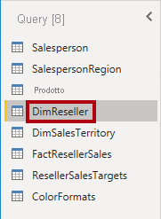

2. Rinominare la query in **Reseller**.

3. Rimuovere tutte le colonne, ad eccezione delle seguenti:

    - ResellerKey

    - BusinessType

    - ResellerName

    - DimGeography

4. Espandere la colonna **DimGeography**, in modo da includere solo le tre colonne seguenti:

    - City

    - StateProvinceName

    - EnglishCountryRegionName

    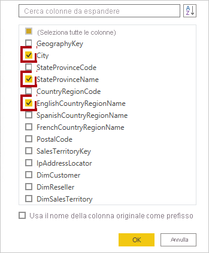

5. Nell'intestazione di colonna **Business Type** fare clic sulla freccia in giù, quindi esaminare i singoli valori della colonna e notare l'errore ortografico per warehouse.

    

  
‎ 

6. Fare clic con il pulsante destro del mouse sull'intestazione di colonna **Business Type** e quindi scegliere **Sostituisci valori**.

    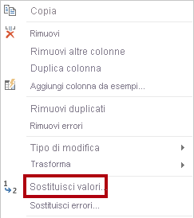

7. Nella finestra **Sostituisci valori** configurare i valori seguenti:

    - Nella casella **Valore da trovare** immettere **Ware House**

    - Nella casella **Sostituisci con** immettere **Warehouse**

    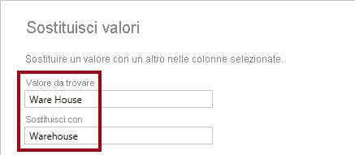

8. Fare clic su **OK**.

    

9. Rinominare le 4 colonne seguenti:

    - **BusinessType** in **Business Type** (includere uno spazio)

    - **ResellerName** in **Reseller**

    - **StateProvinceName** in **State-Province**

    - **EnglishCountryRegionName** in **Country-Region**

10. Nella barra di stato verificare che la query includa 6 colonne e 701 righe.

    

### <a name="task-6-configure-the-region-query"></a>**Attività 6: Configurare la query Region**

In questa attività verrà configurata la query **Region**.

1. Selezionare la query **DimSalesTerritory**.

    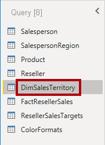

2. Rinominare la query in **Region**.

3. Applicare un filtro alla colonna **SalesTerritoryAlternateKey** per rimuovere il valore 0 (zero).

    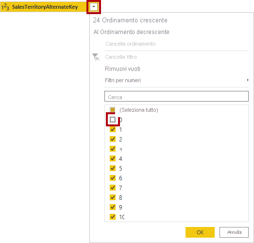

4. Rimuovere tutte le colonne, ad eccezione delle seguenti:

    - SalesTerritoryKey

    - SalesTerritoryRegion

    - SalesTerritoryCountry

    - SalesTerritoryGroup

5. Rinominare le tre colonne seguenti:

    - **SalesTerritoryRegion** in **Region**

    - **SalesTerritoryCountry** in **Country**

    - **SalesTerritoryGroup** in **Group**

6. Nella barra di stato verificare che la query includa 4 colonne e 10 righe.

    

### <a name="task-7-configure-the-sales-query"></a>**Attività 7: Configurare la query Sales**

In questa attività verrà configurata la query **Sales**.

1. Selezionare la query **FactResellerSales**.

    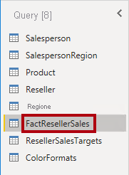

2. Rinominare la query in **Sales**.

3. Rimuovere tutte le colonne, ad eccezione delle seguenti:

    - SalesOrderNumber

    - OrderDate

    - ProductKey

    - ResellerKey

    - EmployeeKey

    - SalesTerritoryKey

    - OrderQuantity

    - UnitPrice

    - TotalProductCost

    - SalesAmount

    - DimProduct

    *Si ricorderà che nel lab **Preparare i dati in Power BI Desktop** mancavano i valori **TotalProductCost** in una piccola percentuale di righe di **FactResellerSales**. La colonna **DimProduct** è stata inclusa per recuperare la colonna del costo standard del prodotto, per facilitare la correzione dei valori mancanti.*

4. Espandere la colonna **DimProduct**, deselezionare tutte le colonne e quindi includere la colonna **StandardCost**.

5. Per creare una colonna personalizzata, nella scheda **Aggiungi colonna** della barra multifunzione, dall'interno del gruppo **Generale**, fare clic su **Colonna personalizzata**.

    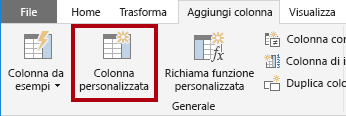

6. Nella finestra **Colonna personalizzata** nella casella **Nome nuova colonna** sostituire il testo con **Cost**.

    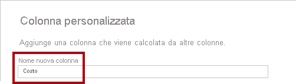

7. Nella casella **Formula colonna personalizzata** immettere l'espressione seguente (dopo il simbolo di uguale).

8. Per praticità, è possibile copiare l'espressione dal file **D:\PL300\Labs\02-load-data-with-power-query-in-power-bi-desktop\Assets\Snippets.txt**.


   **Power Query**
   ```
   if [TotalProductCost] = null then [OrderQuantity] * [StandardCost] else [TotalProductCost]
   ```


*Questa espressione verifica se manca il valore **TotalProductCost**. In caso affermativo, produce un valore moltiplicando il valore di **OrderQuantity** per il valore di **StandardCost**. In caso contrario, viene usato il valore **TotalProductCost** esistente.*

9. Fare clic su **OK**.

    

10. Rimuovere le due colonne seguenti:

    - TotalProductCost

    - StandardCost

11. Rinominare le tre colonne seguenti:

    - **OrderQuantity** in **Quantity**

    - **UnitPrice** in **Unit Price** (includere uno spazio)

    - **SalesAmount** in **Sales**

12. Per modificare il tipo di dati della colonna, nell'intestazione di colonna **Quantity**, a sinistra del nome della colonna, fare clic sull'icona **1.2** e quindi selezionare **Numero intero**.

    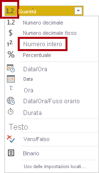

    *La configurazione del tipo di dati corretto è importante. Anche quando la colonna contiene un valore numerico è importante scegliere il tipo corretto se si prevede di eseguire calcoli matematici.*

13. Modificare i tipi di dati delle tre colonne seguenti in **Numero decimale fisso**.

    - Unit Price

    - Sales

    - Cost

    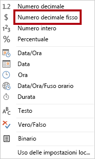

    *Il tipo di dati Numero decimale fisso archivia i valori con la massima precisione, quindi richiede più spazio di archiviazione rispetto al tipo Numero decimale. È importante usare il tipo Numero decimale fisso per i valori finanziari o i tassi, ad esempio i tassi di cambio.*

14. Nella barra di stato verificare che la query includa 10 colonne e più di 999 righe.

    

    *Un massimo di 1000 righe verrà caricato come dati di anteprima per ogni query.*

### <a name="task-8-configure-the-targets-query"></a>**Attività 8: Configurare la query Targets**

In questa attività verrà configurata la query **Targets**.

1. Selezionare la query **ResellerSalesTargets**.

    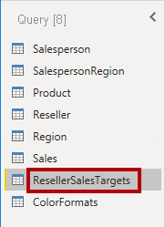

2. Rinominare la query in **Targets**.

3. Per trasformare tramite UnPivot le colonne dei 12 mesi (**M01**-**M12**), selezionare prima di tutto le intestazioni di colonna **Year** e **EmployeeID**.

    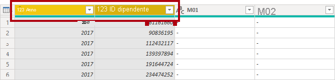

4. Fare clic con il pulsante destro del mouse su una delle intestazioni di colonna selezionate e quindi scegliere **Trasforma altre colonne tramite UnPivot** dal menu di scelta rapida.

    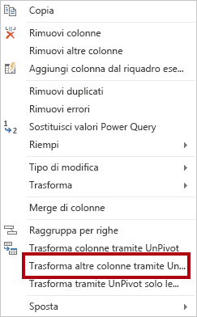

5. Si noti che i nomi di colonna vengono ora visualizzati nella colonna **Attribute** e i valori vengono visualizzati nella colonna **Value**.

6. Applicare un filtro alla colonna **Value** per rimuovere i valori trattino (-).

    *Si ricorderà che il carattere trattino è stato usato nel file CSV di origine per rappresentare lo zero (0).*

7. Rinominare le due colonne seguenti:

    - **Attributo** in **MonthNumber** (nessuno spazio tra le due parole, verrà rimosso in seguito)

    - **Value** in **Target**

    *Verranno ora applicate le trasformazioni per produrre una colonna della data. La data verrà derivata dalle colonne **Year** e **MonthNumber**. La colonna verrà creata usando la funzionalità **Colonna da esempi**.*

8. Per preparare i valori della colonna **MonthNumber**, fare clic con il pulsante destro del mouse sull'intestazione di colonna **MonthNumber** e quindi scegliere **Sostituisci valori**.

    

9. Nella finestra **Sostituisci valori**, nella casella **Valore da trovare** immettere **M**.

    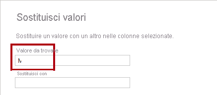

10. Fare clic su **OK**.

11. Modificare il tipo di dati della colonna **MonthNumber** in **Numero intero**.

    

12. Nella scheda **Aggiungi colonna** della barra multifunzione, dall'interno del gruppo **Generale** fare clic sull'icona **Colonna da esempi**.

    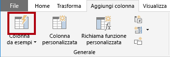

13. Si noti che la prima riga è relativa all'anno **2017** e al numero del mese **7**.

14. Nella colonna **Column1**, nella prima cella della griglia, immettere **7/1/2017** e quindi premere **INVIO**.

    *La macchina virtuale usa le impostazioni internazionali degli Stati Uniti, quindi questa data è in effetti il 1° luglio 2017.*

15. Si noti che le celle della griglia vengono aggiornate con i valori stimati.

    *La funzionalità ha stimato con precisione che i valori vengono combinati dalle colonne **Year** e **MonthNumber**.*

16. Si noti anche la formula visualizzata sopra la griglia della query.

    

17. Per rinominare la nuova colonna, fare doppio clic sull'intestazione di colonna **Sottoposto a merge**.

18. Rinominare la colonna in **TargetMonth**.

    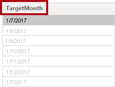

19. Per aggiungere la nuova colonna, fare clic su **OK**.

    

20. Rimuovere le colonne seguenti:

    - Year

    - MonthNumber

21. Modificare i tipi di dati delle colonne seguenti:

    - **Target** come numero decimale fisso

    - **TargetMonth** come data

22. Per moltiplicare i valori di **Target** per 1000, selezionare l'intestazione di colonna **Target**, quindi nella scheda della barra multifunzione **Trasforma**, dall'interno del gruppo **Colonna Numero**, fare clic su **Standard** e quindi selezionare **Moltiplica**.

    *Si ricorderà che i valori di destinazione sono stati archiviati come migliaia.*

    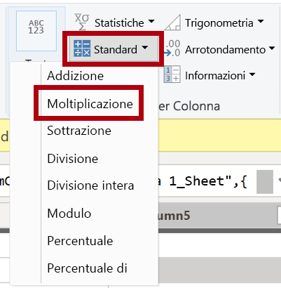

23. Nella finestra **Moltiplica**, nella casella **Valore** immettere **1000**.

    

24. Fare clic su **OK**.

    

25. Nella barra di stato verificare che la query includa tre colonne e 809 righe.

    

### <a name="task-9-configure-the-colorformats-query"></a>**Attività 9: Configurare la query ColorFormats**

In questa attività verrà configurata la query **ColorFormats**.

1. Selezionare la query **ColorFormats**.

    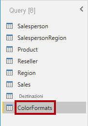

2. Si noti che la prima riga contiene i nomi delle colonne.

3. Nella scheda **Home** della barra multifunzione fare clic su **Usa prima riga come intestazioni** nel gruppo **Trasforma**.

    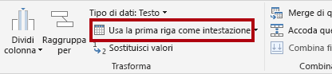

4. Nella barra di stato verificare che la query includa tre colonne e 10 righe.

    

### <a name="task-10-update-the-product-query"></a>**Attività 10: Aggiornare la query Product**

In questa attività verrà aggiornata la query **Product** tramite il merge della query **ColorFormats**.

1. Selezionare la query **Product**.

    

2. Per eseguire il merge della query **ColorFormats**, nella scheda della barra multifunzione **Home** fare clic su **Merge di query** nel gruppo **Combina**.

    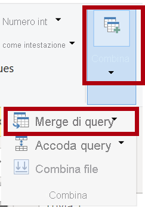

    *Il merge delle query consente l'integrazione di dati, in questo caso da origini dati diverse (SQL Server e un file CSV).*

3. Nella finestra **Merge** nella griglia della query **Product** selezionare l'intestazione di colonna **Color**.

    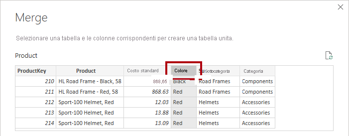

4. Nell'elenco a discesa della griglia della query **Product** selezionare la query **ColorFormats**.

    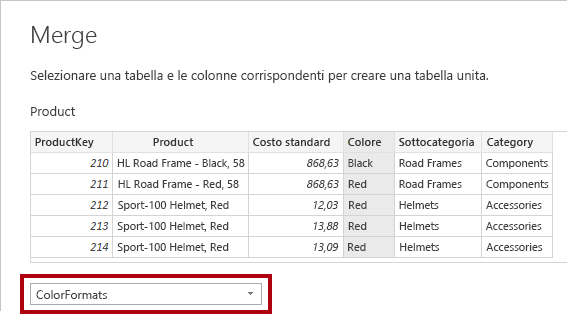

5. Nella griglia della query **ColorFormats** selezionare l'intestazione di colonna **Color**.

6. Quando viene visualizzata la finestra **Livelli di privacy**, per ognuna delle due origini dati, nell'elenco a discesa corrispondente selezionare **Aziendale**.

    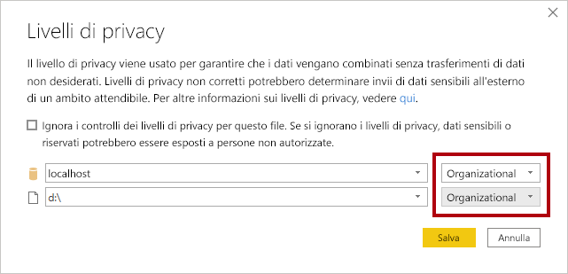

    *È possibile configurare i livelli di privacy per l'origine dati per determinare se i dati possono essere condivisi tra le origini. L'impostazione di ogni origine dati come **Azienda** consente la condivisione dei dati, se necessario. Si noti che le origini dati private non possono mai essere condivise con altre origini dati. Questo non significa che i dati privati non possono essere condivisi, ma che il motore di Power Query non può condividere i dati tra le origini.*

7. Fare clic su **Save** (Salva).

    

8. Nella finestra **Merge** usare il valore predefinito per **Tipo di join**, mantenendo la selezione di Left Outer Join e fare clic su **OK**.

    

9. Espandere la colonna **ColorFormats** per includere le due colonne seguenti:

    - Background Color Format

    - Font Color Format

    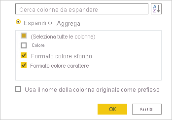

10. Nella barra di stato verificare che la query includa ora otto colonne e 397 righe.

    

### <a name="task-11-update-the-colorformats-query"></a>**Attività 11: Aggiornare la query ColorFormats**

In questa attività si aggiornerà la query **ColorFormats** per disabilitarne il caricamento.

1. Selezionare la query **ColorFormats**.

    

2. Nel riquadro **Impostazioni query** fare clic sul collegamento **Tutte le proprietà**.

    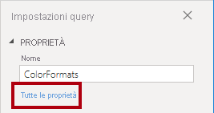

3. Nella finestra **Proprietà query** deselezionare la casella di controllo **Abilita caricamento nel report**.

    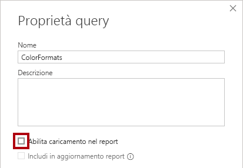

    La disabilitazione del caricamento significa che non verrà caricata come tabella nel modello di dati. Questa operazione è necessaria perché è stato eseguito il merge della query con la query **Product**, abilitata per il caricamento nel modello di dati.

4. Fare clic su **OK**.

    

### <a name="task-12-finish-up"></a>**Attività 12: Completare il lab**

In questa attività si completerà il lab.

1. Verificare di avere otto query, denominate correttamente come indicato di seguito:

    - Salesperson

    - SalespersonRegion

    - Product

    - Reseller

    - Region

    - Sales

    - Targets

    - ColorFormats (che non verrà caricata nel modello di dati)

2. Per eseguire il caricamento nel modello di dati, nella visualizzazione Backstage **File** selezionare **Chiudi e applica**.

    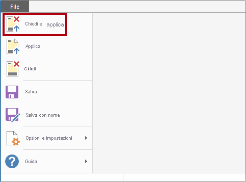

    *Tutte le query abilitate per il caricamento sono ora caricate nel modello di dati.*

3. Nel riquadro **Campi** (a destra) si notino le sette tabelle caricate nel modello di dati.

    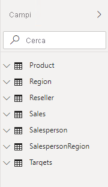

4. Salvare il file di Power BI Desktop.

5. Se si intende iniziare il lab successivo, lasciare aperto Power BI Desktop.

    *Le tabelle e le relazioni del modello di dati verranno configurate nel lab **Modellare i dati in Power BI Desktop - Parte 1**.*
