---
lab:
  title: Modellare i dati in Power BI Desktop
  module: Module 4 - Design a Data Model in Power BI
---

# **Modellare i dati in Power BI Desktop**

**Il tempo stimato per il completamento del lab è di 45 minuti**

In questo lab si inizierà a sviluppare il modello di dati. Il processo includerà la creazione di relazioni tra le tabelle e poi la configurazione delle proprietà delle tabelle e delle colonne per migliorare l'accessibilità e l'usabilità del modello di dati. Verranno anche create gerarchie e misure rapide.

Contenuto del lab:

- Creare le relazioni del modello

- Configurare le proprietà delle tabelle e delle colonne

- Creare gerarchie

### **Presentazione del lab**

Questo lab fa parte di una serie che comprende molti lab progettati come attività completa, dalla preparazione dei dati alla pubblicazione come report e dashboard. È possibile completare i lab nell'ordine desiderato. Se tuttavia si intende seguire più lab, per i primi 10 è consigliabile procedere in questo ordine:

1. Preparare i dati in Power BI Desktop

2. Caricare i dati in Power BI Desktop

3. **Modellare i dati in Power BI Desktop**

5. Creare calcoli DAX in Power BI Desktop - Parte 1

6. Creare calcoli DAX in Power BI Desktop - Parte 2

7. Progettare un report in Power BI Desktop - Parte 1

8. Progettare un report in Power BI Desktop - Parte 2

9. Creare un dashboard di Power BI

10. Eseguire l'analisi dei dati in Power BI Desktop

11. Applicare la sicurezza a livello di riga

## **Esercizio 1: Creare le relazioni del modello**

In questo esercizio verranno create le relazioni del modello.

### **Attività 1: Operazioni preliminari**

In questa attività si configurerà l'ambiente per il lab.

*Importante: se si sta continuando dal lab precedente (e il lab è stato completato correttamente), non completare questa attività, ma passare a quella successiva.*

1. Per aprire Power BI Desktop, sulla barra delle applicazioni fare clic sul collegamento Microsoft Power BI Desktop.

    

1. Per chiudere la finestra introduttiva, fare clic su **X** nella parte superiore sinistra della finestra.

    

1. Per aprire il file di avvio di Power BI Desktop, selezionare la scheda della barra multifunzione **File** per aprire la visualizzazione Backstage.

1. Selezionare **Apri report**.

    

1. Fare clic su **Esplora report**.

    

1. Nella finestra **Apri** passare alla cartella **D:\PL300\Labs\03-configure-data-model-in-power-bi-desktop\Starter**.

1. Selezionare il file **Sales Analysis**.

1. Fare clic su **Apri**.

    

1. Chiudere eventuali finestre aperte di carattere informativo.

1. Per creare una copia del file, fare clic sulla scheda della barra multifunzione **File** per aprire la visualizzazione Backstage.

1. Selezionare **Salva con nome**.

    

1. Se viene richiesto di applicare le modifiche, fare clic su **Applica**.

    

1. Nella finestra **Salva con nome** passare alla cartella **D:\PL300\MySolution**.

1. Fare clic su **Save** (Salva).

    

### **Attività 2: Creare le relazioni del modello**

In questa attività verranno create le relazioni del modello.

1. Nella parte sinistra di Power BI Desktop fare clic sull'icona della visualizzazione **Modello**.

    

2. Se non vengono visualizzate tutte e sette le tabelle, scorrere orizzontalmente a destra, quindi trascinare e disporre le tabelle in modo più ravvicinato in modo che possano essere visualizzate tutte contemporaneamente.

    *Suggerimento: è anche possibile usare il controllo zoom disponibile nella parte inferiore della finestra.*

    *Nella visualizzazione Modello è possibile visualizzare ogni tabella e qualsiasi relazione (connettori tra le tabelle). Attualmente non sono presenti relazioni perché nel lab **Preparare i dati in Power BI Desktop** sono state disabilitate le opzioni per la relazione di caricamento dei dati.*

3. Per tornare alla visualizzazione Report, a sinistra, fare clic sull'icona della visualizzazione **Report**.

    

4. Per visualizzare tutti i campi delle tabelle, nel riquadro **Campi** fare clic con il pulsante destro del mouse su un'area vuota e quindi scegliere **Espandi tutto**.

    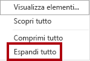

5. Per creare un oggetto visivo Tabella, nel riquadro **Campi**, dall'interno della tabella **Product** selezionare il campo **Category**.

    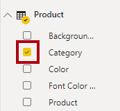

    *Nei lab viene usata una notazione abbreviata per fare riferimento a un campo, simile al seguente: **Product \| Category**. In questo esempio **Product** è il nome della tabella e **Category** è il nome del campo.*

6. Per aggiungere una colonna alla tabella, nel riquadro **Campi** selezionare il campo **Sales \| Sales**.

7. Si noti che l'oggetto visivo Tabella elenca quattro categorie di prodotti e che il valore Sales è lo stesso per ognuno e lo stesso per il totale.

    

    *Il problema è che la tabella è basata su campi da tabelle diverse. Si prevede che ogni categoria di prodotto visualizzi le vendite per tale categoria. Tuttavia, poiché non esiste una relazione del modello tra queste tabelle, la tabella **Sales** non viene filtrata. Si aggiungerà ora una relazione per propagare i filtri tra le tabelle.*

8. Nella scheda della barra multifunzione **Modellazione**, nel gruppo **Relazioni**, fare clic su **Gestisci relazioni**.

    

9. Nella finestra **Gestisci relazioni** si noti che non sono ancora state definite relazioni.

10. Per creare una relazione, fare clic su **Nuova**.

    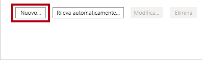

11. Nella finestra **Crea relazione**, nel primo elenco a discesa selezionare la tabella **Product**.

    

12. Nel secondo elenco a discesa (sotto la griglia della tabella **Product**) selezionare la tabella **Sales**.

    

13. Si noti che sono state selezionate automaticamente le colonne **ProductKey** in ogni tabella.

    *Le colonne sono state selezionate automaticamente perché condividono lo stesso nome e tipo di dati.*

14. Nell'elenco a discesa **Cardinalità** si noti che è selezionata l'opzione **Uno a molti (1:*)**.

    *La cardinalità è stata rilevata automaticamente, perché Power BI rileva che la colonna **ProductKey** della tabella **Product** contiene valori univoci. Le relazioni uno-a-molti rappresentano la cardinalità più comune e tutte le relazioni create in questo lab saranno di questo tipo. Nel lab **Modellare i dati in Power BI Desktop - Parte 2** si userà una cardinalità molti-a-molti.*

15. Nell'elenco a discesa **Direzione filtro incrociato** si noti che è selezionata l'opzione **Singola**.

    *La direzione di filtro singola indica che i filtri vengono propagati dal lato "uno" al lato "molti". In questo caso, significa che i filtri applicati alla tabella **Product** verranno propagati alla tabella **Sales**, ma non nell'altra direzione. Nel lab **Modellare i dati in Power BI Desktop - Parte 2** si userà una relazione bidirezionale.*

16. Si noti che è selezionata l'opzione **Imposta come relazione attiva**.

    *Le relazioni attive propagheranno i filtri. È possibile contrassegnare una relazione come inattiva, in modo che i filtri non vengano propagati. Le relazioni inattive possono esistere quando sono presenti più percorsi di relazione tra le tabelle. In tal caso, i calcoli del modello possono usare funzioni speciali per attivarle. Nel lab **Modellare i dati in Power BI Desktop - Parte 2** si userà una relazione inattiva.*

17. Fare clic su **OK**.

    

18. Nella finestra **Gestisci relazioni** osservare che la nuova relazione è elencata e quindi fare clic su **Chiudi**.

    

19. Nel report si noti che l'oggetto visivo Tabella è stato aggiornato per visualizzare valori diversi per ogni categoria di prodotto.

    

    *I filtri applicati alla tabella **Product** vengono ora propagati alla tabella **Sales**.*

20. Passare alla visualizzazione Modello e notare che è ora presente un connettore tra le due tabelle (non importa se le tabelle sono posizionate una accanto all'altra).

    

21. Nel diagramma si noterà che è possibile interpretare la cardinalità, rappresentata dagli indicatori **1** e *****.

    *La direzione del filtro è rappresentata dalla punta della freccia. Una linea continua rappresenta una relazione attiva, mentre una linea tratteggiata rappresenta una relazione inattiva.*

22. Passare il puntatore del mouse sulla relazione per evidenziare le colonne correlate.

    *Esiste un modo più semplice per creare una relazione. Nel diagramma del modello è possibile trascinare e rilasciare le colonne per creare una nuova relazione.*

23. Per creare una nuova relazione usando una tecnica diversa, dalla tabella **Reseller** trascinare la colonna **ResellerKey** alla colonna **ResellerKey** della tabella **Sales**.

    

    *Suggerimento: a volte non si riesce a trascinare una colonna. In questa situazione, selezionare una colonna diversa, quindi selezionare la colonna da trascinare e riprovare. Verificare che la nuova relazione aggiunta sia visibile nel diagramma.*

24. Usare la nuova tecnica per creare le due relazioni tra modelli seguenti:

    - Da **Region \| SalesTerritoryKey** a **Sales \| SalesTerritoryKey**

    - Da **Salesperson \| EmployeeKey** a **Sales \| EmployeeKey**

    *In questo lab, le tabelle **SalespersonRegion** e **Targets** rimarranno disconnesse. Esiste una relazione molti-a-molti tra i venditori e le aree. Questo sarà lo scenario avanzato a cui si lavorerà nel lab **Modellare i dati in Power BI Desktop, Parte 2**.*

25. Nel diagramma disporre le tabelle in modo che la tabella **Sales** sia posizionata al centro del diagramma e che le tabelle correlate siano disposte attorno ad essa. Posizionare le tabelle disconnesse a lato.

    

26. Salvare il file di Power BI Desktop.

## **Esercizio 2: Configurare le tabelle**

In questo esercizio verrà configurata ogni tabella creando gerarchie e nascondendo, formattando e categorizzando le colonne.

### **Attività 1: Configurare la tabella Product**

In questa attività verrà configurata la tabella **Product**.

1. Nella visualizzazione Modello, se necessario, espandere la tabella **Product** nel riquadro **Campi** per visualizzare tutti i campi.

2. Per creare una gerarchia, nel riquadro **Campi** fare clic con il pulsante destro del mouse sulla colonna **Category** e quindi scegliere **Crea gerarchia**.

    

3. Nel riquadro **Proprietà** (a sinistra del riquadro **Campi**), nella casella **Nome** sostituire il testo con **Prodotti**.

    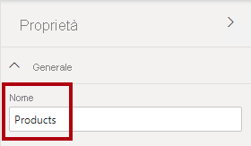

4. Per aggiungere il secondo livello alla gerarchia, nel riquadro **Proprietà**, nell'elenco a discesa **Gerarchia** selezionare **Subcategory** (potrebbe essere necessario scorrere verso il basso all'interno del riquadro).

5. Per aggiungere il terzo livello alla gerarchia, nell'elenco a discesa **Gerarchia** selezionare **Product**.

6. Per completare la progettazione della gerarchia, fare clic su **Applica modifiche al livello**.

    

    *Suggerimento: non dimenticare di fare clic su **Applica modifiche al livello**. È un errore comune dimenticarsi di questo passaggio.*

7. Nel riquadro **Campi** osservare la gerarchia di **Products**.

    

8. Per visualizzare i livelli della gerarchia, espandere la gerarchia di **Products**.

    

9. Per organizzare le colonne in una cartella di visualizzazione, nel riquadro **Campi** selezionare prima di tutto la colonna **Background Color Format**.

10. Tenendo premuto il tasto **CTRL** selezionare la colonna **Font Color Format**.

11. Nel riquadro **Proprietà**, nella casella **Cartella di visualizzazione**, immettere **Formatting**.

    

12. Nel riquadro **Campi** si noti che le due colonne si trovano ora all'interno di una cartella.

    

    *Le cartelle di visualizzazione sono un ottimo modo per fare ordine tra le tabelle, in particolare quelle che contengono molti campi.*

### **Attività 2: Configurare la tabella Region**

In questa attività verrà configurata la tabella **Region**.

1. Nella tabella **Region** creare una gerarchia denominata **Regions** con i tre livelli seguenti:

    - Group

    - Country

    - Region

    

2. Selezionare la colonna **Country** (non il livello della gerarchia **Country**).

3. Nel riquadro **Proprietà** espandere la sezione **Avanzate** nella parte inferiore del riquadro e quindi nell'elenco a discesa **Categoria dati** selezionare **Country/Region**.

    

    *La categorizzazione dei dati può fornire suggerimenti per la progettazione dei report. In questo caso, la classificazione della colonna come paese o area geografica fornisce informazioni più accurate a Power BI durante il rendering di una visualizzazione mappa.*

### **Attività 3: Configurare la tabella Reseller**

In questa attività verrà configurata la tabella **Reseller**.

1. Nella tabella **Reseller** creare una gerarchia denominata **Resellers** con i due livelli seguenti:

    - Business Type

    - Reseller

    

2. Creare una seconda gerarchia denominata **Geography** con i quattro livelli seguenti:

    - Country-Region

    - State-Province

    - City

    - Reseller

    

3. Categorizzare le tre colonne seguenti:

    - **Country-Region** come **Country/Region**

    - **State-Province** come **State or Province**

    - **City** come **City**

### **Attività 4: Configurare la tabella Sales**

In questa attività verrà configurata la tabella **Sales**.

1. Nella tabella **Sales** selezionare la colonna **Cost**.

2. Nel riquadro **Proprietà** nella casella **Descrizione** immettere: **Based on standard cost**

    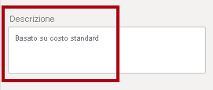

    *Le descrizioni possono essere applicate a tabelle, colonne, gerarchie o misure. Nel riquadro **Campi** il testo della descrizione viene visualizzato in una descrizione comando quando l'autore del report passa il cursore sul campo.*

3. Selezionare la colonna **Quantity**.

4. Nel riquadro **Proprietà**, nella sezione **Formattazione**, impostare l'interruttore per la proprietà **Separatore delle migliaia** su **Sì**.

    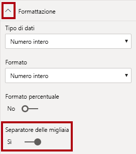

5. Selezionare la colonna **Unit Price**.

6. Nel riquadro **Proprietà**, nella sezione **Formattazione**, impostare l'interruttore per la proprietà **Posizioni decimali** su **2**.

7. Nel gruppo **Avanzate** (potrebbe essere necessario scorrere verso il basso per individuarlo), nell'elenco a discesa **Riepiloga per** selezionare **Media**.

    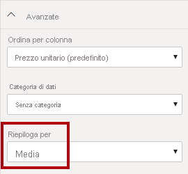

    *Per impostazione predefinita, le colonne numeriche verranno riepilogate sommandone i valori. Questo comportamento predefinito non è adatto per una colonna come **Unit Price**, che rappresenta una tariffa. L'impostazione del riepilogo predefinito su Media consentirà di ottenere un risultato significativo.*

### **Attività 5: Aggiornamento delle proprietà in blocco**

In questa attività verranno aggiornate più colonne con singoli aggiornamenti in blocco. Questo approccio verrà usato per nascondere le colonne e formattare i valori delle colonne.

1. Nel riquadro **Campi** selezionare la colonna **Product \| ProductKey**.

2. Tenendo premuto **CTRL** selezionare le 13 colonne seguenti (in più tabelle):

    - Region \| SalesTerritoryKey

    - Reseller \| ResellerKey

    - Sales \| EmployeeKey
    
    - Sales \| ProductKey

    - Sales \| ResellerKey

    - Sales \| SalesOrderNumber

    - Sales \| SalesTerritoryKey

    - Salesperson \| EmployeeID

    - Salesperson \| EmployeeKey

    - Salesperson \| UPN

    - SalespersonRegion \| EmployeeKey

    - SalespersonRegion \| SalesTerritoryKey

    - Targets \| EmployeeID

3. Nel riquadro **Proprietà** impostare l'interruttore della proprietà **È nascosto** su **Sì**.

    

    *Le colonne sono state nascoste perché vengono usate dalle relazioni o verranno usate nella configurazione della sicurezza a livello di riga o nella logica di calcolo.*

    *Nel lab **Modellare i dati in Power BI Desktop - Parte 2** si definirà la sicurezza a livello di riga usando la colonna **UPN**. Nel lab **Creare calcoli DAX in Power BI Desktop - Parte 1** si userà **SalesOrderNumber** in un calcolo.*

4. Selezionare le tre colonne seguenti:

    - Product \| Standard Cost

    - Sales \| Cost

    - Sales \| Sales

5. Nel riquadro **Proprietà**, nella sezione **Formattazione**, impostare l'interruttore per la proprietà **Posizioni decimali** su **0** (zero).

    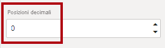

## **Esercizio 3: Esaminare l'interfaccia del modello**

In questo esercizio si passerà alla visualizzazione Report per esaminare l'interfaccia del modello.

### **Attività 1: Esaminare l'interfaccia del modello**

In questa attività si passerà alla visualizzazione Report per esaminare l'interfaccia del modello.

1. Passare alla visualizzazione Report.

2. Nel riquadro **Campi** notare quanto segue:

    - Le colonne, le gerarchie e i relativi livelli sono campi che possono essere usati per configurare gli oggetti visivi dei report

    - Sono visibili solo i campi rilevanti per la creazione di report

    - La tabella **SalespersonRegion** non è visibile perché tutti i relativi campi sono nascosti

    - I campi spaziali nelle tabelle **Region** e **Reseller** sono contrassegnati dall'icona di dati spaziali

    - I campi contrassegnati dal simbolo sigma (Ʃ) verranno riepilogati per impostazione predefinita

    - Viene visualizzata una descrizione comando quando si passa il puntatore del mouse sul campo **Sales \| Cost**

3. Espandere il campo **Sales \| OrderDate** notando che viene visualizzata una gerarchia di date.

    

    *Il campo **Targets \| TargetMonth** rappresenta una gerarchia simile. Queste gerarchie non sono state create dall'utente, ma vengono create automaticamente. È però presente un problema. L'anno finanziario di Adventure Works inizia il 1° luglio ogni anno. Tuttavia, in queste gerarchie di date create automaticamente, l'anno della gerarchia inizia il 1° gennaio ogni anno.*

    *Si vedrà ora come disattivare questo comportamento automatico. Nel lab **Creare calcoli DAX in Power BI Desktop - Parte 1**, si userà DAX per creare una tabella di date e configurarla per definire il calendario di Adventure Works.*

4. Per disattivare la data/ora automatica, fare clic sulla scheda **File** della barra multifunzione per aprire la visualizzazione backstage.

5. A sinistra selezionare **Opzioni e impostazioni** e quindi **Opzioni**.

    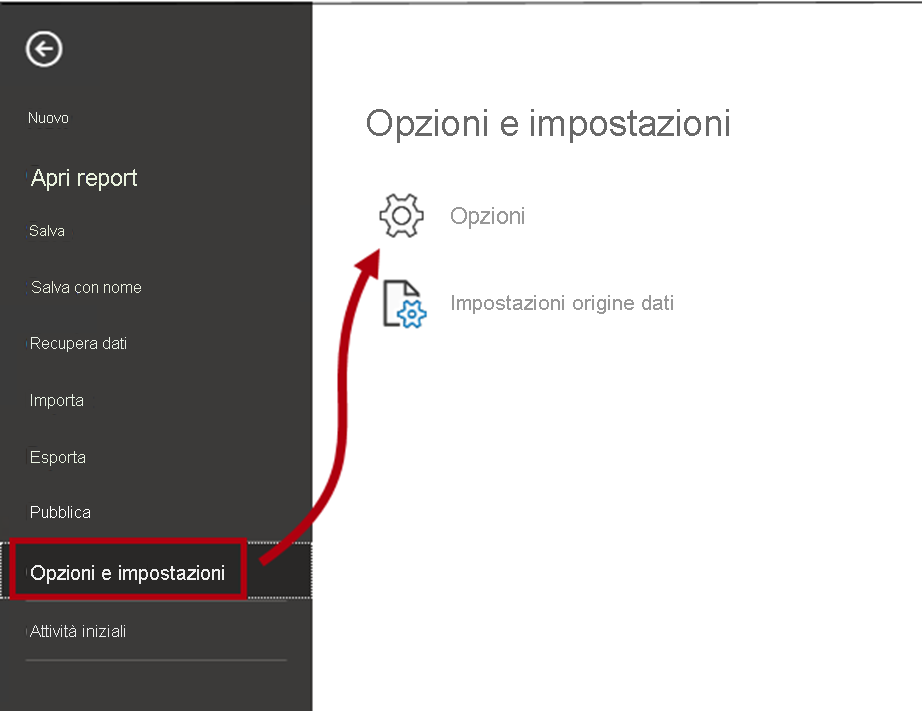

6. Nella finestra **Opzioni**, a sinistra, nel gruppo **File corrente** selezionare **Caricamento dati**.

    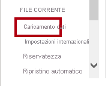

7. Nella sezione **Funzionalità di Business Intelligence per le gerarchie temporali** deselezionare **Data/ora automatica**.

    

8. Fare clic su **OK**.

    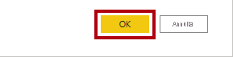

9. Nel riquadro **Campi** notare che le gerarchie di date non sono più disponibili.

    

### **Attività 2: Completare il lab**

In questa attività si completerà il lab.

1. Salvare il file di Power BI Desktop.

2. Se viene richiesto di applicare le query, fare clic su **Applica più tardi**.

3. Se si intende iniziare il lab successivo, lasciare aperto Power BI Desktop.

    *Si migliorerà il modello di dati configurando una relazione molti-a-molti e la sicurezza a livello di riga nel lab **Modellare i dati in Power BI Desktop - Parte 2**.*
