---
lab:
  title: Progettare un modello di dati in Power BI
  module: 4 - Design a Data Model in Power BI
---

# Progettare un modello di dati in Power BI

**Il tempo stimato per il completamento del lab è di 45 minuti.**

In questo lab si inizierà a sviluppare il modello di dati. Il processo includerà la creazione di relazioni tra le tabelle e poi la configurazione delle proprietà delle tabelle e delle colonne per migliorare l'accessibilità e l'usabilità del modello di dati. Si creeranno anche gerarchie e si creeranno misure rapide.

Contenuto del lab:

- Creare le relazioni del modello
- Configurare le proprietà delle tabelle e delle colonne
- Creare gerarchie

### **Presentazione del lab**

Questo lab fa parte di una serie che comprende molti lab progettati come attività completa, dalla preparazione dei dati alla pubblicazione come report e dashboard. È possibile completare i lab nell'ordine desiderato. Se tuttavia si intende seguire più lab, è consigliabile procedere in questo ordine:

1. Preparare i dati in Power BI Desktop
1. Caricare i dati in Power BI Desktop
1. **Progettare un modello di dati in Power BI**
1. Creare calcoli DAX in Power BI Desktop
1. Creare calcoli DAX avanzati in Power BI Desktop
1. Progettare un report in Power BI Desktop
1. Migliorare un report in Power BI Desktop
1. Eseguire l'analisi dei dati in Power BI
1. Creare un dashboard di Power BI
1. Applicare la sicurezza a livello di riga

## **Esercizio 1: Creare le relazioni del modello**

In questo esercizio verranno create relazioni di modello.

### **Attività 1: Operazioni preliminari**

In questa attività verrà configurato l'ambiente per il lab.

1. Aprire Power BI Desktop.

    

    *Suggerimento: per impostazione predefinita, la finestra di dialogo Introduzione viene aperta davanti a Power BI Desktop. È possibile scegliere di accedere e quindi chiudere il popup.*

1. Per aprire il file di Power BI Desktop iniziale, selezionare il file **> Apri report > Sfoglia report**.

1. Passare alla cartella **D:\PL300\Labs\03-configure-data-model-in-power-bi-desktop\Starter** e selezionare il file **Sales Analysis** .

1. Chiudere eventuali finestre aperte di carattere informativo.

1. Passare a **File > Salva con nome** e salvare il file nella cartella **D:\PL300\MySolution** .

### **Attività 2: Creare le relazioni del modello**

In questa attività verranno create le relazioni del modello. Il file è stato configurato per non identificare le relazioni tra le tabelle nei lab precedenti. Questa non è l'impostazione predefinita, ma è consigliabile impedire il lavoro aggiuntivo creando le relazioni corrette per il modello.

*Importante: i lab usano una notazione a breve per fare riferimento a un campo. Sarà simile al seguente: **Categoria di prodotti\|**. In questo esempio **Product** è il nome della tabella e **Category** è il nome del campo.*

1. Nella parte sinistra di Power BI Desktop selezionare l'icona della visualizzazione **Modello**.

     

1. Se non vengono visualizzate tutte le sette tabelle, scorrere orizzontalmente verso destra e quindi trascinare e organizzare più strettamente le tabelle in modo che possano essere visualizzate contemporaneamente.

     *Suggerimento: è anche possibile usare il controllo zoom disponibile nella parte inferiore della finestra.*

1. Per tornare alla visualizzazione Report, a sinistra selezionare l'icona Visualizzazione **report** .

     

1. Per visualizzare tutti i campi delle tabelle, nel riquadro **Campi** fare clic con il pulsante destro del mouse su un'area vuota e quindi scegliere **Espandi tutto**.

1. Per creare un oggetto visivo Tabella, nel riquadro **Campi**, dall'interno della tabella **Product** selezionare il campo **Category**.

1. Per aggiungere un'altra colonna alla tabella, nel riquadro **Campi** selezionare il campo **Sales Sales\|**.

1. Si noti che l'oggetto visivo Tabella elenca quattro categorie di prodotti e che il valore Sales è lo stesso per ognuno e lo stesso per il totale.
    
    *Il problema è che la tabella si basa su campi da tabelle diverse. L'aspettativa è che ogni categoria di prodotti visualizzi le vendite per tale categoria. Tuttavia, poiché non esiste una relazione di modello tra queste tabelle, la tabella **Sales** non viene filtrata. Verrà ora aggiunta una relazione per propagare i filtri tra le tabelle.*

     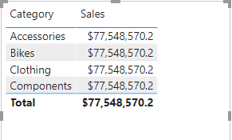

1. Nella scheda della barra multifunzione **Modellazione**, nel gruppo **Relazioni** selezionare **Gestisci relazioni**.

     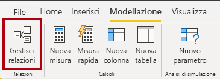

1. Nella finestra **Gestisci relazioni** si noti che non sono ancora state definite relazioni.

1. Per creare una relazione, selezionare **Nuova**.

1. Nella finestra **Crea relazione**, nel primo elenco a discesa selezionare la tabella **Product**.

     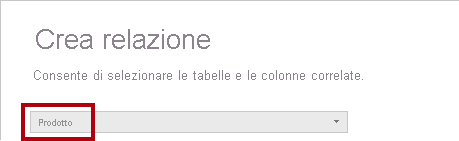

1. Nel secondo elenco a discesa (sotto la griglia della tabella **Product**) selezionare la tabella **Sales**.

     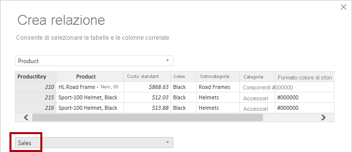

1. Si noti che sono state selezionate automaticamente le colonne **ProductKey** in ogni tabella.
    
    *Le colonne sono state selezionate perché condividono lo stesso nome e tipo di dati. Potrebbe essere necessario trovare colonne corrispondenti con nomi diversi in dati reali.*

1. Nell'elenco a discesa **Cardinalità** si noti che è selezionata l'opzione **Uno a molti (1:*)**.
    
    *La cardinalità è stata rilevata automaticamente, perché Power BI rileva che la colonna **ProductKey** della tabella **Product** contiene valori univoci. Le relazioni uno-a-molti rappresentano la cardinalità più comune e tutte le relazioni create in questo lab saranno di questo tipo.*

1. Nell'elenco a discesa **Direzione filtro incrociato** si noti che è selezionata l'opzione **Singola**.
    
    *La direzione di filtro singola indica che i filtri vengono propagati dal lato "uno" al lato "molti". In questo caso, significa che i filtri applicati alla tabella **Product** verranno propagati alla tabella **Sales**, ma non nell'altra direzione.*

1. Si noti che è selezionata l'opzione **Imposta come relazione attiva**.
    
    *Le relazioni attive propagheranno i filtri. È possibile contrassegnare una relazione come inattiva, in modo che i filtri non vengano propagati. Le relazioni inattive possono esistere quando sono presenti più percorsi di relazione tra le tabelle. In tal caso, i calcoli del modello possono usare funzioni speciali per attivarle.*

1. Selezionare **OK**, notare nella finestra **Gestisci relazioni** che la nuova relazione è elencata e quindi selezionare **Chiudi**.

1. Si noti che è ora presente un connettore tra le due tabelle (non importa se le tabelle vengono posizionate accanto all'altra).
    1. È possibile interpretare la cardinalità rappresentata dagli indicatori **1** e **(*)** .
    1. La direzione del filtro è rappresentata dalla punta della freccia.
    1. Una linea solida rappresenta una relazione attiva; una linea tratteggiata rappresenta una relazione inattiva.
    1. Passare il puntatore del mouse sulla relazione per evidenziare le colonne correlate.

     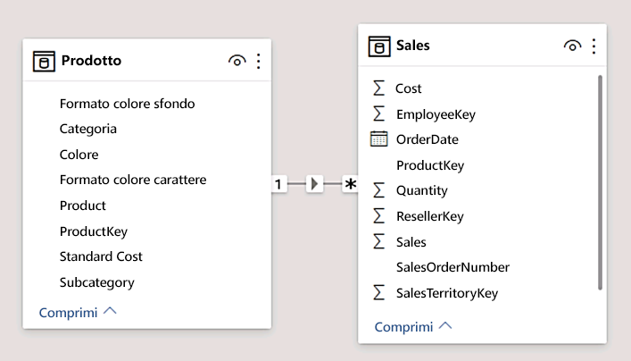

     Esiste un modo più semplice per creare una relazione. Nel diagramma del modello è possibile trascinare e rilasciare le colonne per creare una nuova relazione.

1. Per creare una nuova relazione usando una tecnica diversa, dalla tabella **Reseller** trascinare la colonna **ResellerKey** nella colonna **ResellerKey** della tabella **Sales** .
    
    *Suggerimento: a volte non si riesce a trascinare una colonna. In questa situazione, selezionare una colonna diversa, quindi selezionare la colonna da trascinare e riprovare. Verificare che la nuova relazione aggiunta sia visibile nel diagramma.*

     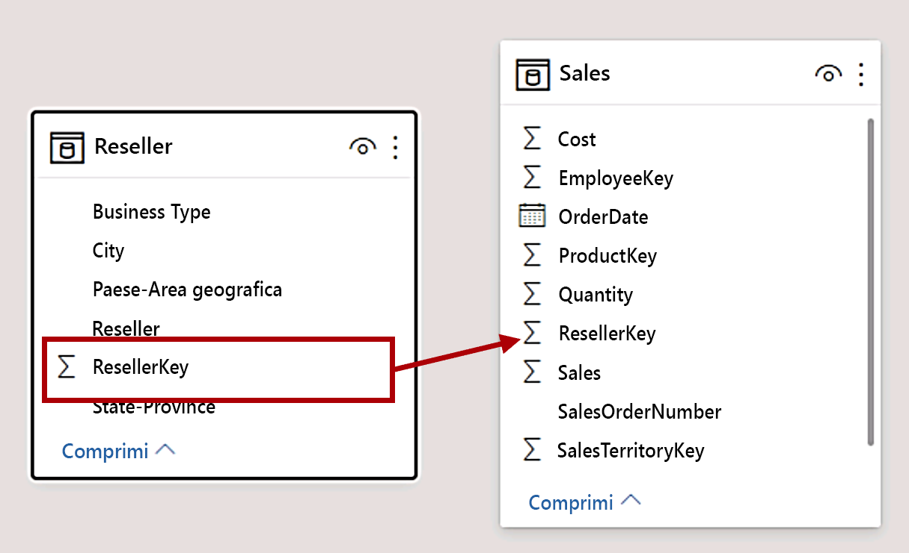

1. Usare la nuova tecnica per creare le due relazioni tra modelli seguenti:

     - Da **Region \| SalesTerritoryKey** a **Sales \| SalesTerritoryKey**
     - Da **Salesperson \| EmployeeKey** a **Sales \| EmployeeKey**

1. Nel diagramma disporre le tabelle in modo che la tabella **Sales** sia posizionata al centro del diagramma e che le tabelle correlate siano disposte attorno ad essa. Posizionare le tabelle disconnesse a lato.

     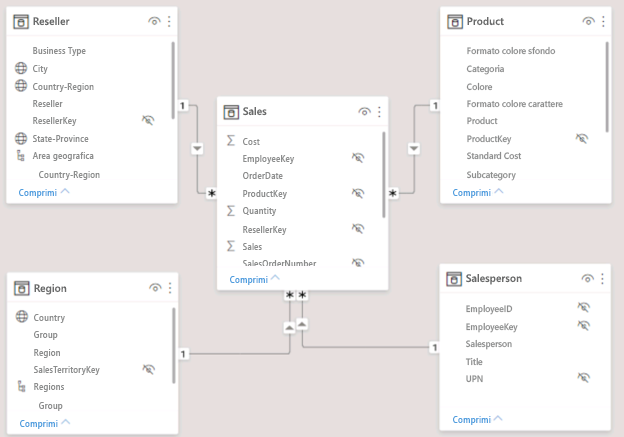

1. Nella visualizzazione report si noti che l'oggetto visivo tabella aggiornato per visualizzare valori diversi per ogni categoria di prodotto.
    
    *I filtri applicati alla tabella **Product** vengono ora propagati alla tabella **Sales**.*

     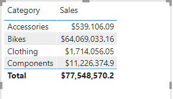

1. Salvare il file di Power BI Desktop.

## **Esercizio 2: Configurare le tabelle**

In questo esercizio verrà configurata ogni tabella creando gerarchie e nascondendo, formattazione e categorizzazione delle colonne.

### **Attività 1: Configurare la tabella Product**

In questa attività verrà configurata la tabella **Product** .

1. Nella visualizzazione Modello, se necessario, espandere la tabella **Product** nel riquadro **Campi** per visualizzare tutti i campi.

1. Per creare una gerarchia, nel riquadro **Campi** fare clic con il pulsante destro del mouse sulla colonna **Category** e quindi scegliere **Crea gerarchia**.

     

1. Nel riquadro **Proprietà** (a sinistra del riquadro **Campi**), nella casella **Nome** sostituire il testo con **Prodotti**.

1. Per aggiungere il secondo livello alla gerarchia, nel riquadro **Proprietà**, nell'elenco a discesa **Gerarchia** selezionare **Subcategory** (potrebbe essere necessario scorrere verso il basso all'interno del riquadro).

1. Per aggiungere il terzo livello alla gerarchia, nell'elenco a discesa **Gerarchia** selezionare **Product**.

1. Per completare la progettazione della gerarchia, selezionare **Applica modifiche al livello**.

     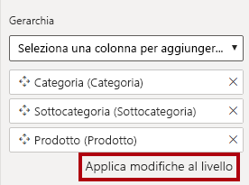

    *Suggerimento: non dimenticare di selezionare **Applica modifiche al livello**, è un errore comune per ignorare questo passaggio.*

1. Nel riquadro **Campi** osservare la gerarchia di **Products**.

     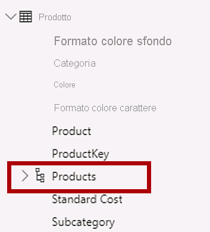

1. Per visualizzare i livelli della gerarchia, espandere la gerarchia di **Products**.

     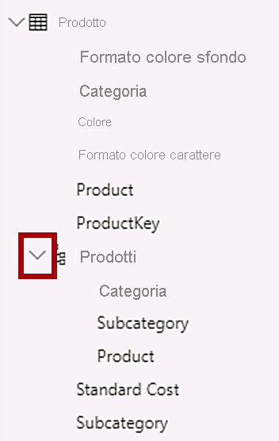

1. Per organizzare le colonne in una cartella di visualizzazione, nel riquadro **Campi** selezionare prima di tutto la colonna **Background Color Format**.

1. Tenendo premuto il tasto **CTRL** selezionare la colonna **Font Color Format**.

1. Nel riquadro **Proprietà**, nella casella **Cartella di visualizzazione**, immettere **Formatting**.

     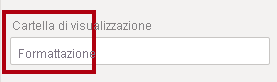

1. Nel riquadro **Campi** si noti che le due colonne si trovano ora all'interno di una cartella.
    
    *Le cartelle di visualizzazione sono un ottimo modo per declutter le tabelle, soprattutto per le tabelle che comprendono molti campi. Sono solo presentazioni logiche.*

     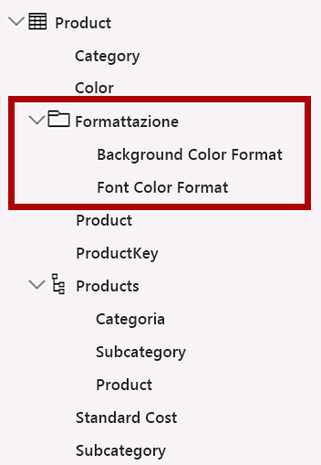

### **Attività 2: Configurare la tabella Region**

In questa attività verrà configurata la tabella **Region** .

1. Nella tabella **Region** creare una gerarchia denominata **Regions** con i tre livelli seguenti:

     - Group
     - Country
     - Region

     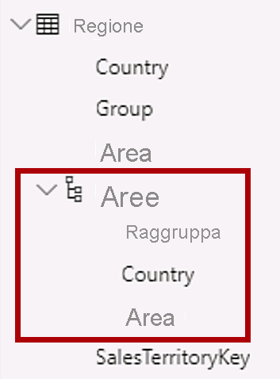

1. Selezionare la colonna **Country** (non il livello della gerarchia **Country**).

1. Nel riquadro **Proprietà** espandere la sezione **Avanzate** nella parte inferiore del riquadro e quindi nell'elenco a discesa **Categoria dati** selezionare **Country/Region**.
    
    *La categorizzazione dei dati può fornire suggerimenti per la progettazione dei report. In questo caso, la classificazione della colonna come paese o area geografica fornisce informazioni più accurate a Power BI durante il rendering di una visualizzazione mappa.*

     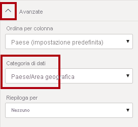

### **Attività 3: Configurare la tabella Reseller**

In questa attività verrà configurata la tabella **Reseller** .

1. Nella tabella **Reseller** creare una gerarchia denominata **Resellers** con i due livelli seguenti:

     - Business Type
     - Reseller

1. Creare una seconda gerarchia denominata **Geography** con i quattro livelli seguenti:

     - Country-Region
     - State-Province
     - City
     - Reseller

1. Impostare la **Categoria dati** per le colonne **Country-Region**, **State-Province** e **City** (non il livello di gerarchia) su **Paese**, **Stato o provincia** e **Città** rispettivamente.

### **Attività 4: Configurare la tabella Sales**

In questa attività verrà configurata la tabella **Sales** .

1. Nella tabella **Sales** selezionare la colonna **Cost**.

1. Nel riquadro **Proprietà** immettere nella casella **Descrizione** : *In base al costo standard*.
    
    *Le descrizioni possono essere applicate a tabelle, colonne, gerarchie o misure. Nel riquadro **Campi** il testo della descrizione viene visualizzato in una descrizione comando quando l'autore del report passa il cursore sul campo.*

1. Selezionare la colonna **Quantity**.

1. Nel riquadro **Proprietà**, nella sezione **Formattazione**, impostare l'interruttore per la proprietà **Separatore delle migliaia** su **Sì**.

1. Selezionare la colonna **Unit Price**.

1. Nel riquadro **Proprietà**, nella sezione **Formattazione**, impostare la proprietà **Posizioni decimali** su **2**.

1. Nel gruppo **Avanzate** (potrebbe essere necessario scorrere verso il basso per individuarlo), nell'elenco a discesa **Riepiloga per** selezionare **Media**.
    
    *Per impostazione predefinita, le colonne numeriche verranno riepilogate sommando i valori insieme. Questo comportamento predefinito non è adatto a una colonna come **Unit Price**, che rappresenta una tariffa. L'impostazione del riepilogo predefinito sulla media produrrà un risultato significativo.*

### **Attività 5: Aggiornamento delle proprietà in blocco**

In questa attività si aggiorneranno più colonne usando singoli aggiornamenti bulk. Si userà questo approccio per nascondere colonne e formattare i valori di colonna.

1. Nel riquadro **Campi** selezionare la colonna **Product \| ProductKey**.

1. Tenendo premuto **CTRL** selezionare le 13 colonne seguenti (in più tabelle):

     - Region \| SalesTerritoryKey
     - Reseller \| ResellerKey
     - Sales \| EmployeeKey
     - Sales \| ProductKey
     - Sales \| ResellerKey
     - Sales \| SalesOrderNumber
     - Sales \| SalesTerritoryKey
     - Salesperson \| EmployeeID
     - Salesperson \| EmployeeKey
     - Salesperson \| UPN
     - SalespersonRegion \| EmployeeKey
     - SalespersonRegion \| SalesTerritoryKey
     - Targets \| EmployeeID

1. Nel riquadro **Proprietà** impostare l'interruttore della proprietà **È nascosto** su **Sì**.
    
    *Le colonne sono state nascoste perché vengono usate dalle relazioni o verranno usate nella configurazione della sicurezza a livello di riga o nella logica di calcolo.*

    *Si userà **SalesOrderNumber** in un calcolo nel lab **Crea calcoli DAX in Power BI Desktop** lab.*

1. Selezionare le tre colonne seguenti:

     - Product \| Standard Cost
     - Sales \| Cost
     - Sales \| Sales

1. Nel riquadro **Proprietà**, nella sezione **Formattazione**, impostare l'interruttore per la proprietà **Posizioni decimali** su **0** (zero).

## **Esercizio 3: Esaminare l'interfaccia del modello**

In questo esercizio si passerà alla visualizzazione Report e si esaminerà l'interfaccia del modello.

### **Attività 1: Esaminare l'interfaccia del modello**

In questa attività si passerà alla visualizzazione Report e si esaminerà l'interfaccia del modello.

1. Passare alla visualizzazione Report.

1. Nel riquadro **Campi** notare quanto segue:

     - Le colonne, le gerarchie e i relativi livelli sono campi che possono essere usati per configurare gli oggetti visivi dei report
     - Sono visibili solo i campi rilevanti per la creazione di report
     - La tabella **SalespersonRegion** non è visibile perché tutti i campi sono nascosti
     - I campi spaziali nelle tabelle **Region** e **Reseller** sono contrassegnati dall'icona di dati spaziali
     - I campi contrassegnati dal simbolo sigma (Ʃ) verranno riepilogati per impostazione predefinita
     - Viene visualizzata una descrizione comando quando si passa il puntatore del mouse sul campo **Sales \| Cost**

1. Espandere il campo **Sales \| OrderDate** notando che viene visualizzata una gerarchia di date.
    
    *Il campo **TargetMonth \|** fornisce una gerarchia simile. Queste gerarchie non sono state create dall'utente. Sono stati creati automaticamente. C'è tuttavia un problema. L'anno finanziario Adventure Works inizia il 1 luglio di ogni anno. Tuttavia, in queste gerarchie di date create automaticamente, la gerarchia di date inizia il 1 gennaio di ogni anno.*

     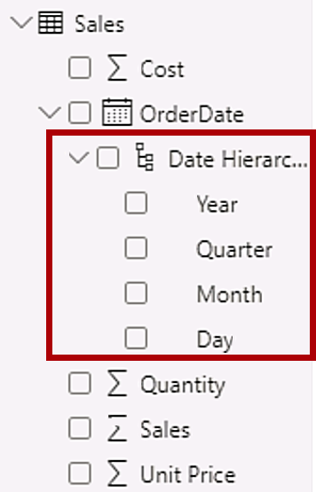

 A questo punto si disattiva questo comportamento automatico. Nel lab **Crea calcoli DAX in Power BI Desktop** lab si userà DAX per creare una tabella di date e configurarla definirà il calendario Adventure Works.

1. Per disattivare l'ora automatica/data, passare a **Opzioni > file e impostazioni > Opzioni > gruppo file corrente** e selezionare **Caricamento dati**.
    1. Nella sezione **Funzionalità di Business Intelligence per le gerarchie temporali** deselezionare **Data/ora automatica**.

     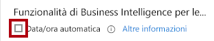

1. Nel riquadro **Campi** notare che le gerarchie di date non sono più disponibili.

     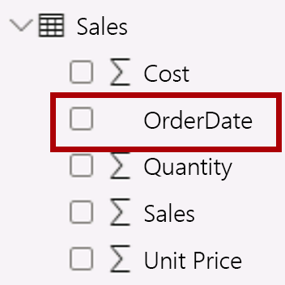

## **Esercizio 4: Creare misure rapide**

In questo esercizio verranno create due misure rapide.

### **Attività 1: Creare misure rapide**

In questa attività si creeranno due misure rapide per calcolare il profitto e il margine di profitto.

*Una misura rapida crea la formula di calcolo per l'utente. Sono facili e veloci da creare per calcoli semplici e comuni. Si creeranno misure senza usare questo strumento nel lab **Creare calcoli DAX in Power BI Desktop** lab.*

1. Nel riquadro **Campi** fare clic con il pulsante destro del mouse sulla tabella **Sales** e quindi scegliere **Nuova misura rapida**.

     

1. Nella finestra **Misure rapide**, nell'elenco a discesa **Calcolo**, dall'interno del gruppo **Operazioni matematiche** selezionare **Sottrazione**.

     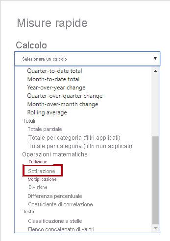

1. Nel riquadro **Campi** della finestra **Misure rapide** espandere la tabella **Sales**.

1. Trascinare il campo **Sales** nella casella **Valore di base**.

1. Trascinare il campo **Cost** nella casella **Valore da sottrarre**.

     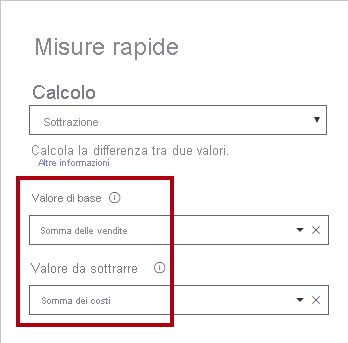

1. Nel riquadro **Campi**, all'interno della tabella **Sales**, notare la nuova misura.
    1. *Le misure usano l'icona della calcolatrice.*

     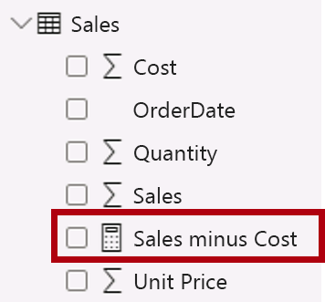

1. Per rinominare la misura, fare clic con il pulsante destro del mouse su di essa, scegliere **Rinomina** e quindi rinominare **Profit**.
    
    *Suggerimento: per rinominare un campo, è anche possibile fare doppio clic su di esso oppure selezionarlo e premere **F2**.*

1. Nella tabella **Sales** aggiungere una seconda misura rapida in base ai requisiti seguenti:

     - Usare l'operazione matematica **Divisione**
     - Impostare **Numeratore** sul campo **Sales \| Profit**
     - Impostare **Denominatore** sul campo **Sales \| Sales**
     - Rinominare la misura **Profit Margin**

1. Verificare che sia selezionata la misura **Profit Margin**, quindi sulla barra multifunzione contestuale **Strumenti misura** impostare il formato su **Percentuale**, con due posizioni decimali.

     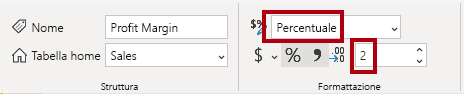

1. Per testare le due misure, selezionare innanzitutto l'oggetto visivo **tabella** nella pagina del report.

1. Nel riquadro **Campi** selezionare le due misure.

     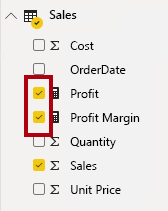

1. Selezionare e trascinare la guida a destra per allargare l'oggetto visivo Tabella.

     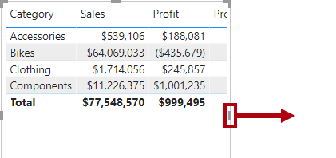

1. Verificare che le misure producano un risultato ragionevole formattato correttamente.

     

### **Attività 2: Creare una relazione molti-a-molti**

In questa attività verrà creata una relazione molti-a-molti tra la tabella **Salesperson** e la tabella **Sales** .

 *Nei lab viene usata una notazione abbreviata per fare riferimento a un campo, simile al seguente: **Salesperson \| Salesperson** . In questo esempio, **Salesperson** è il nome della tabella e **Salesperson** è il nome del campo.*

1. In Power BI Desktop, nella visualizzazione Report, nel riquadro **Campi** selezionare i due campi seguenti per creare un oggetto visivo **tabella**.

     - Salesperson \| Salesperson
     - Sales \| Sales

     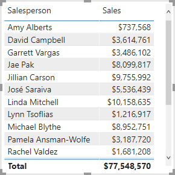

     *Nella tabella vengono visualizzate le vendite effettuate da ogni venditore. Tuttavia, esiste un'altra relazione tra i venditori e le vendite. Alcuni venditori appartengono a una, due o più aree di vendita. Inoltre, le aree di vendita possono avere più venditori assegnati.*

     *Dal punto di vista della gestione delle prestazioni, le vendite di un venditore (basate sulle rispettive aree assegnate) devono essere analizzate e confrontate con gli obiettivi di vendita. Nell'esercizio successivo verranno create le relazioni per supportare questa analisi.*

1. Si noti che **Michael Blythe** ha venduto quasi 9 milioni di dollari.

1. Passare alla visualizzazione Modello, quindi trascinare la tabella **SalespersonRegion** per posizionarla tra le tabelle **Region** e **Salesperson** .

1. Usare la tecnica di trascinamento della selezione per creare le due relazioni tra modelli seguenti:

     - Da **Salesperson \| EmployeeKey** a **SalespersonRegion \| EmployeeKey**
     - Da **Region \| SalesTerritoryKey** a **SalespersonRegion \| SalesTerritoryKey**

    *La tabella **SalespersonRegion** può essere considerata una tabella ponte.*

1. Passare alla visualizzazione Report e quindi notare che l'oggetto visivo non è stato aggiornato, ovvero il risultato delle vendite per Michael Blythe non è stato modificato.

1. Tornare alla visualizzazione Modello e quindi seguire le direzioni del filtro delle relazioni (punta della freccia) dalla tabella **Salesperson**. 
    
    *Si consideri che la tabella **Salesperson** filtra la tabella **Sales** . Filtra anche la tabella **SalespersonRegion** , ma non continua propagando i filtri alla tabella **Region** (la punta della freccia punta la direzione errata).*

     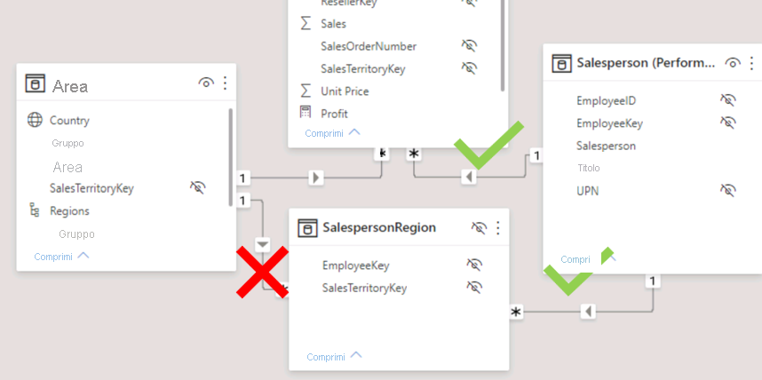

1. Per modificare la relazione tra le tabelle **Region** e **SalespersonRegion**, fare doppio clic sulla relazione.

1. Nella finestra **Modifica relazione**, nell'elenco a discesa **Direzione filtro incrociato** selezionare **Entrambe**.

1. Selezionare la casella di controllo **Applica filtro di sicurezza in entrambe le direzioni** e quindi selezionare OK.

     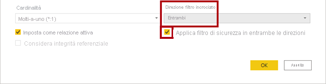

1. Si noti che la relazione ha ora una doppia freccia.

     

1. Passare alla visualizzazione Report e notare che i valori delle vendite non sono ancora cambiati.
    
    *Il problema si riferisce ora al fatto che esistono due possibili percorsi di propagazione dei filtri tra le tabelle **Salesperson** e **Sales**. Questa ambiguità viene risolta internamente, in base a una valutazione "numero minimo di tabelle". Per essere chiari, non è consigliabile progettare modelli con questo tipo di ambiguità. Il problema verrà risolto in parte più avanti in questo lab e al completamento del lab **Creare calcoli DAX in Power BI Desktop** lab.*

1. Passare alla visualizzazione Modello per forzare la propagazione dei filtri tramite la tabella bridging. Modificare (doppio clic) la relazione tra le tabelle **Salesperson** e **Sales** .

1. Nella finestra **Modifica relazione** deselezionare la casella di controllo **Rendi attiva relazione** e selezionare **OK**.
    
    *La propagazione del filtro seguirà ora l'unico percorso attivo.*

1. Nel diagramma si noti che la relazione inattiva è rappresentata da una linea tratteggiata.

     

1. Passare alla visualizzazione Report e quindi notare che le vendite per Michael Blythe sono ora quasi 22 milioni di dollari.

     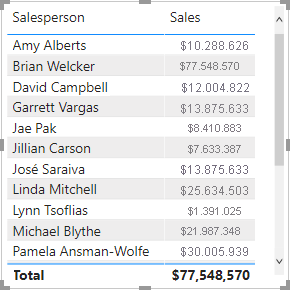

1. Si noti anche che le vendite per ogni venditore, se sommate, sarebbero maggiori del totale della tabella.

     *Si tratta di un'osservazione comune di una relazione molti-a-molti a causa del doppio, triplo, ecc. conteggio dei risultati delle vendite regionali. Si consideri Brian Welcker, il secondo venditore elencato. L'importo delle vendite è uguale all'importo totale delle vendite. È il risultato corretto a causa del fatto che è il direttore delle vendite; le vendite vengono misurate in base alle vendite di tutte le regioni.*

     *Anche se la relazione molti-a-molti funziona ora, non è ora possibile analizzare le vendite effettuate da un venditore (perché la relazione è inattiva). Sarà possibile riattivare la relazione quando si introduce una tabella calcolata che consentirà di analizzare le vendite effettuate nelle aree di vendita assegnate al venditore (per l'analisi delle prestazioni) nel lab **Creare calcoli DAX in Power BI Desktop** lab.*

1. Passare alla visualizzazione Modello e quindi nel diagramma selezionare la tabella **Salesperson**.

1. Nel riquadro **Proprietà**, nella casella **Nome** sostituire il testo con **Salesperson (prestazioni)**.

*La tabella rinominata ora riflette lo scopo: viene usata per segnalare e analizzare le prestazioni dei venditori in base alle vendite delle aree di vendita assegnate.*

### **Attività 3: Correlare la tabella Targets**

In questa attività si creerà una relazione con la tabella **Targets**

1. Creare una relazione dalla colonna **Salesperson (Performance) \| EmployeeID** alla colonna **Targets \| EmployeeID**.

1. Nella visualizzazione Report aggiungere il campo **Targets \| Target** all'oggetto visivo tabella.

1. Ridimensionare l'oggetto visivo tabella in modo che tutte le colonne siano visibili.

     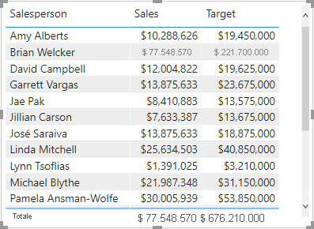

 *È ora possibile visualizzare le vendite e gli obiettivi, ma prestare attenzione a due motivi. In primo luogo, non esiste alcun filtro per un periodo di tempo e quindi anche gli obiettivi includono gli importi di destinazione futuri. In secondo luogo, le destinazioni non sono additive e quindi il totale non deve essere visualizzato. Possono essere disabilitati formattando l'oggetto visivo o rimosso usando la logica di calcolo. Si seguirà il secondo approccio creando una misura di destinazione nel lab **Crea calcoli DAX avanzati in Power BI Desktop** lab che restituirà BLANK quando vengono filtrati più venditori.*

### **Attività 4: Completare il lab**

In questa attività si completerà il lab.

Salvare il file Power BI Desktop e selezionare **Applica in seguito** se viene richiesto di applicare query.
