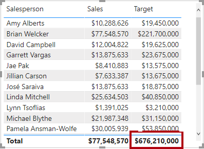
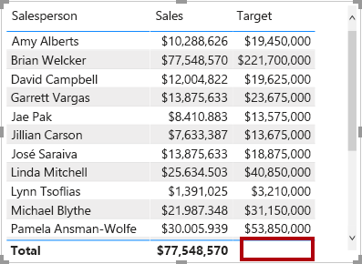
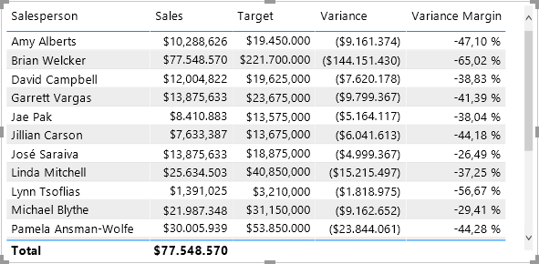
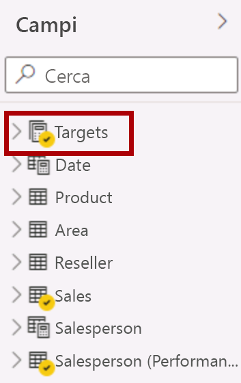

---
lab:
  title: Creare calcoli DAX in Power BI Desktop
  module: Create Model Calculations using DAX in Power BI
---


# Creare calcoli DAX in Power BI Desktop

## **Presentazione del lab**

In questo lab verranno create tabelle calcolate, colonne calcolate e misure semplici usando Data Analysis Expressions (DAX).

Contenuto del lab:

- Creare tabelle calcolate
- Creare colonne calcolate
- Creare misure

**Questo lab richiede circa 45 minuti.**

## **Creare tabelle calcolate**

In questo esercizio si creeranno due tabelle calcolate. La prima sarà la tabella **Salesperson** per consentire una relazione diretta tra la tabella e la tabella **Sales**. La seconda sarà la tabella **Date**.

*Importante: se si continua dal lab precedente (e il lab è stato completato correttamente), non completare questa attività; Continuare invece dall'attività successiva.*

1. Aprire Power BI Desktop.

    

    *Suggerimento: per impostazione predefinita, la finestra di dialogo Introduzione viene visualizzata davanti a Power BI Desktop. È possibile scegliere di eseguire l'accesso e quindi chiudere il popup.*

1. Per aprire il file di Power BI Desktop iniziale, selezionare file **> Apri report > Sfoglia report**.

1. Nella finestra **Apri** passare alla cartella **D:\PL300\Labs\04-create-dax-calculations-in-power-bi-desktop\Starter** e aprire il file **Sales Analysis** .

1. Chiudere eventuali finestre aperte di carattere informativo.

1. Si noti il messaggio di avviso giallo sotto la barra multifunzione.

    *Questo messaggio avvisa il fatto che le query non sono state applicate al caricamento come tabelle del modello. Le query verranno applicate più avanti in questo lab.*

    *Per ignorare il messaggio di avviso, a destra del messaggio di avviso giallo selezionare **X**.*

1. Per creare una copia del file, passare a **File > Salva con** nome e salvare nella cartella **D:\PL300\MySolution** .

1. Se viene richiesto di applicare le modifiche, selezionare **Applica più tardi**.

## **Creare la tabella Salesperson**

In questa attività si creerà la tabella calcolata **Salesperson** (relazione diretta con **Sales**).

Una tabella calcolata viene creata immettendo prima il nome della tabella, seguito dal simbolo di uguale (=), seguito da una formula DAX che restituisce una tabella. Il nome della tabella non può essere già presente nel modello di dati.

La barra della formula supporta l'immissione di una formula DAX valida. Include funzionalità quali il completamento automatico, IntelliSense e la codifica a colori, consentendo di immettere rapidamente e accuratamente la formula.

1. In Power BI Desktop nella vista Report nella barra multifunzione **Modellazione** all'interno del gruppo **Calcoli** selezionare **Nuova tabella**.

     

2. Nella barra della formula, che si apre direttamente sotto la barra multifunzione durante la creazione o la modifica dei calcoli, digitare **Salesperson =**, premere **MAIUSC+INVIO**, digitare **'Salesperson (Performance)'** e quindi premere **INVIO**.

    *Per praticità, tutte le definizioni DAX in questo lab possono essere copiate dal file di frammenti disponibile in **D:\PL300\Labs\04-create-dax-calculations-in-power-bi-desktop\Assets\Snippets.txt**.*

     

     *Questa definizione di tabella crea una copia della tabella **Salesperson (Performance).** Copia solo i dati, ma le proprietà del modello, ad esempio visibilità, formattazione e così via. non vengono copiati.*

     *Suggerimento: si consiglia di immettere "spazi vuoti", ovvero ritorni a capo e schede, per scrivere formule in un formato intuitivo e facile da leggere, soprattutto quando le formule sono lunghe e complesse. Per immettere un ritorno a capo, premere **MAIUSC+INVIO**. "Spazio vuoto" è facoltativo.*

1. Nel riquadro **Dati** si noti che l'icona della tabella è una sfumatura di blu (che indica una tabella calcolata).

    

    *Nota: le tabelle calcolate vengono definite usando una formula DAX che restituisce una tabella. È importante comprendere che le tabelle calcolate aumentano le dimensioni del modello di dati perché materializzano e archiviano i valori. Vengono ricalcolate ogni volta che le dipendenze delle formule vengono aggiornate, come accade per questo modello di dati quando vengono caricati nuovi valori di data (futuri) nelle tabelle.*

    *A differenza delle tabelle con origine Power Query, le tabelle calcolate non possono essere usate per caricare dati da origini dati esterne. Possono solo trasformare i dati in base ai dati già caricati nel modello di dati.*

1. Passare alla visualizzazione Modello e notare che la tabella **Salesperson** è disponibile (potrebbe essere necessario reimpostare la visualizzazione per trovare la tabella).

1. Creare una relazione dalla colonna **Salesperson \| EmployeeKey** alla colonna **Sales \| EmployeeKey**.

1. Fare clic con il pulsante destro del mouse sulla relazione inattiva tra le tabelle **Salesperson (Performance)** e **Sales**, quindi selezionare **Elimina**. Quando viene richiesto di confermare l'eliminazione, selezionare **Sì**.

1. Nella tabella **Salesperson** selezionare più colonne e quindi nasconderle (impostare la proprietà **È nascosta** su **Sì**):

    - EmployeeID
    - EmployeeKey
    - UPN

1. Nel diagramma del modello selezionare la tabella **Salesperson**.

1. Nel riquadro **Proprietà** nella casella **Descrizione** immettere: **Salesperson related to Sales**.
    
    *È possibile ricordare che le descrizioni vengono visualizzate come descrizioni comando nel riquadro **Dati** quando l'utente passa il cursore su una tabella o un campo.*

1. Per la tabella **Salesperson (Performance)** impostare la descrizione su: **Salesperson related to region(s)**.

*Il modello di dati offre ora due alternative durante l'analisi dei venditori. La tabella **Salesperson** consente di analizzare le vendite effettuate da un venditore, mentre la tabella **Salesperson (Performance)** consente di analizzare le vendite effettuate nelle aree di vendita assegnate al venditore.*

## **Creare la tabella Date**

In questa attività verrà creata la tabella **Date**.

1. Passa alla vista Dati. Nella scheda **Home** della barra multifunzione nel gruppo **Calcoli** selezionare **Nuova tabella**.

    

1. Nella barra della formula immettere quanto segue:

    **DAX**

    ```
    Date =  
    CALENDARAUTO(6)
    ```

    


    *La funzione CALENDARAUTO() restituisce una tabella a colonna singola costituita da valori di data. Il comportamento "automatico" analizza tutte le colonne data del modello di dati per determinare il valore della data più recente e il valore della data meno recente archiviati nel modello di dati. Viene quindi creata una riga per ogni data all'interno di questo intervallo, estendendo l'intervallo in entrambe direzioni per garantire che vengano archiviati anni di dati completi.*

    *Questa funzione può accettare un singolo argomento facoltativo che corrisponde al numero dell'ultimo mese di un anno. Quando viene omesso, il valore è 12, indicando dicembre come ultimo mese dell'anno. In questo caso viene immesso 6, indicando giugno come ultimo mese dell'anno.*

1. Si noti la colonna di valori data.

    

    *Le date visualizzate sono formattate usando le impostazioni internazionali degli Stati Uniti (ovvero mm/gg/aaaa).*

5. Nell'angolo inferiore sinistro nella barra di stato osservare le statistiche della tabella: sono state generate 1826 righe di dati che rappresentano i dati di cinque anni completi.

    

## **Creare colonne calcolate**

In questa attività si aggiungeranno altre colonne per abilitare il filtro e il raggruppamento in base a periodi di tempo diversi. Verrà creata anche una colonna calcolata per controllare l'ordinamento delle altre colonne.

*Per praticità, tutte le definizioni DAX in questo lab possono essere copiate dal file di frammenti disponibile in **D:\PL300\Labs\04-create-dax-calculations-in-power-bi-desktop\Assets\Snippets.txt**.*

1. Nella barra multifunzione contestuale **Strumenti tabella** nel gruppo **Calcoli** selezionare **Nuova colonna**.

    

1. Nella barra della formula digitare il comando seguente (o copiarlo dal file dei frammenti) e quindi premere **INVIO**:


    **DAX**


    ```
    Year =
    "FY" & YEAR('Date'[Date]) + IF(MONTH('Date'[Date]) > 6, 1)
    ```


    *Una colonna calcolata viene creata immettendo prima il nome della colonna, seguita dal simbolo uguale (=), seguita da una formula DAX che restituisce un risultato a valore singolo. Il nome della colonna non può esistere già nella tabella.*

    *La formula usa il valore dell'anno della data ma aggiunge un'unità al valore dell'anno quando il mese è successivo a giugno. Questo è il modo in cui vengono calcolati gli anni fiscali in Adventure Works.*

1. Verificare che la nuova colonna sia stata aggiunta.

    

1. Usare le definizioni di file dei frammenti di codice per creare le due colonne calcolate seguenti per la tabella **Date**:

    - Quarter
    - Month

    

1. Per convalidare i calcoli, passare alla vista Report.

1. Per creare una nuova pagina del report, selezionare l'icona con il segno più accanto alla pagina 1.

    

1. Per aggiungere un oggetto visivo matrice alla nuova pagina del report, nel riquadro **Visualizzazioni** selezionare il tipo di oggetto visivo matrice.

    *Suggerimento: è possibile posizionare il puntatore su ogni icona per visualizzare una descrizione comando che specifica il tipo di oggetto visivo.*

    

1. Nel riquadro **Dati** , dall'interno della tabella **Date** , trascinare il campo **Year** nell'area Area/area **Righe** .

    

1. Trascinare il campo **Month** nell'area **Rows** direttamente sotto il campo **Year**.

    

1. In alto a destra dell'oggetto visivo matrice (o in basso, a seconda della posizione dell'oggetto visivo), selezionare l'icona a forma di freccia doppia fork (che espanderà tutti gli anni verso il basso di un livello).

    

1. Si noti che gli anni si espandono di mesi e che i mesi sono ordinati alfabeticamente anziché in ordine cronologico.

    

    *Per impostazione predefinita, i valori di testo sono ordinati alfabeticamente, i numeri sono ordinati dal più piccolo al più grande e le date sono ordinate dalla meno recente alla più recente.*

1. Per personalizzare il tipo di ordinamento del campo **Month**, passare alla vista Dati.

1. Aggiungere la colonna **MonthKey** alla tabella **Date**.


    **DAX**


    ```
    MonthKey =
    (YEAR('Date'[Date]) * 100) + MONTH('Date'[Date])
    ```


    *Questa formula calcola un valore numerico per ogni combinazione di anno/mese.*

1. Nella vista Dati verificare che la nuova colonna contenga valori numerici, ad esempio 201707 per luglio 2017 e così via.

    

1. Tornare alla visualizzazione Report. Nel riquadro **Dati** assicurarsi che il campo **Mese** sia selezionato (quando selezionato avrà uno sfondo grigio scuro).

1. Nella barra multifunzione contestuale **Strumenti colonna** nel gruppo **Ordina** selezionare **Ordina per colonna** e quindi **MonthKey**.

    

1. Nell'oggetto visivo matrice si noti che i mesi sono ora in ordine cronologico.

    

## **Completare la tabella Date**

In questa attività verrà completata la progettazione della tabella **Date** nascondendo una colonna e creando una gerarchia. Si creeranno quindi relazioni con le tabelle **Sales** e **Targets**.

1. Passare alla vista Modello. Nella tabella **Date** nascondere la colonna **MonthKey** (impostare **È nascosta** su **Sì**).


1. Nel riquadro **Dati** a destra selezionare la tabella **Date** , selezionare con il pulsante destro del mouse sulla colonna **Year** e selezionare **Crea gerarchia**. 

1. Rinominare la gerarchia appena creata in **Fiscal** selezionando con il pulsante destro del mouse e **Rinomina**.


1. Aggiungere i due campi rimanenti alla gerarchia fiscale selezionandoli nel riquadro **Dati** , facendo clic con il pulsante destro del mouse, selezionando **Aggiungi alla gerarchia** -> **Fiscal**.

    - Quarter
    - Month

    

1. Creare le due relazioni del modello seguenti:

    - **Date \| Date** con **Sales \| OrderDate**
    - **Date \| Date** con **Targets \| TargetMonth**

1. Nascondere le due colonne seguenti:

    - Sales \| OrderDate
    - Targets \| TargetMonth

## **Contrassegnare la tabella Date**

In questa attività si contrassegnerà la tabella **Date** come tabella data.

1. Passare alla vista Report. Nel riquadro **Dati** selezionare la tabella **Date** (non il campo **Date** ).

1. Nella barra multifunzione contestuale **Strumenti tabella** nel gruppo **Calendari** selezionare **Contrassegna come tabella data** e quindi selezionare **Contrassegna come tabella data**.

    

1. Nella finestra **Contrassegna come tabella data** nell'elenco a discesa **Colonna data** selezionare **Data**. Selezionare **OK**.

    

1. Salvare il file di Power BI Desktop.

    *Power BI Desktop ora riconosce che questa tabella definisce data (ora). È importante quando si basano sui calcoli di intelligenza temporale. I calcoli dell'intelligence temporale verranno usati nel lab **Create Advanced DAX in Power BI Desktop** lab.*

    *Questo approccio di progettazione per una tabella date è adatto quando non si dispone di una tabella data nell'origine dati. Se si dispone di un data warehouse, è consigliabile caricare i dati di data dalla tabella delle dimensioni date anziché "ridefinire" la logica di data nel modello di dati.*

## **Creare misure semplici**

In questa attività verranno create misure semplici. Le misure semplici aggregano i valori in una singola colonna o conteggiano le righe di una tabella.

1. Nella visualizzazione Report, nella **pagina 2**, nel riquadro **Dati** trascinare il campo **Sales \| Unit Price** nell'oggetto visivo matrice.

    *Nei lab viene usata una notazione abbreviata per fare riferimento a un campo, simile al seguente: **Sales \| Unit Price**. In questo esempio, **Sales** è il nome della tabella e **Unit Price** è il nome del campo.*

    

    *Probabilmente di ricorda che nel lab **Modellare i dati in Power BI Desktop** è stata impostata la colonna **Unit Price** per il riepilogo in base al **Media**. Il risultato visualizzato nell'oggetto visivo matrice è il prezzo unitario medio mensile (somma dei valori del prezzo unitario divisa per il numero di prezzi unitari).*

1. Nel riquadro Campi dell'oggetto visivo sotto il riquadro **Visualizzazioni** nell'area **Valori** è possibile osservare che è presente **Unit Price**.

    

1. Selezionare la freccia rivolta verso il basso per **Unit Price** e osservare le opzioni di menu disponibili.

    

    *Le colonne numeriche visibili consentono agli autori di report in fase di progettazione del report di decidere in che modo i valori di colonna riepilogeranno (o meno). Può causare report inappropriati. Alcuni modelli di dati non amano lasciare le cose per probabilità, tuttavia, e scegliere di nascondere queste colonne ed esporre invece la logica di aggregazione definita nelle misure. È l'approccio che verrà ora preso in questo lab.*

1. Per creare una misura, nel riquadro **Dati** fare clic con il pulsante destro del mouse sulla tabella **Sales** e quindi scegliere **Nuova misura**.

1. Nella barra della formula aggiungere la definizione di misura seguente:


    **DAX**


    ```
    Avg Price =  
    AVERAGE(Sales[Unit Price])
    ```

1. Aggiungere la misura **Avg Price** all'oggetto visivo matrice.

1. Si noti che viene prodotto lo stesso risultato della colonna **Prezzo unitario** (ma con formattazione diversa).

1. Nel campo **Valori** aprire il menu di scelta rapida per il campo **Prezzo medio** e notare che non è possibile modificare la tecnica di aggregazione.

    

    *Non è possibile modificare il comportamento di aggregazione di una misura.*

1. Usare le definizioni di file dei frammenti di codice per creare le cinque misure seguenti per la tabella **Sales**:

    - Median Price
    - Min Price
    - Max Price
    - Orders
    - Order Lines

    *La funzione DISTINCTCOUNT() usata nella misura **Orders** conteggerà gli ordini una sola volta (ignorando i duplicati). La funzione COUNTROWS() usata nella misura **Order Lines** opera su una tabella.*

    *In questo caso il numero di ordini viene calcolato contando i singoli valori della colonna **SalesOrderNumber**, mentre il numero di righe di ordine è semplicemente il numero di righe della tabella (ogni riga è una riga di un ordine).*

10. Passare alla vista Modello e quindi selezionare le quattro misure di prezzo: **Avg Price**, **Max Price**, **Median Price** e **Min Price**.

11. Per la selezione di più misure, configurare i requisiti seguenti:

    - Impostare il formato su due cifre decimali

    - Assegnare a una cartella di visualizzazione denominata **Pricing**

    

12. Nascondere la colonna **Unit Price**.

    *La colonna **Unit Price** non è ora disponibile per gli autori di report. È necessario che gli autori usino la misura dei prezzi aggiunta al modello. Questo approccio di progettazione garantisce che gli autori del report non aggreghino in modo inappropriato i prezzi, ad esempio sommandoli.*

13. Selezionare le misure **Order Lines** e **Orders** e quindi configurare i requisiti seguenti:

    - Impostare il formato per il separatore delle migliaia

    - Assegnare a una cartella di visualizzazione denominata **Counts**

    

14. Nella visualizzazione Report, nell'area **Valori** dell'oggetto visivo matrice selezionare **X** per rimuoverla.****

    

15. Aumentare le dimensioni dell'oggetto visivo matrice per riempire la larghezza e l'altezza della pagina.

16. Aggiungere le cinque misure seguenti all'oggetto visivo matrice:

    - Median Price
    - Min Price
    - Max Price
    - Orders
    - Order Lines

17. Verificare che i risultati appaiano sensati e siano formattati correttamente.

    

## **Creare misure aggiuntive**

In questa attività verranno create più misure che usano formule più complesse.

1. Nella visualizzazione Report selezionare **Pagina 1** e esaminare l'oggetto visivo tabella, notando il totale per la colonna **Target** .

    


1. Selezionare l'oggetto visivo tabella e quindi nel riquadro **Visualizzazioni** rimuovere il campo **Target**.

1. Rinominare la colonna **Targets \| Target** in **Targets \| TargetAmount**.

    *Suggerimento: esistono diversi modi per rinominare la colonna nella visualizzazione Report: nel riquadro **Dati** è possibile fare clic con il pulsante destro del mouse sulla colonna e quindi scegliere **Rinomina** oppure fare doppio clic sulla colonna oppure premere **F2**.*

    *Verrà creata una misura denominata **Target**. Non è possibile avere una colonna e una misura nella stessa tabella, con lo stesso nome.*

1. Creare la misura seguente nella tabella **Targets**:

    **DAX**


    ```
    Target =

    IF(

    HASONEVALUE('Salesperson (Performance)'[Salesperson]),

    SUM(Targets[TargetAmount])

    )
    ```

    *La funzione HASONEVALUE() verifica se un singolo valore nella colonna **Salesperson** è filtrato. Se ha valore true, l'espressione restituisce la somma degli importi Target (solo per il venditore specifico). Se ha valore false, viene restituito BLANK.*

1. Formattare la misura **Target** per zero cifre decimali.

    *Suggerimento: È possibile usare la barra multifunzione contestuale **Strumenti misura**.*

1. Nascondere la colonna **TargetAmount**.

    *Suggerimento: è possibile fare clic con il pulsante destro del mouse sulla colonna nel riquadro **Dati** e quindi scegliere **Nascondi**.*

1. Aggiungere la misura **Target** all'oggetto visivo tabella.

1. Si noti che il totale della colonna **Target** è ora vuoto.

    

1. Usare le definizioni di file dei frammenti di codice per creare le due misure seguenti per la tabella **Targets**:

    - Variance
    - Variance Margin

1. Formattare la misura **Variance** per zero cifre decimali.

1. Formattare la misura **Variance Margin** come percentuale con due cifre decimali.

1. Aggiungere le misure **Variance** e **Variance Margin** all'oggetto visivo tabella.

1. Ridimensionare l'oggetto visivo tabella in modo che siano visibili tutte le colonne e le righe.

    

    *Mentre appare che tutti i venditori non soddisfano la destinazione, tenere presente che l'oggetto visivo tabella non è ancora filtrato da un periodo di tempo specifico. Verranno generati report sulle prestazioni delle vendite che filtrano in base a un periodo di tempo selezionato dall'utente nel lab **Progettazione di un report in Power BI Desktop** lab.*

1. Nell'angolo superiore destro del riquadro **Dati** comprimere e quindi aprire il riquadro.

    *Il confronto e la riapertura del riquadro reimposta il contenuto.*

1. Si noti che la tabella **Targets** è ora visualizzata nella parte superiore dell'elenco.

    

    *Le tabelle che includono solo misure visibili sono visualizzate automaticamente all'inizio dell'elenco.*

### **Completare il lab**

Salvare il file di Power BI Desktop.

*Il modello di dati verrà migliorato con calcoli più avanzati usando **DAX nel lab Create Advanced DAX in Power BI Desktop** lab.*
