---
lab:
  title: Creare calcoli DAX in Power BI Desktop - Parte 1
  module: Module 5 - Create Model Calculations using DAX in Power BI
---


# <a name="create-dax-calculations-in-power-bi-desktop-part-1"></a>**Creare calcoli DAX in Power BI Desktop - Parte 1**

**Il tempo stimato per il completamento del lab è di 45 minuti**

In questo lab si creeranno tabelle calcolate, colonne calcolate e semplici misure usando DAX (Data Analysis Expressions).

Contenuto del lab:

- Creare tabelle calcolate

- Creare colonne calcolate

- Creare misure

### <a name="lab-story"></a>**Presentazione del lab**

This lab is one of many in a series of labs that was designed as a complete story from data preparation to publication as reports and dashboards. You can complete the labs in any order. However, if you intend to work through multiple labs, for the first 10 labs, we suggest you do them in the following order:

1. Preparare i dati in Power BI Desktop

2. Caricare i dati in Power BI Desktop

3. Modellare i dati in Power BI Desktop

5. **Creare calcoli DAX in Power BI Desktop - Parte 1**

6. Creare calcoli DAX in Power BI Desktop - Parte 2

7. Progettare un report in Power BI Desktop - Parte 1

8. Progettare un report in Power BI Desktop - Parte 2

9. Creare un dashboard di Power BI

10. Eseguire l'analisi dei dati in Power BI Desktop

11. Applicare la sicurezza a livello di riga

## <a name="exercise-1-create-calculated-tables"></a>**Esercizio 1: Creare tabelle calcolate**

In this exercise you will create two calculated tables. The first will be the <bpt id="p1">**</bpt>Salesperson<ept id="p1">**</ept> table, to allow a direct relationship between it and the <bpt id="p2">**</bpt>Sales<ept id="p2">**</ept> table. The second will be the <bpt id="p1">**</bpt>Date<ept id="p1">**</ept> table.

### <a name="task-1-get-started"></a>**Attività 1: Operazioni preliminari**

In questa attività si configurerà l'ambiente per il lab.

*Importante: se si sta continuando dal lab precedente (e il lab è stato completato correttamente), non completare questa attività, ma passare a quella successiva.*

1. Per aprire Power BI Desktop, sulla barra delle applicazioni fare clic sul collegamento Microsoft Power BI Desktop.

    

1. Per chiudere la finestra introduttiva, fare clic su **X** nella parte superiore sinistra della finestra.

    

1. Per aprire il file di avvio di Power BI Desktop, selezionare la scheda della barra multifunzione **File** per aprire la visualizzazione Backstage.

1. Selezionare **Apri report**.

    

1. Fare clic su **Sfoglia report**.

    

1. Nella finestra **Apri** passare alla cartella **D:\PL300\Labs\05-create-dax-calculations-in-power-bi-desktop\Starter**.

1. Selezionare il file **Sales Analysis**.

1. Fare clic su **Apri**.

    

1. Chiudere eventuali finestre aperte di carattere informativo.

1. Per creare una copia del file, fare clic sulla scheda della barra multifunzione **File** per aprire la visualizzazione Backstage.

1. Selezionare **Salva con nome**.

    

1. Se viene richiesto di applicare le modifiche, fare clic su **Applica**.

    

1. Nella finestra **Salva con nome** passare alla cartella **D:\PL300\MySolution**.

1. Fare clic su **Salva**.

    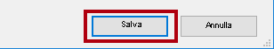

### <a name="task-2-create-the-salesperson-table"></a>**Attività 2: Creare la tabella Salesperson**

In questa attività verrà creata la tabella **Salesperson** (relazione diretta con **Sales**).

1. In Power BI Desktop nella vista Report nella barra multifunzione **Modellazione** all'interno del gruppo **Calcoli** fare clic su **Nuova tabella**.

    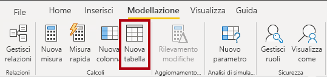

2. Nella barra della formula, che si apre direttamente sotto la barra multifunzione durante la creazione o la modifica dei calcoli, digitare **Salesperson =**, premere **MAIUSC+INVIO**, digitare **'Salesperson (Performance)'** e quindi premere **INVIO**.

    

    *Per praticità, tutte le definizioni DAX in questo lab possono essere copiate dal file di frammenti disponibile in **D:\PL300\Labs\05-create-dax-calculations-in-power-bi-desktop\Assets\Snippets.txt**.*

    *Una tabella calcolata viene creata immettendo prima il nome della tabella, seguito dal simbolo di uguale (=), seguito da una formula DAX che restituisce una tabella. Si noti che il nome della tabella non può essere già presente nel modello di dati.*

    *La barra della formula supporta l'immissione di una formula DAX valida. Include funzionalità quali il completamento automatico, IntelliSense e la codifica a colori, che consentono di immettere la formula in modo veloce e accurato.*

    *Questa definizione di tabella crea una copia della tabella **Salesperson (Performance)**. Vengono copiati solo i dati, ma non vengono copiate proprietà del modello come visibilità, formattazione e così via.*

    *Suggerimento: si consiglia di immettere "spazi", ovvero ritorni a capo e tabulazioni, per specificare le formule in un formato intuitivo e di facile lettura, soprattutto quando le formule sono lunghe e complesse. Per immettere un ritorno a capo, premere **MAIUSC+INVIO**. Lo spazio è facoltativo.*

3. Nel riquadro **Campi** si noti che l'icona della tabella ha una sfumatura blu che indica una tabella calcolata.

    

    *Le tabelle calcolate vengono definite usando una formula DAX che restituisce una tabella. È importante comprendere che le tabelle calcolate aumentano le dimensioni del modello di dati poiché vengono materializzate e archiviano i valori. Vengono ricalcolate ogni volta che vengono aggiornate le dipendenze delle formule, come avviene in questo modello di dati quando i valori delle nuove date (future) vengono caricati nelle tabelle.*

    *A differenza delle tabelle con origine Power Query, le tabelle calcolate non possono essere usate per caricare dati da origini dati esterne. Possono solo trasformare i dati in base ai dati già caricati nel modello di dati.*

4. Passare alla vista Modello.

5. Si noti che la tabella **Salesperson** è disponibile (la tabella potrebbe essere nascosta e in questo caso scorrere orizzontalmente per individuarla).

6. Creare una relazione dalla colonna **Salesperson \| EmployeeKey** alla colonna **Sales \| EmployeeKey**.

7. Fare clic con il pulsante destro del mouse sulla relazione inattiva tra le tabelle **Salesperson (Performance)** e **Sales**, quindi selezionare **Elimina**.

    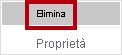

8. Quando viene richiesto di confermare l'eliminazione, fare clic su **Elimina**.

    

9. Nella tabella **Salesperson** selezionare più colonne e quindi nasconderle (impostare la proprietà **È nascosta** su **Sì**):

    - EmployeeID

    - EmployeeKey

    - UPN

10. Nel diagramma del modello selezionare la tabella **Salesperson**.

11. Nel riquadro **Proprietà** nella casella **Descrizione** immettere: **Salesperson related to Sales**.

    *Ricordare che le descrizioni vengono visualizzate come descrizioni comandi nel riquadro **Campi** al passaggio del mouse su una tabella o un campo.*

12. Per la tabella **Salesperson (Performance)** impostare la descrizione su: **Salesperson related to region(s)**.

    *Il modello di dati offre ora due alternative durante l'analisi dei venditori. La tabella **Salesperson** consente di analizzare le vendite effettuate da un venditore, mentre la tabella **Salesperson (Performance)** consente di analizzare le vendite effettuate nelle aree di vendita assegnate al venditore.*

### <a name="task-3-create-the-date-table"></a>**Attività 3: Creare la tabella Data**

In questa attività verrà creata la tabella **Date**.

1. Passa alla vista Dati.

    

2. Nella scheda **Home** della barra multifunzione nel gruppo **Calcoli** fare clic su **Nuova tabella**.

    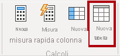

3. Nella barra della formula immettere quanto segue:


    **DAX**


    ```
    Date =  
    CALENDARAUTO(6)
    ```


    

    
    *La funzione CALENDARAUTO() restituisce una tabella a colonna singola costituita da valori di data. Il comportamento "automatico" analizza tutte le colonne data del modello di dati per determinare il valore della data più recente e il valore della data meno recente archiviati nel modello di dati. Viene quindi creata una riga per ogni data all'interno di questo intervallo, estendendo l'intervallo in entrambe direzioni per garantire che vengano archiviati anni di dati completi.*

    *Questa funzione può accettare un singolo argomento facoltativo che corrisponde al numero dell'ultimo mese di un anno. Quando viene omesso, il valore è 12, indicando dicembre come ultimo mese dell'anno. In questo caso viene immesso 6, indicando giugno come ultimo mese dell'anno.*

4. Si noti la colonna di valori data.

    

    *Le date visualizzate sono formattate usando le impostazioni internazionali degli Stati Uniti, ovvero mm/gg/aaaa.*

5. Nell'angolo inferiore sinistro nella barra di stato osservare le statistiche della tabella: sono state generate 1826 righe di dati che rappresentano i dati di cinque anni completi.

    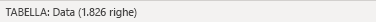

### <a name="task-4-create-calculated-columns"></a>**Attività 4:** **Creare colonne calcolate**

In this task you will add additional columns to enable filtering and grouping by different time periods. You will also create a calculated column to control the sort order of other columns.

*Per praticità, tutte le definizioni DAX in questo lab possono essere copiate dal file di frammenti disponibile in **D:\PL300\Labs\05-create-dax-calculations-in-power-bi-desktop\Assets\Snippets.txt**.*

1. Nella barra multifunzione contestuale **Strumenti tabella** nel gruppo **Calcoli** fare clic su **Nuova colonna**.

    

2. Nella barra della formula digitare il comando seguente (o copiarlo dal file dei frammenti) e quindi premere **INVIO**:


    **DAX**


    ```
    Year =
    "FY" & YEAR('Date'[Date]) + IF(MONTH('Date'[Date]) > 6, 1)
    ```


    *Viene creata una colonna calcolata immettendo prima il nome della colonna, seguito dal simbolo di uguale (=), seguito da una formula DAX che restituisce un risultato a valore singolo. Il nome della colonna non può essere già presente nella tabella.*

    *La formula usa il valore dell'anno della data ma aggiunge un'unità al valore dell'anno quando il mese è successivo a giugno. Questo è il modo in cui vengono calcolati gli anni fiscali in Adventure Works.*

3. Verificare che la nuova colonna sia stata aggiunta.

    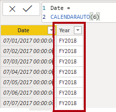

4. Usare le definizioni di file dei frammenti di codice per creare le due colonne calcolate seguenti per la tabella **Date**:

    - Quarter

    - Month

    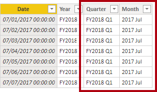

5. Per convalidare i calcoli, passare alla vista Report.

6. Per creare una nuova pagina del report, fare clic sull'icona del segno più in basso a sinistra.

    

7. Per aggiungere un oggetto visivo matrice alla nuova pagina del report, nel riquadro **Visualizzazioni** selezionare il tipo di oggetto visivo matrice.

    *Suggerimento: è possibile posizionare il puntatore su ogni icona per visualizzare una descrizione comando che specifica il tipo di oggetto visivo.*

    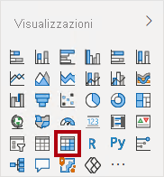

8. Nel riquadro **Campi** nella tabella **Date** trascinare il campo **Year** nell'area **Rows**.

    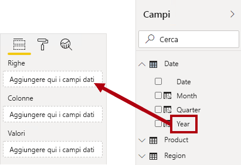

9. Trascinare il campo **Month** nell'area **Rows** direttamente sotto il campo **Year**.

    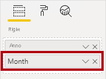

10. In alto a destra nell'oggetto visivo matrice (o in basso, a seconda della posizione dell'oggetto visivo), fare clic sull'icona a forma di freccia doppia con biforcazione (che espanderà tutti gli anni verso il basso di un livello).

    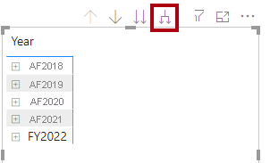

11. Si noti che gli anni si espandono di mesi e che i mesi sono ordinati alfabeticamente anziché in ordine cronologico.

    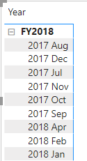

    *Per impostazione predefinita, i valori di testo sono ordinati alfabeticamente, i numeri sono ordinati dal più piccolo al più grande e le date sono ordinate dalla meno recente alla più recente.*

12. Per personalizzare il tipo di ordinamento del campo **Month**, passare alla vista Dati.

13. Aggiungere la colonna **MonthKey** alla tabella **Date**.


    **DAX**


    ```
    MonthKey =
    (YEAR('Date'[Date]) * 100) + MONTH('Date'[Date])
    ```


    *Questa formula calcola un valore numerico per ogni combinazione di anno/mese.*

14. Nella vista Dati verificare che la nuova colonna contenga valori numerici, ad esempio 201707 per luglio 2017 e così via.

    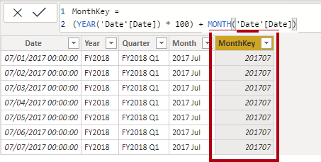

15. Tornare alla visualizzazione Report.

16. Nel riquadro **Campi** verificare che il campo **Month** sia selezionato (se selezionato, avrà uno sfondo grigio scuro).

17. Nella barra multifunzione contestuale **Strumenti colonna** nel gruppo **Ordina** fare clic su **Ordina per colonna** e quindi selezionare **MonthKey**.

    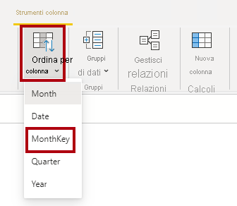

18. Nell'oggetto visivo matrice si noti che i mesi sono ora in ordine cronologico.

    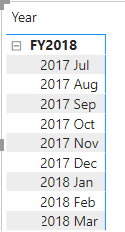

### <a name="task-5-complete-the-date-table"></a>**Attività 5:** **Completare la tabella Date**

In this task you will complete the design of the <bpt id="p1">**</bpt>Date<ept id="p1">**</ept> table by hiding a column and creating a hierarchy. You will then create relationships to the <bpt id="p1">**</bpt>Sales<ept id="p1">**</ept> and <bpt id="p2">**</bpt>Targets<ept id="p2">**</ept> tables.

1. Passare alla vista Modello.

2. Nella tabella **Date** nascondere la colonna **MonthKey** (impostare **È nascosta** su **Sì**).

3. Nel riquadro laterale a destra **Campi** selezionare la tabella **Date**, fare clic con il pulsante destro del mouse sulla colonna **Year** e quindi scegliere **Crea gerarchia**. 

4. Rinominare la gerarchia appena creata in **Fiscal** facendo clic con il pulsante destro del mouse su **Rinomina**. 
5. Aggiungere i due campi rimanenti seguenti alla gerarchia Fiscal. A tale scopo, selezionarli nel riquadro dei campi, fare clic con il pulsante destro del mouse e quindi scegliere **Aggiungi a gerarchia** -> **Fiscal**.
    
    - Quarter

    - Month

    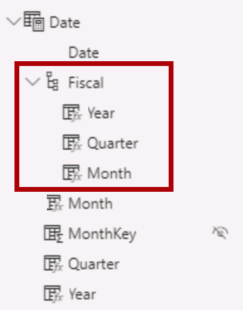

6. Creare le due relazioni del modello seguenti:

    - **Date \| Date** con **Sales \| OrderDate**

    - **Date \| Date** con **Targets \| TargetMonth**

7. Nascondere le due colonne seguenti:

    - Sales \| OrderDate

    - Targets \| TargetMonth

### <a name="task-6-mark-the-date-table"></a>**Attività 6: Contrassegnare la tabella Date**

In questa attività si contrassegnerà la tabella **Date** come tabella data.

1. Passare alla vista Report.

2. Nel riquadro **Campi** selezionare la tabella **Date** (non il campo **Date**).

3. Nella barra multifunzione contestuale **Strumenti tabella** nel gruppo **Calendari** fare clic su **Contrassegna come tabella data** e quindi selezionare **Contrassegna come tabella data**.

    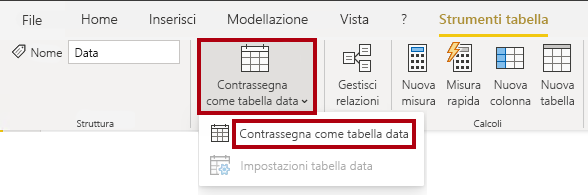

4. Nella finestra **Contrassegna come tabella data** nell'elenco a discesa **Colonna data** selezionare **Data**.

    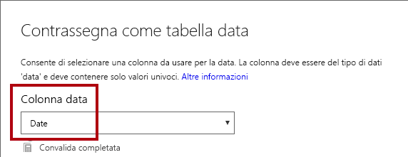

5. Fare clic su **OK**.

    

6. Salvare il file di Power BI Desktop.

    *Power BI Desktop è ora in grado di determinare che la tabella definisce una data (ora). Questo aspetto è importante quando si usano calcoli delle funzionalità di Business Intelligence per le gerarchie temporali. I calcoli delle funzionalità di Business Intelligence per le gerarchie temporali verranno usati nel lab **Creare calcoli DAX in Power BI Desktop - Parte 2**.*

    *Si noti che questo approccio di progettazione per una tabella data è adatto quando non è disponibile una tabella data nell'origine dati. Se è disponibile un data warehouse, è opportuno caricare i dati di data dalla tabella delle dimensioni data anziché "ridefinire" la logica di data nel modello di dati.*

## <a name="exercise-2-create-measures"></a>**Esercizio 2: Creare misure**

In questo esercizio si creeranno e si formatteranno diverse misure.

### <a name="task-1-create-simple-measures"></a>**Attività 1: Creare misure semplici**

In this task you will create simple measures. Simple measures aggregate values in a single column or count rows of a table.

1. Nella vista Report nella **Pagina 2** nel riquadro **Campi** trascinare il campo **Sales \| Unit Price** nell'oggetto visivo matrice.

    *Nei lab viene usata una notazione abbreviata per fare riferimento a un campo, simile al seguente: **Sales \| Unit Price**. In questo esempio, **Sales** è il nome della tabella e **Unit Price** è il nome del campo.*

    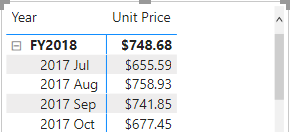

    *Probabilmente di ricorda che nel lab **Modellare i dati in Power BI Desktop - Parte 2** è stata impostata la colonna **Unit Price** per il riepilogo in base al **Media**. Il risultato visualizzato nell'oggetto visivo matrice è il prezzo unitario medio mensile (somma dei valori del prezzo unitario divisa per il numero di prezzi unitari).*

2. Nel riquadro Campi dell'oggetto visivo sotto il riquadro **Visualizzazioni** nell'area **Valori** è possibile osservare che è presente **Unit Price**.

    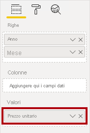

3. Fare clic sulla freccia rivolta verso il basso per **Unit Price** e osservare le opzioni di menu disponibili.

    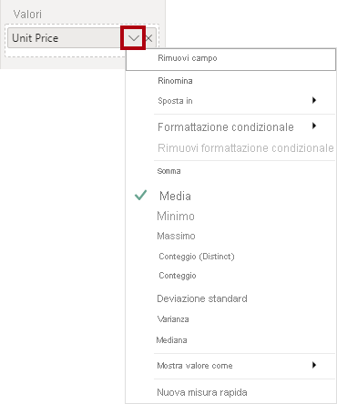

    *Le colonne numeriche visibili consentono agli autori di report di definire in fase di progettazione del report come verranno riepilogati i valori di colonna. Ciò può causare la creazione di report non appropriati. Alcuni autori di modelli di dati, tuttavia, non lasciano nulla al caso e scelgono di nascondere queste colonne e di esporre invece la logica di aggregazione definita nelle misure. Questo è l'approccio che verrà applicato in questo lab.*

4. Per creare una misura, nel riquadro **Campi** fare clic con il pulsante destro del mouse sulla tabella **Sales** e quindi selezionare **Nuova misura**.

    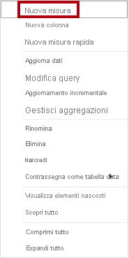

5. Nella barra della formula aggiungere la definizione di misura seguente:


    **DAX**


    ```
    Avg Price =  
    ‎AVERAGE(Sales[Unit Price])
    ```


6. Aggiungere la misura **Avg Price** all'oggetto visivo matrice.

7. Si noti che viene prodotto lo stesso risultato della colonna **Prezzo unitario** (ma con formattazione diversa).

8. Nella finestra **Valori** aprire il menu di scelta rapida del campo **AVG Price** e osservare che non è possibile modificare la tecnica di aggregazione.

    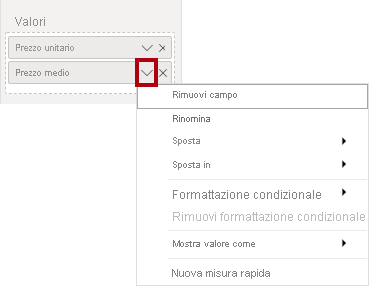

    *Non è possibile modificare il comportamento di aggregazione di una misura.*

9. Usare le definizioni di file dei frammenti di codice per creare le cinque misure seguenti per la tabella **Sales**:

    - Median Price

    - Min Price

    - Max Price

    - Orders

    - Order Lines

    *La funzione DISTINCTCOUNT() usata nella misura **Orders** conteggerà gli ordini una sola volta (ignorando i duplicati). La funzione COUNTROWS() usata nella misura **Order Lines** opera su una tabella.*

    *In questo caso il numero di ordini viene calcolato contando i singoli valori della colonna **SalesOrderNumber**, mentre il numero di righe di ordine è semplicemente il numero di righe della tabella (ogni riga è una riga di un ordine).*

10. Passare alla vista Modello e quindi selezionare le quattro misure di prezzo: **Avg Price**, **Max Price**, **Median Price** e **Min Price**.

11. Per la selezione di più misure, configurare i requisiti seguenti:

    - Impostare il formato su due cifre decimali

    - Assegnare a una cartella di visualizzazione denominata **Pricing**

    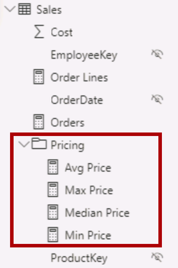

12. Nascondere la colonna **Unit Price**.

    *La colonna **Unit Price** non è ora disponibile per gli autori di report. È necessario che gli autori usino la misura dei prezzi aggiunta al modello. Questo approccio di progettazione garantisce che gli autori del report non aggreghino in modo inappropriato i prezzi, ad esempio sommandoli.*

13. Selezionare le misure **Order Lines** e **Orders** e quindi configurare i requisiti seguenti:

    - Impostare il formato per il separatore delle migliaia

    - Assegnare a una cartella di visualizzazione denominata **Counts**

    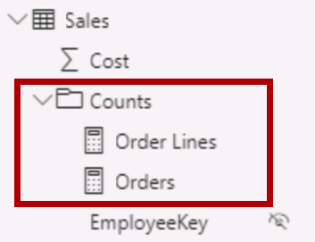

14. Nella vista Report nell'area **Valori** dell'oggetto visivo matrice fare clic su **X** per il campo **Unit Price** per rimuoverlo.

    

15. Aumentare le dimensioni dell'oggetto visivo matrice per riempire la larghezza e l'altezza della pagina.

16. Aggiungere le cinque misure seguenti all'oggetto visivo matrice:

    - Median Price

    - Min Price

    - Max Price

    - Orders

    - Order Lines

17. Verificare che i risultati appaiano sensati e siano formattati correttamente.

    


### <a name="task-2-finish-up"></a>**Attività 2: Completare il lab**

In questa attività si completerà il lab.

1. Salvare il file di Power BI Desktop.

2. Se si intende iniziare il lab successivo, lasciare aperto Power BI Desktop.

    *Il modello di dati verrà migliorato con calcoli più avanzati basati su DAX nel lab **Creare calcoli DAX in Power BI Desktop - Parte 2**.*
