---
lab:
  title: Creare calcoli DAX in Power BI Desktop - Parte 2
  module: Module 5 - Create Model Calculations using DAX in Power BI
ms.openlocfilehash: 064f5bb2c313448f7d15b01bd0e69a84aa85811f
ms.sourcegitcommit: 9ea1e7e21b9b3c718030c94b1693d153a2010ec7
ms.translationtype: HT
ms.contentlocale: it-IT
ms.lasthandoff: 06/29/2022
ms.locfileid: "146650199"
---
# <a name="create-dax-calculations-in-power-bi-desktop-part-2"></a>**Creare calcoli DAX in Power BI Desktop - Parte 2**

**Il tempo stimato per il completamento del lab è di 45 minuti**

In questo lab si creeranno misure con espressioni DAX che implicano la modifica del contesto di filtro.

Contenuto del lab:

- Usare la funzione CALCULATE() per modificare il contesto di filtro

- Usare le funzionalità di Business Intelligence per le gerarchie temporali

### <a name="lab-story"></a>**Presentazione del lab**

Questo lab fa parte di una serie che comprende molti lab progettati come attività completa, dalla preparazione dei dati alla pubblicazione come report e dashboard. È possibile completare i lab nell'ordine desiderato. Se tuttavia si intende seguire più lab, è consigliabile procedere in questo ordine:

1. Preparare i dati in Power BI Desktop

2. Caricare i dati in Power BI Desktop

3. Modellare i dati in Power BI Desktop

5. Creare calcoli DAX in Power BI Desktop - Parte 1

6. **Creare calcoli DAX in Power BI Desktop - Parte 2**

7. Progettare un report in Power BI Desktop - Parte 1

8. Progettare un report in Power BI Desktop - Parte 2

9. Creare un dashboard di Power BI

10. Eseguire l'analisi dei dati in Power BI Desktop

11. Applicare la sicurezza a livello di riga

## <a name="exercise-1-work-with-filter-context"></a>**Esercizio 1: Usare il contesto di filtro**

In questo esercizio si creeranno misure con espressioni DAX che implicano la modifica del contesto di filtro.

### <a name="task-1-get-started"></a>**Attività 1: Operazioni preliminari**

In questa attività si configurerà l'ambiente per il lab.

*Importante: se si sta continuando dal lab precedente (e il lab è stato completato correttamente), non completare questa attività, ma passare a quella successiva.*

1. Per aprire Power BI Desktop, sulla barra delle applicazioni fare clic sul collegamento Microsoft Power BI Desktop.

    

1. Per chiudere la finestra introduttiva, fare clic su **X** nella parte superiore sinistra della finestra.

    

1. Per aprire il file di avvio di Power BI Desktop, selezionare la scheda della barra multifunzione **File** per aprire la visualizzazione Backstage.

1. Selezionare **Apri report**.

    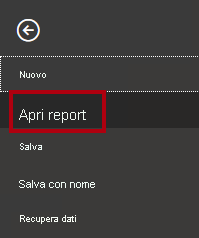

1. Fare clic su **Sfoglia report**.

    

1. Nella finestra **Apri** passare alla cartella **D:\PL300\Labs\05-create-dax-calculations-in-power-bi-desktop-advanced\Starter**.

1. Selezionare il file **Sales Analysis**.

1. Fare clic su **Apri**.

    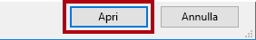

1. Chiudere eventuali finestre aperte di carattere informativo.

1. Per creare una copia del file, fare clic sulla scheda della barra multifunzione **File** per aprire la visualizzazione Backstage.

1. Selezionare **Salva con nome**.

    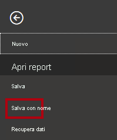

1. Se viene richiesto di applicare le modifiche, fare clic su **Applica**.

    

1. Nella finestra **Salva con nome** passare alla cartella **D:\PL300\MySolution**.

1. Fare clic su **Salva**.

    

### <a name="task-2-create-a-matrix-visual"></a>**Attività 2: Creare un oggetto visivo matrice**

In questa attività verrà creato un oggetto visivo matrice per supportare il test delle nuove misure.

1. In Power BI Desktop nella vista Report creare una nuova pagina del report.

    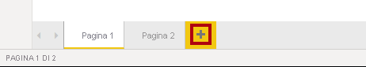

2. In **Pagina 3** aggiungere un oggetto visivo matrice.

    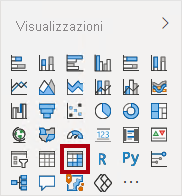

3. Ridimensionare l'oggetto visivo matrice in modo da riempire l'intera pagina.

4. Per configurare i campi dell'oggetto visivo matrice, dal riquadro **Campi** trascinare la gerarchia **Region \| Regions** e rilasciarla all'interno dell'oggetto visivo.

    *Nei lab viene usata una notazione abbreviata per fare riferimento a un campo o a una gerarchia, simile al seguente: **Region \| Regions**. In questo esempio, **Region** è il nome della tabella e **Regions** è il nome della gerarchia.*

5. Aggiungere anche il campo **Sales \| Sales**.

6. Per espandere l'intera gerarchia, nell'angolo superiore destro dell'oggetto visivo matrice fare clic sull'icona della freccia con biforcazione.

    

    *Si ricorderà che la gerarchia **Regions** include i livelli **Group**, **Country** e **Region**.*

7. Per formattare l'oggetto visivo, nel riquadro **Visualizzazioni** selezionare il riquadro **Formato**.

    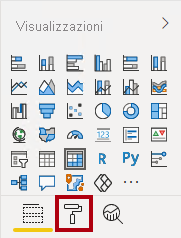

8. Nella casella **Cerca** immettere **Con rientri**.

9. Impostare la proprietà **Layout con rientri** su **Disattivato**.

    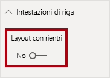

10. Verificare che l'oggetto visivo matrice ora includa quattro intestazioni di colonna.

    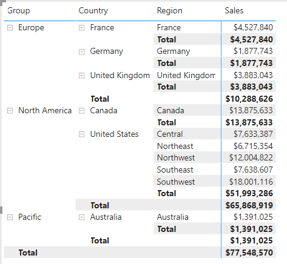

    *In Adventure Works le aree di vendita sono organizzate in gruppi, paesi e aree geografiche. Tutti i paesi, ad eccezione degli Stati Uniti, hanno una sola area il cui nome corrisponde al nome del paese. Poiché gli Stati Uniti sono un territorio di vendita di grandi dimensioni, sono suddivisi in cinque aree di vendita.*

    *In questo esercizio verranno create diverse misure che vengono quindi testate aggiungendole all'oggetto visivo matrice.*

### <a name="task-3-manipulate-filter-context"></a>**Attività 3: Modificare il contesto di filtro**

In questa attività verranno create diverse misure con espressioni DAX che usano la funzione CALCULATE() per modificare il contesto di filtro.

1. Aggiungere una misura alla tabella **Sales** basata sull'espressione seguente:

    *Per praticità, tutte le definizioni DAX in questo lab possono essere copiate dal file **D:\PL300\Labs\05-create-dax-calculations-in-power-bi-desktop-advanced\Assets\Snippets.txt**.*


    **DAX**


    ```
    Sales All Region =

    CALCULATE(SUM(Sales[Sales]), REMOVEFILTERS(Region))
    ```


    *La funzione CALCULATE() è una funzione avanzata usata per modificare il contesto di filtro. Il primo argomento accetta un'espressione o una misura (una misura è semplicemente un'espressione con nome). Gli argomenti successivi consentono di modificare il contesto di filtro.*

    *La funzione REMOVEFILTERS() rimuove i filtri attivi. Può essere senza argomenti o accettare una tabella, una colonna o più colonne come argomento.*

    *In questa formula la misura calcola la somma della colonna **Sales** in un contesto di filtro modificato che rimuove tutti i filtri applicati alle colonne della tabella **Region**.*

2. Aggiungere la misura **Sales All Region** all'oggetto visivo matrice.

    

3. Si noti che la misura **Sales All Region** calcola il totale di tutte le vendite dell'area per ogni area, paese (subtotale) e gruppo (subtotale).

    *La nuova misura restituisce ancora un risultato utile. Quando le vendite di un gruppo, di un paese o di un'area sono divise in base a questo valore, verrà prodotta una percentuale utile chiamata "percentuale del totale complessivo".*

4. Nel riquadro **Campi** verificare che sia selezionata la misura **Sales All Region** (quando è selezionata, lo sfondo sarà grigio scuro), quindi nella barra della formula sostituire il nome della misura e la formula con la formula seguente:

    *Suggerimento: per sostituire la formula esistente, copiare prima il frammento di codice. Quindi fare clic all'interno della barra della formula e premere **CTRL+A** per selezionare tutto il testo. Quindi premere **CTRL+V** per incollare il frammento di codice per sovrascrivere il testo selezionato. Quindi premere **INVIO**.*


    **DAX**


    ```
    Sales % All Region =  
    ‎DIVIDE(  
    ‎ SUM(Sales[Sales]),  
    ‎ CALCULATE(  
    ‎ SUM(Sales[Sales]),  
    ‎ REMOVEFILTERS(Region)  
    ‎ )  
    ‎)
    ```


    *La misura è stata rinominata per riflettere accuratamente la formula aggiornata. La funzione DIVIDE() divide la misura **Sales** (non modificata dal contesto di filtro) per la misura **Sales** di un contesto modificato che rimuove tutti i filtri applicati alla tabella **Region**.*

5. Nell'oggetto visivo matrice si noti che la misura è stata rinominata e che ora vengono visualizzati valori diversi per ogni gruppo, paese e area geografica.

6. Formattare la misura **Sales % All Region** come percentuale con due cifre decimali.

7. Nell'oggetto visivo matrice esaminare i valori della misura **Sales% All Region**.

    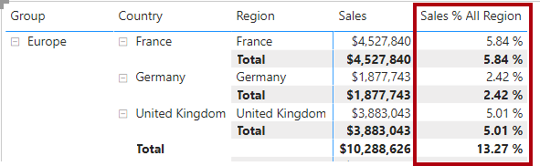

8. Aggiungere un'altra misura alla tabella **Sales** basata sull'espressione seguente e formattata come percentuale:


    **DAX**

    ```
    Sales % Country =  
    ‎DIVIDE(  
    ‎ SUM(Sales[Sales]),  
    ‎ CALCULATE(  
    ‎ SUM(Sales[Sales]),  
    ‎ REMOVEFILTERS(Region[Region])  
    ‎ )  
    ‎)
    ```


9. Si noti che la formula della misura **Sales % Country** differisce leggermente dalla formula della misura **Sales % All Region**.

    *La differenza è rappresentata dal fatto che il denominatore modifica il contesto di filtro rimuovendo i filtri nella colonna **Region** della tabella **Region**, non tutte le colonne della tabella **Region**. Significa che vengono conservati tutti i filtri applicati alle colonne di gruppo o paese. Otterrà un risultato che rappresenta le vendite come percentuale del paese.*

10. Aggiungere la misura **Sales % Country** all'oggetto visivo matrice.

11. Si noti che solo le aree degli Stati Uniti producono un valore che non corrisponde al 100%.

    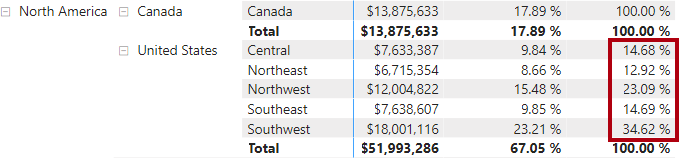

    *Si ricorderà che solo gli Stati Uniti hanno più aree. Tutti gli altri paesi comprendono una singola area e per questa ragione hanno tutti un valore corrispondente al 100%.*

12. Per migliorare la leggibilità di questa misura nell'oggetto visivo, sovrascrivere la misura **Sales % Country** con questa formula migliorata.


    **DAX**


    ```
    Sales % Country =  
    ‎IF(  
    ‎ ISINSCOPE(Region[Region]),  
    ‎ DIVIDE(  
    ‎ SUM(Sales[Sales]),  
    ‎ CALCULATE(  
    ‎ SUM(Sales[Sales]),  
    ‎ REMOVEFILTERS(Region[Region])  
    ‎ )  
    ‎ )  
    ‎)
    ```


    *Incorporata all'interno della funzione IF(), la funzione ISINSCOPE() viene usata per verificare se la colonna Region è il livello in una gerarchia di livelli. Se ha valore true, la funzione DIVIDE() viene valutata. L'assenza di una parte false indica che viene restituito un valore vuoto quando la colonna Region non è inclusa nell'ambito.*

13. Si noti che la misura **Sales % Country** ora restituisce un valore solo quando un'area è nell'ambito.

    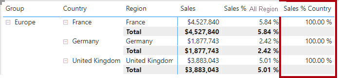

14. Aggiungere un'altra misura alla tabella **Sales** basata sull'espressione seguente e formattata come percentuale:


    **DAX**


    ```
    Sales % Group =  
    ‎DIVIDE(  
    ‎ SUM(Sales[Sales]),  
    ‎ CALCULATE(  
    ‎ SUM(Sales[Sales]),  
    ‎ REMOVEFILTERS(  
    ‎ Region[Region],  
    ‎ Region[Country]  
    ‎ )  
    ‎ )  
    ‎)
    ```


    *Per visualizzare le vendite come percentuale del gruppo, è possibile applicare due filtri per rimuovere efficacemente i filtri in due colonne.*

15. Aggiungere la misura **Sales % Group** all'oggetto visivo matrice.

16. Per migliorare la leggibilità di questa misura nell'oggetto visivo, sovrascrivere la misura **Sales % Group** con questa formula migliorata.


    **DAX**


    ```
    Sales % Group =  
    ‎IF(  
    ‎ ISINSCOPE(Region[Region])  
    ‎ || ISINSCOPE(Region[Country]),  
    ‎ DIVIDE(  
    ‎ SUM(Sales[Sales]),  
    ‎ CALCULATE(  
    ‎ SUM(Sales[Sales]),  
    ‎ REMOVEFILTERS(  
    ‎ Region[Region],  
    ‎ Region[Country]  
    ‎ )  
    ‎ )  
    ‎ )  
    ‎)
    ```


17. Si noti che la misura **Sales % Group** ora restituisce un valore solo quando un'area o un paese è nell'ambito.

18. Nella vista Modello inserire le tre nuove misure in una cartella di visualizzazione denominata **Ratios**.

    

19. Salvare il file di Power BI Desktop.

    *Le misure aggiunte alla tabella **Sales** hanno modificato il contesto di filtro per ottenere la navigazione gerarchica. Si noti che il criterio per ottenere il calcolo di un subtotale richiede la rimozione di alcune colonne dal contesto di filtro. Inoltre, per visualizzare un totale complessivo, tutte le colonne devono essere rimosse.*

## <a name="exercise-2-work-with-time-intelligence"></a>**Esercizio 2: Uso della funzionalità di Business Intelligence per le gerarchie temporali**

In questo esercizio verranno create una misura Sales Year-To-Date (YTD) e una misura Sales Year-over-Year (YoY) Growth.

### <a name="task-1-create-a-ytd-measure"></a>**Attività 1: Creare una misura YTD**

In questa attività verrà creata una misura YTD.

1. Nella vista Report in **Pagina 2** osservare l'oggetto visivo matrice che visualizza varie misure con anni e mesi raggruppati nelle righe.

2. Aggiungere una misura alla tabella **Sales** basata sull'espressione seguente e formattata con zero cifre decimali:


    **DAX**


    ```
    Sales YTD =  
    ‎TOTALYTD(SUM(Sales[Sales]), 'Date'[Date], "6-30")
    ```


    *La funzione TOTALYTD() valuta un'espressione, in questo caso la somma della colonna **Sales**, nella colonna di una determinata data. La colonna della data deve appartenere a una tabella data contrassegnata come tabella data, come è stato fatto nel lab **Creare calcoli DAX in Power BI Desktop - Parte 1**.*

    *La funzione può anche accettare un terzo argomento facoltativo che rappresenta l'ultima data di un anno. L'assenza di questa data significa che il 31 dicembre è l'ultima data dell'anno. Per Adventure Works, poiché giugno è l'ultimo mese dell'anno, viene usato "6-30".*

3. Aggiungere il campo **Sales** e la misura **Sales YTD** all'oggetto visivo matrice.

4. Si noti l'accumulo dei valori delle vendite nell'anno.

    

    *La funzione TOTALYTD() esegue la modifica del filtro, in particolare la modifica dei filtri temporali. Ad esempio, per calcolare le vendite YTD per settembre 2017 (il terzo mese dell'anno fiscale), tutti i filtri nella tabella **Date** vengono rimossi e sostituiti con un nuovo filtro di date che inizia all'inizio dell'anno (1 luglio 2017) e si estende fino all'ultima data del periodo di date nel contesto (30 settembre 2017).*

    *Si noti che in DAX sono disponibili numerose funzionalità di Business Intelligence per le gerarchie temporali per supportare le modifiche di filtri temporali comuni.*

### <a name="task-2-create-a-yoy-growth-measure"></a>**Attività 2: Creare una misura di crescita YoY**

In questa attività verrà creata una misura di crescita YoY.

1. Aggiungere un'altra misura alla tabella **Sales** basata sull'espressione seguente:


    **DAX**


    ```
    Sales YoY Growth =  
    ‎VAR SalesPriorYear =  
    ‎ CALCULATE(  
    ‎ SUM(Sales[Sales]),  
    ‎ PARALLELPERIOD(  
    ‎ 'Date'[Date],  
    ‎ -12,  
    ‎ MONTH  
    ‎ )  
    ‎ )  
    ‎RETURN  
    ‎ SalesPriorYear
    ```


    *La formula della misura **Sales YoY Growth** dichiara una variabile. Le variabili possono essere utili per semplificare la logica delle formule ed essere più efficienti quando un'espressione deve essere valutata più volte all'interno della formula (che sarà il caso per la logica di crescita YoY). Le variabili vengono dichiarate da un nome univoco e l'espressione di misura deve quindi essere restituita dopo la parola chiave **RETURN**.*

    *Alla variabile **SalesPriorYear** viene assegnata un'espressione che calcola la somma della colonna **Sales** in un contesto modificato che usa la funzione PARALLELPERIOD() per tornare indietro di 12 mesi da ogni data nel contesto di filtro.*

2. Aggiungere la misura **Sales YoY Growth** all'oggetto visivo matrice.

3. Si noti che la nuova misura restituisce BLANK per i primi 12 mesi (perché nessuna vendita è stata registrata prima dell'anno fiscale 2017).

4. Si noti che il valore della misura **Sales YoY Growth** per **2018 Jul** è il valore **Sales** per **2017 Jul**.

    

    *Ora che la "parte più complessa" della formula è stata testata, è possibile sovrascrivere la misura con la formula finale che calcola il risultato della crescita.*

5. Per completare la misura, sovrascrivere la misura **Sales YoY Growth** con questa formula e formattarla come percentuale con due cifre decimali:


    **DAX**


    ```
    Sales YoY Growth =  
    ‎VAR SalesPriorYear =  
    ‎ CALCULATE(  
    ‎ SUM(Sales[Sales]),  
    ‎ PARALLELPERIOD(  
    ‎ 'Date'[Date],  
    ‎ -12,  
    ‎ MONTH  
    ‎ )  
    ‎ )  
    ‎RETURN  
    ‎ DIVIDE(  
    ‎ (SUM(Sales[Sales]) - SalesPriorYear),  
    ‎ SalesPriorYear  
    ‎ )
    ```


6. Nella formula nella clausola **RETURN** si noti che viene fatto riferimento due volte alla variabile.

7. Osservare che la crescita YoY per **2018 Jul** è **392.83%**.

    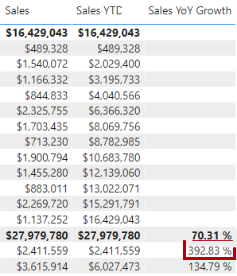

    *Ciò significa che le vendite di luglio 2018 ($ 2.411.559) rappresentano un miglioramento di circa il 400% (quasi il quadruplo) rispetto alle vendite realizzate nello stesso periodo dell'anno precedente ($ 489.328).*

8. Nella vista Modello inserire le due nuove misure in una cartella di visualizzazione denominata **Time Intelligence**.

    

### <a name="task-3-finish-up"></a>**Attività 3: Completare il lab**

In questa attività si completerà il lab.

1. Per eseguire la pulizia della soluzione pronta per lo sviluppo di report, fare clic con il pulsante destro del mouse sulla scheda **Pagina 2** in basso a sinistra e quindi scegliere **Elimina pagina**.

    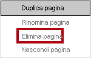

2. Quando viene richiesto di eliminare la pagina, fare clic su **Elimina**.

    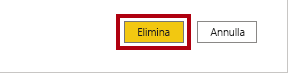

3. Eliminare anche la **pagina 3**.

4. Nella pagina rimanente, per cancellare la pagina, selezionare l'oggetto visivo tabella e premere il tasto **CANC**.

5. Salvare il file di Power BI Desktop.

6. Se si intende iniziare il lab successivo, lasciare aperto Power BI Desktop.

    *Nel lab **Progettare un report in Power BI Desktop - Parte 1** si creerà un report basato sul modello di dati.*
