---
lab:
  title: Progettare un report in Power BI Desktop - Parte 1
  module: Module 7 - Create Reports
ms.openlocfilehash: 426892501790aaecbe21ed2e7f9161c4490c9e3b
ms.sourcegitcommit: 9ea1e7e21b9b3c718030c94b1693d153a2010ec7
ms.translationtype: HT
ms.contentlocale: it-IT
ms.lasthandoff: 06/29/2022
ms.locfileid: "146650217"
---
# **Progettare un report in Power BI Desktop - Parte 1**

**Il tempo stimato per il completamento del lab è di 45 minuti**

In questo lab si creerà un report di tre pagine. Il report verrà quindi pubblicato in Power BI e qui sarà possibile aprirlo e interagire con esso.

Contenuto del lab:

- Progettare un report

- Configurare campi visivi e proprietà del formato

### **Presentazione del lab**

Questo lab fa parte di una serie che comprende molti lab progettati come attività completa, dalla preparazione dei dati alla pubblicazione come report e dashboard. È possibile completare i lab nell'ordine desiderato. Se tuttavia si intende seguire più lab, è consigliabile procedere in questo ordine:

1. Preparare i dati in Power BI Desktop

2. Caricare i dati in Power BI Desktop

3. Modellare i dati in Power BI Desktop

5. Creare calcoli DAX in Power BI Desktop - Parte 1

6. Creare calcoli DAX in Power BI Desktop - Parte 2

7. **Progettare un report in Power BI Desktop - Parte 1**

8. Progettare un report in Power BI Desktop - Parte 2

9. Creare un dashboard di Power BI

10. Eseguire l'analisi dei dati in Power BI Desktop

11. Applicare la sicurezza a livello di riga

## **Esercizio 1: Creare un report**

In questo esercizio si creerà un report di tre pagine denominato **Sales Report**.

### **Attività 1: Operazioni preliminari - Accesso**

In questa attività si accederà a Power BI per configurare l'ambiente per il lab.

*Importante: se l'accesso a Power BI è già stato effettuato, passare all'attività successiva.*

1. Per aprire Microsoft Edge, sulla barra delle applicazioni fare clic sul collegamento al programma Microsoft Edge.

    

1. Nella finestra del browser Microsoft Edge passare a **https://powerbi.microsoft.com**.

    *Suggerimento: è anche possibile usare l'elemento preferito Servizio Power BI sulla barra dei preferiti di Microsoft Edge.*

1. Fare clic su **Accedi** (nell'angolo in alto a destra).

    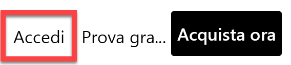

1. Immettere i dettagli dell'account ricevuti (controllare la cartella **Resources**).

1. Se viene chiesto di aggiornare la password, immettere di nuovo la password ricevuta e quindi immettere e confermare una nuova password.

    *Importante: assicurarsi di registrare la nuova password.*

1. Completare il processo di accesso.

1. Se in Microsoft Edge viene chiesto se restare connessi, fare clic su **Sì**.

1. Lasciare aperta la finestra del browser Microsoft Edge.

### **Attività 2: Operazioni preliminari - Abilitare gli oggetti visivi della mappa e della mappa colorata**

In questa attività si abiliteranno gli oggetti visivi della mappa e della mappa colorata nell'ambiente del lab aggiornando le impostazioni di integrazione nel portale di amministrazione di Power BI. 

1. Per aprire il portale di amministrazione di Power BI, fare clic sull'icona **Impostazioni** nell'angolo in alto a destra del browser.

    

1. Selezionare **Portale di amministrazione**.

    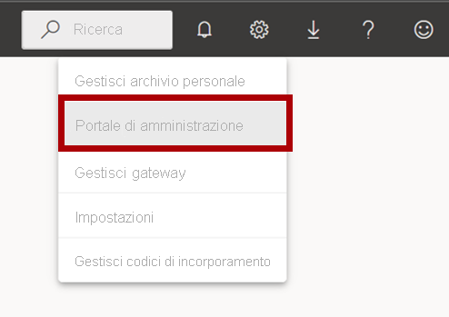

1. Scorrere la pagina verso il basso fino a Impostazioni di integrazione. Fare clic sulla freccia per espandere l'opzione Oggetti visivi della mappa e della mappa colorata.

    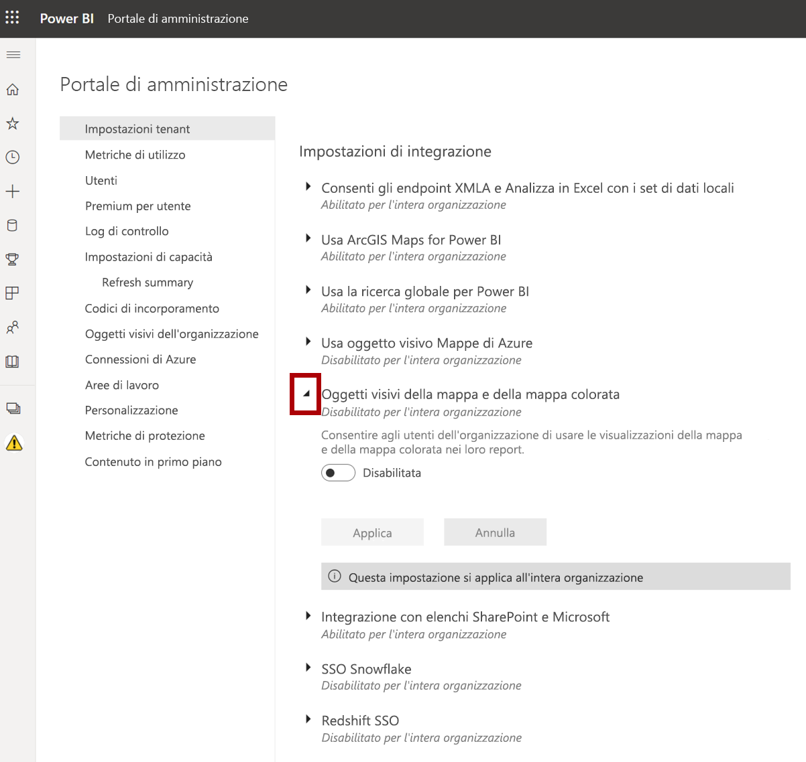

1. Impostare l'opzione Oggetti visivi della mappa e della mappa colorata su **Abilitato**.

1. Fare clic su **Applica** per applicare le modifiche. 

    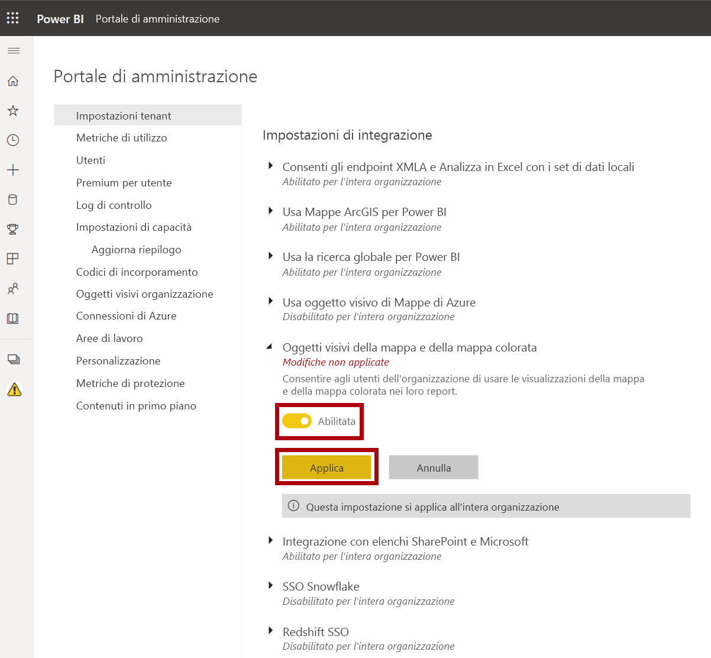

1. Nell'angolo in alto a destra nel browser verrà visualizzato il messaggio Le modifiche alle impostazioni del tenant verranno applicate entro i prossimi 15 minuti. 

    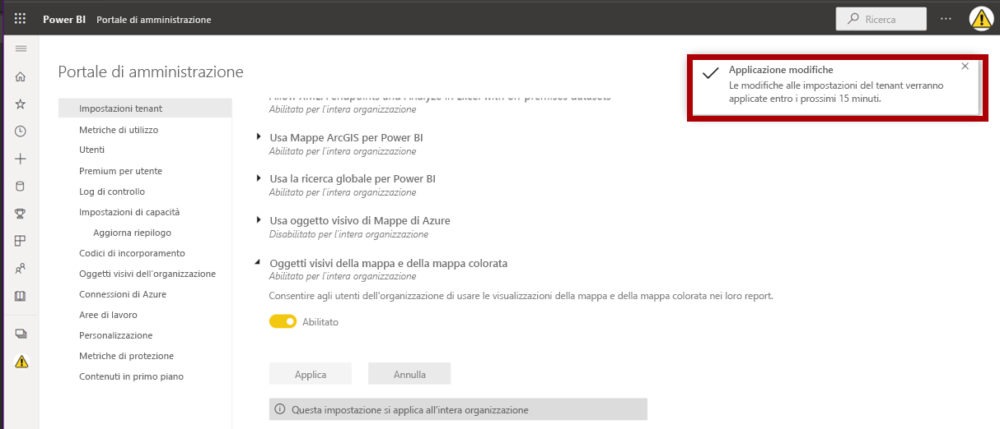

1. Lasciare aperta la finestra del browser Microsoft Edge.

### **Attività 3: Operazioni preliminari - Aprire il report**

In questa attività si aprirà il report iniziale per configurare l'ambiente per il lab.

*Importante: se si sta continuando dal lab precedente (e il lab è stato completato correttamente), non completare questa attività, ma passare a quella successiva.*

1. Per aprire Power BI Desktop, sulla barra delle applicazioni fare clic sul collegamento Microsoft Power BI Desktop.

    

2. Per chiudere la finestra introduttiva, fare clic su **X** nella parte superiore sinistra della finestra.

    

3. Per accedere al servizio Power BI, fare clic su **Accedi** in alto a destra.

    

4. Completare il processo di accesso con lo stesso account usato per accedere al servizio Power BI.

5. Per aprire il file di avvio di Power BI Desktop, selezionare la scheda della barra multifunzione **File** per aprire la visualizzazione Backstage.

6. Selezionare **Apri report**.

    

7. Fare clic su **Esplora report**.

    

8. Nella finestra **Apri** passare alla cartella **D:\PL300\Labs\06-design-report-in-power-bi-desktop\Starter**.

9. Selezionare il file **Sales Analysis**.

10. Fare clic su **Apri**.

    

11. Chiudere eventuali finestre aperte di carattere informativo.

12. Per creare una copia del file, fare clic sulla scheda della barra multifunzione **File** per aprire la visualizzazione Backstage.

13. Selezionare **Salva con nome**.

    

14. Se viene richiesto di applicare le modifiche, fare clic su **Applica**.

    

15. Nella finestra **Salva con nome** passare alla cartella **D:\PL300\MySolution**.

16. Fare clic su **Save** (Salva).

    

### **Attività 4: Progettare la pagina 1**

In questa attività si progetterà la prima pagina del report. Completata la progettazione, la pagina sarà simile alla seguente:

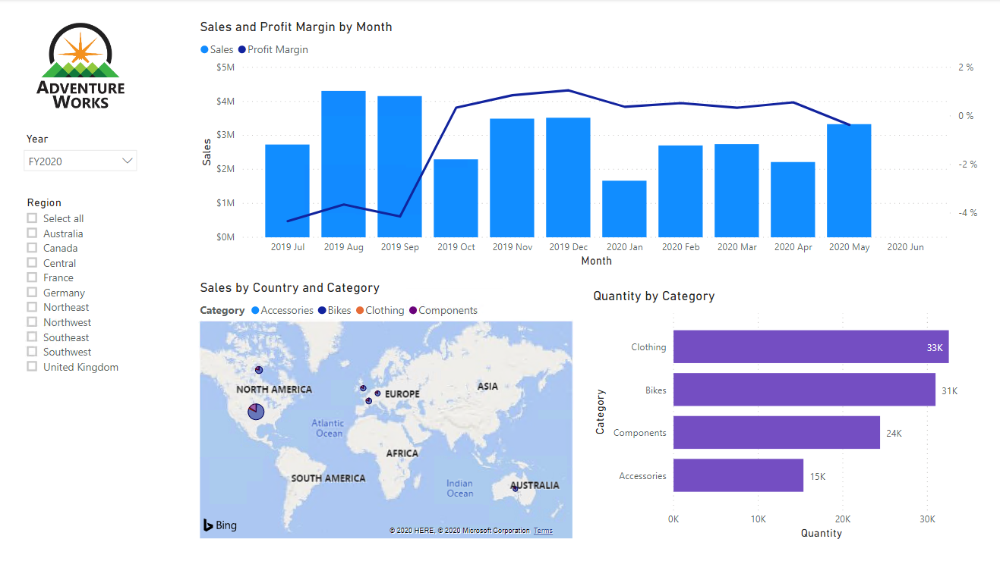

1. Per rinominare la pagina, in basso a sinistra in Power BI Desktop fare clic con il pulsante destro del mouse su **Pagina 1** e quindi scegliere **Rinomina**.

    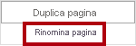

    *Suggerimento: e anche possibile fare doppio clic sul nome della pagina per rinominarla.*

2. Rinominare la pagina come **Panoramica**, quindi premere **INVIO**.

    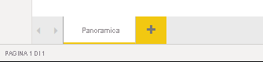

3. Per aggiungere un'immagine, nella scheda della barra multifunzione **Inserisci** fare clic su **Immagine** nel gruppo **Elementi**.

    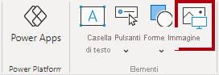

4. Nella finestra **Apri** passare alla cartella **D:\PL300\Resources**.

5. Selezionare il file **AdventureWorksLogo.jpg** e fare clic su **Apri**.

    

6. Trascinare l'immagine per posizionarla nell'angolo superiore sinistro, quindi trascinare anche i marcatori per ridimensionarla.

    

7. Per aggiungere un filtro dei dati, per prima cosa deselezionare l'immagine facendo clic su un'area vuota della pagina del report.
8. Nel riquadro **Campi** selezionare il campo **Date \| Year** (non il livello **Year** della gerarchia).
    
    *Nei lab viene usata una notazione abbreviata per fare riferimento a un campo, simile al seguente: **Date \| Year**. In questo esempio **Date** è il nome della tabella e **Year** è il nome del campo.*

9. Si noti che alla pagina del report è stata aggiunta una tabella di valori relativi all'anno.

10. Per convertire l'oggetto visivo da tabella in filtro dei dati, nel riquadro **Visualizzazioni** selezionare **Filtro dei dati**.

    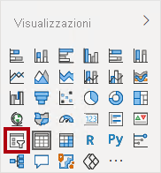

11. Per convertire il filtro dei dati da elenco in elenco a discesa, in alto a destra nel filtro dei dati fare clic sulla freccia giù e quindi selezionare **Elenco a discesa**.

    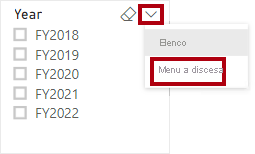

12. Ridimensionare e posizionare il filtro dei dati in modo che si trovi sotto l'immagine e abbia la stessa larghezza dell'immagine.

    

13. Nel filtro dei dati **Year** aprire l'elenco a discesa, selezionare **FY2020** e quindi comprimere l'elenco a discesa.

    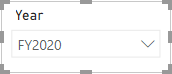

    *La pagina del report è ora filtrata in base all'anno **FY2020**.*

14. Deselezionare il filtro dei dati facendo clic su un'area vuota della pagina del report.

15. Creare un secondo filtro dei dati in base al campo **Region \| Region** (non in base al livello **Region** della gerarchia).

16. Lasciare il filtro dei dati come elenco, quindi ridimensionarlo e posizionarlo sotto il filtro dei dati **Year**.

    

21. Deselezionare il filtro dei dati facendo clic su un'area vuota della pagina del report.

22. Per aggiungere un grafico alla pagina, nel riquadro **Visualizzazioni** fare clic sul tipo di oggetto visivo **Grafico a linee e istogramma a colonne in pila**.

    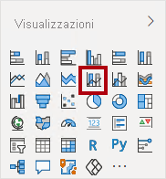

23. Ridimensionare e posizionare l'oggetto visivo in modo che si trovi a destra del logo, riempiendo la pagina del report in larghezza.

    

24. Trascinare i campi seguenti nell'oggetto visivo:

    - Date \| Month

    - Sales \| Sales

25. Nel riquadro dei campi dell'oggetto visivo (non nel riquadro **Campi**: il riquadro dei campi dell'oggetto visivo è sotto il riquadro **Visualizzazioni**) si noti che i campi sono assegnati alle aree **Asse X** e **Colonna asse y**.

    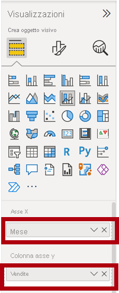

    *Se trascinati in un oggetto visivo, i campi vengono aggiunti alle aree predefinite. Per una maggiore precisione, è possibile trascinare i campi direttamente nelle aree, come mostrato di seguito.*

26. Dal riquadro **Campi** trascinare il campo **Sales \| Profit Margin** nell'area **Linea asse y**.

    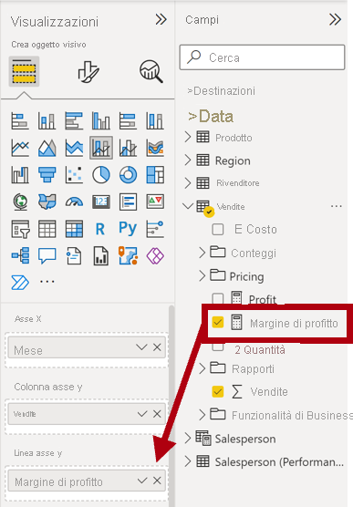

27. Si noti che l'oggetto visivo ha solo 11 mesi.

    *L'ultimo mese dell'anno, giugno 2020, non presenta (ancora) alcuna vendita. Per impostazione predefinita, l'oggetto visivo ha eliminato i mesi con vendite VUOTE. Ora l'oggetto visivo verrà configurato in modo da visualizzare tutti i mesi.*

28. Nell'area **Asse X** del riquadro dei campi dell'oggetto visivo fare clic sulla freccia rivolta verso il basso in corrispondenza del campo **Month** e quindi selezionare **Mostra elementi senza dati**.

    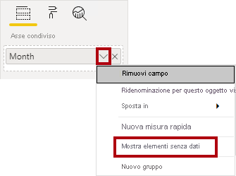

29. Si noti che adesso è visualizzato il mese di **giugno 2020**.

30. Deselezionare il grafico facendo clic su un'area vuota della pagina del report.

31. Per aggiungere un grafico alla pagina, nel riquadro **Visualizzazioni** fare clic sul tipo di oggetto visivo **Mappa**.

    

32. Ridimensionare e posizionare l'oggetto visivo in modo che si trovi sotto l'istogramma o grafico a linee, riempiendo per metà il grafico al di sopra.

    

33. Aggiungere i campi seguenti nelle aree dell'oggetto visivo:

    - Posizione: **Region \| Country**

    - Legenda: **Product \| Category**

    - Dimensioni: **Sales \| Sales**

34. Deselezionare il grafico facendo clic su un'area vuota della pagina del report.

35. Per aggiungere un grafico alla pagina, nel riquadro **Visualizzazioni** fare clic sul tipo di oggetto visivo **Grafico a barre in pila**.

    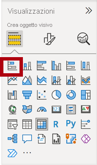

36. Ridimensionare e posizionare l'oggetto visivo in modo da riempire lo spazio rimanente della pagina del report.

    

37. Aggiungere i campi seguenti nelle aree dell'oggetto visivo:

    - Asse: **Product \| Category**

    - Valore: **Sales \| Quantity**

38. Per formattare l'oggetto visivo, aprire il riquadro **Formato**.

    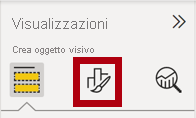

39. Espandere il gruppo **Barre** e quindi il gruppo **Colori**, quindi impostare la proprietà **Colore predefinito** su un colore appropriato, a complemento del grafico a linee o dell'istogramma.

40. **Attivare** la proprietà **Etichette dati**.

    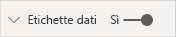

41. Salvare il file di Power BI Desktop.

    *La progettazione della prima pagina è ora completa.*

### **Attività 5: Progettare la pagina 2**

In questa attività si progetterà la seconda pagina del report. Completata la progettazione, la pagina sarà simile alla seguente:

*Importante: Nei casi in cui siano già state fornite istruzioni dettagliate nelle altre attività del lab, i passaggi presenteranno indicazioni più concise. Se sono necessarie istruzioni dettagliate, tornare a fare riferimento alle altre attività in questo lab.*

1. Per creare una nuova pagina, fare clic sull'icona con il segno più in basso a sinistra.

    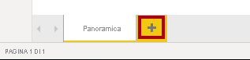

2. Rinominare la pagina in **Profit**.

    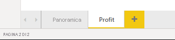

  

3. Aggiungere un filtro dei dati basato sul campo **Region \| Region**.

4. Usare il riquadro **Formato** per abilitare l'opzione "Seleziona tutto" (nel gruppo **Selezione**).

5. Ridimensionare e posizionare il filtro dei dati in modo che si trovi sul lato sinistro della pagina del report, a circa metà altezza della pagina.

    

6. Aggiungere un oggetto visivo matrice, ridimensionarlo e posizionarlo in modo da riempire lo spazio rimanente della pagina del report

    

7. Aggiungere la gerarchia **Date \| Fiscal** all'area **Righe** della matrice.

    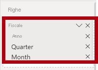

8. Aggiungere i cinque campi seguenti della tabella **Sales** all'area **Valori**:

    - Orders (dalla cartella **Counts**)

    - Sales

    - Cost

    - Profit

    - Profit Margin

    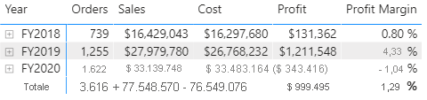

9. Nel riquadro **Filtri** (situato a sinistra del riquadro **Visualizzazioni**) osservare l'area **Filtri in questa pagina** (potrebbe essere necessario scorrere verso il basso).

    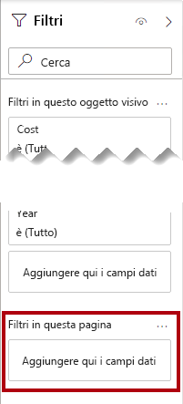

10. Dal riquadro **Campi** trascinare il campo **Product \| Category** nell'area **Filtri in questa pagina**.

11. All'interno della scheda Filtro, in alto a destra, fare clic sulla freccia per comprimere la scheda.

    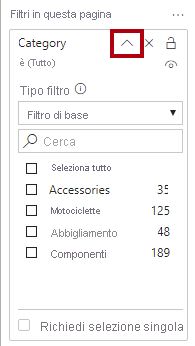

    *I campi aggiunti al riquadro **Filtri** permettono di ottenere lo stesso risultato di un filtro dei dati. Una differenza consiste nel fatto che non occupano spazio nella pagina del report. Un'altra differenza è che possono essere configurati per soddisfare requisiti di filtro più avanzati.*

12. Aggiungere ognuno dei campi seguenti della tabella **Product** all'area **Filtri in questa pagina**, comprimendoli tutti, direttamente sotto la scheda **Category**:

    - Subcategory

    - Product

    - Color

    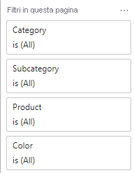

13. Salvare il file di Power BI Desktop.

    *La progettazione della seconda pagina è ora completa.*

### **Attività 6: Progettare la pagina 3**

In questa attività si progetterà la terza e ultima pagina del report. Completata la progettazione, la pagina sarà simile alla seguente:

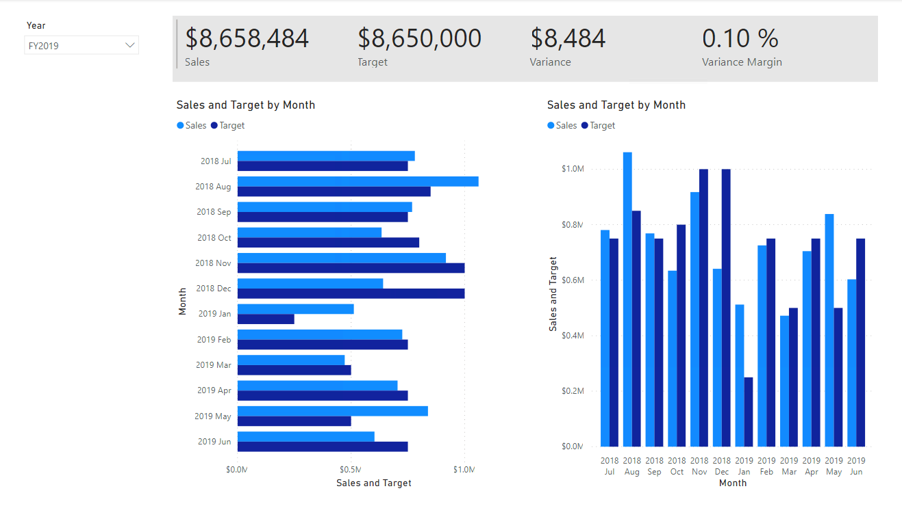

1. Creare una nuova pagina, quindi rinominarla **My Performance**.

1. Per simulare le prestazioni dei filtri di sicurezza a livello di riga, trascinare il campo **Salesperson (Performance) \| Salesperson** nei filtri a livello di pagina nel riquadro dei filtri.
    
    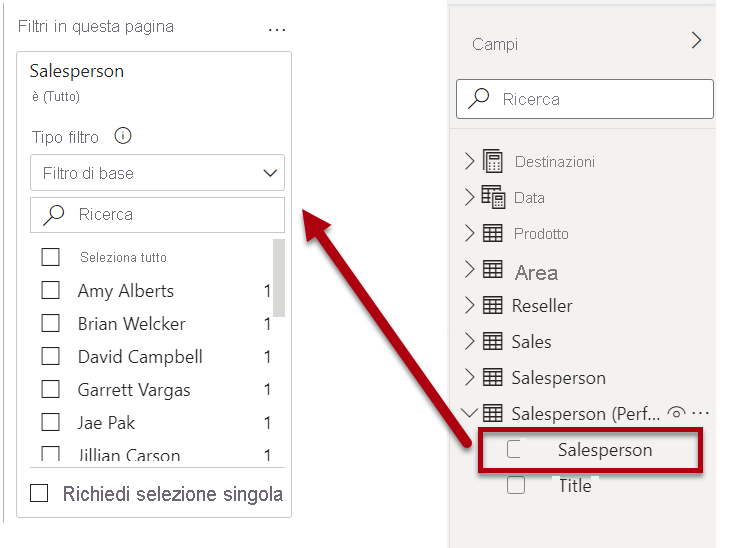 

1. Selezionare **Michael Blythe**. I dati nella pagina del report **My Performance** verranno ora filtrati per visualizzare solo i dati di Michael Blythe.

1. Aggiungere un filtro dei dati a discesa basato sul campo **Date \| Year**, quindi ridimensionarlo e posizionarlo nell'angolo in alto a sinistra della pagina.

    

1. Nel filtro dei dati impostare la pagina in modo da filtrare in base a **FY2019**.

    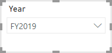

1. Aggiungere un oggetto visivo **Scheda con più righe**, quindi ridimensionarlo e riposizionarlo in modo che si trovi a destra del filtro dei dati e riempia la larghezza rimanente della pagina.

    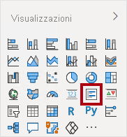

    

1. Aggiungere i quattro campi seguenti all'oggetto visivo:

    - Sales \| Sales

    - Targets \| Target

    - Targets \| Variance

    - Targets \| Variance Margin

1. Formattare l'oggetto visivo:

    - Nel gruppo **Valori callout** aumentare la proprietà **Dimensione testo** a **28pt**

    - Nel gruppo **Sfondo** impostare il **Colore** su un colore grigio chiaro

    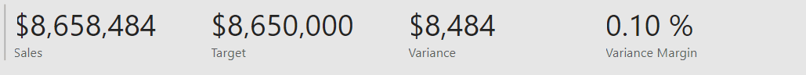

1. Aggiungere un oggetto visivo **Grafico a barre raggruppate**, quindi ridimensionarlo e posizionarlo in modo che si trovi sotto l'oggetto visivo Scheda con più righe e riempia l'altezza rimanente della pagina e metà della larghezza dell'oggetto visivo scheda con più righe.

    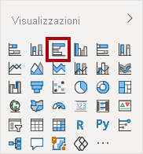

    

1. Aggiungere i campi seguenti nelle aree dell'oggetto visivo:

    - Asse: **Date \| Month**

    - Valore: **Sales \| Sales** e **Targets \| Target**

    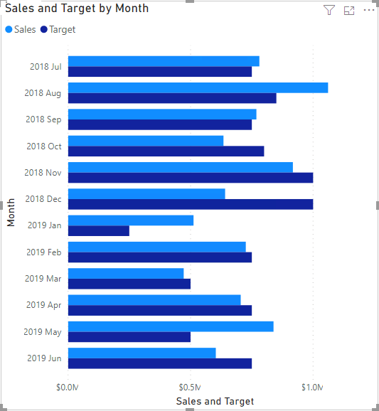

1. Per creare una copia dell'oggetto visivo, premere **CTRL + C**, quindi premere **CTRL + V**.

1. Posizionare il nuovo oggetto visivo a destra dell'oggetto visivo originale.

    

1. Per modificare il tipo di visualizzazione, nel riquadro **Visualizzazioni** selezionare **Istogramma a colonne raggruppate**.

    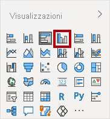

    *È ora possibile visualizzare gli stessi dati espressi da due tipi di visualizzazione diversi. Questo non è un uso ottimale del layout di pagina. Sarà tuttavia possibile migliorarlo nel lab **Progettare un report in Power BI Desktop - Parte 2** sovrapponendo gli oggetti visivi. Aggiungendo pulsanti alla pagina, si consentirà all'utente del report di determinare quale dei due oggetti visivi deve essere visibile.*

    *La progettazione della terza e ultima pagina è ora completa.*

### **Attività 7: Pubblicare il report**

In questa attività si pubblicherà il report.

1. Selezionare la pagina di **panoramica**.

2. Salvare il file di Power BI Desktop.

3. Nella scheda della barra multifunzione **Home** fare clic su **Pubblica** nel gruppo **Condividi**.

    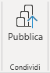

4. Nella finestra **Pubblica in Power BI** si noti che l'opzione **Area di lavoro** è selezionata.

5. Per pubblicare il report, fare clic su **Seleziona**.

    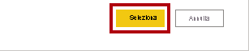

6. Al termine della pubblicazione, fare clic su **Chiudi**.

    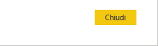

7. Lasciare aperto Power BI Desktop.

    *Nell'esercizio successivo si esplorerà il report nel servizio Power BI.*

## **Esercizio 2: Esplorare il report**

In questo esercizio si esplorerà il report pubblicato in Power BI.

### **Attività 1: Esplorare il report**

In questa attività si esplorerà il report pubblicato in Power BI.

1. Nella finestra del browser Microsoft Edge nel servizio Power BI espandere **Area di lavoro personale** nel **riquadro di spostamento** (a sinistra, potrebbe essere compresso).

    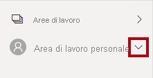

2. Esaminare il contenuto dell'area di lavoro, notando il report **Sales Analysis** e il set di dati.

    *Quando è stato pubblicato il file di Power BI Desktop, il modello di dati è stato pubblicato come set di dati.*

    *Se non viene visualizzato, premere **F5** per ricaricare il browser e quindi espandere di nuovo l'area di lavoro.*

    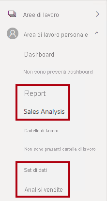

3. Per aprire il report, fare clic sul report **Sales Analysis**.

4. A sinistra, nel riquadro **Pagine** selezionare la pagina **Overview**. 

5. Nel filtro dei dati **Regions** tenendo premuto il tasto **CTRL** selezionare più aree.

6. Nel grafico a linee o nell'istogramma selezionare una colonna del mese per applicare un filtro incrociato alla pagina.

7. Tenendo premuto il tasto **CTRL** selezionare un mese aggiuntivo.

    *Per impostazione predefinita, il filtro incrociato filtra tutti gli altri oggetti visivi nella pagina.*

8. Si noti che il grafico a barre è filtrato ed evidenziato e che la parte in grassetto delle barre rappresenta i mesi filtrati.

9. Passare il puntatore del mouse sull'oggetto visivo grafico a barre e quindi sull'icona del filtro in alto a destra.

    

    *L'icona del filtro consente di comprendere tutti i filtri applicati all'oggetto visivo, inclusi i filtri dei dati e i filtri incrociati di altri oggetti visivi.*

10. Passare il cursore su una barra, quindi osservare le informazioni della descrizione comando.

11. Per annullare il filtro incrociato, fare clic su un'area vuota dell'oggetto visivo nel grafico a linee o nell'istogramma.

12. Passare il puntatore del mouse sull'oggetto visivo mappa e fare clic sull'icona **Modalità messa a fuoco** in alto a destra.

    

    *In modalità messa a fuoco l'oggetto visivo viene ingrandito fino a occupare l'intera pagina.*

13. Passare il puntatore del mouse su segmenti diversi dei grafici a barre per visualizzare le descrizioni comando.

14. Per tornare alla pagina del report, fare clic su **Torna al report** in alto a sinistra.

    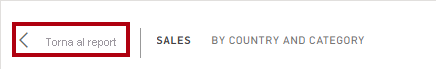

15. Passare nuovamente il puntatore del mouse sull'oggetto visivo mappa, quindi fare clic sui puntini di sospensione (...) in alto a destra e osservare le opzioni di menu.

    

16. Provare ognuna delle opzioni, ad eccezione di **Chat in Teams**.

17. A sinistra, nel riquadro **Pagine** selezionare la pagina **Profit**.

    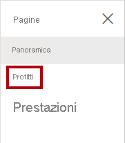

18. Si noti che il filtro dei dati **Region** ha una selezione diversa rispetto al filtro dei dati **Region** nella pagina **Overview**.

    *I filtri dei dati non sono sincronizzati. La progettazione del report verrà modificata per garantire la sincronizzazione tra le pagine nel lab **Progettare un report in Power BI Desktop - Parte 2**.*

19. Nel riquadro **Filtri** a destra espandere una scheda filtro e applicare alcuni filtri.

    *Il riquadro **Filtri** consente di definire più filtri che potrebbero adattarsi a una pagina come filtri dei dati.*

20. Nell'oggetto visivo matrice usare il pulsante più (+) per esaminare la gerarchia **Fiscal**.

21. Selezionare la pagina **My Performance**.

    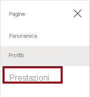

22. In alto a destra nella barra dei menu fare clic su **Vista**, quindi selezionare **Schermo intero**.

    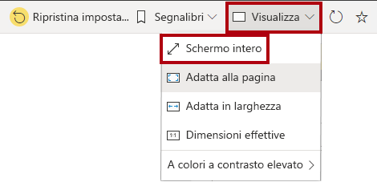

23. Interagire con la pagina modificando il filtro dei dati e applicando un filtro incrociato alla pagina.

24. Nella parte inferiore della finestra notare i comandi per cambiare pagina, spostarsi avanti o indietro tra le pagine o uscire dalla modalità schermo intero.

25. Fare clic sull'icona a sinistra per uscire dalla modalità schermo intero.

    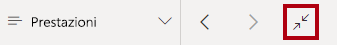

### **Attività 2: Completare il lab**

In questa attività si completerà il lab.

1. Per tornare all'area di lavoro, nel banner della pagina Web della finestra fare clic su **Area di lavoro personale**.

    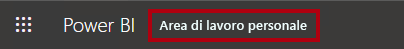

2. Lasciare aperta la finestra del browser Microsoft Edge.

    *È possibile migliorare la progettazione dei report con le funzionalità avanzate mostrate nel lab **Progettare un report in Power BI Desktop - Parte 2**.*
