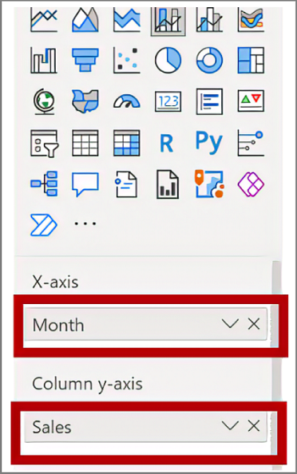
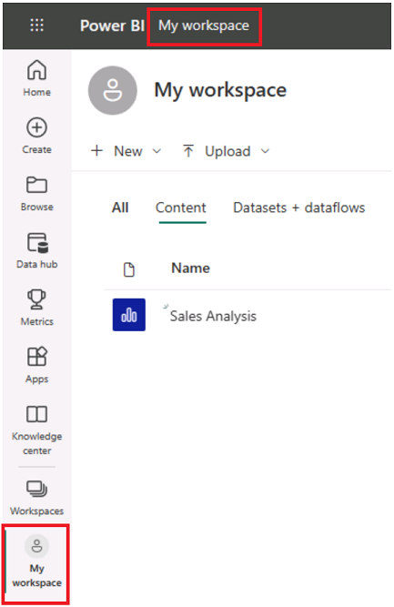

---
lab:
  title: Progettare un report in Power BI Desktop
  module: 7 - Create Reports
---

# Progettare un report in Power BI Desktop

**Il tempo stimato per il completamento del lab è di 45 minuti.**

In questo lab verrà creato un report di tre pagine. Il report verrà quindi pubblicato in Power BI dove sarà possibile aprirlo e interagire con esso.

Contenuto del lab:

- Progettare un report
- Configurare campi visivi e proprietà del formato

### **Presentazione del lab**

Questo lab fa parte di una serie che comprende molti lab progettati come attività completa, dalla preparazione dei dati alla pubblicazione come report e dashboard. È possibile completare i lab nell'ordine desiderato. Se tuttavia si intende seguire più lab, è consigliabile procedere in questo ordine:

1. Preparare i dati in Power BI Desktop
1. Caricare i dati in Power BI Desktop
1. Progettare un modello di dati in Power BI
1. Creare calcoli DAX in Power BI Desktop
1. Creare calcoli DAX avanzati in Power BI Desktop
1. **Progettare un report in Power BI Desktop**
1. Migliorare un report in Power BI Desktop
1. Eseguire l'analisi dei dati in Power BI
1. Creare un dashboard di Power BI
1. Applicare la sicurezza a livello di riga

## **Esercizio 1: Creare un report**

In questo esercizio verrà creato un report a tre pagine denominato **Report vendite**.

### **Attività 1: Introduzione - Apri report**

In questa attività verrà configurato l'ambiente per il lab aprendo il report iniziale.

1. Da Power BI Desktop passare a **File** > **Apri report** > **Sfoglia report**.

1. Aprire il file **Sales Analysis** nella cartella  **D:\PL300\Labs\06-design-report-in-power-bi-desktop\Starter** .

1. Creare una copia del file passando a **Salva** > **con** nome e salvando la copia nella cartella **D:\PL300\MySolution** .

### **Attività 2: Pagina progettazione 1**

In questa attività verrà progettata la prima pagina del report. Completata la progettazione, la pagina sarà simile alla seguente:

1. In Power BI Desktop rinominare la pagina, in basso a sinistra fare clic con il pulsante destro del mouse su **Pagina 1**, quindi **rinominare** la pagina come **Panoramica**.

    *Suggerimento: è anche possibile fare doppio clic sul nome della pagina per rinominarla.*

1. Per aggiungere un'immagine, nella scheda della barra multifunzione **Inserisci** selezionare **Immagine** all'interno del gruppo **Elementi**.

    

1. Nella finestra **Apri** passare alla cartella **D:\PL300\Resources**.

1. Selezionare il file **AdventureWorksLogo.jpg** e quindi **Apri**.

1. Trascinare l'immagine per posizionarla nell'angolo superiore sinistro, quindi trascinare anche i marcatori per ridimensionarla.

     

1. Per aggiungere un filtro dei dati, selezionare prima di tutto l'immagine facendo clic su un'area vuota della pagina del report, quindi selezionare il **filtro** dei dati nel riquadro **Visualizzazioni** .

     

1. Nel riquadro **Campi** trascinare il campo **Data \| Year** (non il livello **Anno** della gerarchia) nel campo filtro dei **dati nel riquadro** Visualizzazioni.
    
    *Nei lab viene usata una notazione abbreviata per fare riferimento a un campo, simile al seguente: **Date \| Year**. In questo esempio **Date** è il nome della tabella e **Year** è il nome del campo.*

1. Per convertire il filtro dei dati da un elenco a discesa, passare a **Visualizzazioni > Formato visivo > Visual > Impostazioni** filtro dei dati > Stile e quindi selezionare **Elenco a** discesa dal menu a discesa.

    

1. Ridimensionare e posizionare il filtro dei dati in modo che si trovi sotto l'immagine e abbia la stessa larghezza dell'immagine.

     

1. Nel filtro dei dati **Year** aprire l'elenco a discesa, selezionare **FY2020** e quindi comprimere l'elenco a discesa.
    1. *La pagina del report è ora filtrata in base all'anno **FY2020**.*

     

1. Deselezionare il filtro dei dati facendo clic su un'area vuota della pagina del report.

1. Creare un secondo filtro dei dati in base al campo **Region \| Region** (non in base al livello **Region** della gerarchia).

1. Lasciare il filtro dei dati come elenco, quindi ridimensionarlo e posizionarlo sotto il filtro dei dati **Year**.

     

1. Deselezionare il filtro dei dati facendo clic su un'area vuota della pagina del report.

1. Per aggiungere un grafico alla pagina, nel riquadro **Visualizzazioni** selezionare il tipo di oggetto visivo **Grafico a linee e istogramma in pila**.

     

1. Ridimensionare e posizionare l'oggetto visivo in modo che si trovi a destra del logo, riempiendo la pagina del report in larghezza.

     

1. Trascinare i campi seguenti nell'oggetto visivo:

     - Date \| Month
     - Sales \| Sales

1. Nel riquadro dei campi dell'oggetto visivo (non nel riquadro **Campi**: il riquadro dei campi dell'oggetto visivo è sotto il riquadro **Visualizzazioni**) si noti che i campi sono assegnati alle aree **Asse X** e **Colonna asse y**.
    
    *Trascinando i campi in un oggetto visivo, verranno aggiunti a ben/aree predefinite. Per precisione, è possibile trascinare i campi direttamente nei pozzi/aree, come si farà successivamente.*

     

1. Dal riquadro **Campi** trascinare il campo **Vendite \| Profit Margin** nell'area **Linea asse y**.

     

1. Si noti che l'oggetto visivo ha solo 11 mesi.
    
    *L'ultimo mese dell'anno, 2020 giugno, non ha ancora vendite (ancora). Per impostazione predefinita, l'oggetto visivo ha eliminato mesi con vendite BLANK. L'oggetto visivo verrà ora configurato per visualizzare tutti i mesi.*

1. Nel riquadro campi visivi, nell'area asse **X** selezionare la freccia giù e quindi **** mostra **elementi senza dati**.
    
    *Si noti che il mese **2020 giugno** ora viene visualizzato.*

     

1. Deselezionare il grafico facendo clic su un'area vuota della pagina del report.

1. Per aggiungere un grafico alla pagina, nel riquadro **Visualizzazioni** selezionare il tipo di oggetto **visivo Grafico colonna in pila** .

     

1. Ridimensionare e posizionare l'oggetto visivo in modo che si trovi sotto l'istogramma o grafico a linee, riempiendo per metà il grafico al di sopra.

     

1. Aggiungere i campi seguenti nelle aree dell'oggetto visivo:

     - Asse X: **Paese dell'area \|**
     - Asse Y: **Sales \| Sales**
     - Legenda: **Product \| Category**

1. Deselezionare il grafico facendo clic su un'area vuota della pagina del report.

1. Per aggiungere un grafico alla pagina, nel riquadro **Visualizzazioni** fare clic sul tipo di oggetto visivo **Grafico a barre in pila**.

     

1. Ridimensionare e posizionare l'oggetto visivo in modo da riempire lo spazio rimanente della pagina del report.

     

1. Aggiungere i campi seguenti nelle aree dell'oggetto visivo:

     - Asse Y: **Categoria di prodotti \|**
     - Asse X: **Quantità vendite \|**

1. Per formattare l'oggetto visivo, aprire il riquadro **Formato**.

     

1. Espandere il gruppo **Barre** e quindi il gruppo **Colori**, quindi impostare la proprietà **Colore predefinito** su un colore appropriato, a complemento del grafico a linee o dell'istogramma.

1. **Attivare** la proprietà **Etichette dati**.

     

1. Salvare il file di Power BI Desktop.

*La progettazione della prima pagina è ora completa.*

### **Attività 3: Pagina progettazione 2**

In questa attività verrà progettata la seconda pagina del report. Completata la progettazione, la pagina sarà simile alla seguente:

 

*Importante: nei casi in cui siano già state fornite istruzioni dettagliate nelle altre attività del lab, i passaggi presenteranno indicazioni più concise. Se sono necessarie istruzioni dettagliate, tornare a fare riferimento alle altre attività in questo lab.*

1. Per creare una nuova pagina, in basso a sinistra selezionare l'icona più e rinominare la nuova pagina in **Profit**.

1. Aggiungere un filtro dei dati basato sul campo **Region \| Region**.

1. Usare il riquadro **Formato** per abilitare l'opzione "Seleziona tutto" (nel gruppo **Selezione**).

1. Ridimensionare e posizionare il filtro dei dati in modo che si trovi sul lato sinistro della pagina del report, a circa metà altezza della pagina.

     

1. Aggiungere un oggetto visivo matrice, ridimensionarlo e posizionarlo in modo da riempire lo spazio rimanente della pagina del report.

     

1. Aggiungere la gerarchia **Date \| Fiscal** all'area **Righe** della matrice.

     

1. Aggiungere i cinque campi seguenti della tabella **Sales** all'area **Valori**:

     - Orders (dalla cartella **Counts**)
     - Sales
     - Cost
     - Profit
     - Profit Margin

     

1. Nel riquadro **Filtri** (situato a sinistra del riquadro **Visualizzazioni**) osservare l'area **Filtri in questa pagina** (potrebbe essere necessario scorrere verso il basso).

     

1. Dal riquadro **Campi** trascinare il campo **Product \| Category** nell'area **Filtri in questa pagina**.
    
    *I campi aggiunti al riquadro **Filtri** permettono di ottenere lo stesso risultato di un filtro dei dati. Una differenza consiste nel fatto che non occupano spazio nella pagina del report. Un'altra differenza è che possono essere configurati per soddisfare requisiti di filtro più avanzati.*

1. All'interno della scheda Filtro in alto a destra selezionare la freccia per comprimere la scheda.

1. Aggiungere ognuno dei campi seguenti della tabella **Product** all'area **Filtri in questa pagina**, comprimendoli tutti, direttamente sotto la scheda **Category**:

     - Subcategory
     - Product
     - Color

     

1. Salvare il file di Power BI Desktop.

 *La progettazione della seconda pagina è ora completa.*

### **Attività 4: Pagina progettazione 3**

In questa attività si progettano la terza pagina e la pagina finale del report. Completata la progettazione, la pagina sarà simile alla seguente:

 

1. Creare una nuova pagina, quindi rinominarla **My Performance**.

1. Per simulare le prestazioni dei filtri di sicurezza a livello di riga, trascinare il campo **Salesperson (Performance) \| Salesperson** nei filtri a livello di pagina nel riquadro dei filtri.

     

1. Selezionare **Michael Blythe**. I dati nella pagina del report **My Performance** verranno ora filtrati per visualizzare solo i dati di Michael Blythe.

1. Aggiungere un filtro dei dati a discesa basato sul campo **Date \| Year**, quindi ridimensionarlo e posizionarlo nell'angolo in alto a sinistra della pagina.

     

1. Nel filtro dei dati impostare la pagina in modo da filtrare in base a **FY2019**.

     

1. Aggiungere un oggetto visivo **Scheda con più righe**, quindi ridimensionarlo e riposizionarlo in modo che si trovi a destra del filtro dei dati e riempia la larghezza rimanente della pagina.

     

     

1. Aggiungere i quattro campi seguenti all'oggetto visivo:

     - Sales \| Sales
     - Targets \| Target
     - Targets \| Variance
     - Targets \| Variance Margin

1. Formattare l'oggetto visivo:

     - Nel gruppo **Valori callout** aumentare la proprietà **Dimensione testo** a **28pt**

     - Nel gruppo **Effetti > generale > Sfondo** impostare **Color** su un colore grigio chiaro (ad esempio "Bianco, 20% più scuro) per dare contrasto

         

1. Aggiungere un oggetto visivo **Grafico a barre raggruppate**, quindi ridimensionarlo e posizionarlo in modo che si trovi sotto l'oggetto visivo Scheda con più righe e riempia l'altezza rimanente della pagina e metà della larghezza dell'oggetto visivo scheda con più righe.

     

     

1. Aggiungere i campi seguenti nelle aree dell'oggetto visivo:

     - Asse Y: **Data \| Mese**
     - Asse X: **Sales Sales \|** and **Targets \| Target**

         

1. Per creare una copia dell'oggetto visivo, premere **CTRL + C**, quindi premere **CTRL + V**.

1. Posizionare il nuovo oggetto visivo a destra dell'oggetto visivo originale.

     

1. Per modificare il tipo di visualizzazione, nel riquadro **Visualizzazioni** selezionare **Istogramma a colonne raggruppate**.

     

 *È ora possibile visualizzare gli stessi dati espressi da due tipi di visualizzazione diversi. Questo non è un buon uso del layout di pagina, ma verrà migliorato nel lab **Migliorare un report in Power BI Desktop** lab sovrapponendo gli oggetti visivi. Aggiungendo pulsanti alla pagina, si consentirà all'utente del report di determinare quale dei due oggetti visivi è visibile.*

 *La progettazione della terza e ultima pagina è ora completa.*

## **Esercizio 2: Esplorare il report**

In questo esercizio si pubblicherà il report nel servizio Power BI ed si esaminerà il report consumer di sola lettura.

### **Attività 1: Pubblicare il report**

In questa attività si pubblicherà il report nel servizio Power BI.

1. Selezionare la pagina **Panoramica** e quindi salvare il file Power BI Desktop.

1. Nella scheda della barra multifunzione **Home** selezionare **Pubblica** all'interno del gruppo **Condividi**.
    
    *Se non è già stato eseguito l'accesso a Power BI Desktop, è necessario eseguire l'accesso per la pubblicazione.*

     

1. Nella finestra **Pubblica in Power BI** si noti che l'opzione **Area di lavoro** è selezionata.
    
    *In questo lab non verranno illustrati in dettaglio i diversi elementi all'interno del servizio Power BI.*

1. Per pubblicare il report, **selezionare Seleziona**. L'operazione potrebbe richiedere alcuni istanti. 
1. Al termine della pubblicazione, fare clic su **Chiudi**.

### **Attività 2: Esplorare il report**

In questa attività si esaminerà il report pubblicato in Power BI.

1. Aprire un browser Microsoft Edge, quindi accedere all'indirizzo **https://app.powerbi.com**.

1. Nella finestra del browser Microsoft Edge nel servizio Power BI espandere **Area di lavoro personale** nel **riquadro di spostamento** (a sinistra, potrebbe essere compresso).

    

1. Esaminare il contenuto dell'area di lavoro. Si notino le opzioni di spostamento di Tutti, Contenuto e Set di dati + flussi di dati.
    1. *Esistono quattro tipi di elementi che possono esistere in un'area di lavoro e verranno descritti **report** e set di **dati**.*
    1. *Potrebbe essere necessario aggiornare il browser Microsoft Edge se il set di dati non è visibile.*
    1. *Quando è stato pubblicato il file di Power BI Desktop, il modello di dati è stato pubblicato come set di dati.*

1. Per esplorare il report, selezionare il report **Sales Analysis** .

1. A sinistra, nel riquadro **Pagine** selezionare la pagina **Overview**.

1. Nel filtro dei dati **Regions** tenendo premuto il tasto **CTRL** selezionare più aree.

1. Nel grafico a linee o nell'istogramma selezionare una colonna del mese per applicare un filtro incrociato alla pagina.

1. Quando si preme **CTRL** , selezionare un altro mese.

     *Nota: per impostazione predefinita, il filtro incrociato filtra tutti gli altri oggetti visivi nella pagina.*

1. Si noti che il grafico a barre è filtrato ed evidenziato e che la parte in grassetto delle barre rappresenta i mesi filtrati.

1. Passare il puntatore del mouse sull'oggetto visivo grafico a barre e quindi sull'icona del filtro in alto a destra. 
    
    *L'icona del filtro consente di comprendere tutti i filtri applicati all'oggetto visivo, inclusi i filtri dei dati e i filtri incrociati di altri oggetti visivi.*

1. Passare il cursore su una barra, quindi osservare le informazioni della descrizione comando.

1. Per annullare il filtro incrociato, fare clic su un'area vuota dell'oggetto visivo nel grafico a linee o nell'istogramma.

1. Passare il cursore sull'oggetto visivo grafico a colonne in pila e quindi in alto a destra selezionare l'icona **Modalità** messa a fuoco.
    
    *In modalità messa a fuoco l'oggetto visivo viene ingrandito fino a occupare l'intera pagina.*

     

1. Passare il puntatore del mouse su segmenti diversi dei grafici a barre per visualizzare le descrizioni comando.

1. Per tornare alla pagina del report, fare clic su **Torna al report** in alto a sinistra.

     

1. Passare di nuovo il cursore su uno degli oggetti visivi, quindi in alto a destra selezionare i puntini di sospensione (...), quindi notare le opzioni di menu. Provare ognuna delle opzioni, ad eccezione di **Chat in Teams**.

     

1. A sinistra, nel riquadro **Pagine** selezionare la pagina **Profit**.

     

1. Si noti che il filtro dei dati **Region** ha una selezione diversa rispetto al filtro dei dati **Region** nella pagina **Overview**.
    
    *I filtri dei dati non vengono sincronizzati. La progettazione del report verrà modificata per assicurarsi che si sincronizzano tra pagine nel lab **Migliorare un report in Power BI Desktop** lab.*

1. Nel riquadro **Filtri** a destra espandere una scheda filtro e applicare alcuni filtri.
    
    *Il riquadro **Filtri** consente di definire più filtri che potrebbero adattarsi a una pagina come filtri dei dati.*

1. Nell'oggetto visivo matrice usare il pulsante più (+) per esaminare la gerarchia **Fiscal**.

1. Selezionare la pagina **My Performance**.

     

1. In alto a destra nella barra dei menu fare clic su **Visualizza** e quindi selezionare **Schermo intero**.

     

1. Interagire con la pagina modificando il filtro dei dati e applicando un filtro incrociato alla pagina.

1. Nella parte inferiore della finestra notare i comandi per cambiare pagina, spostarsi avanti o indietro tra le pagine o uscire dalla modalità schermo intero.

1. Selezionare l'icona a destra per uscire dalla modalità schermo intero.

     

### **Attività 3: Completare il lab**

In questa attività si completerà il lab.

Per tornare a "Area di lavoro personale", selezionare **Area di lavoro** personale nel banner nella pagina Web della finestra.

 *Si migliorerà la progettazione del report con funzionalità avanzate nel lab **Migliorare un report in Power BI Desktop** lab.*
