---
lab:
  title: Progettare un report in Power BI Desktop - Parte 2
  module: Module 7 - Create Reports
ms.openlocfilehash: 72d571e81320d4c0311f9e566d1805725439f961
ms.sourcegitcommit: 9ea1e7e21b9b3c718030c94b1693d153a2010ec7
ms.translationtype: HT
ms.contentlocale: it-IT
ms.lasthandoff: 06/29/2022
ms.locfileid: "146650208"
---
# **Progettare un report in Power BI Desktop - Parte 2**

**Il tempo stimato per il completamento del lab è di 45 minuti**

In questo lab il report **Sales Analysis** viene ottimizzato con funzionalità di progettazione avanzate.

Contenuto del lab:

- Sincronizzare i filtri dei dati

- Creare una pagina di drill-through

- Applicare la formattazione condizionale

- Creare e usare i segnalibri

### **Presentazione del lab**

Questo lab fa parte di una serie che comprende molti lab progettati come attività completa, dalla preparazione dei dati alla pubblicazione come report e dashboard. È possibile completare i lab nell'ordine desiderato. Se tuttavia si intende seguire più lab, è consigliabile procedere in questo ordine:

1. Preparare i dati in Power BI Desktop

2. Caricare i dati in Power BI Desktop

3. Modellare i dati in Power BI Desktop

5. Creare calcoli DAX in Power BI Desktop - Parte 1

6. Creare calcoli DAX in Power BI Desktop - Parte 2

7. Progettare un report in Power BI Desktop - Parte 1

8. **Progettare un report in Power BI Desktop - Parte 2**

9. Creare un dashboard di Power BI

10. Eseguire l'analisi dei dati in Power BI Desktop

11. Applicare la sicurezza a livello di riga

## **Esercizio 1: Configurare i filtri dei dati sincronizzati**

In questo esercizio verrà eseguita la sincronizzazione dei filtri dei dati della pagina del report.

### Attività 1: Operazioni preliminari - Accesso

In questa attività si accederà a Power BI per configurare l'ambiente per il lab.

*Importante: se l'accesso a Power BI è già stato effettuato, passare all'attività successiva.*

1. Per aprire Microsoft Edge, sulla barra delle applicazioni fare clic sul collegamento al programma Microsoft Edge.

    

1. Nella finestra del browser Microsoft Edge passare a **https://powerbi.microsoft.com**.

    *Suggerimento: è anche possibile usare l'elemento preferito Servizio Power BI sulla barra dei preferiti di Microsoft Edge.*

1. Fare clic su **Accedi** (nell'angolo in alto a destra).

    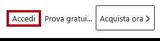

1. Immettere i dettagli dell'account ricevuti.

1. Se viene chiesto di aggiornare la password, immettere di nuovo la password ricevuta e quindi immettere e confermare una nuova password.

    *Importante: assicurarsi di registrare la nuova password.*

1. Completare il processo di accesso.

1. Se in Microsoft Edge viene chiesto se restare connessi, fare clic su **Sì**.

1. Nella finestra del browser Microsoft Edge, nel servizio Power BI, nel riquadro **Navigazione** espandere **Area di lavoro personale**.

    

1. Lasciare aperta la finestra del browser Microsoft Edge.

### Attività 2: Operazioni preliminari - Aprire il report

In questa attività si aprirà il report iniziale per configurare l'ambiente per il lab.

*Importante: se si sta continuando dal lab precedente (e il lab è stato completato correttamente), non completare questa attività, ma passare a quella successiva.*

1. Per aprire Power BI Desktop, sulla barra delle applicazioni fare clic sul collegamento Microsoft Power BI Desktop.

    

2. Per chiudere la finestra introduttiva, fare clic su **X** nella parte superiore sinistra della finestra.

    

3. Per accedere al servizio Power BI, fare clic su **Accedi** in alto a destra.

    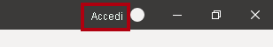

4. Completare il processo di accesso con lo stesso account usato per accedere al servizio Power BI.

5. Per aprire il file di avvio di Power BI Desktop, selezionare la scheda della barra multifunzione **File** per aprire la visualizzazione Backstage.

6. Selezionare **Apri report**.

    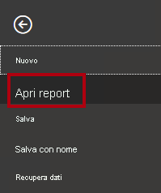

7. Fare clic su **Sfoglia report**.

    

8. Nella finestra **Apri** passare alla cartella **D:\PL300\Labs\07-design-report-in-power-bi-desktop-enhanced\Starter**.

9. Selezionare il file **Sales Analysis**.

10. Fare clic su **Apri**.

    

11. Chiudere eventuali finestre aperte di carattere informativo.

12. Per creare una copia del file, fare clic sulla scheda della barra multifunzione **File** per aprire la visualizzazione Backstage.

13. Selezionare **Salva con nome**.

    

14. Se viene richiesto di applicare le modifiche, fare clic su **Applica**.

    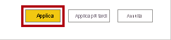

15. Nella finestra **Salva con nome** passare alla cartella **D:\PL300\MySolution**.

16. Fare clic su **Salva**.

    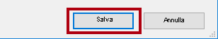

### **Attività 3: Sincronizzare i filtri dei dati**

In questa attività verranno sincronizzati i filtri dei dati **Year** e **Region**.

*Si continuerà a sviluppare il report creato nel lab Progettare un report in **Power BI Desktop - Parte 1**.*

1. In Power BI Desktop, nella pagina **Overview** impostare il filtro dei dati **Year** su **FY2018**.

2. Passare alla pagina **My Performance** e osservare che il filtro dei dati **Year** è un valore diverso.

    *Quando i filtri dei dati non vengono sincronizzati, possono contribuire alla falsa rappresentazione dei dati ed essere motivo di frustrazione per gli utenti del report. A questo punto è possibile sincronizzare i filtri dei dati del report.*

3. Tornare alla pagina **Overview** e quindi selezionare il filtro dei dati **Year**.

4. Nella scheda della barra multifunzione **Visualizza** selezionare **Sincronizza filtri dei dati** all'interno del gruppo **Mostra riquadri**.

    

5. Nel riquadro **Sincronizza filtri dei dati** (a sinistra del riquadro **Visualizzazioni**), nella seconda colonna (che rappresenta la sincronizzazione) selezionare le caselle di controllo per le pagine **Overview** e **My Performance**.

    

6. Nella pagina **Overview** selezionare il filtro dei dati **Region**.

7. Sincronizzare il filtro dei dati con le pagine **Overview** e **Profit**.

    

8. Testare i filtri dei dati sincronizzati selezionando altre opzioni di filtro e quindi verificando che i filtri dei dati sincronizzati vengano filtrati in base alla stessa selezione.

9. Per chiudere la pagina **Sincronizza filtri dei dati**, fare clic sulla **X** in alto a destra nel riquadro.

    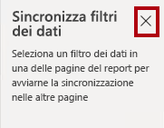

## **Esercizio 2: Configurare il drill-through**

In questo esercizio si creerà una nuova pagina che verrà configurata come pagina di drill-through. Completata la progettazione, la pagina sarà simile alla seguente:

### **Attività 1: Creare una pagina di drill-through**

In questa attività si creerà una nuova pagina che verrà configurata come pagina di drill-through.

1. Aggiungere una nuova pagina del report denominata **Product Details**.

    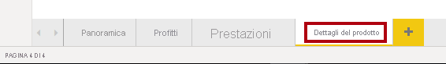

2. Fare clic con il pulsante destro del mouse sulla scheda della pagina **Product Details**, quindi selezionare **Nascondi pagina**.

    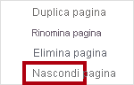

    *Gli utenti del report non potranno accedere direttamente alla pagina di drill-through. Dovranno accedervi dagli oggetti visivi in altre pagine. Si apprenderà come eseguire il drill-through fino alla pagina nell'esercizio finale di questo lab.*

3. Sotto il riquadro **Visualizzazioni**, nella sezione **Drill-through** aggiungere il campo **Product \| Category** alla casella **Aggiungere i campi di drill-through qui**.

    *Nei lab viene usata una notazione abbreviata per fare riferimento a un campo, simile al seguente: **Product \| Category**. In questo esempio **Product** è il nome della tabella e **Category** è il nome del campo.*

    

4. Per testare la pagina di drill-through, nella scheda del filtro di drill-through selezionare **Bikes**.

    

5. Si noti il pulsante freccia in alto a sinistra nella pagina del report.

    

    *Un pulsante viene aggiunto automaticamente quando si aggiunge un campo all'area di drill-through. Consente agli utenti del report di tornare alla pagina da cui hanno eseguito il drill-through.*

6. Aggiungere un oggetto visivo **Scheda** alla pagina, quindi ridimensionarlo e posizionarlo in modo che si trovi a destra del pulsante e riempia la larghezza rimanente della pagina.

    

    

7. Trascinare il campo **Product \| Category** nell'oggetto visivo scheda.

8. Configurare le opzioni di formato per l'oggetto visivo, quindi **disattivare** la proprietà **Etichetta categoria**.

    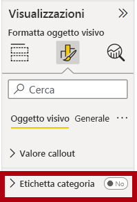

9. Impostare la proprietà **Colore di sfondo** su una sfumatura chiara del grigio.

10. Aggiungere un oggetto visivo **Tabella** alla pagina, quindi ridimensionarlo e posizionarlo in modo che si trovi sotto l'oggetto visivo scheda e riempia lo spazio rimanente sulla pagina.

    

    

11. Aggiungere i campi seguenti all'oggetto visivo:

    - Product \| Subcategory

    - Product \| Color

    - Sales \| Quantity

    - Sales \| Sales

    - Sales \| Profit Margin

12. Configurare le opzioni di formato per l'oggetto visivo e nella sezione **Valori** impostare la proprietà **Dimensione testo** su **20pt**.

    *La progettazione della pagina di drill-through è quasi completa. Nell'esercizio successivo si apporteranno miglioramenti alla pagina con la formattazione condizionale.*

## **Esercizio 3: Aggiungere la formattazione condizionale**

In questo esercizio la pagina di drill-through verrà ottimizzata con la formattazione condizionale. Completata la progettazione, la pagina sarà simile alla seguente:

### **Attività 1: Aggiungere la formattazione condizionale**

In questa attività la pagina di drill-through verrà ottimizzata con la formattazione condizionale.

1. Selezionare l'oggetto visivo tabella.

2. Nel riquadro della visualizzazione fare clic sulla freccia rivolta verso il basso del valore **Profit Margin** e quindi selezionare **Formattazione condizionale \| Icone**.

    

3. Nella finestra **Icone - Profit Margin** selezionare **A destra dei dati** nell'elenco a discesa **Layout icona**.

    

4. Per eliminare la regola intermedia, fare clic su **X** a sinistra del triangolo giallo.

    

5. Configurare la prima regola (rombo rosso) come indicato di seguito:

    - Nel secondo controllo rimuovere il valore

    - Nel terzo controllo selezionare **Numero**

    - Nel quinto controllo immettere **0**

    - Nel sesto controllo selezionare **Numero**

6. Configurare la seconda regola (cerchio verde) come indicato di seguito:

    - Nel secondo controllo immettere **0**

    - Nel terzo controllo selezionare **Numero**

    - Nel quinto controllo rimuovere il valore

    - Nel sesto controllo selezionare **Numero**

    

    *Le regole possono essere interpretate come segue: visualizzare un rombo rosso se il valore del margine di profitto è minore di 0, in caso contrario, se il valore è maggiore o uguale a zero, visualizzare un cerchio verde.*

7. Fare clic su **OK**.

    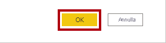

8. Nell'oggetto visivo tabella verificare che siano visualizzate le icone corrette.

    

9. Configurare la formattazione condizionale del colore di sfondo per il campo **Colore**.

10. Nella finestra **Colore di sfondo - Colore** selezionare **Valore campo** nell'elenco a discesa **Stile formato**.

    

11. Nell'elenco a discesa **Specificare il campo su cui basare questo elemento** selezionare **Product \| Formattazione \| Formato del colore di sfondo**.

    

12. Fare clic su **OK**.

    

13. Ripetere i passaggi precedenti per configurare la formattazione condizionale del colore del carattere per il campo **Colore** usando il campo **Product \| Formattazione \| Formato del colore del carattere**

    *Si ricorderà che i colori dello sfondo e del tipo di carattere sono stati originati dal file **ColorFormats.csv** nel lab **Preparare i dati in Power BI Desktop** e quindi integrati con la query **Product** nel lab **Caricare i dati in Power BI Desktop**.*

## **Esercizio 4: Aggiungere segnalibri e pulsanti**

In questo esercizio la pagina **My Performance** viene ottimizzata con pulsanti che consentono all'utente del report di selezionare il tipo di oggetto visivo da visualizzare. Completata la progettazione, la pagina sarà simile alla seguente:

### **Attività 1: Aggiungere segnalibri**

In questa attività verranno aggiunti due segnalibri, per visualizzare gli oggetti visivi relativi alle vendite e agli obiettivi mensili.

1. Passare alla pagina **My Performance**.

2. Nella scheda della barra multifunzione **Visualizza** fare clic su **Segnalibri** all'interno del gruppo **Mostra riquadri**.

    

3. Nella scheda della barra multifunzione **Visualizza** fare clic su **Selezione** all'interno del gruppo **Mostra riquadri**.

    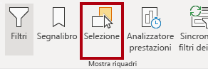

4. Nel riquadro **Selezione** fare clic sull'icona a forma di occhio accanto a uno degli elementi **Sales and Target by Month** per nascondere l'oggetto visivo.

    

5. Nel riquadro **Segnalibri** fare clic su **Aggiungi**.

    

6. Fare doppio clic sul segnalibro per rinominarlo.

7. Se il grafico visibile è un grafico a barre, rinominare il segnalibro in **Bar Chart ON**, se invece è un istogramma, rinominarlo in **Column Chart ON**.

8. Per modificare il segnalibro, nel riquadro **Segnalibri** posizionare il cursore sul segnalibro, fare clic sui puntini di sospensione e quindi selezionare **Dati**.

    

    *Disabilitando l'opzione **Dati**, il segnalibro non userà lo stato del filtro corrente. È importante tenerlo presente perché in caso contrario il segnalibro bloccherà in modo permanente il filtro attualmente applicato dal filtro dei dati **Year**.*

9. Per aggiornare il segnalibro, fare di nuovo clic sui puntini di sospensione e quindi selezionare **Aggiorna**.

    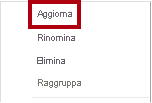

    *Nei passaggi seguenti si creerà e si configurerà un secondo segnalibro per visualizzare il secondo oggetto visivo.*

10. Nel riquadro **Selezione** attivare e disattivare la visibilità dei due elementi **Sales and Target by Month**.

    *In altre parole, nascondere l'oggetto visivo visibile e rendere visibile l'oggetto visivo nascosto.*

    

11. Creare un secondo segnalibro e denominarlo in modo appropriato (**Column Chart ON** o **Bar Chart ON).**

    

12. Configurare il secondo segnalibro in modo da ignorare i filtri (opzione **Dati** disattivata) e aggiornare il segnalibro.

13. Nel riquadro **Selezione** è sufficiente visualizzare l'oggetto visivo nascosto per rendere visibili entrambi gli oggetti visivi.

14. Ridimensionare e riposizionare entrambi gli oggetti visivi in modo che riempiano la pagina sotto l'oggetto visivo a più schede e si sovrappongano completamente l'uno all'altro.

    *Suggerimento: per selezionare l'oggetto visivo coperto, selezionarlo nel riquadro **Selezione**.*

    

15. Nel riquadro **Segnalibri** selezionare ognuno dei segnalibri e verificare che è visibile solo uno degli oggetti visivi.

    *La fase successiva della progettazione prevede l'aggiunta di due pulsanti alla pagina, in modo da consentire all'utente del report di selezionare i segnalibri.*

### **Attività 2: Aggiungere pulsanti**

In questa attività verranno aggiunti due pulsanti e a ognuno di essi verranno assegnate azioni segnalibro.

1. Sulla barra multifunzione **Inserisci** fare clic su **Pulsante** all'interno del gruppo **Elementi** e quindi selezionare **Vuoto**.

    

2. Posizionare il pulsante direttamente sotto il filtro dei dati **Year**.

3. Selezionare il pulsante e quindi nel riquadro **Pulsante Formato** fare clic su **Generale** e impostare la proprietà **Titolo** su **Sì**.

    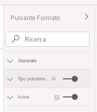

4. Espandere la sezione **Titolo** e quindi immettere **Bar Chart** nella casella **Testo**.

5. Espandere la sezione **Sfondo** e quindi impostare un colore complementare come colore di sfondo.

6. Fare clic su **Pulsante** e impostare la proprietà **Action** su **Sì**.

    

7. Espandere la sezione **Azione**, quindi impostare l'elenco a discesa **Tipo** su **Segnalibro**.

8. Nell'elenco a discesa **Segnalibro** selezionare **Bar Chart ON**.

    

9. Creare una copia del pulsante con un'operazione di copia e incolla, quindi configurare il nuovo pulsante come segue:

    *Suggerimento: i tasti di scelta rapida per le operazioni di copia e incolla sono **CTRL+C** seguito da **CTRL+V**.*

    - Impostare la proprietà **Testo pulsante** su **Istogramma**

    - Nella sezione **Azione** impostare l'elenco a discesa **Segnalibro** su **Column Chart ON**

    *La progettazione del report Sales Analysis è stata completata.*

### **Attività 3: Pubblicare il report**

In questa attività si pubblicherà il report.

1. Selezionare la pagina di **panoramica**.

2. Nel filtro dei dati **Year** selezionare **FY2020**.

3. Nel filtro dei dati **Region** selezionare **Select All**.

4. Salvare il file di Power BI Desktop.

    *Il file deve essere sempre salvato prima della pubblicazione nel servizio Power BI.*

5. Nella scheda della barra multifunzione **Home** fare clic su **Pubblica** nel gruppo **Condividi**.

    

6. Nella finestra **Pubblica in Power BI** si noti che l'opzione **Area di lavoro** è selezionata.

7. Per pubblicare il report, fare clic su **Seleziona**.

    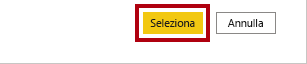

8. Se viene richiesto di sostituire il set di dati, fare clic su **Sostituisci**.

9. Al termine della pubblicazione, fare clic su **Chiudi**.

    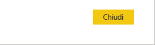

10. Chiudere Power BI Desktop.

    *Nell'esercizio successivo si esplorerà il report nel servizio Power BI.*

## **Esercizio 5: Esplorare il report**

In questo esercizio si esaminerà il report nel servizio Power BI.

### **Attività 1: Esplorare il report**

In questa attività si esaminerà il report nel servizio Power BI.

1. Nella finestra del browser Microsoft Edge, nel servizio Power BI, nel riquadro **Navigazione** selezionare **Area di lavoro personale** e quindi fare clic sul report **Sales Analysis**.

2. Per testare il report di drill-through, nella pagina **Overview**, nell'oggetto visivo **Quantity by category** fare clic con il pulsante destro del mouse sulla barra **Clothing** e quindi scegliere **Drill-through \| Product Details**.

    

3. Si noti che la pagina **Product Details** fa riferimento a **Clothing**.

4. Per tornare alla pagina di origine, fare clic sul pulsante freccia nell'angolo superiore sinistro della pagina.

5. Selezionare la pagina **My Performance**.

6. Fare clic su ognuno dei pulsanti e verificare che venga visualizzato un oggetto visivo diverso.

### **Attività 2: Completare il lab**

In questa attività si completerà il lab.

1. Per tornare all'area di lavoro, nel banner della pagina Web della finestra fare clic su **Area di lavoro personale**.

    

2. Lasciare aperta la finestra del browser Microsoft Edge.
