---
lab:
  title: Migliorare un report in Power BI Desktop
  module: 7 - Create Reports
---

# Migliorare un report in Power BI Desktop

**Il tempo stimato per il completamento del lab è di 45 minuti.**

In questo lab si migliorerà **l'analisi vendite** con funzionalità di progettazione avanzate.

Contenuto del lab:

- Sincronizzare i filtri dei dati
- Creare una pagina di drill-through
- Applicare la formattazione condizionale
- Creare e usare i segnalibri

### **Presentazione del lab**

Questo lab fa parte di una serie che comprende molti lab progettati come attività completa, dalla preparazione dei dati alla pubblicazione come report e dashboard. È possibile completare i lab nell'ordine desiderato. Se tuttavia si intende seguire più lab, è consigliabile procedere in questo ordine:

1. Preparare i dati in Power BI Desktop
1. Caricare i dati in Power BI Desktop
1. Progettare un modello di dati in Power BI
1. Creare calcoli DAX in Power BI Desktop
1. Creare calcoli DAX avanzati in Power BI Desktop
1. Progettare un report in Power BI Desktop
1. **Migliorare un report in Power BI Desktop**
1. Eseguire l'analisi dei dati in Power BI
1. Creare un dashboard di Power BI
1. Applicare la sicurezza a livello di riga

## **Esercizio 1: Configurare i filtri dei dati sincronizzati**

In questo esercizio si sincronizzano i filtri dei dati della pagina del report.

### Attività 1: Operazioni preliminari - Accesso

In questa attività verrà configurato l'ambiente per il lab accedendo a Power BI.

*Nota: se si è già eseguito l'accesso a Power BI, passare all'attività successiva.*

1. Per aprire Microsoft Edge, sulla barra delle applicazioni selezionare il collegamento al programma Microsoft Edge.

     

1. Nella finestra del browser Microsoft Edge passare a **https://app.powerbi.com**.

    *Suggerimento: è anche possibile usare l'elemento preferito Servizio Power BI sulla barra dei preferiti di Microsoft Edge.*

1. Completare il processo di accesso con le credenziali dell'organizzazione (o quelle fornite all'utente). Se in Microsoft Edge viene chiesto se restare connessi, selezionare **Sì**.

1. Nella finestra del browser Microsoft Edge, nel servizio Power BI, nel riquadro **Navigazione** espandere **Area di lavoro personale**. Lasciare aperta la finestra del browser Microsoft Edge.

     

### Attività 2: Operazioni preliminari - Aprire il report

In questa attività verrà configurato l'ambiente per il lab aprendo il report iniziale.

*Importante: se si continua dal lab precedente (e il lab è stato completato correttamente), non completare questa attività; passare invece all'attività successiva.*

1. Aprire Power BI Desktop.

    

    *Suggerimento: per impostazione predefinita, la finestra di dialogo Introduzione viene aperta davanti a Power BI Desktop. È possibile scegliere di accedere e quindi chiudere il popup.*

1. Per aprire il file di Power BI Desktop iniziale, selezionare il file **> Apri report > Sfoglia report**.

1. Nella finestra **Apri** passare alla cartella **D:\PL300\Labs\07-design-report-in-power-bi-desktop-enhanced\Starter** e aprire il file **Di analisi vendite** .

1. Chiudere eventuali finestre aperte di carattere informativo.

1. Si noti il messaggio di avviso giallo sotto la barra multifunzione. 

    *Questo messaggio avvisa il fatto che le query non sono state applicate al caricamento come tabelle modello. Le query verranno applicate più avanti in questo lab.*

    *Per ignorare il messaggio di avviso, a destra del messaggio di avviso giallo selezionare **X**.*

1. Per creare una copia del file, passare a **File > Salva con** nome e salvare nella cartella **D:\PL300\MySolution** .

1. Se viene richiesto di applicare le modifiche, selezionare **Applica più tardi**.

### **Attività 3: Sincronizzare i filtri dei dati**

In questa attività si sincronizzano i filtri dei dati **Year** and **Region**, continuando lo sviluppo del report creato nel lab **Design a Report in Power BI Desktop** lab.

1. In Power BI Desktop, nella pagina **Overview** impostare il filtro dei dati **Year** su **FY2018**.

1. Passare alla pagina **My Performance** e osservare che il filtro dei dati **Year** è un valore diverso.
    
    *Quando i filtri dei dati non vengono sincronizzati, può contribuire alla rappresentazione errata dei dati e alla frustrazione per gli utenti del report. A questo punto si sincronizzano i filtri dei dati del report.*

1. Tornare alla pagina **Overview** e quindi selezionare il filtro dei dati **Year**.

1. Nella scheda della barra multifunzione **Visualizza** selezionare **Sincronizza filtri dei dati** all'interno del gruppo **Mostra riquadri**.

     

1. Nel riquadro **Sincronizza filtri dei dati** (a sinistra del riquadro **Visualizzazioni**), nella seconda colonna (che rappresenta la sincronizzazione) selezionare le caselle di controllo per le pagine **Overview** e **My Performance**.

     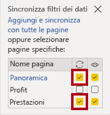

1. Nella pagina **Overview** selezionare il filtro dei dati **Region**.

1. Sincronizzare il filtro dei dati con le pagine **Overview** e **Profit**.

     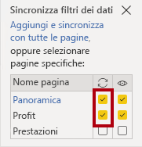

1. Testare i filtri dei dati sincronizzati selezionando altre opzioni di filtro e quindi verificando che i filtri dei dati sincronizzati vengano filtrati in base alla stessa selezione.

1. Per chiudere la pagina **Sincronizza filtri dei dati**, selezionare la **X** in alto a destra nel riquadro.

## **Esercizio 2: Configurare il drill-through**

In questo esercizio verrà creata una nuova pagina e configurata come pagina di drill-through. Completata la progettazione, la pagina sarà simile alla seguente:

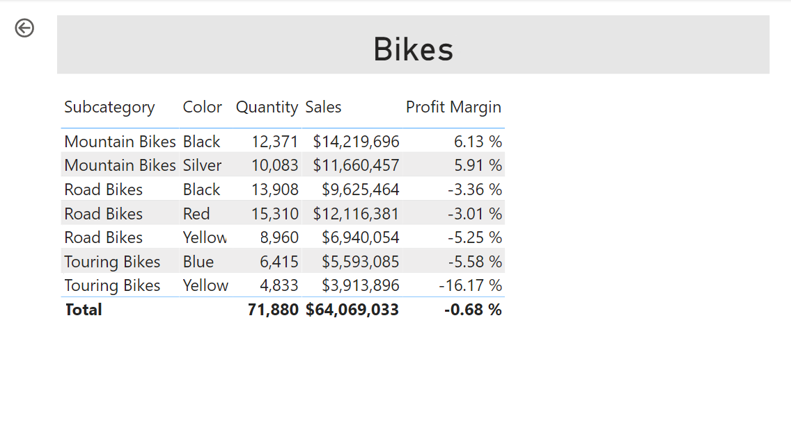

### **Attività 1: Creare una pagina di drill-through**

In questa attività verrà creata una nuova pagina e configurata come pagina di drill-through.

1. Aggiungere una nuova pagina del report denominata **Product Details**.

1. Fare clic con il pulsante destro del mouse sulla scheda della pagina **Product Details**, quindi selezionare **Nascondi pagina**.
    
    *Gli utenti del report non potranno accedere direttamente alla pagina di drill-through. Dovranno accedervi dagli oggetti visivi in altre pagine. Si apprenderà come eseguire il drill-through fino alla pagina nell'esercizio finale di questo lab.*

1. Sotto il riquadro **Visualizzazioni**, nella sezione **Drill-through** aggiungere il campo **Product \| Category** alla casella **Aggiungere i campi di drill-through qui**.
    
    *Nei lab viene usata una notazione abbreviata per fare riferimento a un campo, simile al seguente: **Product \| Category**. In questo esempio **Product** è il nome della tabella e **Category** è il nome del campo.*

     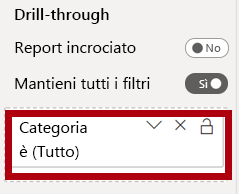

1. Per testare la pagina di drill-through, nella scheda del filtro di drill-through selezionare **Bikes**.

     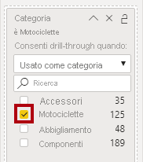

1. Si noti il pulsante freccia in alto a sinistra nella pagina del report.
    
    *Un pulsante freccia viene aggiunto automaticamente quando un campo viene aggiunto al drill-through well/area. Consente agli utenti del report di tornare alla pagina da cui hanno eseguito il drill-through.*

1. Aggiungere un oggetto visivo **Scheda** alla pagina, quindi ridimensionarlo e posizionarlo in modo che si trovi a destra del pulsante e riempia la larghezza rimanente della pagina.

    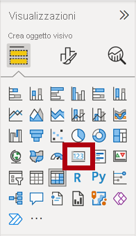

    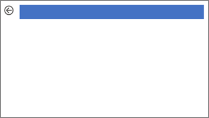

1. Trascinare il campo **Product \| Category** nell'oggetto visivo scheda.

1. Configurare le opzioni di formato per l'oggetto visivo, quindi **disattivare** la proprietà **Etichetta categoria**.

     

1. Impostare la proprietà **Effetti > colore di sfondo** su un colore chiaro di grigio, ad esempio *Bianco, 20% più scuro*.

     

1. Aggiungere un oggetto visivo **Tabella** alla pagina, quindi ridimensionarlo e posizionarlo in modo che si trovi sotto l'oggetto visivo scheda e riempia lo spazio rimanente sulla pagina.

     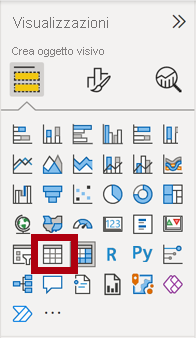

     

1. Aggiungere i campi seguenti all'oggetto visivo:

     - Product \| Subcategory
     - Product \| Color
     - Sales \| Quantity
     - Sales \| Sales
     - Sales \| Profit Margin

1. Configurare le opzioni di formato per l'oggetto visivo e nella sezione **Valori** impostare la proprietà **Dimensione testo** su **20pt**.

*La progettazione della pagina di drill-through è quasi completa. Nell'esercizio successivo si apporteranno miglioramenti alla pagina con la formattazione condizionale.*

## **Esercizio 3: Aggiungere la formattazione condizionale**

In questo esercizio verrà migliorato il drill-through della pagina con la formattazione condizionale. Completata la progettazione, la pagina sarà simile alla seguente:

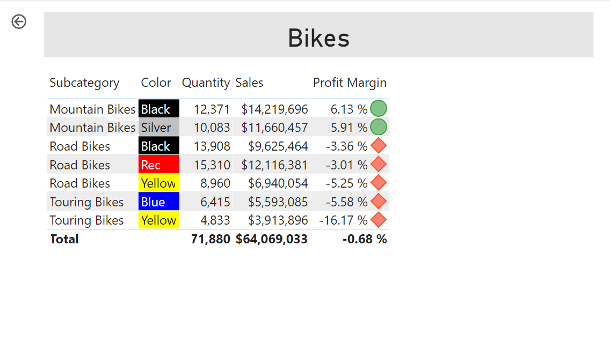

### **Attività 1: Aggiungere la formattazione condizionale**

In questa attività verrà migliorato il drill-through della pagina con la formattazione condizionale.

1. Selezionare l'oggetto visivo tabella. Nel riquadro di visualizzazione selezionare la freccia giù sul valore **Profit Margin** e quindi selezionare **Icone di \| formattazione condizionale**.

    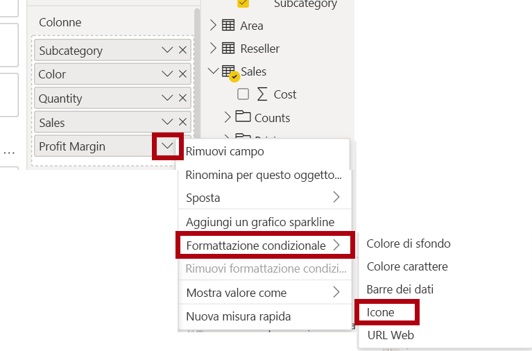

1. Nella finestra **Icone - Profit Margin** selezionare **A destra dei dati** nell'elenco a discesa **Layout icona**.

     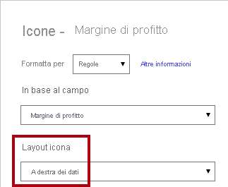

1. Per eliminare la regola centrale, a destra del triangolo giallo selezionare **X**.

     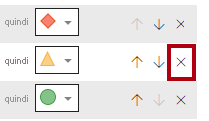

1. Configurare la prima regola (rombo rosso) come indicato di seguito:

    - Nel secondo controllo rimuovere il valore
    - Nel terzo controllo selezionare **Numero**
    - Nel quinto controllo immettere **0**
    - Nel sesto controllo selezionare **Numero**

1. Configurare la seconda regola (cerchio verde) come indicato di seguito, quindi selezionare **OK**:
    
    *Le regole possono essere interpretate come segue: visualizzare un rombo rosso se il valore del margine di profitto è minore di 0, in caso contrario, se il valore è maggiore o uguale a zero, visualizzare un cerchio verde.*

     - Nel secondo controllo immettere **0**
     - Nel terzo controllo selezionare **Numero**
     - Nel quinto controllo rimuovere il valore
     - Nel sesto controllo selezionare **Numero**

     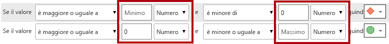

1. Nell'oggetto visivo tabella verificare che vengano visualizzate le icone corrette.

     

1. Configurare la formattazione condizionale del colore di sfondo per il campo **Colore**.

1. Nella finestra **Colore di sfondo - Colore** selezionare **Valore campo** nell'elenco a discesa **Stile formato**.

1. Nell'elenco a discesa **Quale campo dovremmo basarci su?** selezionare **Formato colore sfondo formattazione \| prodotto\|**, quindi **OK**.

     

1. Ripetere i passaggi precedenti per configurare la formattazione condizionale del colore del carattere per il campo **Colore** usando il campo **Product \| Formattazione \| Formato del colore del carattere**

*Si ricorderà che i colori dello sfondo e del tipo di carattere sono stati originati dal file **ColorFormats.csv** nel lab **Preparare i dati in Power BI Desktop** e quindi integrati con la query **Product** nel lab **Caricare i dati in Power BI Desktop**.*

## **Esercizio 4: Aggiungere segnalibri e pulsanti**

In questo esercizio si migliorerà la pagina **Prestazioni** personali con i pulsanti, consentendo all'utente del report di selezionare il tipo di oggetto visivo da visualizzare. Completata la progettazione, la pagina sarà simile alla seguente:

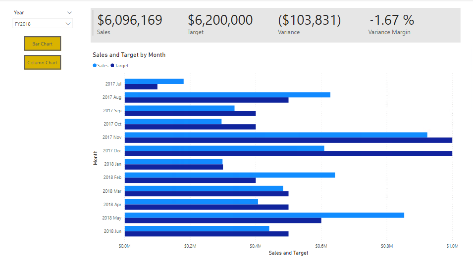

### **Attività 1: Aggiungere segnalibri**

In questa attività si aggiungeranno due segnalibri, uno per visualizzare ognuno degli oggetti visivi mensili di vendita/destinazioni.

1. Passare alla pagina **My Performance**. Nella scheda della barra multifunzione **Visualizza** selezionare **Segnalibri** all'interno del gruppo **Mostra riquadri**.

     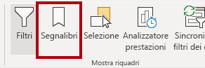

1. Nella scheda della barra multifunzione **Visualizza** selezionare **Selezione** all'interno del gruppo **Mostra riquadri**.

1. Nel riquadro **Selezione** selezionare l'icona a forma di occhio accanto a uno degli elementi **Sales and Target by Month** per nascondere l'oggetto visivo.

     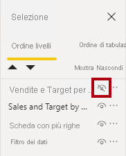

1. Nel riquadro **Segnalibri** selezionare **Aggiungi**.
    
    *Fare doppio clic sul segnalibro per rinominarlo.*

     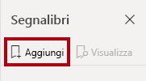

1. Se il grafico visibile è un grafico a barre, rinominare il segnalibro in **Bar Chart ON**, se invece è un istogramma, rinominarlo in **Column Chart ON**.

1. Per modificare il segnalibro, nel riquadro **Segnalibri** passare il cursore sul segnalibro, selezionare i puntini di sospensione e quindi selezionare **Dati**.
     
     *Disabilitando l'opzione **Dati**, il segnalibro non userà lo stato del filtro corrente. È importante tenerlo presente perché in caso contrario il segnalibro bloccherà in modo permanente il filtro attualmente applicato dal filtro dei dati **Year**.*

     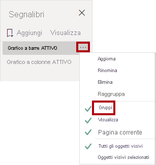

1. Per aggiornare il segnalibro, selezionare di nuovo i puntini di sospensione e quindi selezionare **Aggiorna**.
     
     *Nei passaggi seguenti si creerà e si configurerà un secondo segnalibro per visualizzare il secondo oggetto visivo.*

1. Nel riquadro **Selezione** attivare e disattivare la visibilità dei due elementi **Sales and Target by Month**.
     
     *In altre parole, nascondere l'oggetto visivo visibile e rendere visibile l'oggetto visivo nascosto.*

     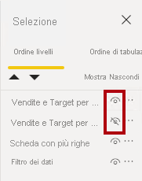

1. Creare un secondo segnalibro e denominarlo in modo appropriato (**Column Chart ON** o **Bar Chart ON).**

     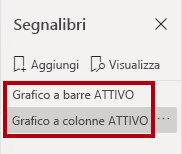

1. Configurare il secondo segnalibro in modo da ignorare i filtri (opzione**Dati** disattivata) e aggiornare il segnalibro.

1. Nel riquadro **Selezione** è sufficiente visualizzare l'oggetto visivo nascosto per rendere visibili entrambi gli oggetti visivi.

1. Ridimensionare e riposizionare entrambi gli oggetti visivi in modo che riempiano la pagina sotto l'oggetto visivo a più schede e si sovrappongano completamente l'uno all'altro.
    
    *Per selezionare l'oggetto visivo coperto, selezionarlo nel riquadro **Selezione** .*

    

1. Nel riquadro **Segnalibri** selezionare ognuno dei segnalibri e verificare che è visibile solo uno degli oggetti visivi.

*La fase successiva della progettazione prevede l'aggiunta di due pulsanti alla pagina, in modo da consentire all'utente del report di selezionare i segnalibri.*

### **Attività 2: Aggiungere pulsanti**

In questa attività si aggiungeranno due pulsanti e si assegnano azioni segnalibro a ognuna.

1. Sulla barra multifunzione **Inserisci** selezionare **Pulsante** all'interno del gruppo **Elementi** e quindi selezionare **Vuoto**.

     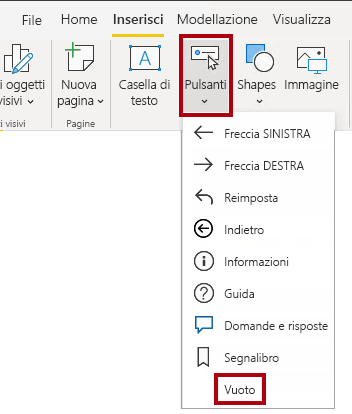

1. Posizionare il pulsante direttamente sotto il filtro dei dati **Year**.

1. Selezionare il pulsante e quindi nel riquadro Pulsante **Formato** selezionare **Pulsante**, espandere **La sezione Stile** e attivare la proprietà **Text****.**

     

1. Espandere la sezione **Testo** e quindi nella casella **Di testo** immettere **Grafico a barre**.

1. Espandere la sezione **Riempimento** e quindi impostare un colore di riempimento usando un colore complementare.

1. Selezionare **Pulsante** e attivare la proprietà **Action****.**

    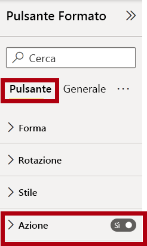

1. Espandere la sezione **Azione**, quindi impostare l'elenco a discesa **Tipo** su **Segnalibro**.

1. Nell'elenco a discesa **Segnalibro** selezionare **Bar Chart ON**.

    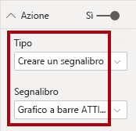

1. Creare una copia del pulsante con un'operazione di copia e incolla, quindi configurare il nuovo pulsante come segue:

    *Suggerimento: i tasti di scelta rapida per le operazioni di copia e incolla sono **CTRL+C** seguito da **CTRL+V**.*

    - Impostare la proprietà **Testo pulsante** su **Istogramma**
    - Nella sezione **Azione** impostare l'elenco a discesa **Segnalibro** su **Column Chart ON**

*La progettazione del report Sales Analysis è stata completata.*

### **Attività 3: Pubblicare il report**

In questa attività verrà pubblicato il report.

1. Selezionare la pagina di **panoramica**.

1. Nel filtro dei dati **Year** selezionare **FY2020**.

1. Nel filtro dei dati **Region** selezionare **Select All**.

1. Salvare il file di Power BI Desktop.
    
    *Il file deve essere sempre salvato prima della pubblicazione nel servizio Power BI.*

1. Nella scheda della barra multifunzione **Home** selezionare **Pubblica** all'interno del gruppo **Condividi**.

     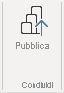

1. Nella finestra **Pubblica in Power BI** si noti che l'opzione **Area di lavoro** è selezionata.

1. Per pubblicare il report, **selezionare Seleziona**.
    1. Se viene richiesto di sostituire il set di dati, selezionare **Sostituisci**.
    1. Al termine della pubblicazione, fare clic su **Chiudi**.

1. Chiudere Power BI Desktop.

*Nell'esercizio successivo si esplorerà il report nel servizio Power BI.*

## **Esercizio 5: Esplorare il report**

In questo esercizio si esaminerà il report nella servizio Power BI.

### **Attività 1: Esplorare il report**

In questa attività si esaminerà il report nella servizio Power BI.

1. In una finestra del browser Microsoft Edge passare alla servizio Power BI > Area **di lavoro** personale e quindi selezionare il report **Analisi vendite**.

1. Per testare la funzionalità di drill-through, passare alla pagina **Panoramica** > **Quantità per** oggetto visivo Categoria. Fare quindi clic con il pulsante destro del mouse sulla barra **abbigliamento** e selezionare **Drill-Through Product Details (Dettagli prodotto drill-through\|**).

     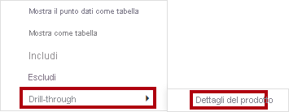

1. Si noti che la pagina **Product Details** fa riferimento a **Clothing**.

1. Per tornare alla pagina di origine, nell'angolo superiore sinistro della pagina selezionare il pulsante freccia.

1. Selezionare la pagina **My Performance**.
    
    *Selezionare ognuno dei pulsanti e verificare che venga visualizzato un oggetto visivo diverso.*

### **Attività 2: Completare il lab**

In questa attività si completerà il lab.

Per tornare all'area di lavoro, nel banner nella pagina Web della finestra selezionare **Area di lavoro personale**.

 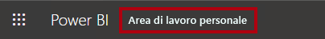
