---
lab:
  title: Creare un dashboard di Power BI
  module: Module 8 - Create Dashboards
---

# **Creare un dashboard di Power BI**

**Il tempo stimato per il completamento del lab è di 45 minuti**

In questo lab si creerà il dashboard **Sales Monitoring**.

Contenuto del lab:

- Aggiungere oggetti visivi a un dashboard

- Usare Domande e risposte per creare riquadri del dashboard

### **Presentazione del lab**

Questo lab fa parte di una serie che comprende molti lab progettati come attività completa, dalla preparazione dei dati alla pubblicazione come report e dashboard. È possibile completare i lab nell'ordine desiderato. Se tuttavia si intende seguire più lab, per i primi 10 è consigliabile procedere in questo ordine:

1. Preparare i dati in Power BI Desktop

2. Caricare i dati in Power BI Desktop

3. Modellare i dati in Power BI Desktop

5. Creare calcoli DAX in Power BI Desktop - Parte 1

6. Creare calcoli DAX in Power BI Desktop - Parte 2

7. Progettare un report in Power BI Desktop - Parte 1

8. Progettare un report in Power BI Desktop - Parte 2

9. **Creare un dashboard di Power BI**

10. Eseguire l'analisi dei dati in Power BI Desktop

11. Applicare la sicurezza a livello di riga

## **Esercizio 1: Creare un dashboard**

In questo esercizio si creerà il dashboard **Sales Monitoring**. Il dashboard completato sarà simile al seguente:

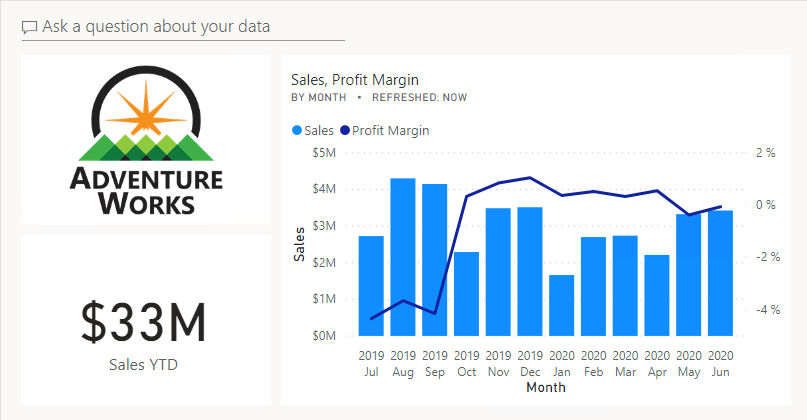

### **Attività 1: Operazioni preliminari - Accesso**

In questa attività si accederà a Power BI per configurare l'ambiente per il lab.

*Importante: se l'accesso a Power BI è già stato effettuato in un lab precedente, passare all'attività successiva.*

1. Per aprire Microsoft Edge, sulla barra delle applicazioni fare clic sul collegamento al programma Microsoft Edge.

    

2. Nella finestra del browser Microsoft Edge passare a **https://powerbi.com**.

    *Suggerimento: è anche possibile usare l'elemento preferito Servizio Power BI sulla barra dei preferiti di Microsoft Edge.*

3. Fare clic su **Accedi** (nell'angolo in alto a destra).

    

4. Immettere i dettagli dell'account ricevuti.

5. Se viene chiesto di aggiornare la password, immettere di nuovo la password ricevuta e quindi immettere e confermare una nuova password.

    *Importante: assicurarsi di registrare la nuova password.*

6. Completare il processo di accesso.

7. Se in Microsoft Edge viene chiesto se restare connessi, fare clic su **Sì**.

8. Nella finestra del browser Microsoft Edge, nel servizio Power BI, nel riquadro **Navigazione** espandere **Area di lavoro personale**.

    

9. Lasciare aperta la finestra del browser Microsoft Edge.

### **Attività 2: Operazioni preliminari - Aprire il report**

In questa attività si aprirà il report iniziale per configurare l'ambiente per il lab.

*Importante: se si sta continuando dal lab precedente (e il lab è stato completato correttamente), non completare questa attività, ma passare a quella successiva.*

1. Per aprire Power BI Desktop, sulla barra delle applicazioni fare clic sul collegamento Microsoft Power BI Desktop.

    

2. Per chiudere la finestra introduttiva, fare clic su **X** nella parte superiore sinistra della finestra.

    

3. Se Power BI Desktop non è connesso al servizio Power BI, fare clic su **Accedi** in alto a destra.

    

4. Completare il processo di accesso con lo stesso account usato per accedere al servizio Power BI.

5. Per aprire il file di avvio di Power BI Desktop, selezionare la scheda della barra multifunzione **File** per aprire la visualizzazione Backstage.

6. Selezionare **Apri report**.

    

7. Fare clic su **Sfoglia report**.

    

8. Nella finestra **Apri** passare alla cartella **D:\PL300\Labs\09-create-power-bi-dashboard\Starter**.

9. Selezionare il file **Sales Analysis**.

10. Fare clic su **Apri**.

    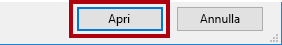

11. Chiudere eventuali finestre aperte di carattere informativo.

12. Per creare una copia del file, fare clic sulla scheda della barra multifunzione **File** per aprire la visualizzazione Backstage.

13. Selezionare **Salva con nome**.

    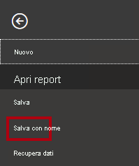

14. Se viene richiesto di applicare le modifiche, fare clic su **Applica**.

    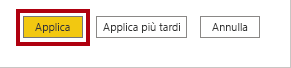

15. Nella finestra **Salva con nome** passare alla cartella **D:\PL300\MySolution**.

16. Fare clic su **Save** (Salva).

    

### **Attività 3: Operazioni preliminari - Pubblicare il report**

In questa attività si creerà un set di dati per configurare l'ambiente per il lab.

*Importante: se si è già pubblicato il report nel lab **Progettare un report in Power BI Desktop - Parte 2**, passare all'attività successiva.*

1. Nella finestra del browser Microsoft Edge, nel servizio Power BI, nel riquadro **Navigazione** fare clic su **Recupera dati** nella parte inferiore.

    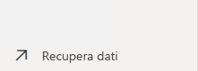

2. Nel riquadro **File** fare clic su **Recupera**.

    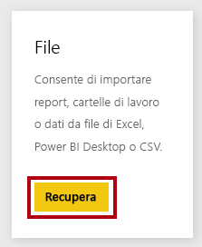

3. Fare clic sul riquadro **File locale**.

    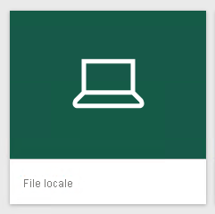

4. Nella finestra **Apri** passare alla cartella **D:\PL300\Labs\08-design-report-in-power-bi-desktop-enhanced\Solution**.

5. Selezionare il file **Sales Analysis.pbix** e quindi fare clic su **Apri**.

6. Se viene richiesto di sostituire il set di dati, fare clic su **Sostituisci**.

### **Attività 4: Creare un dashboard**

In questa attività verrà creato il dashboard **Sales Monitoring**. Si aggiungerà un oggetto visivo dal report e si aggiungerà un riquadro in base a un URI di dati dell'immagine e si userà Domande e risposte per creare un riquadro.

1. Nella finestra del browser Microsoft Edge aprire il report **Sales Analysis** nel servizio Power BI.

2. Nella pagina **Overview** impostare il filtro dei dati **Year** su **FY2020**.

    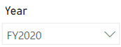

3. Impostare il filtro dei dati **Region** su **Select All**.

    *Quando si aggiungono gli oggetti visivi a un dashboard, verrà usato il contesto di filtro corrente. Dopo essere stato aggiunto, il contesto di filtro non può essere modificato. Per i filtri basati sul tempo, è consigliabile usare un filtro dei dati per la data relativa (oppure Domande e risposte con una domanda basata su un intervallo di tempo relativo).*

4. Per creare un dashboard e aggiungere un oggetto visivo, passare il cursore sull'oggetto visivo **Sales and Profit Margin by Month** (colonna/riga).

5. Nell'angolo superiore destro fare clic sulla puntina da disegno.

    

6. Nella finestra **Aggiungi al dashboard** nella casella **Nome del dashboard** immettere **Sales Monitoring**.

    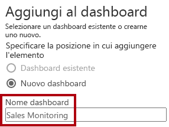

7. Fare clic su **Aggiungi**.

    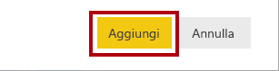

8. Aprire il riquadro **Navigazione** e quindi aprire il dashboard **Sales Monitoring**.

    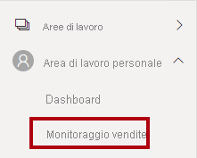

9. Si noti che il dashboard ha un solo riquadro.

    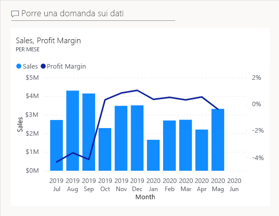

10. Per aggiungere un riquadro basato su una domanda, nella parte superiore sinistra del dashboard fare clic su **Porre una domanda sui dati**.

    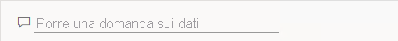

    *È possibile usare la funzionalità Domande e risposte per porre una domanda e ottenere una risposta di Power BI con un oggetto visivo.*

11. Fare clic su una delle domande suggerite sotto la casella Domande e risposte nelle caselle blu.

12. Esaminare la risposta.

13. Rimuovere tutto il testo dalla casella Domande e risposte.

14. Nella casella Domande e risposte immettere quanto segue: **Sales YTD**

    

15. Si noti la risposta **(Vuoto)**.

    

    *Si ricorderà di aver aggiunto la misura **Sales YTD** nel lab **Creare calcoli DAX in Power BI Desktop - Parte 2**. Questa misura è un'espressione della funzionalità di Business Intelligence per le gerarchie temporali, quindi richiede un filtro nella tabella **Date** per produrre un risultato.*

16. Estendere la domanda con: **in year FY2020**.

    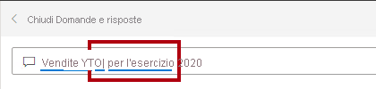

17. Si noti che la risposta è ora **$33M**.

    

18. Per aggiungere la risposta al dashboard, nell'angolo superiore destro fare clic su **Aggiungi oggetto visivo**.

    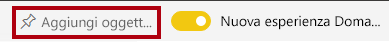

19. Quando viene richiesto di aggiungere il riquadro al dashboard, fare clic su **Aggiungi**.

    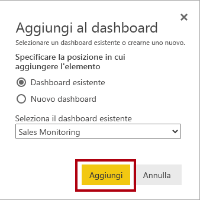

20. Per tornare al dashboard, nell'angolo superiore sinistro fare clic su **Chiudi Domande e risposte**.

    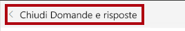

21. Per aggiungere il logo aziendale, sulla barra dei menu fare clic su **Modifica** e quindi selezionare **Aggiungi un riquadro**.

    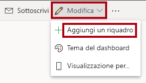

    *L'uso di questa tecnica per aggiungere un riquadro del dashboard consente di migliorare l'aspetto del dashboard con elementi multimediali, inclusi contenuti Web, immagini, caselle di testo in formato RTF e video (tramite collegamenti YouTube o Vimeo).*

22. Nel riquadro **Aggiungi un riquadro** (a destra) selezionare il riquadro **Immagine**.

    

23. Fare clic su **Avanti**.

    

24. Nel riquadro **Aggiungi riquadro immagine**, nella casella **URL** immettere l'URL completo trovato nel file **D:\PL300\Resources\AdventureWorksLogo_DataURL.txt**.

    *È possibile incorporare un'immagine usando il relativo URL oppure usando un URL di dati, che incorpora il contenuto inline.*

25. Nella parte inferiore del riquadro fare clic su **Applica**.

    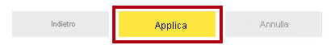

26. Per ridimensionare il riquadro del logo, trascinare l'angolo inferiore destro e ridimensionare il riquadro in modo che abbia una larghezza di un'unità e un'altezza di due unità.

    *Le dimensioni dei riquadri sono vincolate a una forma rettangolare. È possibile ridimensionare solo in multipli della forma rettangolare.*

27. Organizzare i riquadri in modo che il logo venga visualizzato in alto a sinistra, con il riquadro **Sales YTD** al di sotto e il riquadro **Sales, Profit Margin** a destra.

    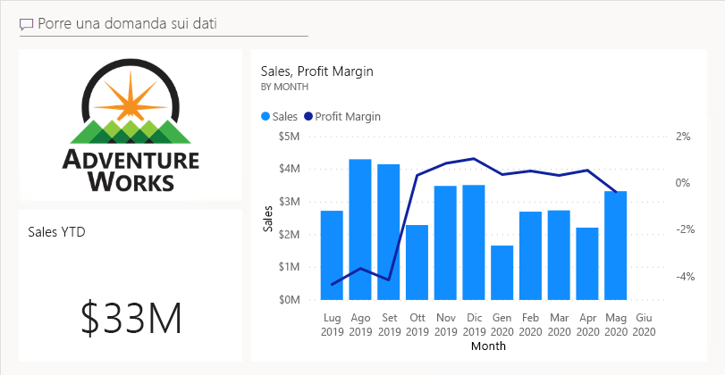

### **Attività 5: Modificare i dettagli del riquadro**

In questa attività verranno modificati i dettagli di due riquadri.

1. Posizionare il cursore sul riquadro **Sales YTD** e quindi nella parte superiore destra del riquadro fare clic sui puntini di sospensione e selezionare **Modifica dettagli**.

    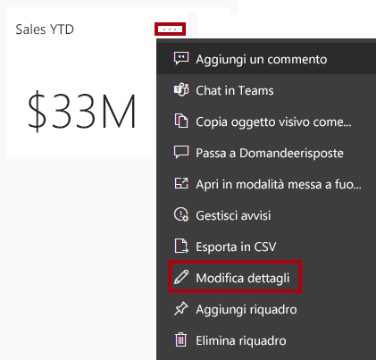

2. Nel riquadro **Dettagli riquadro** (a destra) nella casella **Sottotitolo** immettere **FY2020**.

    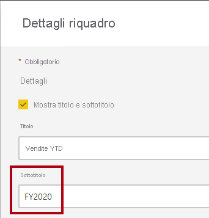

3. Fare clic su **Applica**.

    

4. Si noti che il riquadro **Sales YTD** visualizza un sottotitolo.

    

5. Modificare i dettagli per il riquadro **Sales, Profit Margin**.

6. Nel riquadro **Dettagli riquadro** nella sezione **Funzionalità** selezionare **Visualizza ora ultimo aggiornamento**.

    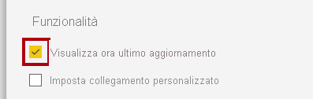

7. Fare clic su **Applica**.

    

8. Si noti che il riquadro descrive l'ora dell'ultimo aggiornamento effettuato durante il caricamento del modello di dati in Power BI Desktop.

    *Nell'esercizio successivo verrà aggiornato il set di dati. In genere questa operazione deve essere eseguita usando l'aggiornamento pianificato, nel qual caso Power BI può usare un gateway per connettersi al database SQL Server. Tuttavia, a causa dei vincoli nella configurazione della classe, non è presente alcun gateway. Per questo motivo si aprirà Power BI Desktop, si eseguirà un aggiornamento manuale dei dati e quindi si caricherà il file nell'area di lavoro.*

## **Esercizio 2: Aggiornare il set di dati**

In questo esercizio si caricheranno prima i dati degli ordini di vendita per giugno 2020 nel database **AdventureWorksDW2020**. Si aprirà quindi il file di Power BI Desktop, si eseguirà un aggiornamento dei dati e si caricherà il file nell'area di lavoro.

### **Attività 1: Aggiornare il database del lab**

In questa attività verrà eseguito uno script di PowerShell per aggiornare i dati nel database **AdventureWorksDW2020**.

1. In Esplora file, all'interno della cartella **D:\PL300\Setup** fare clic con il pulsante destro del mouse sul file **UpdateDatabase-2-AddSales.ps1** e quindi scegliere **Esegui con PowerShell**.

    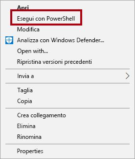

2. Se viene richiesto di modificare i criteri di esecuzione, premere**A**.

3. Quando viene richiesto di premere un tasto qualsiasi per chiudere, premere di nuovo **INVIO**.

    *Il database **AdventureWorksDW2020** include ora gli ordini di vendita effettuati a giugno 2020.*

### **Attività 2: Aggiornare il file di Power BI Desktop**

In questa attività si aprirà il file di Power BI Desktop **Sales Analysis**, si eseguirà un aggiornamento dei dati e quindi si caricherà il file nell'area di lavoro **Sales Analysis**.

1. Nel file di Power BI Desktop, nel riquadro **Campi** fare clic con il pulsante destro del mouse sulla tabella **Sales** e quindi scegliere **Aggiorna dati**.

    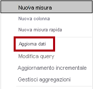

2. Al termine dell'aggiornamento, salvare il file di Power BI Desktop.

3. Per pubblicare il file nell'area di lavoro, nel gruppo **Condividi** della scheda della barra multifunzione **Home** fare clic su **Pubblica**.

    

4. Quando viene richiesto di sostituire il set di dati, fare clic su **Sostituisci**.

    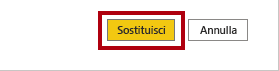

    *Il set di dati nel servizio Power BI include ora i dati sulle vendite di giugno 2020.*

5. Chiudere Power BI Desktop.

## **Esercizio 3: Esaminare il dashboard**

In questo esercizio si esaminerà il dashboard per verificare le vendite aggiornate e l'attivazione dell'avviso.

### **Attività 1: Esaminare il dashboard**

In questa attività si esaminerà il dashboard per verificare le vendite aggiornate e l'attivazione dell'avviso.

1. Nella finestra del browser Microsoft Edge esaminare il dashboard **Sales Monitoring** nel servizio Power BI.

2. Nel riquadro **Sales, Profit Margin** nel sottotitolo osservare che i dati sono stati aggiornati **ADESSO**.

3. Si noti anche che è ora disponibile una colonna **2020 Jun**.

    *Se i dati relativi a giugno 2020 non vengono visualizzati, potrebbe essere necessario premere **F5** per ricaricare il Web browser.*

    

    *Dovrebbe essere stato attivato anche l'avviso nel riquadro **Sales YTD**. Dopo un breve periodo di tempo, l'avviso dovrebbe notificare che le vendite superano il valore soglia configurato.*

4. Si noti che il riquadro **Sales YTD** è stato aggiornato in **$37M**.

5. Verificare che il riquadro **Sales YTD** visualizzi un'icona di notifica di avviso.

    *Se la notifica non viene visualizzata, potrebbe essere necessario premere **F5** per ricaricare il browser. Se la notifica non viene ancora visualizzata, attendere alcuni minuti.*

    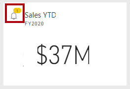

    *Le notifiche di avviso vengono visualizzate nel riquadro del dashboard e possono essere inviate tramite posta elettronica e notifiche push alle app per dispositivi mobili, inclusa Apple Watch.*

6. Nell'angolo in alto a destra della pagina Web fare clic sull'icona **Notifiche**.

    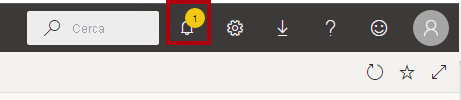

7. Nel riquadro **Tutte le notifiche** esaminare i dettagli della notifica di avviso.

8. Per chiudere il riquadro, fare clic su **Chiudi**.
