---
lab:
  title: Eseguire l'analisi dei dati in Power BI Desktop
  module: Module 9 - Identify Patterns and Trends
ms.openlocfilehash: e58af011b5603e4cd6e5def7c4353156fc67c879
ms.sourcegitcommit: 6853b027da7f5e739951c3eef54f4cd458854c66
ms.translationtype: HT
ms.contentlocale: it-IT
ms.lasthandoff: 06/12/2022
ms.locfileid: "146274803"
---
# **Eseguire l'analisi dei dati in Power BI Desktop**

**Il tempo stimato per il completamento del lab è di 45 minuti**

In questo lab verrà creato il report **Sales Exploration**.

Contenuto del lab:

- Creare grafici a dispersione animati

- Usare un oggetto visivo per prevedere valori

### **Presentazione del lab**

Questo lab fa parte di una serie che comprende molti lab progettati come attività completa, dalla preparazione dei dati alla pubblicazione come report e dashboard. È possibile completare i lab nell'ordine desiderato. Se tuttavia si intende seguire più lab, per i primi 10 è consigliabile procedere in questo ordine:

1. Preparare i dati in Power BI Desktop

2. Caricare i dati in Power BI Desktop

3. Modellare i dati in Power BI Desktop

5. Creare calcoli DAX in Power BI Desktop - Parte 1

6. Creare calcoli DAX in Power BI Desktop - Parte 2

7. Progettare un report in Power BI Desktop - Parte 1

8. Progettare un report in Power BI Desktop - Parte 2

9. Creare un dashboard di Power BI

10. **Eseguire l'analisi dei dati in Power BI Desktop**

11. Applicare la sicurezza a livello di riga

## **Esercizio 1: Creare il report**

In questo esercizio verrà creato il report **Sales Exploration**.

### **Attività 1: Operazioni preliminari - Accesso**

In questa attività si accederà a Power BI per configurare l'ambiente per il lab.

*Importante: se l'accesso a Power BI è già stato effettuato in un lab precedente, passare all'attività successiva.*

1. Per aprire Microsoft Edge, sulla barra delle applicazioni fare clic sul collegamento al programma Microsoft Edge.

    

1. Nella finestra del browser Microsoft Edge passare a **https://powerbi.microsoft.com**.

    *Suggerimento: è anche possibile usare l'elemento preferito Servizio Power BI sulla barra dei preferiti di Microsoft Edge.*

1. Fare clic su **Accedi** (nell'angolo in alto a destra).

    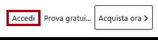

1. Immettere i dettagli dell'account ricevuti.

1. Se viene chiesto di aggiornare la password, immettere di nuovo la password ricevuta e quindi immettere e confermare una nuova password.

    *Importante: assicurarsi di registrare la nuova password.*

1. Completare il processo di accesso.

1. Se in Microsoft Edge viene chiesto se restare connessi, fare clic su **Sì**.

1. Nella finestra del browser Microsoft Edge, nel servizio Power BI, nel riquadro **Navigazione** espandere **Area di lavoro personale**.

    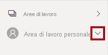

1. Lasciare aperta la finestra del browser Microsoft Edge.

### **Attività 2: Operazioni preliminari - Creare un set di dati**

In questa attività si creerà un set di dati per configurare l'ambiente per il lab.

*Importante: se il set di dati è già stato pubblicato nel lab **Creare un dashboard di Power BI**, passare all'attività successiva.*

1. Nella finestra del browser Microsoft Edge, nel servizio Power BI, nel riquadro **Navigazione** fare clic su **Recupera dati** nella parte inferiore.

    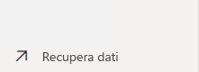

2. Nel riquadro **File** fare clic su **Recupera**.

    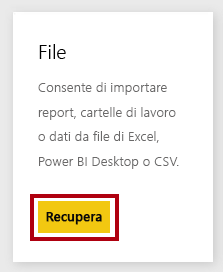

3. Fare clic sul riquadro **File locale**.

    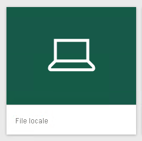

4. Nella finestra **Apri** passare alla cartella **D:\PL300\Labs\08-create-power-bi-dashboard\Solution**.

5. Selezionare il file **Sales Analysis.pbix** e quindi fare clic su **Apri**.

6. Se viene richiesto di sostituire il set di dati, fare clic su **Sostituisci**.

### **Attività 3: Creare il report**

In questa attività verrà creato il report **Sales Exploration**.

1. Per aprire Power BI Desktop, sulla barra delle applicazioni fare clic sul collegamento Microsoft Power BI Desktop.

    *Importante: se Power BI Desktop è già aperto (da un lab precedente), chiudere tale istanza.*

    

2. Per chiudere la finestra introduttiva, fare clic su **X** nella parte superiore sinistra della finestra.

    

3. Se Power BI Desktop non è connesso al servizio Power BI, fare clic su **Accedi** in alto a destra.

    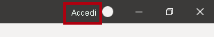

4. Completare il processo di accesso con lo stesso account usato per accedere al servizio Power BI.

5. Per salvare il file, fare clic sulla scheda della barra multifunzione **File** per aprire la visualizzazione Backstage.

6. Selezionare **Salva**.

    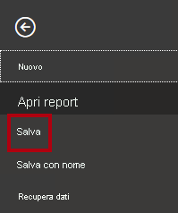

7. Nella finestra **Salva con nome** passare alla cartella **D:\PL300\MySolution**.

8. Nella casella **Nome file** immettere **Sales Exploration** e quindi fare clic su **Salva**.

    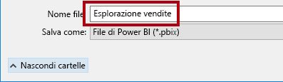

9. Per creare una connessione dinamica al set di dati **Sales Analysis**, nella scheda della barra multifunzione **Home**, nel gruppo **Dati** fare clic su **Set di dati di Power BI**.

    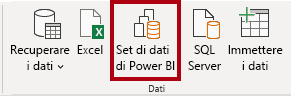

10. Nella finestra **Seleziona un set di dati per creare un report** selezionare il set di dati **Sales Analysis**.

11. Fare clic su **Crea**.

    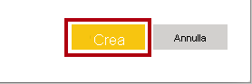

12. Salvare il file di Power BI Desktop.

    *È ora possibile creare due pagine del report e in ogni pagina verrà usato un oggetto visivo diverso per analizzare ed esplorare i dati.*

## **Esercizio 2: Creare un grafico a dispersione**

In questo esercizio verrà creato un grafico a dispersione che può essere animato.

### **Attività 1: Creare un grafico a dispersione animato**

In questa attività verrà creato un grafico a dispersione che può essere animato.

1. Rinominare **Pagina 1** in **Grafico a dispersione**.

    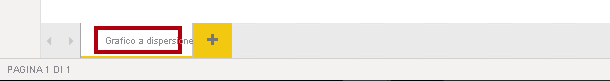

2. Aggiungere un oggetto visivo **Grafico a dispersione** alla pagina del report e quindi posizionarlo e ridimensionarlo in modo da riempire l'intera pagina.

    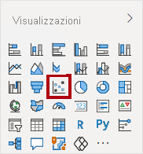

    

3. Aggiungere i campi seguenti nelle aree dell'oggetto visivo:

    Nei lab viene usata una notazione abbreviata per fare riferimento a un campo, simile al seguente: **Reseller** **\|** **Business Type**. In questo esempio, **Reseller** è il nome della tabella e **Business Type** è il nome del campo.

    

    - Asse X: **Sales \| Sales** 

    - Asse Y: **Sales \| Profit Margin**

    - Legenda: **Reseller \| Business Type**

    - Dimensioni: **Sales \| Quantity**

    - Asse di riproduzione: **Date \| Quarter**

    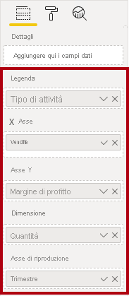

    *Il grafico può essere animato quando viene aggiunto un campo nell'area **Asse di riproduzione**.*

4. Nel riquadro **Filtri** aggiungere il campo **Product \| Category** nell'area **Filtri** in questa pagina.

5. Nella scheda del filtro filtrare per **Bikes**.

    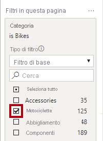

6. Per animare il grafico, nell'angolo inferiore sinistro fare clic su **Riproduci**.

    

7. Guardare l'intero ciclo di animazione da **FY2018 Q1** a **FY2020 Q4**.

    *Il grafico a dispersione consente di comprendere i valori delle misure simultaneamente, in questo caso la quantità di ordini, i ricavi delle vendite e il margine di profitto.*

    *Ogni bolla rappresenta un tipo di attività del rivenditore. Le variazioni nelle dimensioni delle bolle rispecchiano le quantità di ordini aumentate o diminuite. I movimenti orizzontali rappresentano invece aumenti o riduzioni dei ricavi delle vendite e i movimenti verticali rappresentano aumenti o riduzioni della redditività.*

8. Quando l'animazione si arresta, fare clic su una delle bolle per visualizzare il rilevamento nel tempo.

9. Passare il puntatore del mouse su una bolla per visualizzare una descrizione comando che descrive i valori della misura per il tipo di rivenditore in quel momento.

10. Nel riquadro **Filtri** filtrare solo per **Clothing** e notare che produce un risultato molto diverso.

11. Salvare il file di Power BI Desktop.

## **Esercizio 3: Creare una previsione**

In questo esercizio verrà creata una previsione per determinare i possibili ricavi delle vendite futuri.

### **Attività 1: Creare una previsione**

In questa attività verrà creata una previsione per determinare i possibili ricavi delle vendite futuri.

1. Aggiungere una nuova pagina e quindi rinominarla in **Previsione**.

    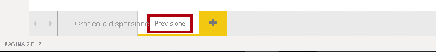

2. Aggiungere un oggetto visivo **Grafico a linee** alla pagina del report e quindi posizionarlo e ridimensionarlo in modo da riempire l'intera pagina.

    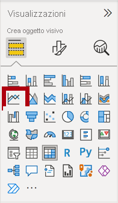

    

  

3. Aggiungere i campi seguenti nelle aree dell'oggetto visivo:

    - Asse X: **Date \| Date**

    - Asse Y: **Sales \| Sales** 

    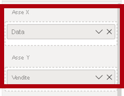

4. Nel riquadro **Filtri** aggiungere il campo **Date \| Year** nell'area **Filtri in questa pagina**.

5. Nella scheda del filtro filtrare per due anni: **FY2019** e **FY2020**.

    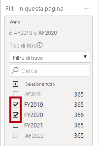

    *Per una previsione su una sequenza temporale, saranno necessari almeno due cicli (anni) di dati per produrre una previsione accurata e stabile.*

  

6. Aggiungere anche il campo **Product \| Category** nell'area **Filtri in questa pagina** e filtrare per **Bikes**.

    

7. Per aggiungere una previsione, sotto il riquadro **Visualizzazioni** selezionare il riquadro **Analisi**.

    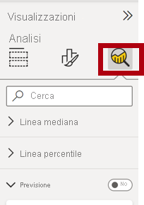

8. Espandere la sezione **Previsione**.

    *Se la sezione **Previsione** non è disponibile, probabilmente è perché l'oggetto visivo non è stato configurato correttamente. La previsione è disponibile solo quando vengono soddisfatte due condizioni: l'asse ha un solo campo di tipo data ed è presente un solo campo valore.*

9. Impostare l'opzione **Previsione** su **Sì**.

    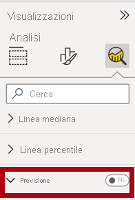

10. Configurare le proprietà di previsione seguenti:

    - Unità: Mesi

    - Lunghezza previsione: 1 mese

    - Stagionalità: 365
    
    - Intervallo di confidenza: 80%

11. Fare clic su **Applica**.

    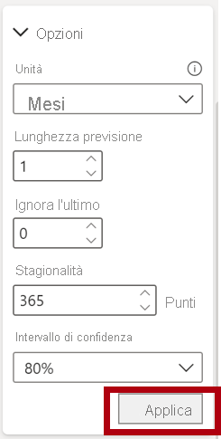

12. Nell'oggetto visivo grafico a linee si noti che la previsione è stata estesa di un mese dopo i dati della cronologia.

    *L'area grigia rappresenta la confidenza. Maggiore è la confidenza, meno stabile e quindi meno accurata sarà probabilmente la previsione.*

    *Quando si conosce la lunghezza del ciclo, in questo caso annuale, immettere i punti di stagionalità. Il ciclo può anche essere settimanale (7) o mensile (30).*

13. Nel riquadro **Filtri** filtrare solo per **Clothing** e osservare che si ottiene un risultato diverso.

14. Salvare il file di Power BI Desktop.

### **Attività 2: Completare il lab**

In questa attività si completerà il lab.

1. Selezionare la pagina **Grafico a dispersione**.

2. Salvare il file di Power BI Desktop.

3. Per pubblicare il file in **Area di lavoro personale**, nel gruppo **Condividi** della scheda della barra multifunzione **Home** fare clic su **Pubblica** e quindi fare clic su **Seleziona** per pubblicare.

    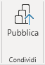

4.  Chiudere Power BI Desktop.
