---
lab:
  title: Applicare la sicurezza a livello di riga
  module: Module 12 - Row-Level Security
ms.openlocfilehash: 6ccc19e9835dca06ec613e386c82fb0270a28ed5
ms.sourcegitcommit: 51f448b208842f1333cb683b7775618edb41c126
ms.translationtype: HT
ms.contentlocale: it-IT
ms.lasthandoff: 04/09/2022
ms.locfileid: "141580174"
---
# **Applicare la sicurezza a livello di riga**

**Il tempo stimato per il completamento del lab è di 45 minuti**

In questo lab verrà creata una relazione molti-a-molti tra la tabella **Salesperson** e la tabella **Sales**. Verrà anche applicata la sicurezza a livello di riga per garantire che un venditore possa analizzare solo i dati di vendita per le rispettive aree assegnate.

Contenuto del lab:

- Configurare relazioni molti-a-molti

- Applicare la sicurezza a livello di riga

### **Presentazione del lab**

Questo lab fa parte di una serie che comprende molti lab progettati come attività completa, dalla preparazione dei dati alla pubblicazione come report e dashboard. È possibile completare i lab nell'ordine desiderato. Se tuttavia si intende seguire più lab, per i primi 10 è consigliabile procedere in questo ordine:

1. Preparare i dati in Power BI Desktop

2. Caricare i dati in Power BI Desktop

3. Modellare i dati in Power BI Desktop

5. Creare calcoli DAX in Power BI Desktop - Parte 1

6. Creare calcoli DAX in Power BI Desktop - Parte 2

7. Progettare un report in Power BI Desktop - Parte 1

8. Progettare un report in Power BI Desktop - Parte 2

9. Creare un dashboard di Power BI

10. Eseguire l'analisi dei dati in Power BI Desktop

11. **Applicare la sicurezza a livello di riga**

## **Esercizio 1: Applicare la sicurezza a livello di riga**

In questo esercizio si applicherà la sicurezza a livello di riga per assicurarsi che un venditore possa visualizzare solo le vendite realizzate nelle proprie aree.

### **Attività 1: Operazioni preliminari**

In questa attività si configurerà l'ambiente per il lab.

*Importante: se si sta continuando dal lab precedente (e il lab è stato completato correttamente), non completare questa attività, ma passare a quella successiva.*

1. Per aprire Power BI Desktop, sulla barra delle applicazioni fare clic sul collegamento Microsoft Power BI Desktop.

    

1. Per chiudere la finestra introduttiva, fare clic su **X** nella parte superiore sinistra della finestra.

    

1. Per aprire il file di avvio di Power BI Desktop, selezionare la scheda della barra multifunzione **File** per aprire la visualizzazione Backstage.

1. Selezionare **Apri report**.

    

1. Fare clic su **Esplora report**.

    

1. Nella finestra **Apri** passare alla cartella **D:\PL300\Labs\10-row-level-security\Starter**.

1. Selezionare il file **Sales Analysis**.

1. Fare clic su **Apri**.

    

1. Chiudere eventuali finestre aperte di carattere informativo.

1. Per creare una copia del file, fare clic sulla scheda della barra multifunzione **File** per aprire la visualizzazione Backstage.

1. Selezionare **Salva con nome**.

    

1. Se viene richiesto di applicare le modifiche, fare clic su **Applica**.

    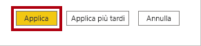

1. Nella finestra **Salva con nome** passare alla cartella **D:\PL300\MySolution**.

1. Fare clic su **Save** (Salva).

    

### **Attività 2: Applicare la sicurezza a livello di riga**

In questa attività si applicherà la sicurezza a livello di riga per assicurarsi che un venditore possa visualizzare solo le vendite realizzate nelle proprie aree.

1. Passa alla vista Dati.

    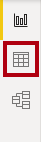

2. Nel riquadro **Campi** selezionare la tabella **Salesperson (Performance)**.

3. Esaminare i dati. Si noti che il valore UPN di Michael Blythe (EmployeeKey 281) è: **michael-blythe@adventureworks.com**

    *Si ricordi che Michael Blythe è assegnato a tre aree di vendita: US Northeast, US Central e US Southeast.*

4. Passare alla vista Report.

5. Nella scheda della barra multifunzione **Modellazione**, nel gruppo **Sicurezza** fare clic su **Gestisci ruoli**.

    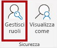

6. Nella finestra **Gestisci ruoli** fare clic su **Crea**.

    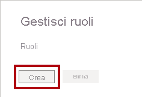

7. Nella casella sostituire il testo selezionato con il nome del ruolo: **Salespeople** e quindi premere **INVIO**.

    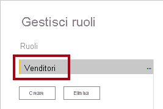

8. Per assegnare un filtro per la tabella **Salesperson (Performance)** , fare clic sul carattere puntini di sospensione (...) e quindi selezionare **Aggiungi filtro \| [UPN]** .

    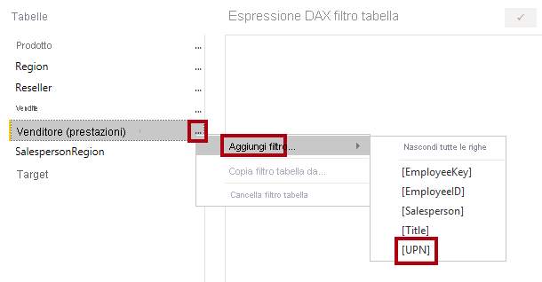

9. Nella casella **Espressione DAX filtro tabella** modificare l'espressione sostituendo **"Value"** con **USERPRINCIPALNAME()** .

    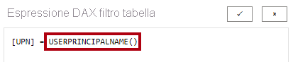

    *USERPRINCIPALNAME() è una funzione DAX (Data Analysis Expressions) che restituisce il nome dell'utente autenticato. La tabella **Salesperson (Performance)** verrà quindi filtrata in base al nome dell'entità utente (UPN) dell'utente che esegue una query sul modello.*

10. Fare clic su **Save** (Salva).

    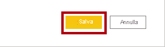

11. Per testare il ruolo di sicurezza, nella scheda della barra multifunzione **Modellazione**, nel gruppo **Sicurezza** fare clic su **Visualizza come**.

    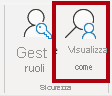

12. Nella finestra **Visualizza come ruoli** selezionare l'elemento **Altro utente** e quindi nella casella corrispondente immettere: **michael-blythe@adventureworks.com**

13. Selezionare il ruolo **Salespeople**.

    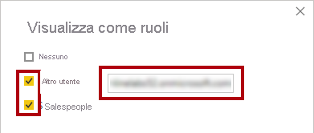

    *Questa configurazione comporta l'uso del ruolo **Salespeople** e la rappresentazione dell'utente con il nome di Michael Blythe.*

14. Fare clic su **OK**.

    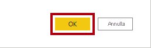

15. Si noti il banner giallo sopra la pagina del report, che descrive il contesto di sicurezza del test.

    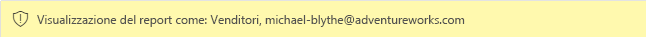

16. Nell'oggetto visivo tabella si noti che è elencato solo il venditore **Michael Blythe**.

    

17. Per arrestare il test, fare clic su **Arresta visualizzazione** sul lato destro del banner giallo.

    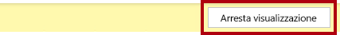

    *Dopo la pubblicazione del file di Power BI Desktop nel servizio Power BI, sarà necessario completare un'attività per eseguire il mapping delle entità di sicurezza al ruolo **Salespeople**. Tale attività non verrà eseguita in questo lab.*

18. Per eliminare il ruolo, nella scheda della barra multifunzione **Modellazione**, nel gruppo **Sicurezza** selezionare **Gestisci ruoli**.

    

19. Nella finestra **Gestisci ruoli** fare clic su **Elimina**.

    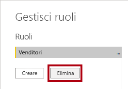

20. Quando viene richiesto di confermare l'eliminazione, fare clic su **Sì, elimina**.

21. Fare clic su **Save** (Salva).

    

### **Attività 3: Completare il lab**

In questa attività si completerà il lab.

1. Salvare il file di Power BI Desktop.
