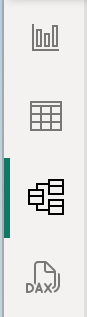
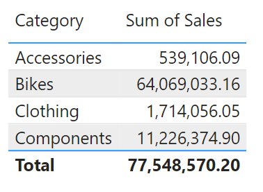
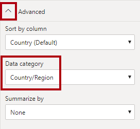
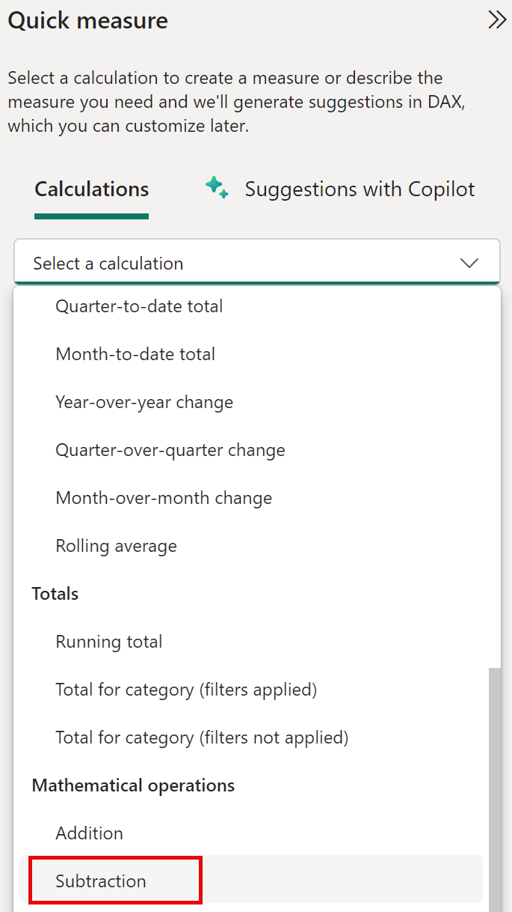
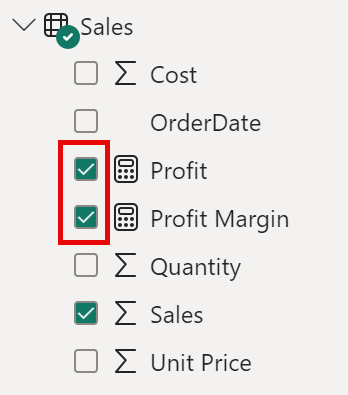

---
lab:
  title: Progettare un modello di dati in Power BI
  module: Design a Data Model in Power BI
---

# Progettare un modello di dati in Power BI

## Presentazione del lab

In questo lab si inizierà a sviluppare il modello di dati. Il processo includerà la creazione di relazioni tra le tabelle e poi la configurazione delle proprietà delle tabelle e delle colonne per migliorare l'accessibilità e l'usabilità del modello di dati. Si creeranno anche gerarchie e si creeranno misure rapide.

Contenuto del lab:

- Creare le relazioni del modello
- Configurare le proprietà delle tabelle e delle colonne
- Creare gerarchie

**Il lab dovrebbe richiedere circa 45 minuti.**

## Operazioni preliminari

Per completare questo esercizio, aprire prima un Web browser e immettere l'URL seguente per scaricare la cartella ZIP:

`https://github.com/MicrosoftLearning/PL-300-Microsoft-Power-BI-Data-Analyst/raw/Main/Allfiles/Labs/03-configure-data-model-in-power-bi-desktop/03-model-data.zip`

Estrarre la cartella nella **cartella C:\Users\Student\Downloads\03-model-data** .

Aprire il **file 03-Starter-Sales Analysis.pbix** .

> ***Nota**: è possibile ignorare l'accesso selezionando **Annulla**. Chiudere qualsiasi altra finestra informativa. Selezionare **Applica in seguito**, se richiesto di applicare le modifiche.*

## Creare le relazioni del modello

In questa attività verranno create le relazioni del modello. Il file è stato configurato per non identificare le relazioni tra le tabelle, che non è l'impostazione predefinita, ma è consigliabile evitare operazioni aggiuntive per la creazione delle relazioni corrette per il modello.

> **Importante**: *i lab usano una notazione abbreviata per fare riferimento a un campo. Avrà un aspetto simile al seguente: **Categoria** prodotto\|. In questo esempio Product **** è il nome della tabella e **Category** è il nome del campo.*

1. A sinistra in Power BI Desktop selezionare l'icona **Visualizzazione** report.

     

1. Per visualizzare tutti i campi della tabella, nel riquadro Dati** fare clic con il pulsante destro del **mouse su un'area vuota e quindi scegliere **Espandi tutto**.

1. Per creare un oggetto visivo tabella, nel riquadro Dati** selezionare il **campo Categoria** all'interno della **tabella Product**.**

1. Per aggiungere un'altra colonna alla tabella, nel riquadro Dati selezionare il campo Sales Sales .To add another column to the table, in the **Data** pane, check the **Sales \|** field.

1. Si noti che l'oggetto visivo Tabella elenca quattro categorie di prodotti e che il valore Sales è lo stesso per ognuno e lo stesso per il totale.

     

     > *Il problema è che la tabella si basa su campi di tabelle diverse. L'aspettativa è che ogni categoria di prodotti visualizzi le vendite per tale categoria. Tuttavia, poiché non esiste una relazione di modello tra queste tabelle, la **tabella Sales** non viene filtrata. A questo punto si aggiungerà una relazione per propagare i filtri tra le tabelle.*

1. Selezionare l'icona **Visualizzazione modello** nel riquadro di spostamento a sinistra e selezionare **Gestisci relazioni**.

     

1. **Nella finestra Gestisci relazioni** si noti che non sono ancora state definite relazioni. Per creare una relazione, selezionare **Nuova relazione**.

1. Configurare la relazione dalla **tabella Product** alla **tabella Sales** . Si noti che gli elementi seguenti sono stati configurati automaticamente:

    - **Sono selezionate** le colonne ProductKey in ogni tabella. *Le colonne sono state selezionate perché condividono lo stesso nome e tipo di dati. Potrebbe essere necessario trovare colonne corrispondenti con nomi diversi nei dati reali.*
    - **Il tipo di cardinalità è uno-a-molti (1:\*)..** *La cardinalità è stata rilevata automaticamente, perché Power BI riconosce che la **colonna ProductKey** della **tabella Product** contiene valori univoci. Le relazioni uno-a-molti sono la cardinalità più comune e tutte le relazioni create in questo lab saranno questo tipo.*
    - **Il tipo direzione filtro incrociato è Single**. *La direzione del filtro singolo indica che i filtri vengono propagati da "un lato" al lato "molti". In questo caso, significa che i filtri applicati alla **tabella Product** verranno propagati alla **tabella Sales** , ma non nella direzione opposta.*
    - **Imposta questa relazione attiva è selezionata**. *Le relazioni attive propagano i filtri. È possibile contrassegnare una relazione come inattiva in modo che i filtri non vengano propagati. Le relazioni inattive possono esistere quando sono presenti più percorsi di relazione tra tabelle. In questo caso, i calcoli del modello possono usare funzioni speciali per attivarle.*

     

1. Selezionare **OK**, notare nella **finestra Gestisci relazioni** che la nuova relazione è elencata e quindi selezionare **Chiudi**.

     

Si noti che è ora presente un connettore tra le due tabelle (* non importa se le tabelle sono posizionate l'una accanto all'altra*).
    - È possibile interpretare la cardinalità rappresentata dagli **indicatori 1** e **(*)** .
    - La direzione del filtro è rappresentata dalla punta della freccia.
    - Una linea continua rappresenta una relazione attiva, mentre una linea tratteggiata rappresenta una relazione inattiva.
    - Passare il puntatore del mouse sulla relazione per evidenziare le colonne correlate.

### Creare relazioni aggiuntive

Esiste un modo più semplice per creare una relazione. Nel diagramma del modello è possibile trascinare e rilasciare le colonne per creare una nuova relazione.

1. Per creare una nuova relazione usando una tecnica diversa, dalla **tabella Reseller trascinare la **colonna ResellerKey**** nella **colonna ResellerKey** della **tabella Sales**.

    > ***Suggerimento**: a volte una colonna non vuole essere trascinata. In questa situazione, selezionare una colonna diversa, quindi selezionare la colonna da trascinare e riprovare. Assicurarsi di visualizzare la nuova relazione aggiunta al diagramma.*

     

1. Usare la nuova tecnica per creare le due relazioni tra modelli seguenti:

     - Da **Region \| SalesTerritoryKey** a **Sales \| SalesTerritoryKey**
     - Da **Salesperson \| EmployeeKey** a **Sales \| EmployeeKey**

1. Nel diagramma disporre le tabelle in modo che la tabella **Sales** sia posizionata al centro del diagramma e che le tabelle correlate siano disposte attorno ad essa. Posizionare le tabelle disconnesse a lato.

     

1. Nella visualizzazione report si noti che l'oggetto visivo tabella aggiornato per visualizzare valori diversi per ogni categoria di prodotto.

    > *I filtri applicati alla tabella **Product** vengono ora propagati alla tabella **Sales**.*

     

1. **Salvare** il file di Power BI Desktop.

## Configurare la tabella Product

In questa attività si configurerà la **tabella Product** con una gerarchia e una cartella di visualizzazione.

1. In **Visualizzazione modello > riquadro** Dati, se necessario, espandere la **tabella Product** per visualizzare tutti i campi.

1. Per creare una gerarchia, nel riquadro Dati fare clic con il pulsante destro del mouse sulla **colonna Categoria** e quindi scegliere **Crea gerarchia**.

1. Aggiornare il nome a **Products** (fare clic con il pulsante destro del mouse o fare doppio clic per rinominare).

1. Per aggiungere il secondo livello alla gerarchia, nel riquadro **Proprietà**, nell'elenco a discesa **Gerarchia** selezionare **Subcategory** (potrebbe essere necessario scorrere verso il basso all'interno del riquadro).

1. Per aggiungere il terzo livello alla gerarchia, nell'elenco a discesa **Gerarchia** selezionare **Product**.

1. Per completare la progettazione della gerarchia, selezionare **Applica modifiche al livello**.

     

1. **Nel riquadro Dati** notare la **gerarchia Products**. Per visualizzare i livelli della gerarchia, espandere la gerarchia di **Products**.

     

1. Per organizzare le colonne in una cartella di visualizzazione, nel **riquadro Dati** selezionare prima la **colonna Formato** colore sfondo.

1. Tenendo premuto il tasto **CTRL** selezionare la colonna **Font Color Format**.

1. Nel riquadro **Proprietà**, nella casella **Cartella di visualizzazione**, immettere **Formatting**.

     

1. **Nel riquadro Dati** si noti che le due colonne si trovano ora all'interno di una cartella.

   > *Le cartelle di visualizzazione sono un ottimo modo per organizzare le tabelle, soprattutto per le tabelle che includono molti campi. Sono solo presentazione logica.*

     

## Configurare la tabella Region

In questa attività si configurerà la **tabella Region** con una gerarchia e le categorie aggiornate.

1. Nella tabella **Region** creare una gerarchia denominata **Regions** con i tre livelli seguenti:

     - Raggruppa
     - Country
     - Paese

1. Selezionare la colonna **Country** (non il livello della gerarchia **Country**).

1. Nel riquadro **Proprietà** espandere la sezione **Avanzate** nella parte inferiore del riquadro e quindi nell'elenco a discesa **Categoria dati** selezionare **Country/Region**.

    

    > *La categorizzazione dei dati può fornire suggerimenti alla finestra di progettazione report. In questo caso, la categorizzazione della colonna come paese o area geografica fornisce informazioni più accurate a Power BI quando esegue il rendering di una visualizzazione mappa.*

## Configurare la tabella Reseller

In questa attività si configurerà la **tabella Reseller** per aggiungere una gerarchia e aggiornare le categorie di dati.

1. Nella tabella **Reseller** creare una gerarchia denominata **Resellers** con i due livelli seguenti:

     - Business Type
     - Reseller

1. Creare una seconda gerarchia denominata **Geography** con i quattro livelli seguenti:

     - Country-Region
     - State-Province
     - Città
     - Reseller

1. Impostare la **categoria** di dati per le colonne seguenti (non all'interno della gerarchia):

    - Country-Region to **Country/Region**
    - Stato-Provincia a **Stato o Provincia**
    - Da città a **città**

## Configurare la tabella Sales

In questa attività si configurerà la **tabella Sales** con descrizioni aggiornate, formattazione e riepilogo.

1. Nella tabella **Sales** selezionare la colonna **Cost**.

1. **Nel riquadro **Proprietà** immettere: *In base al costo* standard nella casella Descrizione**.

 > *Le descrizioni possono essere applicate a tabelle, colonne, gerarchie o misure. Nel riquadro Dati** il **testo della descrizione viene visualizzato in una descrizione comando quando un autore del report passa il cursore sul campo.*

1. Selezionare la colonna **Quantity**.

1. Nel riquadro **Proprietà**, nella sezione **Formattazione**, impostare l'interruttore per la proprietà **Separatore delle migliaia** su **Sì**.

1. Selezionare la colonna **Unit Price**.

1. Nel riquadro **Proprietà**, nella sezione **Formattazione**, impostare la proprietà **Posizioni decimali** su **2**.

1. Nel gruppo **Avanzate** (potrebbe essere necessario scorrere verso il basso per individuarlo), nell'elenco a discesa **Riepiloga per** selezionare **Media**.

 > *Per impostazione predefinita, le colonne numeriche verranno riepilogate sommando i valori. Questo comportamento predefinito non è adatto per una colonna come **Unit Price**, che rappresenta una tariffa. L'impostazione del riepilogo predefinito sulla media produrrà un risultato significativo.*

## Aggiornamento delle proprietà in blocco

In questa attività verranno aggiornate più colonne usando singoli aggiornamenti in blocco. Questo approccio verrà usato per nascondere le colonne e formattare i valori delle colonne.

1. **Nel riquadro Dati** visualizzazione**** > modello selezionare la **colonna ProductKey ProductKey\|**.

1. Tenendo premuto **CTRL** selezionare le 13 colonne seguenti (in più tabelle):

     - Region \| SalesTerritoryKey
     - Reseller \| ResellerKey
     - Sales \| EmployeeKey
     - Sales \| ProductKey
     - Sales \| ResellerKey
     - Sales \| SalesOrderNumber
     - Sales \| SalesTerritoryKey
     - Salesperson \| EmployeeID
     - Salesperson \| EmployeeKey
     - Salesperson \| UPN
     - SalespersonRegion \| EmployeeKey
     - SalespersonRegion \| SalesTerritoryKey
     - Targets \| EmployeeID

1. Nel riquadro **Proprietà** impostare l'interruttore della proprietà **È nascosto** su **Sì**.

 > *Le colonne sono state nascoste perché vengono usate dalle relazioni o verranno usate nella configurazione della sicurezza a livello di riga o nella logica di calcolo.*

  *Si userà **SalesOrderNumber** in un calcolo nel **lab Creare calcoli DAX in Power BI Desktop** .*

1. Selezionare le tre colonne seguenti:

     - Product \| Standard Cost
     - Sales \| Cost
     - Sales \| Sales

1. Nel riquadro **Proprietà**, nella sezione **Formattazione**, impostare l'interruttore per la proprietà **Posizioni decimali** su **0** (zero).

## Esplorare l'interfaccia del modello

In questa attività si passerà alla visualizzazione Report, si esaminerà l'interfaccia del modello di dati e si configurerà l'impostazione di data/ora automatica.

1. Passare alla visualizzazione **Report**.

1. **Nel riquadro Dati** osservare quanto segue:

     - Le colonne, le gerarchie e i relativi livelli sono campi che possono essere usati per configurare gli oggetti visivi dei report
     - Sono visibili solo i campi rilevanti per la creazione di report
     - La **tabella SalespersonRegion** non è visibile perché tutti i relativi campi sono nascosti
     - I campi spaziali nelle tabelle **Region** e **Reseller** sono contrassegnati dall'icona di dati spaziali
     - I campi contrassegnati dal simbolo sigma (Ʃ) verranno riepilogati per impostazione predefinita
     - Viene visualizzata una descrizione comando quando si passa il puntatore del mouse sul campo **Sales \| Cost**

1. Espandere il **campo Sales \| OrderDate** e notare che viene visualizzata una **gerarchia** di date. Il **campo TargetMonth** \| fornisce una gerarchia simile.

      

> **Importante**: *queste gerarchie non sono state create dall'utente. Sono stati creati automaticamente come impostazione predefinita. C'è però un problema. L'anno finanziario Adventure Works inizia il 1° luglio di ogni anno. Tuttavia, in queste gerarchie di date create automaticamente, la gerarchia di date inizia il 1° gennaio di ogni anno.*

1. Per disattivare l'impostazione **Data/ora automatica** , passare a **Opzioni > file e Impostazioni > Opzioni**.

1. **Nella sezione File** corrente passare a **Data Load > Time Intelligence** e deselezionare **Data/ora** automatica.

    

1. **Nel riquadro Dati** notare che le gerarchie di data non sono più disponibili.

## Creare misure rapide

In questa attività verranno create due misure rapide per calcolare il profitto e il margine di profitto. Una misura rapida crea automaticamente la formula per il calcolo. Sono semplici e veloci da creare per calcoli semplici e comuni.

1. **Nel riquadro Dati** fare clic con il pulsante destro del mouse sulla **tabella Sales** e quindi scegliere **Nuova misura** rapida.

     

1. Nella finestra **Misure rapide**, nell'elenco a discesa **Calcolo**, dall'interno del gruppo **Operazioni matematiche** selezionare **Sottrazione**.

     

1. **Nel riquadro Dati** della **finestra Misure** rapide espandere la **tabella Sales**.

1. Trascinare il campo **Sales** nella casella **Valore di base**.

1. Trascinare il **campo Costo** nella **casella Valore da sottrarre** e quindi selezionare **Aggiungi**.  

     

1. **Nel riquadro Dati**, all'interno della **tabella Sales**, si noti che la nuova misura. 
    > *Le misure sono indicate dall'icona della calcolatrice.*

     

1. Per rinominare la misura, fare clic con il pulsante destro del mouse, scegliere **Rinomina** e quindi rinominare **Profit**.

    > *Suggerimento: per rinominare un campo, è anche possibile fare doppio clic su di esso oppure selezionarlo e premere **F2**.*

1. Nella tabella **Sales** aggiungere una seconda misura rapida in base ai requisiti seguenti:

     - Usare l'operazione matematica **Divisione**
     - Impostare **Numeratore** sul campo **Sales \| Profit**
     - Impostare **Denominatore** sul campo **Sales \| Sales**
     - Rinominare la misura **Profit Margin**

1. Verificare che sia selezionata la misura **Profit Margin**, quindi sulla barra multifunzione contestuale **Strumenti misura** impostare il formato su **Percentuale**, con due posizioni decimali.

     

1. Per testare le due misure, selezionare prima l'oggetto **visivo Tabella** .

1. **Nel riquadro Dati** controllare le due misure.

     

1. Selezionare e trascinare la guida a destra per allargare l'oggetto visivo Tabella.

     

1. Verificare che le misure producano un risultato ragionevole formattato correttamente.

     

## Creare una relazione molti a molti

In questa attività si creerà una relazione molti-a-molti tra la **tabella Salesperson** e la **tabella Sales** .

1. In Power BI Desktop, nella visualizzazione Report, nel **riquadro Dati** selezionare i due campi seguenti per creare un nuovo **oggetto visivo tabella** .

     - Salesperson \| Salesperson
     - Sales \| Sales

     

     > *Nella tabella vengono visualizzate le vendite effettuate da ogni venditore. Esiste tuttavia un'altra relazione tra venditori e vendite. Alcuni venditori appartengono a una, due o più aree di vendita. Inoltre, le aree di vendita possono avere più venditori assegnati.*
     >
     > *Dal punto di vista della gestione delle prestazioni, le vendite di un venditore (in base ai territori assegnati) devono essere analizzate e confrontate con gli obiettivi di vendita. Si creeranno relazioni per supportare questa analisi nell'esercizio successivo.*

1. Si noti che **Michael Blythe** ha venduto quasi 9 milioni di dollari.

1. Passare alla visualizzazione Modello, quindi trascinare la **tabella SalespersonRegion** per posizionarla tra le **tabelle Region** e **Salesperson** .

1. Usare la tecnica di trascinamento della selezione per creare le due relazioni tra modelli seguenti:

     - Da **Salesperson \| EmployeeKey** a **SalespersonRegion \| EmployeeKey**
     - Da **Region \| SalesTerritoryKey** a **SalespersonRegion \| SalesTerritoryKey**

    > *La tabella **SalespersonRegion** può essere considerata una tabella ponte.*

1. Passare alla visualizzazione Report e quindi notare che l'oggetto visivo non è stato aggiornato. Il risultato delle vendite per Michael Blythe non è stato modificato.

1. Tornare alla visualizzazione Modello e quindi seguire le direzioni del filtro delle relazioni (punta della freccia) dalla tabella **Salesperson**.

     > *Si consideri che la **tabella Salesperson** filtra la **tabella Sales** . Filtra anche la **tabella SalespersonRegion** , ma non continua propagando i filtri alla **tabella Region** (la punta della freccia punta alla direzione errata).*

     

1. Per modificare la relazione tra le tabelle **Region** e **SalespersonRegion**, fare doppio clic sulla relazione.

1. Nella finestra **Modifica relazione**, nell'elenco a discesa **Direzione filtro incrociato** selezionare **Entrambe**.

1. Selezionare la **casella di controllo Applica filtro di sicurezza in Entrambe le direzioni** , quindi selezionare OK.

     

1. Si noti che la relazione ha ora una doppia punta della freccia.

     

1. Passare alla visualizzazione Report e notare che i valori delle vendite non sono ancora cambiati.

    > *Il problema si riferisce ora al fatto che esistono due possibili percorsi di propagazione dei filtri tra le **tabelle Salesperson** e **Sales** . Questa ambiguità viene risolta internamente, in base a una valutazione "numero minimo di tabelle". Per essere chiari, non è consigliabile progettare modelli con questo tipo di ambiguità. Il problema verrà risolto in parte più avanti in questo lab e al completamento del **lab Creare calcoli DAX nel lab di Power BI Desktop** .*

1. Passare alla visualizzazione Modello per forzare la propagazione dei filtri tramite la tabella bridging. Modificare (doppio clic) la relazione tra le **tabelle Salesperson** e **Sales** .

1. **Nella finestra Modifica relazione** deselezionare la **casella di controllo Rendi attiva relazione** e selezionare **OK**.

    > *La propagazione del filtro seguirà ora l'unico percorso attivo.*

1. Nel diagramma si noti che la relazione inattiva è rappresentata da una linea tratteggiata.

     

1. Passare alla visualizzazione Report e quindi notare che le vendite per Michael Blythe sono quasi 22 milioni di dollari.

     

1. Si noti anche che le vendite per ogni venditore, se sommate, sarebbero maggiori del totale della tabella.

     > *È un'osservazione comune di una relazione molti-a-molti a causa del doppio, triplo e così via. Conteggio dei risultati delle vendite regionali. Si consideri Brian Welcker, il secondo venditore elencato. L'importo delle vendite è uguale all'importo totale delle vendite. È il risultato corretto a causa del fatto che è il direttore delle vendite; le vendite vengono misurate in base alle vendite di tutte le regioni.*
     >
     > *Anche se la relazione molti-a-molti funziona, non è ora possibile analizzare le vendite effettuate da un venditore (perché la relazione è inattiva). Sarà possibile riattivare la relazione quando si introduce una tabella calcolata che consentirà di analizzare le vendite effettuate nelle aree di vendita assegnate al venditore (per l'analisi delle prestazioni) nel lab Creare calcoli DAX in **Power BI Desktop** .*

1. Passare alla visualizzazione Modello e quindi nel diagramma selezionare la **tabella Salesperson** .

1. Nella casella Nome del **riquadro **Proprietà** sostituire il testo con **Salesperson (Prestazioni).****

    > *La tabella rinominata ora riflette lo scopo: viene usata per segnalare e analizzare le prestazioni dei venditori in base alle vendite delle aree di vendita assegnate.*

## Correlare la tabella Targets

In questa attività si creerà una relazione con la **tabella Targets** .

1. Creare una relazione dalla colonna **Salesperson (Performance) \| EmployeeID** alla colonna **Targets \| EmployeeID**.

1. Nella visualizzazione Report aggiungere il campo **Targets \| Target** all'oggetto visivo tabella.

1. Ridimensionare l'oggetto visivo tabella in modo che tutte le colonne siano visibili.

     

 > *È ora possibile visualizzare le vendite e gli obiettivi, ma prestare attenzione a due motivi. In primo luogo, non esiste alcun filtro per un periodo di tempo e quindi anche gli obiettivi includono importi di destinazione futuri. In secondo luogo, le destinazioni non sono additivi e quindi il totale non deve essere visualizzato. Possono essere disabilitati formattando l'oggetto visivo o rimosso usando la logica di calcolo.*

## Lab completato
