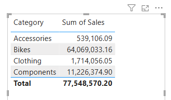
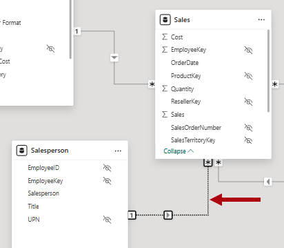

---
lab:
  title: Configurare un modello semantico in Power BI
  module: Configure a semantic model in Power BI
---

# Configurare un modello semantico in Power BI

## Presentazione del lab

In questo lab si inizierà a sviluppare il modello di dati. Il processo includerà la creazione di relazioni tra le tabelle e poi la configurazione delle proprietà delle tabelle e delle colonne per migliorare l'accessibilità e l'usabilità del modello di dati. Si creeranno anche gerarchie e misure rapide.

Contenuto del lab:

- Creare relazioni tra modelli.
- Configurare le proprietà di tabelle e colonne.
- Creare gerarchie.
- Creare misure rapide.
- Configurare una relazione molti-a-molti.

**Il lab dovrebbe richiedere circa 45 minuti.**

## Operazioni preliminari

Per completare questo esercizio, aprire prima un Web browser e immettere l'URL seguente per scaricare il file ZIP:

`https://github.com/MicrosoftLearning/PL-300-Microsoft-Power-BI-Data-Analyst/raw/Main/Allfiles/Labs/03-configure-semantic-model/03-model-data.zip`

Estrarre il file nella **cartella C:\Users\Student\Downloads\03-model-data** .

Aprire il **file 03-Starter-Sales Analysis.pbix** .

> _**Nota**: è possibile che venga visualizzata una finestra di dialogo di accesso durante il caricamento del file. Selezionare **Annulla** per chiudere la finestra di dialogo di accesso. Chiudere qualsiasi altra finestra informativa. Selezionare **Applica in seguito**, se richiesto di applicare le modifiche._

## Creare le relazioni del modello

In questa attività verranno create le relazioni del modello. Il file è stato configurato per non identificare le relazioni tra le tabelle, che non è l'impostazione predefinita, ma è consigliabile evitare operazioni aggiuntive per la creazione delle relazioni corrette per il modello.

> Nei lab viene usata una notazione abbreviata per fare riferimento a un campo, Sarà simile al seguente: `Product | Category`. In questo esempio, `Product` è il nome della tabella e `Category` è il nome del campo.

1. In Power BI Desktop, per visualizzare tutti i campi della tabella, nel riquadro Dati** fare clic con il pulsante destro del **mouse su un'area vuota e quindi scegliere **Espandi tutto**.

1. Per creare un oggetto visivo tabella, nel **riquadro Dati** , dall'interno della `Product` tabella, controllare il `Category` campo.

1. Per aggiungere un'altra colonna alla tabella, nel **riquadro Dati** selezionare il `Sales | Sales` campo .

1. Si noti che l'oggetto visivo Tabella elenca quattro categorie di prodotti e che il valore Sales è lo stesso per ognuno e lo stesso per il totale.

    

    > _Il problema è che la tabella si basa su campi di tabelle diverse. L'aspettativa è che ogni categoria di prodotti visualizzi le vendite per tale categoria. Tuttavia, poiché non esiste una relazione di modello tra queste tabelle, la `Sales` tabella non viene filtrata. A questo punto si aggiungerà una relazione per propagare i filtri tra le tabelle._

1. Per passare a Progettazione modelli, a sinistra selezionare l'icona **Visualizzazione modello** .

    

1. **Nella barra multifunzione Home** selezionare **Gestisci relazioni**.

    

1. **Nella finestra Gestisci relazioni** si noti che non sono ancora state definite relazioni.

1. Per creare una relazione, selezionare **+ Nuova relazione**.

1. Per configurare una relazione da `Product` tabella a `Sales` tabella, nell'elenco **a discesa Da tabella** selezionare la `Product` tabella e nell'elenco **a discesa A tabella** selezionare la `Sales` tabella.

    

1. Si noti che le proprietà seguenti sono state configurate automaticamente:

    - **Sono selezionate** le colonne ProductKey in ogni tabella. _Le colonne sono state selezionate perché condividono lo stesso nome e tipo di dati. Potrebbe essere necessario trovare colonne corrispondenti con nomi diversi nei dati reali._
    - **Il tipo di cardinalità è uno-a-molti (1:\*)..** _La cardinalità è stata rilevata automaticamente, perché Power BI riconosce che la `ProductKey` colonna della `Product` tabella contiene valori univoci. Le relazioni uno-a-molti sono la cardinalità più comune e tutte le relazioni create in questo lab saranno questo tipo._
    - **Il tipo direzione filtro incrociato è Single**. _La direzione del filtro singolo indica che i filtri vengono propagati da "un lato" al lato "molti". In questo caso, significa che i filtri applicati alla `Product` tabella verranno propagati alla `Sales` tabella, ma non nella direzione opposta._
    - **Imposta questa relazione attiva è selezionata**. _Le relazioni attive propagano i filtri. È possibile contrassegnare una relazione come inattiva in modo che i filtri non vengano propagati. Le relazioni inattive possono esistere quando sono presenti più percorsi di relazione tra tabelle. In questo caso, i calcoli del modello possono usare funzioni speciali per attivarle._

    

1. Selezionare **Salva**, notare nella **finestra Gestisci relazioni** che la nuova relazione è elencata e quindi selezionare **Chiudi**.

1. Nel diagramma del modello si noti che è ora presente un connettore tra le due tabelle ( è possibile scegliere di riposizionare le tabelle per visualizzare più chiaramente la relazione).

    

    > _È possibile interpretare molte delle proprietà della relazione esaminando la linea della relazione nel diagramma:_
    >
    > - _La cardinalità è rappresentata dagli **indicatori 1** e **(\*).**_
    > - _La direzione del filtro è rappresentata dalla freccia._
    > - _Una linea continua rappresenta una relazione attiva; una linea tratteggiata rappresenta una relazione inattiva._
    >
    > Suggerimento: se si passa il cursore sulla relazione per evidenziare il columns._ correlato

1. Passare alla **visualizzazione** Report e quindi notare che l'oggetto visivo tabella aggiornato per visualizzare valori diversi per ogni categoria di prodotto.

    > _I filtri applicati alla `Product` tabella ora vengono propagati alla `Sales` tabella._

    

## Creare relazioni aggiuntive

Esiste un modo più semplice per creare una relazione. Nel diagramma del modello è possibile trascinare e rilasciare le colonne per creare una nuova relazione.

1. Per creare una nuova relazione usando una tecnica diversa, passare alla **visualizzazione** Modello.

1. `Reseller` Dalla tabella trascinare la `ResellerKey` colonna nella `ResellerKey` colonna della `Sales` tabella.

    > _**Importante**: a volte una colonna non vuole essere trascinata. Se si verifica questa situazione, selezionare una colonna diversa e quindi selezionare la colonna che si intende trascinare di nuovo e quindi riprovare. Assicurarsi di visualizzare la nuova relazione aggiunta al diagramma._

    

1. **Nella finestra Nuova relazione** esaminare la configurazione e quindi selezionare **Salva**.

1. Usare la nuova tecnica per creare le due relazioni tra modelli seguenti:

     - `Region | SalesTerritoryKey` a `Sales | SalesTerritoryKey`
     - `Salesperson | EmployeeKey` a `Sales | EmployeeKey`

1. Nel diagramma disporre le tabelle in modo che la `Sales` tabella sia posizionata al centro del diagramma e le tabelle correlate siano disposte. Posizionare le tabelle disconnesse a lato.

    

1. Salvare il file di Power BI Desktop.

## Configurare la tabella Product

In questa attività si configurerà la `Product` tabella con una gerarchia e una cartella di visualizzazione.

1. Passare alla **visualizzazione** Modello.

1. **Nel riquadro Dati**, se necessario, espandere la `Product` tabella per visualizzare tutti i campi.

1. Nella tabella fare clic con il pulsante destro del `Product` mouse sulla `Category` colonna e scegliere **Crea gerarchia**.

    

1. Nella casella Nome del **riquadro **Proprietà** sostituire il valore con _Products_.**

    

1. Nell'elenco **a discesa Hierarchy (Gerarchia** ) selezionare **Subcategory (Sottocategoria** ) e quindi Selezionare **Product (Prodotto**) e quindi Apply Level Changes ( **Applica modifiche** al livello).

    

1. **Nel riquadro Dati** notare la `Products` gerarchia. Per visualizzare i livelli della gerarchia, espanderlo.

    

1. Per organizzare le colonne in una cartella di visualizzazione, nel **riquadro Dati** selezionare prima la `Background Color Format` colonna.

1. Quando si preme CTRL****, selezionare la `Font Color Format` colonna.

1. Nel riquadro **Proprietà**, nella casella **Cartella di visualizzazione**, immettere _Formatting_.

    

1. **Nel riquadro Dati** si noti che le due colonne si trovano ora all'interno di una cartella.

    

    > _Le cartelle di visualizzazione sono un ottimo modo per organizzare le tabelle, soprattutto per le tabelle che includono molti campi. Sono solo presentazione logica._

## Configurare la tabella Region

In questa attività si configurerà la `Region` tabella con una gerarchia e le categorie aggiornate.

1. `Region` Nella tabella creare una gerarchia denominata _Regions_ con i tre livelli seguenti:

     - `Group`
     - `Country`
     - `Region`

1. Selezionare la `Country` colonna (non il livello della `Country` gerarchia).

1. **Nel riquadro Proprietà** espandere la **sezione Avanzate** (nella parte inferiore del riquadro) e quindi nell'elenco **a discesa Categoria** dati selezionare **Paese/Area** geografica.

    

    > _La categorizzazione dei dati può fornire suggerimenti alla finestra di progettazione report. In questo caso, la categorizzazione della colonna come paese o area geografica fornisce informazioni più accurate a Power BI quando esegue il rendering di una visualizzazione mappa._

## Configurare la tabella Reseller

In questa attività si configurerà la `Reseller` tabella per aggiungere una gerarchia e aggiornare le categorie di dati.

1. `Reseller` Nella tabella creare una gerarchia denominata _Resellers_ con i due livelli seguenti:

     - `Business Type`
     - `Reseller`

1. Creare una seconda gerarchia denominata _Geography_ con i quattro livelli seguenti:

     - `Country-Region`
     - `State-Province`
     - `City`
     - `Reseller`

1. Impostare la categoria di dati per le colonne seguenti (non all'interno della gerarchia):

    - `Country-Region` per **paese/area geografica**
    - `State-Province` per **stato o provincia**
    - `City` a **Città**

## Configurare la tabella Sales

In questa attività si configurerà la `Sales` tabella con descrizioni aggiornate, formattazione e riepilogo.

1. `Sales` Nella tabella selezionare la `Cost` colonna .

1. Nella casella Descrizione** del **** riquadro Proprietà** immettere: _In base al costo standard_

    > _Le descrizioni possono essere applicate a tabelle, colonne, gerarchie o misure. Nel riquadro Dati** il **testo della descrizione viene visualizzato in una descrizione comando quando un autore del report passa il cursore sul campo._

1. Selezionare la `Quantity` colonna .

1. **Nel riquadro Proprietà** impostare la **proprietà Thousands Separator su _Sì_ all'interno della **sezione Formattazione****.

1. Selezionare la `Unit Price` colonna .

1. Nel riquadro **Proprietà**, nella sezione **Formattazione**, impostare la proprietà **Posizioni decimali** su _2_.

1. Nel gruppo **Avanzate** (potrebbe essere necessario scorrere verso il basso per individuarlo), nell'elenco a discesa **Riepiloga per** selezionare **Media**.

    > _Per impostazione predefinita, le colonne numeriche verranno riepilogate sommando i valori. Questo comportamento predefinito non è adatto per una colonna come `Unit Price`, che rappresenta una frequenza. L'impostazione del riepilogo predefinito sulla media produrrà un risultato significativo._

## Aggiornamento delle proprietà in blocco

In questa attività verranno aggiornate più colonne usando singoli aggiornamenti in blocco. Questo approccio verrà usato per nascondere le colonne e formattare i valori delle colonne.

1. **Nel riquadro Dati** (o diagramma modello) selezionare la `Product | ProductKey` colonna.

1. Tenendo premuto **CTRL** selezionare le 13 colonne seguenti (in più tabelle):

     - `Region | SalesTerritoryKey`
     - `Reseller | ResellerKey`
     - `Sales | EmployeeKey`
     - `Sales | ProductKey`
     - `Sales | ResellerKey`
     - `Sales | SalesOrderNumber`
     - `Sales | SalesTerritoryKey`
     - `Salesperson | EmployeeID`
     - `Salesperson | EmployeeKey`
     - `Salesperson | UPN`
     - `SalespersonRegion | EmployeeKey`
     - `SalespersonRegion | SalesTerritoryKey`
     - `Targets | EmployeeID`

1. **Nel riquadro Proprietà** impostare la **proprietà Is Hidden** su _Sì_.

    > _Le colonne sono nascoste perché vengono usate dalle relazioni o vengono usate nella configurazione di sicurezza a livello di riga o nella logica di calcolo._
    >
    > _Si userà la `SalesOrderNumber` colonna in un calcolo nel **lab Creare calcoli DAX in Power BI Desktop** ._

1. Selezionare le tre colonne seguenti:

     - `Product | Standard Cost`
     - `Sales | Cost`
     - `Sales | Sales`

1. Nel riquadro **Proprietà**, nella sezione **Formattazione**, impostare l'interruttore per la proprietà **Posizioni decimali** su _0_ (zero).

## Esplorare l'interfaccia del modello

In questa attività si passerà alla **visualizzazione** Report, si esaminerà l'interfaccia del modello di dati e si configurerà l'impostazione di data/ora automatica.

1. Passare alla visualizzazione **Report**.

1. **Nel riquadro Dati** osservare quanto segue:

     - Le colonne, le gerarchie e i relativi livelli sono campi, che possono essere usati per configurare gli oggetti visivi del report.
     - Sono visibili solo i campi rilevanti per la creazione di report.
     - La `SalespersonRegion` tabella non è visibile perché tutti i relativi campi sono nascosti.
     - I campi spaziali nella `Region` tabella e `Reseller` sono decorati con un'icona spaziale.
     - I campi adornati con il simbolo sigma (Ʃ) riepilogeranno, per impostazione predefinita.
     - Viene visualizzata una descrizione comando quando si passa il cursore sul `Sales | Cost` campo.

1. Espandere il `Sales | OrderDate` campo e quindi notare che rivela un oggetto `Date Hierarchy`. Il `Targets | TargetMonth` campo fornisce una gerarchia simile.

    

    > _**Importante**: queste gerarchie non sono state create dall'utente. Sono stati creati automaticamente come impostazione predefinita. C'è però un problema. L'anno finanziario Adventure Works inizia il 1° luglio di ogni anno. Tuttavia, in queste gerarchie di date create automaticamente, la gerarchia di date inizia il 1° gennaio di ogni anno._

1. Per disattivare l'impostazione di data/ora automatica, passare a **Opzioni > file e Impostazioni > Opzioni**.

1. Nella sezione File** corrente della ****finestra Opzioni** passare a **Data Load > Time Intelligence** e deselezionare **Data/Ora** automatica.

    

1. **Nel riquadro Dati** notare che le gerarchie di data non sono più disponibili.

## Creare misure rapide

In questa attività verranno create due misure rapide per calcolare il profitto e il margine di profitto. Una misura rapida crea automaticamente la formula per il calcolo. Sono semplici e veloci da creare per calcoli semplici e comuni.

1. **Nel riquadro Dati** fare clic con il pulsante destro del mouse sulla `Sales` tabella e quindi scegliere **Nuova misura** rapida.

    

1. **Nel riquadro Misura** rapida selezionare **Sottrazione** nell'elenco **a discesa Seleziona un calcolo** dall'interno del **gruppo Operazioni** matematiche.

    

1. **Dal riquadro Dati** trascinare il `Sales | Sales` campo nell'area **Valore** di base.

    

1. Trascinare il `Sales | Cost` campo nella **casella Valore in Sottrazione** .  

    

1. Selezionare **Aggiungi**.

1. **Nel riquadro Dati**, all'interno della `Sales` tabella, si noti che la nuova misura.

    > _Le misure sono indicate dall'icona della calcolatrice._

    

1. Per rinominare la misura, fare clic con il pulsante destro del mouse su di essa, scegliere **Rinomina** e quindi rinominare profit__.

    > _Suggerimento: per rinominare un campo, è anche possibile fare doppio clic su di esso oppure selezionarlo e premere **F2**._

1. `Sales` Nella tabella aggiungere una seconda misura rapida in base ai requisiti seguenti:

    > _**Importante**: se l'opzione per creare una misura rapida non viene visualizzata nel menu di scelta rapida, usare il comando che si trova nella **barra multifunzione Home** , dall'interno del **gruppo Calcoli** .

    - Usare l'operazione **matematica Divisione** .
    - Impostare il **numeratore** sul `Sales | Profit` campo .
    - Impostare il denominatore** sul `Sales | Sales` **campo .
    - Rinominare la misura come _Profit Margin_.

1. Verificare che la `Profit Margin` misura sia selezionata e quindi nella **barra multifunzione contestuale Strumenti** di misura impostare il formato su **Percentuale**, con due posizioni decimali.

    

1. Per testare le due misure, selezionare prima l'oggetto visivo tabella esistente nella pagina.

1. **Nel riquadro Dati** controllare le `Profit` misure e `Profit Margin` per aggiungerle alla tabella.

    

1. Selezionare e trascinare la guida a destra per allargare l'oggetto visivo Tabella.

    

1. Verificare che le misure producano un risultato ragionevole formattato correttamente.

    

## Creare una relazione molti a molti

In questa attività si creerà una relazione molti-a-molti tra la `Salesperson` tabella e la `Sales` tabella.

1. Nella **visualizzazione** Report selezionare un'area vuota della pagina del report.

1. Per creare un nuovo oggetto visivo tabella, nel **riquadro Dati** selezionare i due campi seguenti:

     - `Salesperson | Salesperson`
     - `Sales | Sales`

    

    > _L'oggetto visivo tabella visualizza le vendite effettuate da ogni venditore. Esiste tuttavia un'altra relazione tra venditori e vendite. Alcuni venditori appartengono a una, due o più aree di vendita. Inoltre, le aree di vendita possono avere più venditori assegnati._
    >
    > _Dal punto di vista della gestione delle prestazioni, le vendite di un venditore (in base ai territori assegnati) devono essere analizzate e confrontate con gli obiettivi di vendita. Si creeranno relazioni per supportare questa analisi nell'esercizio successivo._

1. Si noti che _Michael Blythe_ ha generato quasi 9 milioni di dollari di vendite.

1. Passare alla **visualizzazione** Modello, quindi trascinare la `SalespersonRegion` tabella per posizionarla tra le `Region` tabelle e `Salesperson` .

1. Usare la tecnica di trascinamento della selezione per creare le due relazioni tra modelli seguenti:

    - `Salesperson | EmployeeKey` a `SalespersonRegion | EmployeeKey`
    - `Region | SalesTerritoryKey` a `SalespersonRegion | SalesTerritoryKey`

    > _La `SalespersonRegion` tabella può essere considerata una tabella di bridging._

1. Passare alla **visualizzazione** Report e quindi notare che l'oggetto visivo non è stato aggiornato. Il risultato delle vendite per Michael Blythe non è stato modificato.

1. Tornare alla **visualizzazione** Modello e quindi seguire le direzioni del filtro delle relazioni (punta di freccia) dalla `Salesperson` tabella.

    > _Si consideri che la `Salesperson` tabella filtra la `Sales` tabella. Filtra anche la `SalespersonRegion` tabella, ma non continua propagando i filtri alla `Region` tabella (la punta della freccia punta alla direzione errata)._

    

1. Per modificare la relazione tra le `Region` tabelle e `SalespersonRegion` , fare doppio clic sulla relazione.

1. Nella finestra **Modifica relazione**, nell'elenco a discesa **Direzione filtro incrociato** selezionare _Entrambe_.

1. Selezionare la casella di controllo **Applica filtro di sicurezza in entrambe le direzioni**.

    

1. Seleziona **Salva**.

1. Si noti che la relazione ha ora una doppia punta della freccia.

    

1. Passare alla **visualizzazione** Report e quindi notare che i valori delle vendite non sono ancora stati modificati.

    > _Il problema si riferisce ora al fatto che esistono due possibili percorsi di propagazione dei filtri tra le `Salesperson` tabelle e `Sales` . Questa ambiguità viene risolta internamente, in base a una valutazione "numero minimo di tabelle". Per essere chiari, non è consigliabile progettare modelli con questo tipo di ambiguità. Il problema verrà risolto in parte più avanti in questo lab e al completamento del **lab Creare calcoli DAX nel lab di Power BI Desktop** ._

1. Passare alla **visualizzazione** Modello.

1. Per forzare la propagazione dei filtri tramite la tabella di bridging, modificare (doppio clic) la relazione tra le `Salesperson` tabelle e `Sales` .

1. Nella finestra **Modifica relazione** deselezionare la casella di controllo **Imposta come relazione attiva**.

    

1. Seleziona **Salva**.

    > _La propagazione dei filtri seguirà ora l'unico percorso attivo._

1. Nel diagramma del modello si noti che la relazione inattiva è rappresentata da una linea tratteggiata.

    

1. Passare alla **visualizzazione** Report e quindi notare che le vendite per Michael Blythe sono ora quasi 22 milioni di dollari.

1. Si noti anche che le vendite per ogni venditore, se sommate, sarebbero maggiori del totale della tabella.

     > _È un'osservazione comune di una relazione molti-a-molti a causa del doppio, triplo e così via. Conteggio dei risultati delle vendite regionali. Si consideri Brian Welcker, il secondo venditore elencato. L'importo delle vendite è uguale all'importo totale delle vendite. È il risultato corretto a causa del fatto che è il direttore delle vendite; le vendite vengono misurate in base alle vendite di tutte le regioni._
     >
     > _Anche se la relazione molti-a-molti funziona, non è ora possibile analizzare le vendite effettuate da un venditore (perché la relazione è inattiva). Sarà possibile riattivare la relazione quando si introduce una tabella calcolata che consentirà di analizzare le vendite effettuate nelle aree di vendita assegnate al venditore (per l'analisi delle prestazioni) nel lab Creare calcoli DAX in **Power BI Desktop** ._

1. Passare alla **visualizzazione** Modello e quindi nel diagramma del modello selezionare la `Salesperson` tabella.

1. Nella casella Nome del **riquadro **Proprietà** sostituire il testo con _Salesperson (Prestazioni)._**

    > _La tabella rinominata riflette ora lo scopo: viene usato per segnalare e analizzare le prestazioni dei venditori in base alle vendite delle aree di vendita assegnate._

## Correlare la tabella Targets

In questa attività si creerà una relazione con la `Targets` tabella.

1. Creare una relazione dalla `Salesperson (Performance) | EmployeeID` colonna e dalla `Targets | EmployeeID` colonna .

1. Nella **visualizzazione** Report aggiungere il `Targets | Target` campo all'oggetto visivo tabella.

1. Ridimensionare l'oggetto visivo tabella in modo che tutte le colonne siano visibili.

    

 > _È ora possibile visualizzare le vendite e gli obiettivi, ma per il momento si prendono cura di due motivi. In primo luogo, non esiste alcun filtro per un periodo di tempo e quindi anche gli obiettivi includono importi di destinazione futuri. In secondo luogo, le destinazioni non sono additivi e quindi il totale non deve essere visualizzato. Possono essere disabilitati formattando l'oggetto visivo o rimosso usando la logica di calcolo._

1. Salvare il file di Power BI Desktop.

## Lab completato

È possibile scegliere di salvare il report di Power BI, anche se non è necessario per questo lab. Nell'esercizio successivo si userà un file di avvio predefinito.

1. Passare al **menu "File"** nell'angolo in alto a sinistra e selezionare **"Salva con nome".** 
1. Selezionare **Esplora il dispositivo**
1. Selezionare la cartella in cui si desidera salvare il file e assegnargli un nome descrittivo. 
1. Selezionare il **pulsante Salva** per salvare il report come file con estensione pbix. 
1. Se viene visualizzata una finestra di dialogo che richiede di applicare modifiche alle query in sospeso, selezionare **Applica**.
1. Chiudere Power BI Desktop.