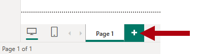

---
lab:
  title: Creare calcoli DAX in modelli semantici
  module: Create DAX calculations in semantic models
---

# Creare calcoli DAX in modelli semantici

## Presentazione del lab

In questo lab verranno create tabelle calcolate, colonne calcolate e misure semplici usando DAX (Data Analysis Expressions).

Contenuto del lab:

- Creare tabelle calcolate.
- Creare colonne calcolate.
- Creare misure.

**Il lab dovrebbe richiedere circa 45 minuti.**

## Operazioni preliminari

Per completare questo esercizio, aprire prima un Web browser e immettere l'URL seguente per scaricare il file ZIP:

`https://github.com/MicrosoftLearning/PL-300-Microsoft-Power-BI-Data-Analyst/raw/Main/Allfiles/Labs/04-create-dax-calculations\04-dax-calculations.zip`

Estrarre il file nella **cartella C:\Users\Student\Downloads\04-dax-calculations** .

Aprire il **file 04-Starter-Sales Analysis.pbix** .

> _**Nota**: è possibile che venga visualizzata una finestra di dialogo di accesso durante il caricamento del file. Selezionare **Annulla** per chiudere la finestra di dialogo di accesso. Chiudere qualsiasi altra finestra informativa. Selezionare **Applica in seguito**, se richiesto di applicare le modifiche._

## Creare la tabella calcolata Salesperson

In questa attività si creerà la `Salesperson` tabella calcolata (che avrà una relazione diretta con la `Sales` tabella).

Una tabella calcolata viene creata immettendo prima il nome della tabella, seguito dal simbolo di uguale (=), seguito da una formula DAX che restituisce una tabella. Il nome della tabella non può essere già presente nel modello di dati.

Immettere una formula DAX valida nella barra_ della _formula. La barra della formula include funzionalità come il completamento automatico, IntelliSense e la codifica a colori, che consentono di immettere in modo rapido e accurato la formula.

1. In Power BI Desktop, nella **visualizzazione** Report, nella **barra multifunzione Modellazione** selezionare **Nuova tabella** all'interno del **gruppo Calcoli**.

    

1. Nella barra della formula (che si apre direttamente sotto la barra multifunzione quando si creano o si modificano calcoli), digitare `Salesperson =`, premere **MAIUSC+INVIO**, digitare `'Salesperson (Performance)'`e quindi premere **INVIO**.

    > _**Nota**: per praticità, tutte le definizioni DAX in questo lab possono essere copiate dal file di frammenti di codice, che si trova nel **file 04-dax-calculations\Snippets.txt** ._

    

    > _Questa definizione di tabella crea una copia della `Salesperson (Performance)` tabella. Copia solo i dati, ma le proprietà del modello, ad esempio visibilità, formattazione e altre non vengono copiate._

1. **Nel riquadro Dati** si noti che l'icona per la nuova tabella include una calcolatrice aggiuntiva davanti a essa (denotando una tabella calcolata).

    

    > _**Nota**: le tabelle calcolate vengono definite usando una formula DAX che restituisce una tabella. È importante comprendere che le tabelle calcolate aumentano le dimensioni del modello di dati perché materializzano e archiviano i valori. Inoltre, vengono ricalcolate ogni volta che vengono aggiornate le dipendenze della formula, come nel caso di questo modello di dati quando vengono caricati nuovi valori di data (futuri) nelle tabelle._
    >
    > _A differenza delle tabelle con origine Power Query, le tabelle calcolate non possono essere usate per caricare dati da origini dati esterne. Possono trasformare i dati solo in base a ciò che è già stato caricato nel modello di dati._

1. Passare alla **visualizzazione** Modello e notare che la `Salesperson` tabella è disponibile.

1. Creare una relazione dalla `Salesperson | EmployeeKey` colonna alla `Sales | EmployeeKey` colonna.

    > _I lab usano una notazione abbreviata per fare riferimento a un campo. Sarà simile al seguente: `Salesperson | EmployeeKey`. In questo esempio è `Salesperson` il nome della tabella e `EmployeeKey` è il nome della colonna._

1. Fare clic con il pulsante destro del mouse sulla relazione inattiva (linea tratteggiata) tra le `Salesperson (Performance)` tabelle e `Sales` e quindi scegliere **Elimina**. Quando viene richiesto di confermare l'eliminazione, selezionare **Sì**.

1. `Salesperson` Nella tabella selezionare più colonne e quindi nasconderle (impostare la **proprietà Is Hidden** su _Sì_):

    - `EmployeeID`
    - `EmployeeKey`
    - `UPN`

1. Nel diagramma del modello selezionare la `Salesperson` tabella.

1. Nella casella Descrizione** del **** riquadro Proprietà** immettere: _Venditore correlato alle vendite_

    > _È possibile ricordare che le descrizioni vengono visualizzate come descrizioni comando nel **riquadro Dati** ogni volta che l'utente passa il cursore su una tabella o un campo._

1. Per la `Salesperson (Performance)` tabella, impostare la descrizione su: _Venditore correlato alle aree_

> _Il modello di dati offre ora due alternative per l'analisi dei venditori. La `Salesperson` tabella consente di analizzare le vendite effettuate da un venditore, mentre la `Salesperson (Performance)` tabella consente di analizzare le vendite effettuate nelle aree di vendita assegnate al venditore._

## Creare la tabella Date

In questa attività si creerà la `Date` tabella.

1. Passare alla **visualizzazione** Tabella. Nella scheda **Home** della barra multifunzione nel gruppo **Calcoli** selezionare **Nuova tabella**.

    

1. Nella barra della formula immettere il dax seguente:

    ```dax
    Date =  
    CALENDARAUTO(6)
    ```

    

    > _La `CALENDARAUTO` funzione restituisce una tabella a colonna singola che include valori di data. Il comportamento "automatico" analizza tutte le colonne di data del modello di dati per determinare i valori di data più recenti e meno recenti archiviati nel modello di dati. Crea quindi una riga per ogni data all'interno di questo intervallo, estendendo l'intervallo in entrambe le direzioni per garantire l'archiviazione completa di anni di dati._
    >
    > _Questa funzione può accettare un singolo argomento facoltativo che corrisponde al numero dell'ultimo mese di un anno. Se omesso, il valore è 12, ovvero dicembre è l'ultimo mese dell'anno. In questo caso, viene immesso 6, vale a dire che giugno è l'ultimo mese dell'anno._

1. Si noti la colonna di valori di data che potrebbero essere formattati usando le impostazioni internazionali degli Stati Uniti, ovvero mm/gg/aa.

    

1. Nell'angolo inferiore sinistro, nella barra di stato, si notino le statistiche della tabella, confermando che sono state generate 1826 righe di dati, che rappresenta i dati di cinque anni completi.

    

## Creare colonne calcolate

In questa attività verranno aggiunte altre colonne per abilitare il filtro e il raggruppamento in base a periodi di tempo diversi. Verrà creata anche una colonna calcolata per controllare l'ordinamento delle altre colonne.

> _**Nota**: per praticità, tutte le definizioni DAX in questo lab possono essere copiate dal **file Snippets.txt** ._

1. Nella barra multifunzione contestuale **Strumenti tabella** nel gruppo **Calcoli** selezionare **Nuova colonna**.

    > _Una colonna calcolata viene creata immettendo prima il nome della colonna, seguita dal simbolo di uguale (=), seguita da una formula DAX che restituisce un risultato a valore singolo. Il nome della colonna non può esistere già nella tabella._

    

1. Nella barra della formula digitare il comando seguente (o copiarlo dal file dei frammenti) e quindi premere **INVIO**:

    > _La formula usa il valore dell'anno della data, ma ne aggiunge uno al valore dell'anno quando il mese è successivo a giugno. Ecco come vengono calcolati gli anni fiscali di Adventure Works._

   ```dax
   Year =
   "FY" & YEAR('Date'[Date]) + IF(MONTH('Date'[Date]) > 6, 1)
   ```

1. Usare le definizioni di file di frammenti di codice per creare le due colonne calcolate seguenti per la `Date` tabella:

    - `Quarter`
    - `Month`

1. Verificare che le nuove colonne siano state aggiunte.

    

1. Per convalidare i calcoli, passare alla **visualizzazione** Report.

1. Per creare una nuova pagina del report, selezionare l'icona con il segno più accanto alla **pagina 1**.

    

1. Per aggiungere un oggetto visivo matrice alla nuova pagina del report, nel riquadro **Visualizzazioni** selezionare il tipo di oggetto visivo matrice.

    > _Suggerimento: è possibile passare il cursore su ogni icona per visualizzare una descrizione comando che descrive il tipo di oggetto visivo._

    

1. **Nel riquadro Dati** trascinare il `Year` campo nell'area Righe** dall'interno della **`Date` tabella.

    

1. Trascinare il `Month` campo nell'area **Righe** , direttamente sotto il `Year` campo.

1. In alto a destra dell'oggetto visivo matrice (o in basso, a seconda della posizione dell'oggetto visivo), selezionare l'icona a forma di freccia doppia con fork (che espanderà tutti gli anni verso il basso di un livello).

    

1. Si noti che gli anni si espandono di mesi e che i mesi sono ordinati alfabeticamente anziché in ordine cronologico.

    

    > _Per impostazione predefinita, i valori di testo ordinano alfabeticamente, i numeri sono ordinati dal più piccolo al più grande e le date sono ordinate dal più recente al più recente._

1. Per personalizzare l'ordinamento dei `Month` campi, passare alla **visualizzazione** Tabella.

1. Aggiungere la `MonthKey` colonna alla `Date` tabella.

    ```dax
    MonthKey =
    (YEAR('Date'[Date]) * 100) + MONTH('Date'[Date])
    ```

    > _Questa formula calcola un valore numerico per ogni combinazione di anno/mese._

1. In **Visualizzazione** tabella verificare che la nuova colonna contenga valori numerici, ad esempio 201707 per luglio 2017 e così via.

    

1. Tornare alla **visualizzazione** Report.

1. **Nel riquadro Dati** selezionare il `Month` campo .

1. Nella barra multifunzione contestuale **Strumenti colonna** nel gruppo **Ordina** selezionare **Ordina per colonna** e quindi **MonthKey**.

    

1. Nell'oggetto visivo matrice si noti che i mesi sono ora in ordine cronologico.

    

## Completare la tabella Date

In questa attività si completerà la progettazione della `Date` tabella nascondendo una colonna e creando una gerarchia. Si creeranno quindi relazioni con le `Sales` tabelle e `Targets` .

1. Passare alla **visualizzazione** Modello.

1. `Date` Nella tabella nascondere la `MonthKey` colonna (impostare **Nascosto** su _Sì_).

1. **Nel riquadro Dati** selezionare la tabella, fare clic con il `Date` pulsante destro del mouse sulla `Year` colonna e selezionare **Crea gerarchia**.

    

1. Nella casella Nome del **riquadro **Proprietà** sostituire il valore con _Fiscal_.**

    

1. Due livelli aggiungino livelli alla gerarchia, nell'elenco **a discesa Gerarchia** selezionare **Trimestre** e quindi **Mese** e quindi Applica **modifiche** al livello.

    

1. Creare le due relazioni del modello seguenti:

    - `Date | Date` a `Sales | OrderDate`
    - `Date | Date` a `Targets | TargetMonth`

1. Nascondere le due colonne seguenti:

    - `Sales | OrderDate`
    - `Targets | TargetMonth`

## Contrassegnare la tabella Date

In questa attività si contrassegnerà la `Date` tabella come tabella data.

1. Passare alla visualizzazione **Report**.

1. **Nel riquadro Dati** selezionare la `Date` tabella (non il `Date` campo).

1. **Nella barra multifunzione contestuale Strumenti** tabella selezionare **Contrassegna come tabella** data nel **gruppo Calendari**.

    

1. **Nella finestra Contrassegna come tabella** data scorrere la **proprietà Contrassegna come tabella** data su _Sì_.

1. Nell'elenco **a discesa Scegliere una colonna** data selezionare **Data**.

    

1. Seleziona **Salva**.

1. Salvare il file di Power BI Desktop.

> _Power BI Desktop ora riconosce che questa tabella definisce la data (ora)._
>
> _Questo approccio progettuale per una tabella data è adatto quando non si dispone di una tabella data nell'origine dati. Se si dispone di un data warehouse, sarebbe opportuno caricare i dati di data dalla tabella delle dimensioni data anziché "ridefinire" la logica della data nel modello di dati._

## Creare misure semplici

In questa attività verranno create misure semplici. Le misure semplici aggregano i valori in una singola colonna o conteggiano le righe di una tabella.

1. Nella **visualizzazione** Report, nella **pagina 2**, dal **riquadro Dati** trascinare il `Sales | Unit Price` campo nell'oggetto visivo matrice.

    

1. Nel riquadro campi visivi (che si trova nel riquadro Visualizzazioni **), nell'area **** Valori** si noti che `Unit Price` il campo è configurato come **Media prezzo** unitario.

    

1. Selezionare la freccia giù per **Average of Unit Price** (Media prezzo unitario) e quindi notare le opzioni di menu disponibili.

    > _Le colonne numeriche visibili consentono agli autori di report in fase di progettazione del report di decidere in che modo i valori delle colonne riepilogeranno (o meno). Tuttavia, può comportare la segnalazione inappropriata._
    >
    > _Alcuni modelli di dati non amano lasciare le cose per caso, quindi scelgono di nascondere queste colonne ed espongono invece la logica di aggregazione definita nelle misure. È l'approccio che verrà ora adottato in questo lab._

1. Per creare una misura, nel riquadro Dati** fare clic con il **pulsante destro del mouse sulla `Sales` tabella e quindi scegliere **Nuova misura**.

1. Nella barra della formula aggiungere la definizione di misura seguente:

    ```DAX
    Avg Price =  
    AVERAGE(Sales[Unit Price])
    ```

1. Aggiungere la `Avg Price` misura all'oggetto visivo matrice e notare che produce lo stesso risultato della `Unit Price` colonna (ma con formattazione diversa).

1. Nell'area **Valori** aprire il menu di scelta rapida per il `Avg Price` campo e notare che non è possibile modificare la tecnica di aggregazione.

    

    > _Non è possibile modificare il comportamento di aggregazione di una misura._

1. Usare le definizioni di file di frammenti di codice per creare le cinque misure seguenti per la `Sales` tabella:

    - `Median Price`
    - `Min Price`
    - `Max Price`
    - `Orders`
    - `Order Lines`

    > _La `DISTINCTCOUNT` funzione usata nella `Orders` misura conta gli ordini una sola volta (ignorando i duplicati). La `COUNTROWS` funzione usata nella `Order Lines` misura opera su una tabella._
    >
    > _In questo caso, il numero di ordini viene calcolato contando i valori di colonna distinti `SalesOrderNumber` , mentre il numero di righe di ordine è semplicemente il numero di righe di tabella (ogni riga è una riga di un ordine)._

1. Passare alla **visualizzazione** Modello e quindi selezionare più misure di prezzo: `Avg Price`, `Max Price`, `Median Price`e `Min Price`.

1. Per la selezione di più misure, configurare i requisiti seguenti:

    - Impostare il formato su due posizioni decimali.
    - Assegnare a una cartella di visualizzazione denominata _Pricing_ (usare la **proprietà Visualizza cartella** nel **riquadro Proprietà** ).

    

1. Nascondere la `Unit Price` colonna.

    > _La `Unit Price` colonna non è più disponibile per gli autori di report. Devono usare le misure di determinazione dei prezzi aggiunte al modello. Questo approccio di progettazione garantisce che gli autori di report non aggregano in modo inappropriato i prezzi, ad esempio sommandoli._

1. Selezionare più `Order Lines` misure e `Orders` e quindi configurare i requisiti seguenti:

    - Impostare il formato usando il separatore delle migliaia.
    - Assegnare a una cartella di visualizzazione denominata _Conteggi_.

    

1. Nella **visualizzazione** Report, nell'area **Valori** dell'oggetto visivo matrice, per **Media prezzo** unitario selezionare **X** per rimuoverlo.

    

1. Aumentare le dimensioni dell'oggetto visivo matrice per riempire la larghezza e l'altezza della pagina.

1. Aggiungere le cinque misure seguenti all'oggetto visivo matrice:

    - `Median Price`
    - `Min Price`
    - `Max Price`
    - `Orders`
    - `Order Lines`

1. Verificare che i risultati appaiano sensati e siano formattati correttamente.

    

## Creare misure aggiuntive

In questa attività verranno create più misure che usano formule più complesse.

1. Nella **visualizzazione** Report selezionare **Pagina 1** ed esaminare l'oggetto visivo tabella dei venditori (a destra), notando il totale per la **colonna Somma destinazione** .

    

1. Selezionare l'oggetto visivo tabella e quindi nel **riquadro Visualizzazioni** rimuovere **Somma destinazione**.

1. Rinominare la `Targets | Target` colonna come _TargetAmount_.

    > _Suggerimento: esistono diversi modi per rinominare la colonna nella **visualizzazione** Report: nel riquadro Dati** è possibile fare clic con il pulsante destro del **mouse sulla colonna e quindi scegliere **Rinomina** oppure fare doppio clic sulla colonna oppure premere **F2**._

1. Creare la misura seguente nella `Targets` tabella:

    ```dax
    Target =
    IF(
        HASONEVALUE('Salesperson (Performance)'[Salesperson]),
        SUM(Targets[TargetAmount])
    )
    ```

    > _La `HASONEVALUE` funzione verifica se viene filtrato un singolo valore nella `Salesperson` colonna. Se true, l'espressione restituisce la somma degli importi di destinazione (solo per tale venditore). Se false, `BLANK` viene restituito ._

1. Formattare la `Target` misura per zero cifre decimali.

    > _Suggerimento: è possibile usare la **barra multifunzione contestuale Strumenti** misure._

1. Nascondere la `TargetAmount` colonna.

    > _Suggerimento: è possibile fare clic con il pulsante destro del **mouse sulla colonna nel riquadro Dati** e quindi scegliere **Nascondi**._

1. Si noti che la `Targets` tabella viene ora visualizzata nella parte superiore dell'elenco.

    

    > _Le tabelle che comprendono solo le misure visibili vengono elencate automaticamente nella parte superiore dell'elenco._

1. Aggiungere la `Target` misura all'oggetto visivo tabella.

1. Si noti che il totale della **colonna di** destinazione è ora `BLANK`.

    

1. Usare le definizioni di file di frammenti di codice per creare le due misure seguenti per la `Targets` tabella:

    - `Variance`
    - `Variance Margin`

1. Formattare la `Variance` misura per zero cifre decimali.

1. Formattare la `Variance Margin` misura come percentuale con due posizioni decimali.

1. Aggiungere le `Variance` misure e `Variance Margin` all'oggetto visivo tabella.

1. Ridimensionare l'oggetto visivo tabella in modo che siano visibili tutte le colonne e le righe.

    

    > _Anche se appare che tutti i venditori non soddisfano la destinazione, tenere presente che l'oggetto visivo tabella non è ancora filtrato in base a un periodo di tempo specifico. Si produrranno report sulle prestazioni delle vendite che filtrano in base a un periodo di tempo selezionato dall'utente nel **lab Progettare un report in Power BI Desktop** ._

1. Salvare il file di Power BI Desktop.

## Lab completato

È possibile scegliere di salvare il report di Power BI, anche se non è necessario per questo lab. Nell'esercizio successivo si userà un file di avvio predefinito.

1. Passare al **menu "File"** nell'angolo in alto a sinistra e selezionare **"Salva con nome".** 
1. Selezionare **Esplora il dispositivo**
1. Selezionare la cartella in cui si desidera salvare il file e assegnargli un nome descrittivo. 
1. Selezionare il **pulsante Salva** per salvare il report come file con estensione pbix. 
1. Se viene visualizzata una finestra di dialogo che richiede di applicare modifiche alle query in sospeso, selezionare **Applica**.
1. Chiudere Power BI Desktop.