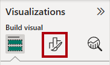
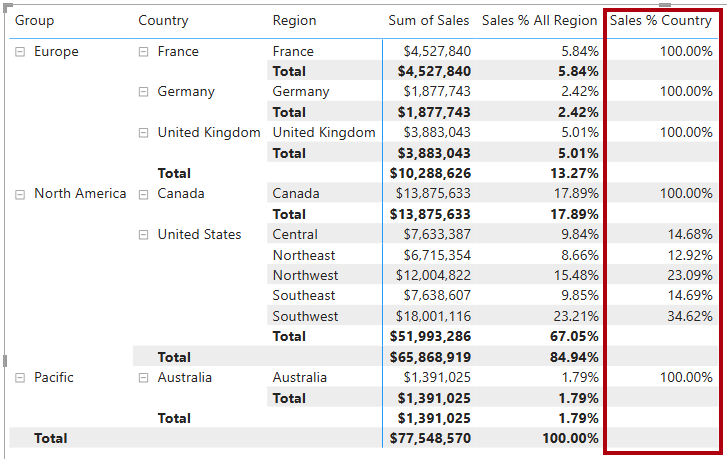
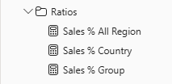

---
lab:
  title: Modificare il contesto di filtro DAX in Power BI
  module: Modify DAX filter context in Power BI
---

# Modificare il contesto di filtro DAX in Power BI

## Presentazione del lab

In questo lab verranno create misure con espressioni DAX che comportano la manipolazione del contesto di filtro.

Scopri come:

 - Usare la funzione per modificare il `CALCULATE` contesto di filtro.

**Questo lab dovrebbe richiedere circa 30 minuti.**

## Operazioni preliminari

Per completare questo esercizio, aprire prima un Web browser e immettere l'URL seguente per scaricare il file ZIP:

`https://github.com/MicrosoftLearning/PL-300-Microsoft-Power-BI-Data-Analyst/raw/Main/Allfiles/Labs/05-modify-dax-filter-context/05-modify-dax-filter-context.zip`

Estrarre il file nella **cartella C:\Users\Student\Downloads\05-modify-dax-filter-context** .

Aprire il **file 05-Starter-Sales Analysis.pbix** .

> _**Nota**: è possibile ignorare l'accesso selezionando **Annulla**. Chiudere qualsiasi altra finestra informativa. Selezionare **Applica in seguito**, se richiesto di applicare le modifiche._

## Creare un oggetto visivo matrice

In questa attività si creerà un oggetto visivo matrice per supportare il test delle nuove misure.

1. In Power BI Desktop creare una nuova pagina del report.

1. In **Pagina 3** aggiungere un oggetto visivo matrice.

    

1. Ridimensionare l'oggetto visivo matrice in modo da riempire l'intera pagina.

1. Per configurare i campi visivi matrice, dal **riquadro Dati** trascinare la `Region | Regions` gerarchia e rilasciarla all'interno dell'oggetto visivo.

    > Nei lab viene usata una notazione abbreviata per fare riferimento a un campo o a una gerarchia, Sarà simile al seguente: `Region | Regions`. In questo esempio è `Region` il nome della tabella ed `Regions` è la gerarchia name._

1. Aggiungere il `Sales | Sales` campo all'area **Valori** .

1. Per espandere l'intera gerarchia, nell'angolo superiore destro dell'oggetto visivo matrice fare clic sull'icona con la freccia con biforcazione.

    

1. Per formattare l'oggetto visivo, nel riquadro **Visualizzazioni** selezionare il riquadro **Formato**.

    

1. **Nella casella Cerca** immettere _Layout_.

1. Impostare la **proprietà Layout** su _Tabulare_.

    

1. Verificare che l'oggetto visivo matrice disponga ora di 4 intestazioni di colonna.

    

    > _In Adventure Works le aree di vendita sono organizzate in gruppi, paesi e aree geografiche. Tutti i paesi, ad eccezione del Stati Uniti, hanno solo un'area, denominata in base al paese. Poiché il Stati Uniti è un territorio di vendita così ampio, è suddiviso in cinque aree di vendita._

In questo esercizio verranno create varie misure e quindi verranno testate aggiungendole all'oggetto visivo matrice.

## Modificare il contesto di filtro

In questa attività verranno create diverse misure con espressioni DAX che usano la funzione per modificare il `CALCULATE` contesto di filtro.

> _La `CALCULATE` funzione è una funzione potente che è possibile usare per modificare il contesto di filtro. Il primo argomento accetta un'espressione o una misura (una misura è semplicemente un'espressione denominata). Gli argomenti successivi consentono di modificare il contesto di filtro._

1. Aggiungere una misura alla `Sales` tabella in base all'espressione seguente:

    > _**Nota**: per praticità, tutte le definizioni DAX in questo lab possono essere copiate dal **file C:\Users\Student\Downloads\05-modify-dax-filter-context\Snippets.txt** ._

    ```dax
    Sales All Region =
    CALCULATE(
        SUM(Sales[Sales]),
        REMOVEFILTERS(Region)
    )
    ```

    > _La `REMOVEFILTERS` funzione rimuove i filtri attivi. Non può accettare argomenti o una tabella, una colonna o più colonne come argomento._
    >
    > _In questa formula, la misura valuta la somma della `Sales` colonna in un contesto di filtro modificato, che rimuove tutti i filtri applicati alle colonne della `Region` tabella._

1. Aggiungere la `Sales All Region` misura all'oggetto visivo matrice.

    

1. Si noti che la misura calcola il totale di tutte le vendite di aree per ogni area geografica, paese (subtotale) e gruppo (subtotale).

    > _La nuova misura è ancora in grado di ottenere un risultato utile. Quando le vendite per un gruppo, un paese o un'area geografica sono divise per questo valore, produrrà un rapporto utile noto come "percentuale del totale complessivo"._

1. **Nel riquadro Dati** verificare che la `Sales All Region` misura sia selezionata (se selezionata avrà uno sfondo grigio scuro) e quindi nella barra della formula sostituire il nome della misura e la formula con la formula seguente:

    > _Suggerimento: per sostituire la formula esistente, copiare prima il frammento di codice. Selezionare quindi all'interno della barra della formula e premere **CTRL+A** per selezionare tutto il testo. Premere **quindi CTRL+V** per incollare il frammento per sovrascrivere il testo selezionato. Quindi premere **INVIO**._

    ```dax
    Sales % All Region =
    DIVIDE(
        SUM(Sales[Sales]),
        CALCULATE(
            SUM(Sales[Sales]),
            REMOVEFILTERS(Region)
        )
    )
    ```

    > _La misura è stata rinominata per riflettere in modo accurato la formula aggiornata. La `DIVIDE` funzione divide la somma della `Sales` colonna (non modificata dal contesto di filtro) per la somma della `Sales` colonna in un contesto modificato, che rimuove tutti i filtri applicati alla `Region` tabella._

1. Nell'oggetto visivo matrice si noti che la misura è stata rinominata e che ora viene visualizzato un valore diverso per ogni gruppo, paese e area geografica.

1. Formattare la `Sales % All Region` misura come percentuale con due posizioni decimali.

1. Nell'oggetto visivo matrice esaminare i valori delle `Sales % All Region` misure.

    

1. Aggiungere un'altra misura alla `Sales` tabella, in base all'espressione seguente e formattare come percentuale:

    ```dax
    Sales % Country =
    DIVIDE(
        SUM(Sales[Sales]),
        CALCULATE(
            SUM(Sales[Sales]),
            REMOVEFILTERS(Region[Region])
        )
    )
    ```

1. Si noti che la formula della `Sales % Country` misura è leggermente diversa dalla formula della `Sales % All Region` misura.

    > _La differenza è che il denominatore modifica il contesto di filtro rimuovendo i filtri nella `Region` colonna della `Region` tabella, non tutte le colonne della `Region` tabella. Ciò significa che tutti i filtri applicati alle colonne di gruppo o paese vengono mantenuti. Otterrà un risultato che rappresenta le vendite come percentuale di paese._

1. Aggiungere la `Sales % Country` misura all'oggetto visivo matrice.

1. Si noti che solo le aree del Stati Uniti producono un valore non pari al 100%.

    

    > _Si potrebbe ricordare che solo il Stati Uniti ha più aree. Tutti gli altri paesi comprendono una singola area, che spiega perché sono tutti del 100%._

1. Per migliorare la leggibilità di questa misura nell'oggetto visivo, sovrascrivere la `Sales % Country` misura con la formula migliorata seguente.

    ```dax
    Sales % Country =
    IF(
        ISINSCOPE(Region[Region]),
        DIVIDE(
            SUM(Sales[Sales]),
            CALCULATE(
                SUM(Sales[Sales]),
                REMOVEFILTERS(Region[Region])
            )
        )
    )
    ```

    > _La `IF` funzione usa la `ISINSCOPE` funzione per verificare se la colonna region è il livello in una gerarchia di livelli. Se true, la `DIVIDE` funzione viene valutata. Se false, `BLANK` viene restituito perché la colonna dell'area non è nell'ambito._

1. Si noti che la `Sales % Country` misura restituisce ora solo un valore quando un'area è nell'ambito.

    

1. Aggiungere un'altra misura alla `Sales` tabella, in base all'espressione seguente e formattare come percentuale:

    ```dax
    Sales % Group =
    DIVIDE(
        SUM(Sales[Sales]),
        CALCULATE(
            SUM(Sales[Sales]),
            REMOVEFILTERS(
                Region[Region],
                Region[Country]
            )
        )
    )
    ```

    > _Per ottenere le vendite come percentuale di gruppo, è possibile applicare due filtri per rimuovere in modo efficace i filtri su due colonne._

1. Aggiungere la `Sales % Group` misura all'oggetto visivo matrice.

1. Per migliorare la leggibilità di questa misura nell'oggetto visivo, sovrascrivere la `Sales % Group` misura con la formula seguente.

    ```dax
    Sales % Group =
    IF(
        ISINSCOPE(Region[Region])
            || ISINSCOPE(Region[Country]),
        DIVIDE(
            SUM(Sales[Sales]),
            CALCULATE(
                SUM(Sales[Sales]),
                REMOVEFILTERS(
                    Region[Region],
                    Region[Country]
                )
            )
        )
    )
    ```

1. Si noti che la `Sales % Group` misura restituisce ora solo un valore quando un'area o un paese si trova nell'ambito.

1. Nella vista Modello inserire le tre nuove misure in una cartella di visualizzazione denominata _Ratios_.

    

1. Salvare il file di Power BI Desktop.

> _Le misure aggiunte alla tabella hanno modificato il `Sales` contesto di filtro per ottenere lo spostamento gerarchico. Si noti che il modello per ottenere il calcolo di un subtotale richiede la rimozione di alcune colonne dal contesto di filtro e per arrivare a un totale complessivo, è necessario rimuovere tutte le colonne._

## Lab completato
