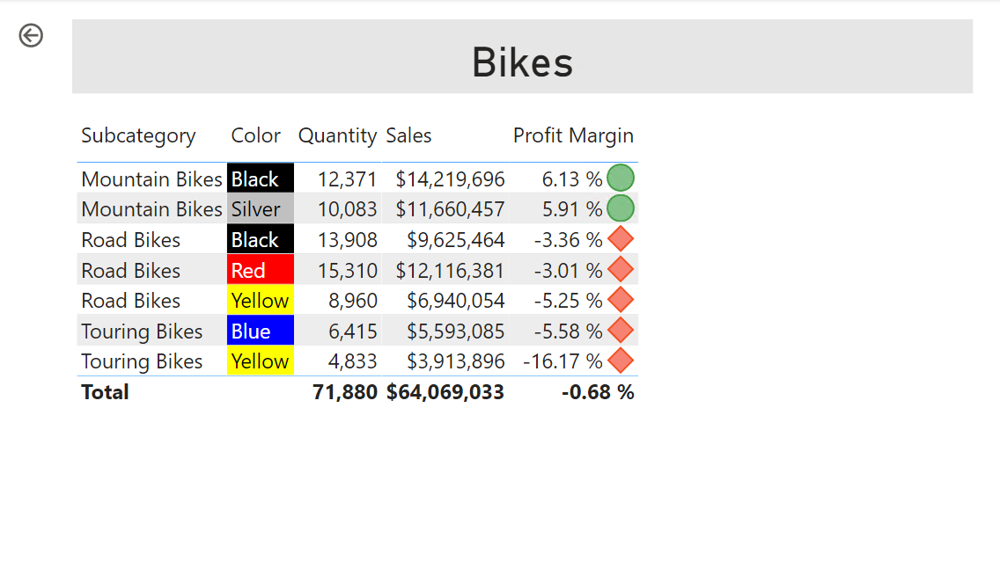
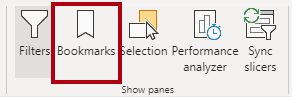
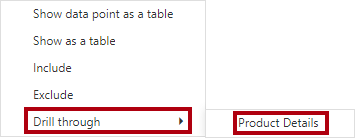

---
lab:
  title: Migliorare un report in Power BI Desktop
  module: Create Reports in Power BI desktop
---

# Migliorare un report in Power BI Desktop

## Presentazione del lab

In questo lab si migliorerà l'analisi **** delle vendite con funzionalità di progettazione avanzate.

Contenuto del lab:

- Sincronizzare i filtri dei dati
- Creare una pagina di drill-through
- Applicare la formattazione condizionale
- Creare e usare segnalibri e pulsanti

**Il lab dovrebbe richiedere circa 45 minuti.**

## Operazioni preliminari

Per completare questo esercizio, aprire prima un Web browser e immettere l'URL seguente per scaricare la cartella ZIP:

`https://github.com/MicrosoftLearning/PL-300-Microsoft-Power-BI-Data-Analyst/raw/Main/Allfiles/Labs/07-design-report-in-power-bi-desktop-enhanced/07-enhanced-report.zip`

Estrarre la cartella nella **cartella C:\Users\Student\Downloads\07-enhanced-report** .

Aprire il **file 07-Starter-Sales Analysis.pbix** .

> ***Nota**: è possibile ignorare l'accesso selezionando **Annulla**. Chiudere qualsiasi altra finestra informativa. Selezionare **Applica in seguito**, se richiesto di applicare le modifiche.*

## Sincronizzare i filtri dei dati

In questa attività si sincronizzeranno i **filtri dei dati Year** e **Region** , continuando lo sviluppo del report creato nel **lab Progettare un report in Power BI Desktop** .

1. In Power BI Desktop, nella pagina **Overview** impostare il filtro dei dati **Year** su **FY2018**.

1. Passare alla pagina **My Performance** e osservare che il filtro dei dati **Year** è un valore diverso.

    > *Quando i filtri dei dati non vengono sincronizzati, possono contribuire alla rappresentazione errata dei dati e alla frustrazione per gli utenti del report. A questo punto si sincronizzeranno i filtri dei dati del report.*

1. Tornare alla pagina **Overview** e quindi selezionare il filtro dei dati **Year**.

1. Nella scheda della barra multifunzione **Visualizza** selezionare **Sincronizza filtri dei dati** all'interno del gruppo **Mostra riquadri**.

     

1. Nel riquadro **Sincronizza filtri dei dati** (a sinistra del riquadro **Visualizzazioni**), nella seconda colonna (che rappresenta la sincronizzazione) selezionare le caselle di controllo per le pagine **Overview** e **My Performance**.

     

1. Nella pagina **Overview** selezionare il filtro dei dati **Region**.

1. Sincronizzare il filtro dei dati con le pagine **Overview** e **Profit**.

     

1. Testare i filtri dei dati sincronizzati selezionando altre opzioni di filtro e quindi verificando che i filtri dei dati sincronizzati vengano filtrati in base alla stessa selezione.

1. Per chiudere la **pagina Sincronizza filtro dei** dati, selezionare l'opzione **Sincronizza filtro** dei dati disponibile nella **scheda Visualizza** della barra multifunzione.

## Configurare una pagina di drill-through

In questo esercizio si creerà una nuova pagina e la si configurerà come pagina di drill-through. Completata la progettazione, la pagina sarà simile alla seguente:

1. Aggiungere una nuova pagina del report denominata **Product Details**.

1. Fare clic con il pulsante destro del mouse sulla scheda della pagina **Product Details**, quindi selezionare **Nascondi pagina**.

    > *Gli utenti del report non potranno passare direttamente alla pagina di drill-through. Dovranno accedervi dagli oggetti visivi in altre pagine. Si apprenderà come eseguire il drill-through alla pagina nell'esercizio finale di questo lab.*

1. Sotto il riquadro **Visualizzazioni**, nella sezione **Drill-through** aggiungere il campo **Product \| Category** alla casella **Aggiungere i campi di drill-through qui**.

    > *I lab usano una notazione abbreviata per fare riferimento a un campo. Avrà un aspetto simile al seguente: **Categoria** prodotto\|. In questo esempio Product **** è il nome della tabella e **Category** è il nome del campo.*

     

1. Per testare la pagina di drill-through, nella scheda del filtro di drill-through selezionare **Bikes**.

     

1. Si noti il pulsante freccia in alto a sinistra nella pagina del report.

    > *Un pulsante freccia viene aggiunto automaticamente quando un campo viene aggiunto all'area/area di drill-through. Consente agli utenti del report di tornare alla pagina da cui è stato eseguito il drill-through.*

1. Aggiungere un oggetto visivo **Scheda** alla pagina, quindi ridimensionarlo e posizionarlo in modo che si trovi a destra del pulsante e riempia la larghezza rimanente della pagina.

    

    

1. Trascinare il campo **Product \| Category** nell'oggetto visivo scheda.

1. Configurare le opzioni di formato per l'oggetto visivo, quindi **disattivare** la proprietà **Etichetta categoria**.

     

1. Impostare la **proprietà Effetti > colore di sfondo** su un'ombreggiatura chiara di grigio, *ad esempio Bianco, 20% più* scuro.

     

1. Aggiungere un oggetto visivo **Tabella** alla pagina, quindi ridimensionarlo e posizionarlo in modo che si trovi sotto l'oggetto visivo scheda e riempia lo spazio rimanente sulla pagina.

     

     

1. Aggiungere i campi seguenti all'oggetto visivo:

     - **Sottocategoria prodotto \|**
     - **Colore prodotto \|**
     - **Sales \| Quantity**
     - **Sales \| Sales**
     - **Sales \| Profit Margin**

1. Configurare le opzioni di formato per l'oggetto visivo e nelle **sezioni Valori** e **Intestazioni** colonna impostare la **proprietà Dimensioni** testo su **20pt**.

*La progettazione della pagina di drill-through è quasi completa. Si migliorerà la pagina con la formattazione condizionale nell'esercizio successivo.*

## Aggiungere la formattazione condizionale

In questo esercizio si migliorerà la pagina di drill-through con la formattazione condizionale. Completata la progettazione, la pagina sarà simile alla seguente:

1. Selezionare l'oggetto visivo tabella. Nel riquadro di visualizzazione selezionare la freccia giù nel **valore Profit Margin** e quindi selezionare **Icone** di formattazione \| condizionale.

    

1. Nella finestra **Icone - Profit Margin** selezionare **A destra dei dati** nell'elenco a discesa **Layout icona**.

    

1. Per eliminare la regola centrale, a destra del triangolo giallo selezionare **X**.

    

1. Configurare la prima regola (rombo rosso) come indicato di seguito:

    - Nel secondo controllo rimuovere il valore
    - Nel terzo controllo selezionare **Numero**
    - Nel quinto controllo immettere **0**
    - Nel sesto controllo selezionare **Numero**

1. Configurare la seconda regola (cerchio verde) come indicato di seguito, quindi selezionare **OK**:

    > *Le regole possono essere interpretate come segue: visualizzare un diamante rosso se il valore del margine di profitto è minore di 0; in caso contrario, se il valore è maggiore o uguale a zero, visualizzare un cerchio verde.*

    - Nel secondo controllo immettere **0**
    - Nel terzo controllo selezionare **Numero**
    - Nel quinto controllo rimuovere il valore
    - Nel sesto controllo selezionare **Numero**

    

1. Nell'oggetto visivo tabella verificare che siano visualizzate le icone corrette.

    

1. Configurare la formattazione condizionale del colore di sfondo per il campo **Colore**.

1. Nella finestra **Colore di sfondo - Colore** selezionare **Valore campo** nell'elenco a discesa **Stile formato**.

1. Nell'elenco **a discesa What field should we base this on?** , select **Product \| Formatting \| Background Color Format**, then **OK**.

    

1. Ripetere i passaggi precedenti per configurare la formattazione condizionale del colore del carattere per il campo **Colore** usando il campo **Product \| Formattazione \| Formato del colore del carattere**

*Si ricorderà che i colori dello sfondo e del tipo di carattere sono stati originati dal file **ColorFormats.csv** nel lab **Preparare i dati in Power BI Desktop** e quindi integrati con la query **Product** nel lab **Caricare i dati in Power BI Desktop**.*

## Aggiungere segnalibri e pulsanti

In questo esercizio si migliorerà la **pagina Prestazioni** personali con i pulsanti, consentendo all'utente del report di selezionare il tipo di oggetto visivo da visualizzare. Completata la progettazione, la pagina sarà simile alla seguente:

1. Passare alla pagina **My Performance**. Nella scheda della barra multifunzione **Visualizza** selezionare **Segnalibri** all'interno del gruppo **Mostra riquadri**.

    

1. Nella scheda della barra multifunzione **Visualizza** selezionare **Selezione** all'interno del gruppo **Mostra riquadri**.

1. Nel riquadro **Selezione** selezionare l'icona a forma di occhio accanto a uno degli elementi **Sales and Target by Month** per nascondere l'oggetto visivo.

    

1. Nel riquadro **Segnalibri** selezionare **Aggiungi**.

    > *Per rinominare il segnalibro, fare doppio clic sul segnalibro.*

    

1. Se il grafico visibile è un grafico a barre, rinominare il segnalibro in **Bar Chart ON**, se invece è un istogramma, rinominarlo in **Column Chart ON**.

1. Per modificare il segnalibro, nel **riquadro Segnalibri** passare il cursore sul segnalibro, selezionare i puntini di sospensione e quindi selezionare **Dati**.

    > *La disabilitazione dell'opzione **Dati** indica che il segnalibro non userà lo stato del filtro corrente. Questo è importante perché in caso contrario, il segnalibro blocca in modo permanente il filtro attualmente applicato dal filtro dei **dati Year** .*

     

1. Per aggiornare il segnalibro, selezionare di nuovo i puntini di sospensione e quindi selezionare **Aggiorna**.

    > *Nei passaggi seguenti si creerà e si configurerà un secondo segnalibro per visualizzare il secondo oggetto visivo.*

1. Nel riquadro **Selezione** attivare e disattivare la visibilità dei due elementi **Sales and Target by Month**.

    > *In altre parole, rendere l'oggetto visivo visibile nascosto e rendere visibile l'oggetto visivo nascosto.*

     

1. Creare un secondo segnalibro e denominarlo in modo appropriato (**Column Chart ON** o **Bar Chart ON).**

     

1. Configurare il secondo segnalibro in modo da ignorare i filtri (opzione**Dati** disattivata) e aggiornare il segnalibro.

1. Nel riquadro **Selezione** è sufficiente visualizzare l'oggetto visivo nascosto per rendere visibili entrambi gli oggetti visivi.

1. Ridimensionare e riposizionare entrambi gli oggetti visivi in modo che riempiano la pagina sotto l'oggetto visivo a più schede e si sovrappongano completamente l'uno all'altro.

    *Per selezionare l'oggetto visivo coperto, selezionarlo nel **riquadro Selezione** .*

    

1. Nel riquadro **Segnalibri** selezionare ognuno dei segnalibri e verificare che è visibile solo uno degli oggetti visivi.

*La fase successiva della progettazione consiste nell'aggiungere due pulsanti alla pagina, che consentirà all'utente del report di selezionare i segnalibri.*

1. Sulla barra multifunzione **Inserisci** selezionare **Pulsante** all'interno del gruppo **Elementi** e quindi selezionare **Vuoto**.

     

1. Posizionare il pulsante direttamente sotto il filtro dei dati **Year**.

1. Selezionare il pulsante e quindi nel **riquadro del pulsante** Formato selezionare **Pulsante**, espandere **La sezione Stile** e impostare la **proprietà Testo** su **Sì**.

     

1. Espandere la **sezione Testo** e quindi nella **casella Di testo** immettere Grafico** a **barre.

1. Espandere la **sezione Riempimento** e quindi impostare un colore di riempimento usando un colore complementare.

1. Selezionare **Pulsante** e impostare la **proprietà Action** su **Sì**.

    

1. Espandere la sezione **Azione**, quindi impostare l'elenco a discesa **Tipo** su **Segnalibro**.

1. Nell'elenco a discesa **Segnalibro** selezionare **Bar Chart ON**.

    

1. Creare una copia del pulsante con un'operazione di copia e incolla, quindi configurare il nuovo pulsante come segue:

    *Suggerimento: i comandi di scelta rapida per copia e incolla sono **CTRL+C** seguiti da **CTRL+V**.*

    - Impostare la proprietà **Testo pulsante** su **Istogramma**
    - Nella sezione **Azione** impostare l'elenco a discesa **Segnalibro** su **Column Chart ON**

*La progettazione del report Sales Analysis è stata completata.*

## Pubblicare ed esplorare il report

In questo esercizio si pubblicherà il report nel servizio Power BI ed si esaminerà il comportamento del report pubblicato.

> **Nota**: è possibile esaminare il resto dell'esercizio, anche se non si ha accesso al servizio Power BI online per eseguire direttamente le attività.

1. Selezionare la pagina di **panoramica**.

1. Nel filtro dei dati **Year** selezionare **FY2020**.

1. Nel filtro dei dati **Region** selezionare **Select All**.

1. Salvare il file di Power BI Desktop.

1. Nella scheda della barra multifunzione **Home** selezionare **Pubblica** all'interno del gruppo **Condividi**.

    > *Se non è già stato eseguito l'accesso a Power BI Desktop, è necessario eseguire l'accesso per la pubblicazione.*

     

1. Nella finestra **Pubblica in Power BI** si noti che l'opzione **Area di lavoro** è selezionata.

1. Per pubblicare il report, selezionare **Seleziona**.
    1. Se viene richiesto di sostituire il modello semantico, selezionare **Sostituisci**.
    1. Al termine della pubblicazione, fare clic su **Chiudi**.

1. Chiudere Power BI Desktop.

1. In una finestra del browser Microsoft Edge passare alla servizio Power BI > **Area di lavoro** personale e quindi selezionare il **report Analisi** vendite.

1. Per testare la funzionalità di drill-through, passare alla **pagina Panoramica** > **quantità per oggetto visivo Categoria** . Fare quindi clic con il pulsante destro del mouse sulla **barra Abbigliamento** e selezionare **Drill-Through Product Details (Dettagli** prodotto drill-through\|).

     

1. Si noti che la pagina **Product Details** fa riferimento a **Clothing**.

1. Per tornare alla pagina di origine, nell'angolo superiore sinistro della pagina selezionare il pulsante freccia.

1. Selezionare la pagina **My Performance**.

     > *Selezionare ognuno dei pulsanti e quindi notare che viene visualizzato un oggetto visivo diverso.*

## Lab completato
