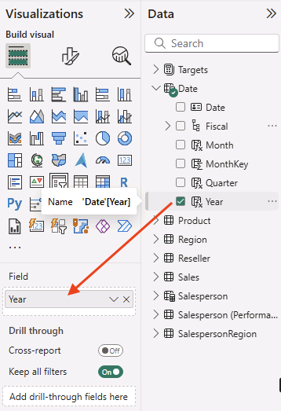
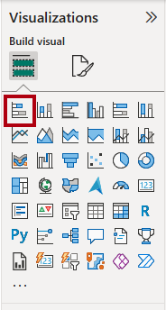
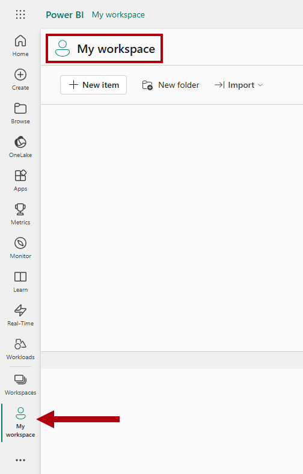

---
lab:
  title: Progettare i report di Power BI
  module: Design Power BI reports
---

# Progettare i report di Power BI

## Presentazione del lab

In questo lab verrà creato un report di tre pagine. Verrà quindi pubblicato nel servizio Power BI, in cui si aprirà e si interagirà con il report.

Contenuto del lab:

- Progettare un report.
- Configurare i campi visivi e le proprietà di formato.
- Sincronizzare i filtri dei dati.
- Pubblicare il report nel servizio Power BI.
- Interagire con un report e i relativi oggetti visivi.

**Il lab dovrebbe richiedere circa 45 minuti.**

## Operazioni preliminari

Per completare questo esercizio, aprire prima un Web browser e immettere l'URL seguente per scaricare un file ZIP:

`https://github.com/MicrosoftLearning/PL-300-Microsoft-Power-BI-Data-Analyst/raw/Main/Allfiles/Labs/08-design-power-bi-reports/08-design-report.zip`

Estrarre il file nella **cartella C:\Users\Student\Downloads\08-design-report** .

Aprire il **file 08-Starter-Sales Analysis.pbix** .

> _**Nota**: è possibile che venga visualizzata una finestra di dialogo di accesso durante il caricamento del file. Selezionare **Annulla** per chiudere la finestra di dialogo di accesso. Chiudere qualsiasi altra finestra informativa. Selezionare **Applica in seguito**, se richiesto di applicare le modifiche._

## Progettare la pagina 1

In questa attività verrà progettata la prima pagina del report. Completata la progettazione, la pagina sarà simile alla seguente:

1. In Power BI Desktop rinominare la pagina, in basso a sinistra fare clic con il pulsante destro del mouse sulla **pagina 1** e quindi scegliere **Rinomina**. Rinominare la pagina come _Panoramica_.

    > _Suggerimento: è anche possibile fare doppio clic sul nome della pagina per rinominarlo._

1. Per aggiungere un'immagine, nella scheda della barra multifunzione **Inserisci** selezionare **Immagine** all'interno del gruppo **Elementi**.

    

1. **Nella finestra Apri** passare alla **cartella C:\Users\Student\Downloads\08-design-report**.

1. Selezionare il file **AdventureWorksLogo.jpg** e quindi **Apri**.

1. Trascinare l'immagine per posizionarla nell'angolo superiore sinistro, quindi trascinare anche i marcatori per ridimensionarla.

    

1. Per aggiungere un filtro dei dati, deselezionare prima di tutto l'immagine selezionando un'area vuota della pagina del report, quindi selezionare **Filtro** dei **dati nel riquadro Visualizzazioni** .

    

1. **Nel riquadro Dati** trascinare il `Date | Year` campo (non il `Year` livello della gerarchia) nell'area **Campo** filtro dei **dati nel riquadro Visualizzazioni**.

    > _I lab usano una notazione abbreviata per fare riferimento a un campo. Sarà simile al seguente: `Date | Year`. In questo esempio, `Date` è il nome della tabella e `Year` è il nome del campo._

    

1. Per convertire il filtro dei dati da un elenco a discesa, nel riquadro Visualizzazioni** selezionare **Formato oggetto visivo**.** Espandere Impostazioni **** filtro dei dati e quindi impostare l'elenco **a discesa **Stile** su Elenco a discesa**.

    

1. Ridimensionare e posizionare il filtro dei dati in modo che si trovi sotto l'immagine e abbia la stessa larghezza dell'immagine.

    

1. Nel filtro dei dati **Year** aprire l'elenco a discesa, selezionare **FY2020** e quindi comprimere l'elenco a discesa.

    > _La pagina del report è ora filtrata in base all'anno **FY2020**._

    

1. Deselezionare il filtro dei dati facendo clic su un'area vuota della pagina del report.

1. Creare un secondo filtro dei dati, in base al `Region | Region` campo (non al `Region` livello della gerarchia).

1. Lasciare il filtro dei dati come elenco, quindi ridimensionarlo e posizionarlo sotto il filtro dei dati **Year**.

    

1. Deselezionare il filtro dei dati facendo clic su un'area vuota della pagina del report.

1. Per aggiungere un grafico alla pagina, nel riquadro **Visualizzazioni** selezionare il tipo di oggetto visivo **Grafico a linee e istogramma in pila**.

    

1. Ridimensionare e posizionare l'oggetto visivo in modo che si trovi a destra del logo, riempiendo la pagina del report in larghezza.

    

1. Trascinare i campi seguenti nell'oggetto visivo:

     - `Date | Month`
     - `Sales | Sales`

1. Nel riquadro campi visivi (che si trova nel **riquadro Visualizzazioni** ), si noti che i campi vengono assegnati agli **assi** X e **Agli assi** y della colonna.

    > _Trascinando i campi in un oggetto visivo, vengono aggiunti agli well predefiniti. Per precisione, è possibile trascinare i campi direttamente nei pozzi, come si farà successivamente._

    

1. **Dal riquadro Dati** trascinare il `Sales | Profit Margin` campo nell'area **Asse** y linea.

    

1. Si noti che l'oggetto visivo ha solo 11 mesi.

    > _L'ultimo mese dell'anno, giugno 2020, non ha ancora vendite. Per impostazione predefinita, l'oggetto visivo ha eliminato mesi con `BLANK` vendite. Si configurerà ora l'oggetto visivo per visualizzare tutti i mesi._

1. Nel riquadro campi visivi, nell'area **Asse** X, per il **campo Mese** selezionare la freccia rivolta verso il basso e quindi selezionare **Mostra elementi senza dati**.

    

    > _Si noti che ora viene visualizzato il mese **2020 giugno** ._

1. Deselezionare il grafico facendo clic su un'area vuota della pagina del report.

1. Per aggiungere un grafico alla pagina, nel **riquadro Visualizzazioni** selezionare il **tipo di oggetto visivo Istogramma** in pila.

    

1. Ridimensionare e posizionare l'oggetto visivo in modo che si trovi sotto l'istogramma o grafico a linee, riempiendo per metà il grafico al di sopra.

    

1. Aggiungere i campi seguenti alle finestre dell'oggetto visivo:

     - Asse x: `Region | Group`
     - Asse y: `Sales | Sales`
     - Leggenda: `Product | Category`

1. Deselezionare il grafico facendo clic su un'area vuota della pagina del report.

1. Per aggiungere un grafico alla pagina, nel riquadro **Visualizzazioni** selezionare il tipo di oggetto visivo **Grafico a barre in pila**.

    

1. Ridimensionare e posizionare l'oggetto visivo in modo da riempire lo spazio rimanente della pagina del report.

    

1. Aggiungere i campi seguenti alle finestre dell'oggetto visivo:

     - Asse y: `Product | Category`
     - Asse x: `Sales | Quantity`

1. Per formattare l'oggetto visivo, aprire il riquadro **Formato**.

    

1. Espandere la **sezione Barre** e quindi nel **gruppo Colore** impostare la **proprietà Color** su un colore appropriato (per completare l'istogramma/grafico a linee).

1. Impostare la **sezione Etichette** dati su **Sì**.

    

1. Salvare il file di Power BI Desktop.

    > _La progettazione della prima pagina è stata completata._

## Progettare la pagina 2

In questa attività verrà progettata la seconda pagina del report. Completata la progettazione, la pagina sarà simile alla seguente:

> _**Importante**: quando sono già state fornite istruzioni dettagliate nei lab, i passaggi del lab forniranno istruzioni più concise. Se sono necessarie le istruzioni dettagliate, è possibile fare riferimento ad altre attività in questo lab._

1. Per creare una nuova pagina, fare clic sul segno più (+) in basso a sinistra. Quando la pagina viene aggiunta, rinominarla come _Profit_.

1. Aggiungere un filtro dei dati in base al `Region | Region` campo.

1. Usare il riquadro Formato** per visualizzare l'opzione _Seleziona tutto_ (disponibile nella **sezione Impostazioni filtro dei dati > selezione**).**

1. Ridimensionare e posizionare il filtro dei dati in modo che si trova sul lato sinistro della pagina del report e quindi si tratti di circa la metà dell'altezza della pagina.

    

1. Aggiungere un oggetto visivo matrice, ridimensionarlo e posizionarlo in modo da riempire lo spazio rimanente della pagina del report

    

1. Aggiungere la `Date | Fiscal` gerarchia all'area Righe** della matrice**.

    

1. Aggiungere i cinque `Sales` campi di tabella seguenti all'area **Valori** :

     - `Orders` (dalla `Counts` cartella)
     - `Sales`
     - `Cost`
     - `Profit` (dalla `Pricing` cartella)
     - `Profit Margin` (dalla `Pricing` cartella)

    

1. **Nel riquadro Filtri (a sinistra del **riquadro Visualizzazioni**), si noti la **sezione Filtri** in questa pagina** (potrebbe essere necessario espandere il riquadro e scorrere verso il basso).

    

1. **Dal riquadro Dati** trascinare il `Product | Category` campo nell'area **Filtri in questa pagina**.

    > _I campi aggiunti al **riquadro Filtri** possono ottenere lo stesso risultato di un filtro dei dati. Una differenza è che non occupano spazio nella pagina del report. Un'altra differenza consiste nel fatto che possono essere configurati per ottenere requisiti di filtro più sofisticati._

1. All'interno della scheda filtro, in alto a destra, selezionare la freccia per comprimere la scheda.

1. Aggiungere ognuno dei campi della tabella seguenti `Product` all'area **Filtri in questa pagina** , collassando ognuno, direttamente sotto il `Category` campo:

     - `Subcategory`
     - `Product`
     - `Color`

    

1. Salvare il file di Power BI Desktop.

    > _La progettazione della seconda pagina è stata completata._

## Progettare la pagina 3

In questa attività verrà progettata la terza pagina del report e la pagina finale del report. Completata la progettazione, la pagina sarà simile alla seguente:

1. Creare una nuova pagina e rinominarla come _Prestazioni_ personali.

1. Per simulare le prestazioni dei filtri di sicurezza a livello di riga, trascinare il `Salesperson (Performance) | Salesperson` campo nei filtri a livello di pagina nel riquadro filtro.

    

1. Nella scheda filtro selezionare **Michael Blythe**.

    > _I dati nella pagina del report verranno ora filtrati per visualizzare i dati solo per Michael Blythe._

1. Aggiungere un filtro dei dati a discesa in base al `Date | Year` campo e quindi ridimensionarlo e posizionarlo in modo che si trova nell'angolo superiore sinistro della pagina.

    

1. Nel filtro dei dati impostare la pagina in modo da filtrare in base a **FY2019**.

    

1. Aggiungere un **oggetto visivo Scheda** a più righe alla pagina e quindi ridimensionarlo e riposizionarlo in modo che si trova a destra del filtro dei dati e riempia la larghezza rimanente della pagina.

    

    

1. Aggiungere i quattro campi seguenti all'oggetto visivo:

     - `Sales | Sales`
     - `Targets | Target`
     - `Targets | Variance`
     - `Targets | Variance Margin`

1. Formattare l'oggetto visivo:

     - **Nella sezione Valori** callout aumentare la proprietà dimensione carattere a **28pt**.
     - **Nella scheda Generale**, nella **sezione Effetti**, impostare la proprietà colore di sfondo su un colore grigio chiaro (ad esempio _Bianco, 10% Più_ scuro) per fornire il contrasto.

        

1. Aggiungere un **oggetto visivo Grafico** a barre cluster alla pagina e quindi ridimensionarlo e posizionarlo in modo che si trova sotto l'oggetto visivo scheda a più righe e riempia l'altezza rimanente della pagina e metà della larghezza dell'oggetto visivo scheda a più righe.

    

    

1. Aggiungere i campi seguenti alle finestre dell'oggetto visivo:

     - Asse y: `Date | Month`
     - Asse X: `Sales | Sales` e `Targets | Target`

        

1. Per creare una copia dell'oggetto visivo, premere **CTRL + C**, quindi premere **CTRL + V**.

1. Posizionare il nuovo oggetto visivo a destra dell'oggetto visivo originale.

    

1. Per modificare il tipo di visualizzazione, nel riquadro **Visualizzazioni** selezionare **Istogramma a colonne raggruppate**.

    

     > _È ora possibile visualizzare gli stessi dati espressi da due tipi di visualizzazione diversi. La progettazione della pagina finale è stata completata._

## Sincronizzare i filtri dei dati

In questa attività si sincronizzeranno i _filtri dei dati Year_ e _Region_ .

1. _Nella pagina Panoramica_ impostare il _filtro dei dati Year_ su **FY2018**.

1. Passare alla _pagina Prestazioni_ personali e quindi notare che il _filtro dei dati Year_ ha un valore diverso.

    > _Quando i filtri dei dati non vengono sincronizzati, possono contribuire alla rappresentazione errata dei dati e alla frustrazione per gli utenti del report. A questo punto si sincronizzeranno i filtri dei dati del report._

1. Tornare alla pagina _Overview_ e quindi selezionare il filtro dei dati _Year_.

1. Nella scheda della barra multifunzione **Visualizza** selezionare **Sincronizza filtri dei dati** all'interno del gruppo **Mostra riquadri**.

    

1. Nel riquadro **Sincronizza filtri dei dati** (a sinistra del riquadro **Visualizzazioni**), nella seconda colonna (che rappresenta la sincronizzazione) selezionare le caselle di controllo per le pagine _Overview_ e _My Performance_.

    

1. Nella pagina _Overview_ selezionare il filtro dei dati _Region_.

1. Sincronizzare il filtro dei dati con le pagine _Overview_ e _Profit_.

    

1. Testare i filtri dei dati sincronizzati selezionando altre opzioni di filtro e quindi verificando che i filtri dei dati sincronizzati vengano filtrati in base alla stessa selezione.

1. Per chiudere il **riquadro Sincronizza filtro dei** dati, selezionare l'opzione **Sincronizza filtro** dei dati disponibile nella **scheda Visualizza** della barra multifunzione.

## Pubblicare ed esplorare il report

In questa attività si pubblicherà il report nel servizio Power BI. Si esaminerà quindi il comportamento del report pubblicato.

> _**Nota**: per pubblicare il report sarà necessaria almeno una **licenza gratuita** di Power BI. Aprire il browser Microsoft Edge e passare a_ `https://app.powerbi.com`_.  Accedere con le credenziali per il tenant di Microsoft 365 fornito dall'host del lab autorizzato (ALH). Quando viene chiesto di risolvere un puzzle o di avviare una versione di valutazione gratuita di Fabric, è possibile ignorare questo e chiudere il browser._

> _**Nota**: è possibile esaminare il resto dell'esercizio, anche se non si ha accesso al servizio Power BI per eseguire direttamente le attività._

1. Selezionare la _pagina Panoramica_ e quindi salvare il file di Power BI Desktop.

1. Nella scheda della barra multifunzione **Home** selezionare **Pubblica** all'interno del gruppo **Condividi**.

    > _Se non si è già connessi a Power BI Desktop, è necessario accedere prima di pubblicare il report._

    

1. Nella finestra Pubblica in Power BI** si noti che _l'area **di lavoro_ personale è selezionata.

    > _Questo lab non illustra in dettaglio i diversi elementi all'interno del servizio Power BI._

1. Per pubblicare il report, selezionare **Seleziona**. Attendere il completamento della pubblicazione.

1. Quando la pubblicazione ha esito positivo, selezionare **Recupera.**

1. Aprire il browser Microsoft Edge, quindi passare a `https://app.powerbi.com`.

1. Nella finestra del browser, nella servizio Power BI, nel **riquadro di spostamento** (a sinistra e potrebbe essere compresso), espandere **Area di lavoro** personale.

    

1. Esaminare il contenuto dell'area di lavoro.

    - Esistono diversi tipi di elementi che possono esistere in un'area di lavoro, ma ciò che è rilevante per questo lab sono modelli semantici e report.
    - Potrebbe essere necessario aggiornare il browser se il modello semantico non è visibile.
    - Quando è stato pubblicato il report, il modello di dati è stato pubblicato come modello semantico.

1. Per esplorare il report, selezionare il _report 08-Starter-Sales Analysis_ .

1. A sinistra, nel **riquadro Pagine** si noti che la **pagina Panoramica** è selezionata.

1. Nel filtro dei _dati Area_, mentre si preme CTRL****, selezionare più aree.

1. Nel grafico a linee o nell'istogramma selezionare una colonna del mese per applicare un filtro incrociato alla pagina.

1. Quando si preme CTRL****, selezionare un altro mese.

     > _Per impostazione predefinita, il filtro incrociato filtra tutti gli altri oggetti visivi nella pagina._

1. Si noti che il grafico a barre è filtrato ed evidenziato e che la parte in grassetto delle barre rappresenta i mesi filtrati.

1. Passare il cursore sull'oggetto visivo grafico a barre e quindi, in alto a destra, posizionare il cursore sull'icona **Filtro** .

    

    > _L'icona del filtro consente agli utenti di comprendere tutti i filtri applicati all'oggetto visivo, inclusi i filtri dei dati e i filtri incrociati di altri oggetti visivi._

1. Passare il cursore su una barra, quindi osservare le informazioni della descrizione comando.

1. Per annullare il filtro incrociato, fare clic su un'area vuota dell'oggetto visivo nel grafico a linee o nell'istogramma.

1. Passare il cursore sull'oggetto visivo istogramma in pila e quindi in alto a destra selezionare l'icona **Modalità** messa a fuoco.

    > _La modalità messa a fuoco consente di ingrandire l'oggetto visivo alle dimensioni della pagina complete._

    

1. Passare il puntatore del mouse su segmenti diversi dei grafici a barre per visualizzare le descrizioni comando.

1. Per tornare alla pagina del report, fare clic su **Torna al report** in alto a sinistra.

    

1. Passare di nuovo il cursore su uno degli oggetti visivi, quindi in alto a destra selezionare i puntini di sospensione (...), quindi notare le opzioni di menu. Provare ognuna delle opzioni, ad eccezione di quelle all'interno **di Condividi**.

    

1. A sinistra, nel riquadro **Pagine** selezionare la pagina **Profit**.

    

1. Si noti che il _filtro dei dati Region_ ha la stessa selezione effettuata nella _pagina Panoramica_ , grazie ai filtri dei dati sincronizzati.

1. Nel riquadro **Filtri** a destra espandere una scheda filtro e applicare alcuni filtri.

    > _Il riquadro **Filtri** consente di definire più filtri che potrebbero adattarsi a una pagina come filtri dei dati._

1. Nell'oggetto visivo matrice usare il pulsante più (+) per esaminare la `Fiscal` gerarchia.

1. Selezionare la pagina **My Performance**.

    

1. In alto a destra sulla barra dei menu selezionare **Visualizza** e quindi schermo **intero**.

    

1. Interagire con la pagina modificando il filtro dei dati e applicando un filtro incrociato alla pagina.

1. Nella parte inferiore della finestra notare i comandi per cambiare pagina, spostarsi avanti o indietro tra le pagine o uscire dalla modalità schermo intero.

1. Selezionare l'icona a destra per uscire dalla modalità schermo intero.

    

## Lab completato

1. Chiudere il browser Microsoft Edge.
1. Chiudere Power BI Desktop.