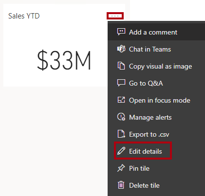

---
lab:
  title: Creare un dashboard di Power BI
  module: Create Dashboards
---

# **Creare un dashboard di Power BI**

## **Presentazione del lab**

In questo lab si creerà il dashboard **Sales Monitoring** nel servizio Power BI usando un report esistente.

Contenuto del lab:

- Aggiungere oggetti visivi a un dashboard
- Usare Domande e risposte per creare riquadri del dashboard

**Questo lab dovrebbe richiedere circa 30 minuti.**

## **Introduzione: accedere**

In questa attività si configurerà l'ambiente per il lab accedendo a Power BI.

*Nota: se è già stato eseguito l'accesso a Power BI, passare all'attività successiva.*

1. Per aprire Microsoft Edge, sulla barra delle applicazioni selezionare il collegamento al programma Microsoft Edge.

     

1. Nella finestra del browser Microsoft Edge passare a **https://app.powerbi.com**.

    *Suggerimento: è anche possibile usare l'elemento preferito Servizio Power BI sulla barra dei preferiti di Microsoft Edge.*

1. Completare il processo di accesso con le credenziali dell'organizzazione (o quelle fornite all'utente). Se in Microsoft Edge viene chiesto se restare connessi, selezionare **Sì**.

1. Nella finestra del browser Microsoft Edge, nel servizio Power BI, nel riquadro **Navigazione** espandere **Area di lavoro personale**. Lasciare aperta la finestra del browser Microsoft Edge.

     

## **Introduzione: aprire il report**

In questa attività si configurerà l'ambiente per il lab aprendo il report iniziale.

*Importante: se si continua dal lab precedente (e il lab è stato completato correttamente), non completare questa attività; Continuare invece dall'attività successiva.*

1. Aprire Power BI Desktop.
    
    *Per impostazione predefinita, la finestra di dialogo Introduzione viene visualizzata davanti a Power BI Desktop. Accedere e quindi chiudere la finestra popup.*

    

1. Per aprire il file di Power BI Desktop iniziale, selezionare file **> Apri report > Sfoglia report**.

1. Nella finestra **Apri** passare alla cartella **D:\PL300\Labs\09-create-power-bi-dashboard\Starter** e aprire il file **Sales Analysis** .

1. Chiudere eventuali finestre aperte di carattere informativo.

1. Si noti il messaggio di avviso giallo sotto la barra multifunzione. *Questo messaggio avvisa il fatto che le query non sono state applicate al caricamento come tabelle del modello. Le query verranno applicate più avanti nel lab.*
    
    *Per ignorare il messaggio di avviso, a destra del messaggio di avviso giallo selezionare **X**.*

1. Se viene richiesto di applicare le modifiche, selezionare **Applica più tardi**.

## **Introduzione: pubblicare il report**

In questa attività si configurerà l'ambiente per il lab creando un set di dati. *Se il set di dati è già stato pubblicato, passare all'attività successiva.*

1. Nella finestra del browser Microsoft Edge, nella servizio Power BI, passare a **Area di lavoro personale**.

1. Selezionare **Carica > Sfoglia**.

1. Passare alla cartella **D:\PL300\Labs\09-create-power-bi-dashboard\Starter** .

1. Selezionare il file **Sales Analysis.pbix** e quindi selezionare **Apri**.

*Se viene richiesto di sostituire il set di dati, selezionare **Sostituisci**.*

## **Creare un dashboard**

In questa attività verrà creato il dashboard **Sales Monitoring** . Si aggiungerà un oggetto visivo dal report e si aggiungerà un riquadro in base a un URI di dati dell'immagine e si userà Domande e risposte per creare un riquadro.

1. Nel servizio Power BI aprire il report **Sales Analysis**.

1. Nella pagina **Overview** impostare il filtro dei dati **Year** su **FY2020**.

    

1. Impostare il filtro dei dati **Region** su **Select All**.

    *Gli oggetti visivi aggiunti vengono impostati con il contesto di filtro al momento del pin. Se l'oggetto visivo sottostante cambia, è necessario aggiornare anche il riquadro del dashboard. Per i filtri basati sul tempo, è preferibile usare un filtro dei dati di data relativo (o Q&A usando una domanda relativa basata sul tempo).*

1. Per creare un dashboard e aggiungere un oggetto visivo, passare il cursore sull'oggetto visivo **Sales and Profit Margin by Month** (colonna/riga) e selezionare la puntina da disegno.

    

1. Nella finestra **Aggiungi al dashboard** immettere **Sales Monitoring** nella casella **Nome dashboard** e quindi selezionare **Aggiungi**.

    

1. Aprire **Area di lavoro personale** e aprire il dashboard **Sales Monitoring** .

1. Si noti che il dashboard ha un solo riquadro.

    

1. Per aggiungere un riquadro basato su una domanda, nella parte superiore sinistra del dashboard selezionare **Porre una domanda sui dati**.
    
    *È possibile usare la funzionalità Domande e risposte per porre una domanda e ottenere una risposta di Power BI con un oggetto visivo.*

    

1. Selezionare una qualsiasi delle domande suggerite sotto la casella Q&A, in caselle blu e rivedere la risposta.

1. Rimuovere tutto il testo dalla casella Q&A e immettere quanto segue: **Sales YTD**

1. Si noti la risposta **(Vuoto)**.
    
    *È possibile ricordare di aver aggiunto la misura **Sales YTD** nel lab **Creare calcoli DAX avanzati in Power BI Desktop** lab. Questa misura è un'espressione di Business Intelligence per le gerarchie temporali e quindi richiede un filtro sulla tabella **Date** per produrre un risultato.*

    

1. Estendere la domanda con: **in year FY2020**.

1. Si noti che la risposta è ora **$33M**.

    

1. Per aggiungere la risposta al dashboard, nell'angolo in alto a destra selezionare **Aggiungi oggetto visivo**.

    

1. Quando viene richiesto di aggiungere il riquadro al dashboard, selezionare **Aggiungi**.

1. Per tornare al dashboard, nell'angolo superiore sinistro selezionare **Esci da Q&amp;A**.

1. Per aggiungere il logo aziendale, nella barra dei menu selezionare **Modifica** e quindi selezionare **Aggiungi un riquadro**.
    
    *L'uso di questa tecnica per aggiungere un riquadro del dashboard consente di migliorare il dashboard con contenuti multimediali, inclusi contenuti Web, immagini, caselle di testo formattate in modo avanzato e video (tramite collegamenti YouTube o Vimeo).*

1. Nel riquadro **Aggiungi un riquadro** (a destra) selezionare il riquadro **Immagine** e quindi **Avanti**.

1. Nella casella **URL** del riquadro **Aggiungi riquadro immagine** immettere l'URL completo trovato nel file **D:\PL300\Resources\AdventureWorksLogo_DataURL.txt** e quindi **Applica**.
    
    *È possibile incorporare un'immagine usando il relativo URL oppure usando un URL di dati, che incorpora il contenuto inline.*

1. Per ridimensionare il riquadro del logo, trascinare l'angolo inferiore destro e ridimensionare il riquadro in modo che abbia una larghezza di un'unità e un'altezza di due unità.
    
    *Le dimensioni dei riquadri sono limitate a una forma rettangolare.*

1. Organizzare i riquadri in modo che il logo venga visualizzato in alto a sinistra, con il riquadro **Sales YTD** al di sotto e il riquadro **Sales, Profit Margin** a destra.

    

## **Modificare i dettagli del riquadro**

In questa attività verranno modificati i dettagli di due riquadri.

1. Posizionare il cursore sul riquadro **Sales YTD** e quindi nella parte superiore destra del riquadro selezionare i puntini di sospensione e selezionare **Modifica dettagli**.

    

1. Nel riquadro **Dettagli riquadro** (a destra), nella casella **Sottotitolo** immettere **FY2020** e quindi selezionare **Applica**.

1. Si noti che il riquadro **Sales YTD** visualizza un sottotitolo.

    

1. Modificare i dettagli per il riquadro **Sales, Profit Margin**.

1. Nel riquadro **Dettagli riquadro** , nella sezione **Funzionalità** selezionare **Visualizza ora ultimo aggiornamento** e quindi **Applica**.

    

1. Si noti che il riquadro descrive l'ora dell'ultimo aggiornamento effettuato durante il caricamento del modello di dati in Power BI Desktop.

*Il set di dati verrà aggiornato nell'esercizio successivo. A seconda dei dati e dei report, è possibile eseguire un aggiornamento dati ad hoc in qualsiasi momento o impostare una pianificazione. Tuttavia, gli aggiornamenti pianificati richiedono che i gateway non siano in grado di configurare per questo lab. Quindi, da Power BI Desktop, si eseguirà un aggiornamento manuale dei dati e quindi si caricherà il file nell'area di lavoro.*

## **Aggiornare il set di dati**

In questo esercizio si caricheranno prima i dati degli ordini di vendita per giugno 2020 nel database **AdventureWorksDW2020**. Si aprirà quindi il file Power BI Desktop, si eseguirà un aggiornamento dei dati e quindi si caricherà il file nell'area di lavoro.

## **Aggiornare il database del lab**

In questa attività verrà eseguito uno script di PowerShell per aggiornare i dati nel database **AdventureWorksDW2020**.

1. In Esplora file, all'interno della cartella **D:\PL300\Setup** fare clic con il pulsante destro del mouse sul file **UpdateDatabase-2-AddSales.ps1** e quindi scegliere **Esegui con PowerShell**.

    

1. Se viene richiesto di modificare i criteri di esecuzione, premere**A**.

1. Quando viene richiesto di premere un tasto qualsiasi per chiudere, premere di nuovo **INVIO**.

*Il database **AdventureWorksDW2020** include ora gli ordini di vendita effettuati a giugno 2020.*

## **Aggiornare il file di Power BI Desktop**

In questa attività si aprirà il file **Sales Analysis** Power BI Desktop, si eseguirà un aggiornamento dati e quindi si caricherà il file nell'area di lavoro **Sales Analysis**.

1. Nel riquadro **Dati** del file Power BI Desktop fare clic con il pulsante destro del mouse sulla tabella **Sales** e quindi scegliere **Aggiorna dati**.

    

1. Al termine dell'aggiornamento, salvare il file di Power BI Desktop.

1. Per pubblicare il file nell'area di lavoro, nella scheda **Home** della barra multifunzione selezionare **Pubblica** nel gruppo **Condividi** e quindi **selezionare Seleziona** per pubblicare.

    

1. Se viene richiesto di sostituire il set di dati, selezionare **Sostituisci**.

1. Chiudere Power BI Desktop.

*Il set di dati nel servizio Power BI include ora i dati sulle vendite di giugno 2020.*

### **Esaminare il dashboard**

In questa attività si esaminerà il dashboard per notare le vendite aggiornate.

1. Nella finestra del browser Microsoft Edge aprire servizio Power BI e quindi esaminare il dashboard **Sales Monitoring** in **Area di lavoro personale**.

2. Nel riquadro **Sales, Profit Margin** , in linea con il sottotitolo, si noti che i dati sono stati **Aggiornati: NOW**.

3. Si noti anche che ora è presente una colonna per **jun 2020**.
    
    *Se i dati relativi a giugno 2020 non vengono visualizzati, potrebbe essere necessario premere **F5** per ricaricare il Web browser.*

    

### **Completare il lab**

In questa attività si completerà il lab.

1. Salvare il report e chiudere il browser.
