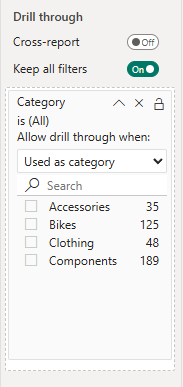
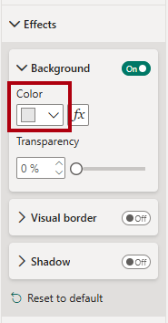
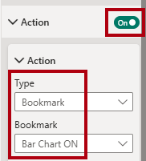

---
lab:
  title: Migliorare le progettazioni dei report di Power BI
  module: Enhance Power BI report designs for the user experience
---

# Migliorare la progettazione di report Power BI

## Presentazione del lab

In questo lab si migliorerà il_report Sales Analysis_ con funzionalità di progettazione avanzate.

Contenuto del lab:

- Creare una pagina di drill-through.
- Applicare la formattazione condizionale.
- Creare e usare segnalibri e pulsanti.

**Il lab dovrebbe richiedere circa 45 minuti.**

## Operazioni preliminari

Per completare questo esercizio, aprire prima un Web browser e immettere l'URL seguente per scaricare il file ZIP:

`https://github.com/MicrosoftLearning/PL-300-Microsoft-Power-BI-Data-Analyst/raw/Main/Allfiles/Labs/09-enhance-power-bi-reports/09-enhanced-report.zip`

Estrarre il file nella**cartella C:\Users\Student\Downloads\09-enhanced-report** .

Aprire il**file 09-Starter-Sales Analysis.pbix** .

> _**Nota**: è possibile che venga visualizzata una finestra di dialogo di accesso durante il caricamento del file. Selezionare**Annulla** per chiudere la finestra di dialogo di accesso. Chiudere qualsiasi altra finestra informativa. Selezionare**Applica in seguito**, se richiesto di applicare le modifiche._

## Configurare una pagina drill-through

In questo esercizio si creerà una nuova pagina e la si configurerà come pagina drill-through. Completata la progettazione, la pagina sarà simile alla seguente:

1. Creare una nuova pagina e rinominarla come_Dettagli_ prodotto.

1. Fare clic con il pulsante destro del mouse sulla scheda della pagina**Product Details**, quindi selezionare**Nascondi pagina**.

    > _Gli utenti del report non potranno passare direttamente alla pagina drill-through. Sarà invece possibile accedervi dagli oggetti visivi in altre pagine. Si apprenderà come eseguire il drill-through alla pagina nell'esercizio finale di questo lab._

1. Sotto il**riquadro Visualizzazioni** , nella**sezione Drill-through** aggiungere il`Product | Category` campo alla**casella Aggiungi campi drill-through qui** .

    > _I lab usano una notazione abbreviata per fare riferimento a un campo. Sarà simile al seguente:`Product | Category`. In questo esempio,`Product` è il nome della tabella e`Category` è il nome del campo._

    

1. Per testare la pagina di drill-through, nella scheda del filtro di drill-through selezionare_Bikes_.

    

1. Nella parte superiore sinistra della pagina del report osservare il pulsante freccia.

    > _La finestra di progettazione report aggiunge automaticamente un pulsante freccia quando un campo viene aggiunto all'area di drill-through. Consente agli utenti del report di tornare alla pagina da cui è stato eseguito il drill-through._

1. Aggiungere un oggetto visivo**Scheda** alla pagina, quindi ridimensionarlo e posizionarlo in modo che si trovi a destra del pulsante e riempia la larghezza rimanente della pagina.

    

    

1. Trascinare il`Product | Category` campo nell'oggetto visivo scheda.

1. Configurare le opzioni di formato per l'oggetto visivo per disattivare la**proprietà**** Etichetta categoria**.

    

1. **Nella scheda Generale**, nella**sezione Effetti**, impostare la proprietà colore di sfondo su un colore grigio chiaro (ad esempio_Bianco, 10% Più_ scuro) per fornire il contrasto.

    

1. Aggiungere un oggetto visivo**Tabella** alla pagina, quindi ridimensionarlo e posizionarlo in modo che si trovi sotto l'oggetto visivo scheda e riempia lo spazio rimanente sulla pagina.

    

    

1. Aggiungere i campi seguenti all'oggetto visivo:

    - `Product | Subcategory`
    - `Product | Color`
    - `Sales | Quantity`
    - `Sales | Sales`
    - `Sales | Profit Margin`

1. Per configurare le opzioni di formato per l'oggetto visivo, nella**sezione Griglia** impostare la**proprietà Dimensioni carattere** globali su**20pt**.

    > _La progettazione della pagina drill-through è quasi completa. Si migliorerà la pagina con la formattazione condizionale nell'esercizio successivo._

## Aggiungere la formattazione condizionale

In questo esercizio si migliorerà la pagina drill-through con la formattazione condizionale. Completata la progettazione, la pagina sarà simile alla seguente:

1. Selezionare l'oggetto visivo tabella. Nell'area**Colonne** selezionare la freccia giù nel**campo Profit Margin** e quindi selezionare**Formattazione condizionale > Icone**.

    

1. Nella finestra**Icone - Profit Margin** selezionare**A destra dei dati** nell'elenco a discesa**Layout icona**.

    

1. Per eliminare la regola centrale, a destra del triangolo giallo selezionare**X**.

    

1. Configurare la prima regola (rombo rosso) come indicato di seguito:

    - Nel secondo controllo rimuovere il valore
    - Nel terzo controllo selezionare**Numero**
    - Nel quinto controllo immettere**0**
    - Nel sesto controllo selezionare**Numero**

1. Configurare la seconda regola (cerchio verde) come indicato di seguito:

    - Nel secondo controllo immettere**0**
    - Nel terzo controllo selezionare**Numero**
    - Nel quinto controllo rimuovere il valore
    - Nel sesto controllo selezionare**Numero**

    

    > _Le regole possono essere interpretate come segue: visualizzare un diamante rosso se il valore del margine di profitto è minore di 0; in caso contrario, se il valore è maggiore o uguale a zero, visualizzare un cerchio verde._

1. **Nella finestra Icone - Margine** profitto, nell'elenco**a discesa Applica a** selezionare**Valori e totali**.

    

1. Seleziona**OK**.

1. Nell'oggetto visivo tabella verificare che siano visualizzate le icone corrette.

    

1. Configurare la formattazione condizionale del colore di sfondo per il campo**Colore**.

1. Nella finestra**Colore di sfondo - Colore** selezionare**Valore campo** nell'elenco a discesa**Stile formato**.

    

1. Nell'elenco**a discesa What field should we base this on? (In quale campo è necessario basare questa impostazione?** nel_gruppo Tutti i dati_ selezionare il`Product | Formatting | Background Color Format` campo ).

    

1. Ripetere i passaggi precedenti per configurare la formattazione condizionale del colore del carattere per il**campo Colore** usando il`Product | Formatting | Font Color Format` campo .

 > _È possibile ricordare che i colori di sfondo e carattere sono stati originati dal**file di ColorFormats.csv** nel**lab Prepare Data in Power BI Desktop** e quindi integrati con la**query Product** nel lab Carica dati in**Power BI Desktop** ._

## Aggiungere segnalibri e pulsanti

In questo esercizio si migliorerà la_pagina Prestazioni_ personali con i pulsanti, consentendo all'utente del report di selezionare il tipo di oggetto visivo da visualizzare. Completata la progettazione, la pagina sarà simile alla seguente:

1. Passare alla pagina_My Performance_.

1. Nella scheda della barra multifunzione**Visualizza** selezionare**Segnalibri** all'interno del gruppo**Mostra riquadri**.

    

1. Nella scheda della barra multifunzione**Visualizza** selezionare**Selezione** all'interno del gruppo**Mostra riquadri**.

    

1. Nel riquadro**Selezione** selezionare l'icona a forma di occhio accanto a uno degli elementi_Sales and Target by Month_ per nascondere l'oggetto visivo.

    

1. Nel riquadro**Segnalibri** selezionare**Aggiungi**.

    

    > _Suggerimento: per rinominare il segnalibro, fare doppio clic sul segnalibro._

1. Se il grafico visibile è un grafico a barre, rinominare il segnalibro in_Bar Chart ON_, se invece è un istogramma, rinominarlo in_Column Chart ON_.

1. Per modificare il segnalibro, nel**riquadro Segnalibri** passare il cursore sul segnalibro, selezionare i puntini di sospensione e quindi selezionare**Dati**.

    > _La disabilitazione dell'opzione**Dati** indica che il segnalibro non userà lo stato del filtro corrente. Questo è importante perché in caso contrario, il segnalibro blocca in modo permanente il filtro attualmente applicato dal filtro dei dati Year._

    

1. Per aggiornare il segnalibro, selezionare di nuovo i puntini di sospensione e quindi selezionare**Aggiorna**.

    > _Nei passaggi seguenti si creerà e si configurerà un secondo segnalibro per visualizzare il secondo oggetto visivo._

1. Nel riquadro**Selezione** attivare e disattivare la visibilità dei due elementi_Sales and Target by Month_.

    > _In altre parole, rendere l'oggetto visivo visibile nascosto e rendere visibile l'oggetto visivo nascosto._

    

1. Creare un secondo segnalibro e denominarlo in modo appropriato (_istogramma ON_ o_grafico a barre ON_.

    

1. Configurare il secondo segnalibro in modo da ignorare i filtri (opzione**Dati** disattivata) e aggiornare il segnalibro.

1. Nel riquadro**Selezione** è sufficiente visualizzare l'oggetto visivo nascosto per rendere visibili entrambi gli oggetti visivi.

1. Ridimensionare e riposizionare entrambi gli oggetti visivi in modo che riempiano la pagina sotto l'oggetto visivo a più schede e si sovrappongano completamente l'uno all'altro.

    > _Per selezionare l'oggetto visivo coperto, selezionarlo nel**riquadro Selezione** ._

    

1. Nel riquadro**Segnalibri** selezionare ognuno dei segnalibri e verificare che è visibile solo uno degli oggetti visivi.

    > _La fase successiva della progettazione consiste nell'aggiungere due pulsanti alla pagina. Questi pulsanti consentiranno all'utente del report di selezionare i segnalibri._

1. Sulla barra multifunzione**Inserisci** selezionare**Pulsante** all'interno del gruppo**Elementi** e quindi selezionare**Vuoto**.

    

1. Posizionare il pulsante direttamente sotto il filtro dei dati_Year_.

1. Selezionare il pulsante e quindi nel**riquadro pulsante** Formato espandere la**sezione Stile** e quindi impostare la**sezione Testo** su**Sì**.

    

1. **Nella sezione Testo** immettere Grafico a_barre_ nella**casella di testo**.

1. Impostare la**sezione Riempimento** su**Sì** e quindi impostare un colore usando un colore complementare.

1. Impostare la**sezione Azione** su**Sì** e quindi impostare la**proprietà Type** su**Bookmark**.

1. Selezionare**Pulsante** e impostare la**proprietà Action** su**Sì**.

1. Espandere la sezione**Azione**, quindi impostare l'elenco a discesa**Tipo** su**Segnalibro**.

1. Nell'elenco a discesa**Segnalibro** selezionare**Bar Chart ON**.

    

1. Creare una copia del pulsante con un'operazione di copia e incolla, quindi configurare il nuovo pulsante come segue:

    > _Suggerimento: i comandi di scelta rapida per copia e incolla sono**CTRL+C** seguiti da**CTRL+V**._

    - Impostare il testo del pulsante su_Istogramma_.
    - Impostare il segnalibro azione su**Istogramma ON**.

    > _La progettazione del report Sales Analysis è stata completata._

## Pubblicare ed esplorare il report

In questo esercizio si pubblicherà il report nel servizio Power BI ed si esaminerà il comportamento del report pubblicato.

> _**Nota**: per pubblicare il report sarà necessaria almeno una**licenza gratuita** di Power BI. Aprire il browser Microsoft Edge e passare a_`https://app.powerbi.com`_.  Accedere con le credenziali per il tenant di Microsoft 365 fornito dall'host del lab autorizzato (ALH). Quando viene chiesto di risolvere un puzzle o di avviare una versione di valutazione gratuita di Fabric, è possibile ignorare questo e chiudere il browser._

> _**Nota**: è possibile esaminare il resto dell'esercizio, anche se non si ha accesso al servizio Power BI per eseguire direttamente le attività._

1. Selezionare la pagina di_panoramica_.

1. Nel filtro dei dati_Year_ selezionare**FY2020**.

1. Nel filtro dei_dati Area_ verificare che non siano selezionate aree.

1. Salvare il file di Power BI Desktop.

1. Nella scheda della barra multifunzione**Home** selezionare**Pubblica** all'interno del gruppo**Condividi**.

    > _Se non si è già connessi a Power BI Desktop, è necessario accedere prima di pubblicare il report._

    

1. Nella finestra Pubblica in Power BI** si noti che_l'area**di lavoro_ personale è selezionata.

1. Per pubblicare il report, selezionare**Seleziona**. Attendere il completamento della pubblicazione.

1. Quando la pubblicazione ha esito positivo, selezionare**Recupera.**

1. Chiudere Power BI Desktop.

1. Aprire il browser Microsoft Edge, quindi accedere all'indirizzo`https://app.powerbi.com` (o usare una sessione del browser esistente).

1. Nella finestra del browser, nella servizio Power BI, nel**riquadro di spostamento** (a sinistra e potrebbe essere compresso), selezionare**Area di lavoro** personale.

1. Per esplorare il report, selezionare il_report 09-Starter-Sales Analysis_ .

1. Per testare la funzionalità di drill-through, nella pagina Panoramica,_nell'oggetto_visivo Somma quantità per categoria_ fare clic con il pulsante destro del mouse sulla_barra Abbigliamento_ e quindi scegliere**Drill-Through > Dettagli**_ prodotto.

    

1. Si noti che la_pagina Dettagli_ prodotto filtra gli oggetti visivi per_Clothing_.

1. Per tornare alla pagina di origine, nell'angolo superiore sinistro della pagina selezionare il pulsante freccia.

1. Passare alla pagina_My Performance_.

1. Selezionare ognuno dei pulsanti e verificare che venga visualizzato un oggetto visivo diverso.

## Lab completato

1. Chiudere il browser Microsoft Edge.
1. Chiudere Power BI Desktop.