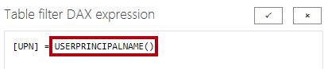

---
lab:
  title: Applicare la sicurezza a livello di riga
  module: Enforce Row-Level Security
---

# **Applicare la sicurezza a livello di riga**

## **Presentazione del lab**

In questo lab verrà applicata la sicurezza a livello di riga per garantire che un venditore possa analizzare solo i dati delle vendite per le aree assegnate.

Contenuto del lab:

- Applicare la sicurezza a livello di riga
- Scegliere tra metodi dinamici e statici

**Questo lab dovrebbe richiedere circa 20 minuti.**

## **Per iniziare**

In questa attività si configurerà l'ambiente per il lab.

*Importante: se si continua dal lab precedente (e il lab è stato completato correttamente), non completare questa attività; Continuare invece dall'attività successiva.*

1. Apri Power BI Desktop.

    

    *Suggerimento: per impostazione predefinita, viene visualizzata la finestra di dialogo Attività iniziali davanti a Power BI Desktop. **** Accedere e quindi chiudere il popup.*

1. Per aprire il file di Power BI Desktop iniziale, selezionare File **> Apri report > Sfoglia report**.

1. **Nella finestra Apri** passare alla **cartella D:\PL300\Labs\10-row-level-security\Starter** e aprire il **file Sales Analysis**.

1. Chiudere eventuali finestre aperte di carattere informativo.

1. Si noti il messaggio di avviso giallo sotto la barra multifunzione. *Questo messaggio avvisa il fatto che le query non sono state applicate per il caricamento come tabelle del modello. Le query verranno applicate più avanti in questo lab.*
    
    *Per ignorare il messaggio di avviso, a destra del messaggio di avviso giallo selezionare **X**.*

1. Per creare una copia del file, passare a **File > Salva con** nome e salvare nella **cartella D:\PL300\MySolution** .

1. Se viene richiesto di applicare le modifiche, selezionare **Applica più tardi**.

## **Applicare la sicurezza a livello di riga**

In questa attività verrà applicata la sicurezza a livello di riga per garantire che un venditore possa visualizzare solo le vendite effettuate nelle aree assegnate.

1. Passa alla vista Dati.

   

1. **Nel riquadro Dati** selezionare la **tabella Salesperson (Performance).**

1. Esaminare i dati. Si noti che il valore UPN di Michael Blythe (EmployeeKey 281) è: **michael-blythe@adventureworks.com**
    
    *È possibile ricordare che Michael Blythe è assegnato a tre aree di vendita: Stati Uniti nord-orientali, Stati Uniti centrali e Stati Uniti sud-orientali.*

1. **Nella scheda Modellazione della barra multifunzione** selezionare **Gestisci ruoli** nel **gruppo Sicurezza**.

    

1. Nella finestra **Gestisci ruoli** selezionare **Crea**.

1. Nella casella sostituire il testo selezionato con il nome del ruolo Salespeople **** e quindi premere **INVIO**.

   

1. Per assegnare un filtro, per la **tabella Salesperson (Performance),** selezionare il carattere con i puntini di sospensione (...) e quindi selezionare **Aggiungi filtro \| [UPN]**.

   

1. Nella **casella Espressione** DAX filtro tabella modificare l'espressione sostituendo **"Value"** con **U edizione Standard RPRINCIPALNAME()** e quindi **Salva**.
    
    *U edizione Standard RPRINCIPALNAME() è una funzione DAX (Data Analysis Expressions) che restituisce il nome dell'utente autenticato. Significa che la **tabella Salesperson (Performance)** filtra in base al nome dell'entità utente (UPN) dell'utente che esegue una query sul modello.*

   

1. Per testare il ruolo di sicurezza, nella scheda della barra multifunzione **Modellazione**, nel gruppo **Sicurezza** selezionare **Visualizza come**.

   

1. Nella finestra **Visualizza come ruoli** selezionare l'elemento **Altro utente** e quindi nella casella corrispondente immettere: **michael-blythe@adventureworks.com**

1. Controllare il **ruolo Venditori** e quindi **OK**.
    
    *Questa configurazione comporta l'uso del ruolo **Salespeople** e la rappresentazione dell'utente con il nome di Michael Blythe.*

   

1. Si noti il banner giallo sopra la pagina del report, che descrive il contesto di sicurezza del test.

   

1. Nell'oggetto visivo tabella si noti che è elencato solo il venditore **Michael Blythe**.

   

1. Per arrestare il test, selezionare **Arresta visualizzazione** sul lato destro del banner giallo.

   

1. Per eliminare il **ruolo Venditori**, nella scheda Modellazione della **barra multifunzione** selezionare **Gestisci ruoli** all'interno del **gruppo Sicurezza**.

   

1. Nella finestra **Gestisci ruoli** selezionare **Elimina**. Quando viene richiesto di confermare l'eliminazione, selezionare **Sì, Elimina**.

   

### **Fine**

In questa attività si completerà il lab.

1. Selezionare **Salva**, quindi salvare il file di Power BI Desktop per terminare il lab.

*Nota: quando il file di Power BI Desktop viene pubblicato nel servizio Power BI, è necessario completare un'attività post-pubblicazione per eseguire il mapping delle entità di sicurezza al **ruolo Venditori**. Questa operazione non verrà eseguita in questo lab.*
