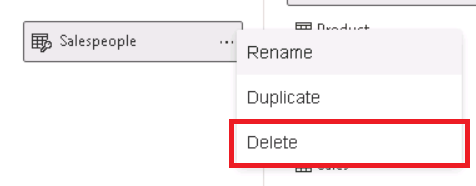

---
lab:
  title: Proteggere l'accesso ai dati in Power BI
  module: Secure data access in Power BI
---

# Proteggere l'accesso ai dati in Power BI

## Presentazione del lab

In questo lab verrà applicata la sicurezza a livello di riga per garantire che un venditore possa analizzare solo i dati delle vendite per le aree assegnate. La sicurezza a livello di riga verrà applicata tramite il metodo dinamico.

**Questo lab dovrebbe richiedere circa 20 minuti.**

## Operazioni preliminari

Per completare questo esercizio, aprire prima un Web browser e immettere l'URL seguente per scaricare la cartella ZIP:

`https://github.com/MicrosoftLearning/PL-300-Microsoft-Power-BI-Data-Analyst/raw/Main/Allfiles/Labs/11-secure-data-access/11-secure-data.zip`

Estrarre la cartella nella**cartella C:\Users\Student\Downloads\11-secure-data** .

Aprire il**file 11-Starter-Sales Analysis.pbix** .

> _**Nota**: è possibile che venga visualizzata una finestra di dialogo di accesso durante il caricamento del file. Selezionare**Annulla** per chiudere la finestra di dialogo di accesso. Chiudere qualsiasi altra finestra informativa. Selezionare**Applica in seguito**, se richiesto di applicare le modifiche._

## Applicare la sicurezza a livello di riga

In questa attività verrà applicata la sicurezza a livello di riga per garantire che un venditore possa visualizzare solo le vendite effettuate nelle aree assegnate.

1. Passare alla**visualizzazione** Tabella.

   

1. **Nel riquadro Dati** selezionare la**tabella Salesperson (Performance).**

1. Esaminare i dati. Si noti che il valore UPN di Michael Blythe (EmployeeKey 281) è:**`michael-blythe@adventureworks.com`**
    
    > *È possibile ricordare che Michael Blythe è assegnato a tre aree di vendita: Stati Uniti nord-orientali, Stati Uniti centrali e Stati Uniti sud-orientali.*

1. Nella scheda Home** della**barra multifunzione selezionare**Gestisci ruoli** nel**gruppo Sicurezza**.

    

1. Nella sezione Ruoli** della****finestra Gestisci ruoli** di sicurezza selezionare**Nuovo**.

1. Nella casella sostituire il testo selezionato con il nome del ruolo Salespeople**** e quindi premere**INVIO**.

   

1. Per assegnare un filtro, selezionare la**tabella Salesperson (Performance)** e quindi selezionare**Passa all'editor** DAX nella**sezione Filtra dati** .

   

1. Nella casella editor DAX immettere l'espressione seguente:

    ```DAX
    [UPN] = USERPRINCIPALNAME()
    ```

   

    > *USERPRINCIPALNAME() è una funzione DAX (Data Analysis Expressions) che restituisce il nome dell'utente autenticato. Significa che la**tabella Salesperson (Performance)** filtra in base al nome dell'entità utente (UPN) dell'utente che esegue una query sul modello.*

1. Selezionare**Salva** e**Chiudi**.

1. Per testare il ruolo di sicurezza, nella scheda Home della**barra multifunzione selezionare**Visualizza come** all'interno del**gruppo Sicurezza**.**

   

1. Nella finestra**Visualizza come ruoli** selezionare l'elemento**Altro utente** e quindi nella casella corrispondente immettere:**`michael-blythe@adventureworks.com`**

1. Controllare il**ruolo Venditori** e quindi**OK**.
    
    > *Questa configurazione comporta l'uso del ruolo**Salespeople** e la rappresentazione dell'utente con il nome di Michael Blythe.*

   

1. Si noti il banner giallo sopra la pagina del report, che descrive il contesto di sicurezza del test.

   

1. Nell'oggetto visivo tabella si noti che è elencato solo il venditore**Michael Blythe**.

   

1. Per arrestare il test, selezionare**Arresta visualizzazione** sul lato destro del banner giallo.

   

1. Per eliminare il**ruolo Venditori**, nella scheda Home** della**barra multifunzione selezionare**Gestisci ruoli** all'interno del**gruppo Sicurezza**.

   

1. **Nella finestra Gestisci ruoli** di sicurezza selezionare i puntini di sospensione (...) nel**ruolo Venditori** e selezionare**Elimina**. Quando viene richiesto di confermare l'eliminazione, selezionare**Sì, Elimina**.

   

*Nota: quando il file di Power BI Desktop viene pubblicato nel servizio Power BI, è necessario completare un'attività post-pubblicazione per eseguire il mapping delle entità di sicurezza al**ruolo Venditori**. Questa operazione non verrà eseguita in questo lab.*

## Lab completato

È possibile scegliere di salvare il report di Power BI, anche se non è necessario per questo lab. 

1. Chiudere la finestra del browser Microsoft Edge.
1. In Power BI Desktop passare al**menu "File"** nell'angolo in alto a sinistra e selezionare **"Salva con nome".** 
1. Selezionare**Esplora il dispositivo**
1. Selezionare la cartella in cui si desidera salvare il file e assegnargli un nome descrittivo. 
1. Selezionare il**pulsante Salva** per salvare il report come file con estensione pbix. 
1. Se viene visualizzata una finestra di dialogo che richiede di applicare modifiche alle query in sospeso, selezionare**Applica**.
1. Chiudere Power BI Desktop.
